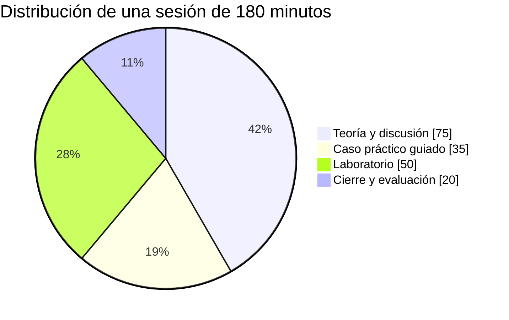

# Cómo usar este curso

## Si lo estudias por tu cuenta

Cada módulo está escrito para leerse de principio a fin en una sesión de trabajo. La estructura es siempre la misma:

| Sección | Para qué sirve |
| --- | --- |
| **Apertura** | El problema real que el módulo resuelve. Si no entiendes el problema, la solución no se queda. |
| **Desarrollo** | Teoría con diagramas, tablas comparativas y ejemplos verificables. |
| **Caso práctico** | Una organización concreta —normalmente latinoamericana— aplicando lo visto. |
| **Laboratorio** | Comandos y archivos que puedes ejecutar. Aquí se consolida lo aprendido. |
| **Conceptos clave** | Las definiciones que debes poder repetir sin mirar. |
| **Puntos clave** | Lo que debe quedarte si olvidas todo lo demás. |
| **Ejercicios** | Aplicación sobre tu propio contexto, no preguntas de memoria. |
| **Lectura adicional** | Fuentes primarias para profundizar. |

Recomendación: no saltes los laboratorios. La diferencia entre saber qué es un contenedor y haber construido uno es la diferencia entre aprobar un examen y resolver un incidente a las 3 de la mañana.

## Si lo impartes

Cada módulo está calibrado para **una sesión de 3 horas**. La [guía para el docente](guia-docente.md) incluye el desglose de tiempos, las dinámicas sugeridas y las preguntas que suelen abrir debate.

Reparto típico de la sesión:



## Convenciones del material

!!! note "Nota"
    Información complementaria, útil pero no indispensable.

!!! tip "Consejo"
    Atajos y buenas prácticas que ahorran tiempo en el mundo real.

!!! warning "Cuidado"
    Errores frecuentes. Si te vas a equivocar, será aquí.

!!! danger "Agua fría"
    La contraparte crítica. Ninguna tecnología de este curso es una bala de plata, y el material lo dice explícitamente.

!!! example "Caso"
    Ejemplos aplicados con nombres, cifras y contexto.

Los bloques de código indican siempre dónde se ejecutan:

```bash
# Terminal local
docker build -t mi-modelo:1.0 .
```

```yaml
# Archivo de manifiesto — ruta indicada en el encabezado
apiVersion: apps/v1
kind: Deployment
```

## Qué necesitas instalado

| Bloque | Herramientas |
| --- | --- |
| I–II | Navegador y cuenta gratuita en algún proveedor de nube (capa gratuita) |
| III | Python 3.11+, `pandas`, opcionalmente DuckDB |
| IV | Git 2.40+, Docker Desktop o Podman, `kubectl` y `kind` o Minikube |
| V | Python 3.11+, PyTorch o TensorFlow, OpenCV |
| VI | Un agente de codificación con CLI (Claude Code, Codex, o similar) |

!!! tip "Sin tarjeta de crédito"
    Los bloques I–IV se pueden completar íntegramente con herramientas locales gratuitas. Las cuentas de nube solo se usan para explorar consolas y calculadoras de precios.
