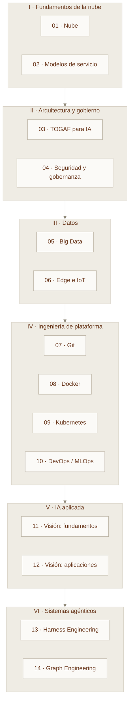

---
hide:
  - navigation
---

# Infraestructura para IA

Construir un modelo es la parte visible. Sostenerlo en producción —con datos que llegan a tiempo, cómputo que escala, versiones que se pueden revertir y costos que no se desbordan— es la parte que decide si el proyecto sobrevive.

Este curso trata de esa parte: **la infraestructura sobre la que se apoya la inteligencia artificial**, desde el centro de datos hasta el sistema agéntico que supervisa su propio trabajo.

Son **14 módulos de 3 horas**, organizados en seis bloques que se apoyan uno sobre otro. Cada módulo combina teoría, casos reales de la región, un laboratorio práctico y ejercicios de evaluación.

---

## Empezar

-   :material-book-open-variant:{ .lg .middle } **Módulos**

    ---

    Los 14 capítulos teóricos, del cómputo en la nube a la ingeniería de grafos.

    [:octicons-arrow-right-24: Ver el temario](modulos/index.md)

-   :material-flask:{ .lg .middle } **Prácticas**

    ---

    Diez laboratorios guiados: contenerizar un modelo, desplegarlo, versionarlo y orquestarlo.

    [:octicons-arrow-right-24: Ir a los laboratorios](practicas/index.md)

-   :material-map-marker-path:{ .lg .middle } **Ruta de aprendizaje**

    ---

    Qué módulo depende de cuál, y qué caminos puedes recortar según tu perfil.

    [:octicons-arrow-right-24: Ver la ruta](ruta.md)

-   :material-library-shelves:{ .lg .middle } **Recursos**

    ---

    Glosario, rúbricas de evaluación, plantillas reutilizables y bibliografía.

    [:octicons-arrow-right-24: Abrir la biblioteca](recursos/index.md)

---

## El mapa completo

La infraestructura para IA no es una lista de herramientas: es una pila donde cada capa hace posible la siguiente.

Se lee de abajo hacia arriba. Sin nube no hay elasticidad; sin arquitectura no hay gobierno; sin datos no hay modelo; sin plataforma el modelo no llega a producción; sin sistemas agénticos, cada mejora del modelo sigue dependiendo de que alguien esté escribiendo instrucciones a mano.

---

## Qué aprenderás

- **Decidir** entre IaaS, PaaS, SaaS y serverless con criterios de costo, control y velocidad, no por moda.
- **Diseñar** una arquitectura empresarial para IA usando el ciclo ADM de TOGAF, con capas de negocio, datos, aplicación y tecnología.
- **Construir** canalizaciones de datos masivos y elegir entre Data Lake, Data Warehouse y Lakehouse según el caso.
- **Versionar** código, datos y modelos con Git y sus flujos de trabajo profesionales.
- **Empaquetar** un modelo en un contenedor reproducible y **orquestarlo** en Kubernetes con autoescalado y GPU.
- **Operar** el ciclo de vida completo con DevOps, GitOps, MLOps y AIOps.
- **Entrenar y evaluar** modelos de visión por computadora, y llevarlos de notebook a producto.
- **Diseñar el entorno** en el que un agente de IA trabaja de forma fiable: reglas explícitas, verificación independiente, estado persistente y observabilidad.
- **Organizar** múltiples agentes, herramientas y evaluadores en un grafo explícito con nodos, aristas, estado compartido y reglas de enrutamiento.

---

## A quién está dirigido

Estudiantes de diplomado, ingenieros de datos, desarrolladores que se mueven hacia IA y arquitectos que necesitan aterrizar la IA en una organización real.

!!! info "Requisitos previos"
    Manejo básico de línea de comandos y de algún lenguaje de programación (preferentemente Python). No se requiere experiencia previa en nube, contenedores ni machine learning: cada módulo parte de cero y profundiza progresivamente.

---

## Siguientes pasos

- [Módulo 01 · Fundamentos de la computación en la nube](modulos/01-fundamentos-nube.md) — el punto de partida obligado.
- [Cómo usar este curso](como-usar.md) — cómo estudiarlo por tu cuenta o impartirlo en aula.
- [Guía para el docente](guia-docente.md) — planificación de cada sesión de 3 horas, minuto a minuto.
