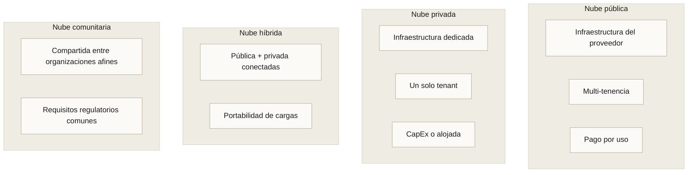
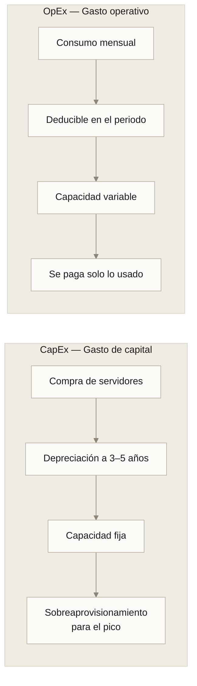

---
tags:
  - Bloque I
  - Nube
---

# Módulo 01 · Fundamentos de la computación en la nube

:material-clock-outline: 3 horas
:material-stairs: Nivel introductorio
:material-link-variant: Sin prerrequisitos

Una startup de cuatro personas puede hoy levantar un servicio que atiende a un millón de usuarios sin comprar un solo servidor. Hace veinte años eso requería una sala con aire acondicionado, un contrato eléctrico industrial y una inversión de seis cifras antes de tener el primer cliente.

Lo que cambió no fue la tecnología de cómputo. Fue **el modelo de acceso a ella**.

---

## 1. Qué es realmente la computación en la nube

La computación en la nube es la entrega de servicios de cómputo —servidores, almacenamiento, bases de datos, redes, software y análisis— **a través de internet, bajo demanda y con pago por consumo**.

La analogía canónica es la energía eléctrica. Ninguna fábrica construye hoy su propia planta generadora: se conecta a la red y paga por kilovatio-hora consumido. La nube hace exactamente eso con el cómputo.

Pero la analogía tiene un límite importante, y conviene señalarlo desde el principio: **la electricidad es una mercancía indiferenciada, y la nube no lo es**. Un kilovatio es igual en cualquier proveedor; una máquina virtual de AWS, una de Azure y una de Google Cloud tienen APIs, modelos de red y modelos de identidad distintos. Esa diferencia es el origen de la dependencia del proveedor que veremos en el [módulo 02](02-modelos-servicio.md).

### La definición formal

El NIST (National Institute of Standards and Technology de Estados Unidos) publicó en 2011 la definición que sigue siendo el estándar de referencia:

> Un modelo que permite el acceso ubicuo, conveniente y bajo demanda a través de la red a un conjunto compartido de recursos de cómputo configurables, que pueden ser aprovisionados y liberados rápidamente con un esfuerzo mínimo de gestión o de interacción con el proveedor del servicio.

Cada palabra de esa definición está elegida. "Bajo demanda" excluye los contratos de aprovisionamiento con semanas de espera. "Conjunto compartido" implica multi-tenencia. "Rápidamente" define la elasticidad. "Esfuerzo mínimo de gestión" es la razón por la que funciona un equipo de cuatro personas.

---

## 2. Historia: cómo llegamos aquí

La evolución se entiende mejor en tres etapas, separadas por dos puntos de inflexión: 2006, cuando la nube se vuelve un producto, y 2018, cuando el acelerador pasa a ser el recurso que se alquila.

=== "1960–2002 · La idea sin la infraestructura"

    **La nube existe como concepto, no como producto.**

    | Año | Qué ocurre |
    | --- | --- |
    | **1960s** | Tiempo compartido en mainframes. McCarthy propone el cómputo como servicio público |
    | **1990s** | Internet comercial. Aparecen los primeros proveedores de hosting |
    | **1999** | Salesforce entrega software por navegador (SaaS) |
    | **2002** | Amazon abre sus servicios web internos |

=== "2006–2014 · Se construyen las capas"

    **De la máquina virtual al contenedor.**

    | Año | Qué ocurre |
    | --- | --- |
    | **2006** | AWS lanza S3 y EC2: nace la nube moderna |
    | **2008** | Google App Engine (PaaS) |
    | **2010** | Microsoft Azure en disponibilidad general |
    | **2013** | Docker populariza los contenedores |
    | **2014** | Kubernetes y AWS Lambda: orquestación y serverless |

=== "2018–2026 · La capa de IA"

    **El acelerador se convierte en el recurso que se alquila.**

    | Año | Qué ocurre |
    | --- | --- |
    | **2018** | GPUs y TPUs bajo demanda para deep learning |
    | **2023** | Modelos fundacionales como servicio gestionado |
    | **2026** | Infraestructura de inferencia y agentes: capa estándar de la plataforma |

Dos observaciones sobre esta línea de tiempo:

**La idea es vieja; la ejecución es nueva.** John McCarthy —el mismo que acuñó el término "inteligencia artificial"— propuso en 1961 que "algún día el cómputo podría organizarse como un servicio público". Tuvieron que pasar 45 años y la banda ancha masiva para que fuera viable.

**La nube nació de un problema interno.** Amazon construyó su infraestructura de servicios para resolver su propio caos de aprovisionamiento entre equipos. La vendió después. Ese origen explica por qué las APIs de AWS se sienten más como herramientas de infraestructura que como productos de consumo.

---

## 3. Las cinco características esenciales (NIST)

Si a un servicio le falta alguna de estas cinco, no es nube. Es hosting con otro nombre.

=== "1. Autoservicio bajo demanda"

    El usuario aprovisiona recursos —tiempo de servidor, almacenamiento— de forma unilateral, sin intervención humana del proveedor.

    **Prueba práctica:** ¿puedes crear una máquina virtual a las 3 de la mañana de un domingo sin hablar con nadie? Si necesitas abrir un ticket, no es autoservicio.

=== "2. Acceso amplio por red"

    Las capacidades están disponibles por la red y se acceden mediante mecanismos estándar que funcionan desde plataformas heterogéneas: teléfonos, tabletas, laptops, estaciones de trabajo.

    **Implicación arquitectónica:** todo se expone como API sobre HTTP. Esto es lo que permite que exista la infraestructura como código.

=== "3. Agrupación de recursos (pooling)"

    Los recursos del proveedor se agrupan para servir a múltiples consumidores con un modelo multi-tenencia, asignándose y reasignándose dinámicamente según demanda.

    El cliente generalmente **no sabe ni controla la ubicación exacta** de los recursos, aunque sí puede especificarla a un nivel de abstracción mayor: país, región, zona de disponibilidad.

    **Implicación de cumplimiento:** aquí es donde aparecen las normativas de residencia de datos. Si tu regulación exige que los datos no salgan del país, la región es tu control.

=== "4. Elasticidad rápida"

    Las capacidades se aprovisionan y liberan elásticamente —en algunos casos de forma automática— para escalar rápidamente hacia afuera y hacia adentro de acuerdo con la demanda.

    Para el consumidor, las capacidades disponibles **parecen ilimitadas** y pueden apropiarse en cualquier cantidad y en cualquier momento.

    !!! warning "Elasticidad no es escalabilidad"
        La escalabilidad es la capacidad de crecer. La elasticidad es la capacidad de crecer **y volver a encogerse automáticamente**. Un sistema que escala pero nunca reduce te cuesta el pico las 24 horas.

=== "5. Servicio medido"

    Los sistemas de nube controlan y optimizan automáticamente el uso de recursos mediante capacidades de medición apropiadas al tipo de servicio: almacenamiento, procesamiento, ancho de banda, cuentas activas.

    El uso puede ser monitoreado, controlado y reportado, dando **transparencia tanto al proveedor como al consumidor**.

    Esta es la característica que hace posible el modelo OpEx y, de paso, la que hace posible recibir una factura de 40 000 dólares por un bucle mal escrito.

---

## 4. Ventajas reales, y su letra pequeña

| Ventaja | Qué significa | La letra pequeña |
| --- | --- | --- |
| **Sin inversión inicial** | Empiezas a operar sin comprar hardware | A escala suficiente, el costo operativo acumulado supera al de comprar |
| **Escala global en minutos** | Despliegas en otro continente cambiando un parámetro | La latencia entre regiones sigue siendo física; la velocidad de la luz no está en oferta |
| **Elasticidad** | Pagas el pico solo mientras dura | Requiere arquitectura sin estado; una aplicación monolítica con sesión en memoria no escala |
| **Fiabilidad** | Replicación y respaldo integrados | La replicación no te protege de borrar datos por error: se replica el borrado |
| **Velocidad de innovación** | Servicios gestionados que no tienes que construir | Cada servicio gestionado que adoptas aumenta tu acoplamiento al proveedor |
| **Seguridad del proveedor** | Equipos de seguridad más grandes que los de casi cualquier cliente | El proveedor asegura la nube; tú aseguras lo que pones *en* la nube ([módulo 04](04-arquitectura-seguridad.md)) |

!!! danger "Agua fría: la nube no es automáticamente más barata"
    Dropbox migró parte de su infraestructura **fuera** de AWS en 2016 y reportó un ahorro de casi 75 millones de dólares en dos años. 37signals (Basecamp) hizo lo mismo en 2023.

    El patrón es consistente: la nube es imbatible cuando la carga es variable, impredecible o está creciendo. Cuando la carga se vuelve grande, estable y predecible, la economía puede invertirse. La respuesta correcta casi nunca es "todo dentro" o "todo fuera".

---

## 5. Modelos de despliegue

### Comparación

| Criterio | Pública | Privada | Híbrida | Comunitaria |
| --- | --- | --- | --- | --- |
| Propiedad | Proveedor | Organización | Mixta | Consorcio |
| Inversión inicial | Nula | Alta | Media | Compartida |
| Control | Bajo | Total | Variable | Negociado |
| Escalabilidad | Prácticamente ilimitada | Limitada por hardware | Alta | Media |
| Cumplimiento estricto | Difícil en casos extremos | Máximo | Bueno | Diseñado para ello |
| Costo operativo | Variable | Fijo alto | Mixto | Repartido |
| Caso típico | Startups, cargas variables | Banca, defensa | Empresas en migración | Salud pública, consorcios académicos |

**Multinube** merece una mención aparte: no es un modelo de despliegue del NIST, sino una estrategia. Consiste en usar deliberadamente más de un proveedor público. Se adopta para evitar dependencia, para aprovechar el mejor servicio de cada uno, o por exigencia regulatoria. Su costo es real: duplica la superficie operativa y el conocimiento requerido del equipo.

---

## 6. El modelo económico: CapEx contra OpEx

El caso clásico: una tienda en línea que vende el 40 % de su año en noviembre.

| Enfoque | Capacidad comprada | Uso promedio real | Costo anual aproximado |
| --- | --- | --- | --- |
| CapEx (centro de datos propio) | 100 servidores (para el pico) | 22 % | Inversión de 500 000 USD amortizada, más energía, espacio y personal |
| OpEx (nube con autoescalado) | 12–100 instancias según demanda | 100 % de lo pagado | Alrededor de 140 000 USD/año en consumo variable |

La cifra importante no es el ahorro. Es que en el modelo CapEx **el 78 % de la capacidad comprada está apagada o inactiva la mayor parte del año**, y ese desperdicio está pagado por adelantado.

### Los cuatro costos que se olvidan

1. **Transferencia de salida (egress).** Mover datos *hacia* la nube suele ser gratis. Sacarlos cuesta. Es el principal mecanismo económico de retención de clientes.
2. **Almacenamiento huérfano.** Discos de máquinas eliminadas, instantáneas antiguas, respaldos sin política de retención. Crece de forma silenciosa.
3. **Entornos de no producción.** Desarrollo, pruebas y staging corriendo 24/7 cuando solo se usan 40 horas a la semana.
4. **Servicios gestionados premium.** Una base de datos gestionada puede costar de 3 a 5 veces lo que la misma base sobre máquinas virtuales. A veces vale la pena; hay que saber cuándo.

---

## 7. Disponibilidad y SLA

Un **SLA** (Service Level Agreement) es el compromiso contractual del proveedor sobre la disponibilidad del servicio. Se expresa en porcentaje de tiempo activo.

| SLA | Tiempo fuera al año | Tiempo fuera al mes | Se usa para |
| --- | --- | --- | --- |
| 99 % ("dos nueves") | 3 días 15 horas | 7 h 18 min | Entornos de desarrollo |
| 99.9 % ("tres nueves") | 8 h 45 min | 43 min | Aplicaciones internas |
| 99.95 % | 4 h 22 min | 21 min | Producción estándar |
| 99.99 % ("cuatro nueves") | 52 min | 4 min 23 s | Servicios críticos |
| 99.999 % ("cinco nueves") | 5 min 15 s | 26 s | Telecomunicaciones, pagos |

!!! warning "Tres trampas del SLA que debes conocer"

    **1. El SLA no es una promesa, es una penalización.** Si el proveedor incumple, te devuelve un porcentaje del crédito del servicio. No te compensa la pérdida de negocio. Un SLA de 99.99 % con crédito del 10 % no vale nada frente a una caída en pleno Buen Fin.

    **2. Los SLA se multiplican, no se promedian.** Si tu aplicación depende de tres servicios en cadena, cada uno con 99.9 %, tu disponibilidad teórica es $0.999^3 = 99.7\%$ — casi 26 horas de caída al año, no 8.

    **3. El reloj lo mide el proveedor.** La definición de "no disponible" está en el contrato, y suele ser más estricta que la percepción del usuario. Un servicio lento pero que responde normalmente no cuenta como caída.

### La aritmética que importa

Para un sistema de $n$ componentes **en serie** (todos deben funcionar):

$$A_{\text{total}} = \prod_{i=1}^{n} A_i$$

Para $n$ componentes **redundantes en paralelo** (basta que uno funcione):

$$A_{\text{total}} = 1 - \prod_{i=1}^{n} (1 - A_i)$$

Dos componentes de 99 % en paralelo dan 99.99 %. Esta fórmula es el fundamento matemático de las zonas de disponibilidad múltiples que veremos en el [módulo 04](04-arquitectura-seguridad.md).

---

## 8. Panorama de proveedores

| Proveedor | Cuota aproximada | Fortaleza principal | Dónde destaca en IA |
| --- | --- | --- | --- |
| **AWS** | ~30 % | Catálogo más amplio y maduro | SageMaker, instancias Trainium e Inferentia |
| **Microsoft Azure** | ~22 % | Integración con el ecosistema empresarial Microsoft | Azure AI Foundry, acceso a modelos de OpenAI |
| **Google Cloud** | ~13 % | Datos, analítica y Kubernetes (lo inventaron) | Vertex AI, TPUs propias, modelos Gemini |
| **Alibaba Cloud** | ~4 % | Dominante en Asia-Pacífico | Modelos Qwen |
| **Oracle Cloud** | ~3 % | Bases de datos empresariales, clústeres de GPU | Superclústeres para entrenamiento |
| **IBM Cloud** | ~2 % | Nube híbrida regulada, Red Hat OpenShift | watsonx |

!!! tip "Cómo elegir sin caer en la guerra de marcas"
    El criterio útil no es cuál es mejor, sino:

    1. **¿Dónde está tu gente?** El proveedor que tu equipo ya conoce te ahorra seis meses de curva de aprendizaje.
    2. **¿Dónde están tus datos?** La gravedad de los datos es real: donde vive el dato, ahí conviene que viva el cómputo.
    3. **¿Qué servicio gestionado necesitas y no quieres construir?** Ese servicio puede decidir la elección completa.
    4. **¿Qué exige tu regulador?** Residencia de datos y certificaciones pueden eliminar opciones de entrada.

---

## Caso práctico · Cooperativa de café en Chiapas

Una cooperativa con 1 200 productores quiere un sistema de trazabilidad: cada lote de café debe poder rastrearse desde la parcela hasta el comprador final en Europa, con certificación de origen.

**Restricciones reales:**

- Conectividad intermitente en las zonas de producción.
- Picos de carga brutales durante los tres meses de cosecha; casi nada el resto del año.
- Presupuesto inicial inferior a 15 000 USD.
- El comprador europeo exige que los datos de certificación residan en la UE.

**Análisis con lo visto en este módulo:**

| Característica NIST | Cómo se aplica |
| --- | --- |
| Autoservicio | El equipo técnico —dos personas— aprovisiona sin depender de un proveedor externo |
| Acceso por red | App móvil para los productores, portal web para el comprador |
| Pooling | Región europea para los datos de certificación, región mexicana para operación |
| Elasticidad | Escala durante la cosecha, se reduce al mínimo los otros nueve meses |
| Servicio medido | Costo proporcional a la actividad real de la cooperativa |

**Decisión de despliegue:** nube pública, con replicación de los datos certificables a una región de la UE. La nube privada queda descartada por costo; la híbrida, por falta de personal para operarla.

**Cálculo de elasticidad:** si la operación necesita 20 instancias durante 3 meses y 3 instancias durante 9, el modelo OpEx paga $20 \times 3 + 3 \times 9 = 87$ instancias-mes. Un centro de datos propio habría comprado capacidad para 20 durante los 12 meses: 240 instancias-mes. **Un ahorro del 64 % que proviene solo de la elasticidad.**

---

## Laboratorio · Calcular el punto de equilibrio

**Objetivo:** determinar a partir de qué carga deja de convenir la nube frente a infraestructura propia.

**Paso 1.** Abre la calculadora de precios de cualquier proveedor. Configura una instancia de propósito general con 4 vCPU y 16 GB de RAM en la región más cercana a ti. Anota el costo mensual bajo demanda.

**Paso 2.** Repite con las tres modalidades de compra disponibles:

| Modalidad | Compromiso | Descuento típico |
| --- | --- | --- |
| Bajo demanda | Ninguno | 0 % |
| Instancias reservadas / planes de ahorro | 1 o 3 años | 40–72 % |
| Instancias interrumpibles (spot) | Ninguno, pero el proveedor puede reclamarlas | 70–90 % |

**Paso 3.** Estima el costo equivalente de comprar el hardware: un servidor comparable cuesta entre 3 500 y 5 000 USD, más energía (unos 40 USD/mes), espacio en centro de datos (100–300 USD/mes) y un porcentaje de salario de administración.

**Paso 4.** Calcula el punto de equilibrio en meses:

$$
\text{Meses de equilibrio} = \frac{\text{CapEx total}}{\text{Costo mensual en nube} - \text{Costo operativo mensual propio}}
$$

**Paso 5.** Responde: con la carga de tu organización, ¿el punto de equilibrio llega antes o después de que el hardware quede obsoleto (típicamente 48 meses)?

**Entregable:** una tabla comparativa a 36 meses y un párrafo con tu recomendación justificada.

---

## Conceptos clave

- **Computación en la nube:** entrega de servicios de cómputo por internet, bajo demanda y con pago por consumo.
- **Las cinco características del NIST:** autoservicio bajo demanda, acceso amplio por red, agrupación de recursos, elasticidad rápida y servicio medido. Si falta una, no es nube.
- **Elasticidad:** capacidad de crecer *y reducirse* automáticamente. Se distingue de la escalabilidad, que solo implica crecer.
- **Multi-tenencia:** varios clientes comparten la misma infraestructura física con aislamiento lógico.
- **CapEx frente a OpEx:** inversión de capital amortizada contra gasto operativo variable en el periodo.
- **SLA:** compromiso contractual de disponibilidad, medido en porcentaje de tiempo activo y respaldado por créditos, no por indemnización.
- **Gravedad de los datos:** tendencia de las aplicaciones y servicios a migrar hacia donde residen los datos, por costo y latencia de moverlos.
- **Egress:** transferencia de datos hacia afuera del proveedor; principal costo oculto y principal mecanismo de retención.

---

## Puntos clave

- La nube no es "los servidores de alguien más": es un modelo operativo definido por cinco características verificables.
- La idea tiene 65 años; lo que cambió en 2006 fue la viabilidad económica y técnica, no el concepto.
- La ventaja central no es el precio, es **la elasticidad**: pagar el pico solo mientras dura.
- La economía se invierte cuando la carga se vuelve grande, estable y predecible. Hay casos documentados de migración inversa con ahorros de decenas de millones.
- Los SLA en serie se multiplican. Tres servicios de 99.9 % encadenados dan 99.7 %, no 99.9 %.
- El modelo de despliegue correcto depende de regulación, personal disponible y perfil de carga —en ese orden.
- Elegir proveedor por catálogo de funcionalidades es un error. Se elige por conocimiento del equipo, ubicación de los datos y exigencias del regulador.

---

## Ejercicios

1. **Auditoría de las cinco características.** Toma un servicio que uses a diario (correo institucional, almacenamiento de archivos, un CRM). Evalúa una por una las cinco características del NIST. ¿Cumple las cinco? ¿Cuál es la más dudosa y por qué?

2. **Cadena de disponibilidad.** Dibuja la cadena de dependencias de una aplicación que conozcas: frontend, API, base de datos, servicio de autenticación, pasarela de pago. Asigna a cada eslabón un SLA realista y calcula la disponibilidad compuesta. ¿Cuál es el eslabón que más daño hace?

3. **Detectar el desperdicio.** Enumera cinco recursos de cómputo en tu organización (o en un proyecto personal) que estén encendidos más horas de las que realmente se usan. Estima el ahorro de apagarlos fuera del horario laboral.

4. **El argumento contrario.** Escribe medio folio defendiendo que tu organización **no** debería migrar a la nube. Debe ser un argumento honesto, no un hombre de paja. Si no encuentras ninguno, es señal de que aún no entiendes el costo de la dependencia.

5. **Residencia de datos.** Investiga qué exige la normativa de tu país sobre el almacenamiento de datos personales fuera del territorio nacional. ¿Qué regiones de proveedor te quedan disponibles?

---

## Lectura adicional

- [NIST SP 800-145 · The NIST Definition of Cloud Computing](https://csrc.nist.gov/publications/detail/sp/800-145/final) — las once páginas que definieron el vocabulario del sector.
- [AWS Well-Architected Framework](https://aws.amazon.com/architecture/well-architected/) — los seis pilares que estructuran cualquier revisión de arquitectura.
- [Microsoft Azure Well-Architected Framework](https://learn.microsoft.com/azure/well-architected/) — el equivalente de Azure, con énfasis en costo y operación.
- [Google Cloud Architecture Framework](https://cloud.google.com/architecture/framework) — el de Google, más orientado a fiabilidad.
- [Dropbox: Scaling to exabytes and beyond](https://dropbox.tech/infrastructure/magic-pocket-infrastructure) — el caso documentado de migración inversa más citado.
- [Módulo 02 · Modelos de servicio](02-modelos-servicio.md) — el siguiente paso: qué administras tú y qué administra el proveedor.
