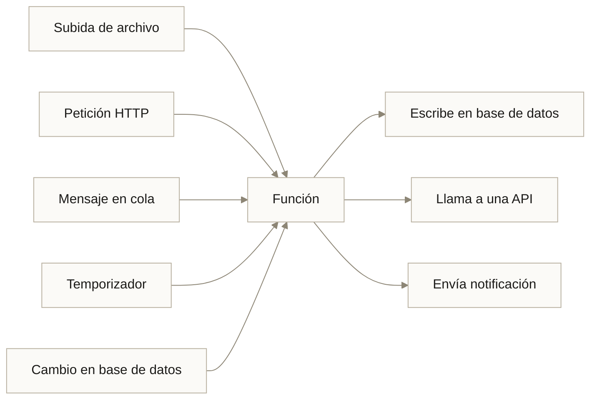
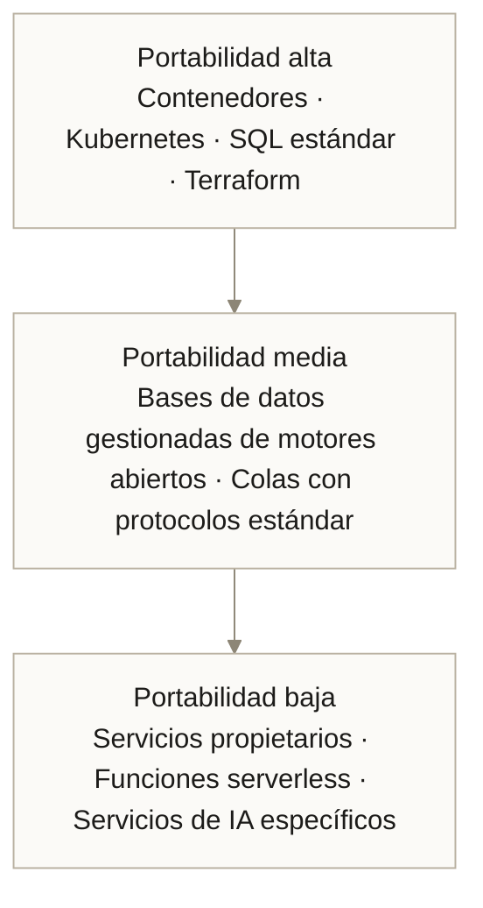
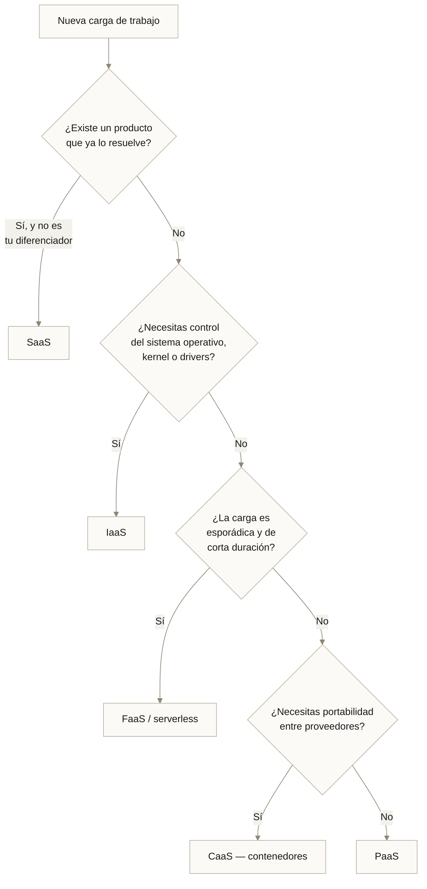

---
tags:
  - Bloque I
  - Nube
---

# Módulo 02 · Modelos de servicio: IaaS, PaaS, SaaS y FaaS

:material-clock-outline: 3 horas
:material-stairs: Nivel introductorio
:material-link-variant: Requiere módulo 01

Tienes que lanzar una tienda en línea en dos semanas. Puedes construir el servidor desde el sistema operativo hacia arriba, puedes desplegar código sobre una plataforma que ya existe, o puedes pagar una suscripción a Shopify y estar vendiendo el jueves.

Las tres son "la nube". La diferencia está en **dónde trazas la línea entre lo que administras tú y lo que administra el proveedor**. Esa línea es el modelo de servicio, y es probablemente la decisión de arquitectura con mayor efecto sobre el costo, la velocidad y la libertad futura de tu proyecto.

---

## 1. La pila de responsabilidad

```mermaid
%%{init:{"theme":"base","themeVariables":{"fontFamily":"Inter, sans-serif","darkMode":false,"background":"#f3f1ec","mainBkg":"#fbfaf7","primaryColor":"#fbfaf7","primaryTextColor":"#1c1b19","primaryBorderColor":"#b9b1a1","secondaryColor":"#ead9ba","secondaryTextColor":"#1c1b19","secondaryBorderColor":"#b9b1a1","tertiaryColor":"#c2d4cb","tertiaryTextColor":"#1c1b19","tertiaryBorderColor":"#b9b1a1","lineColor":"#8d8676","textColor":"#1c1b19","nodeTextColor":"#1c1b19","nodeBorder":"#b9b1a1","labelTextColor":"#1c1b19","titleColor":"#1c1b19","edgeLabelBackground":"#f3f1ec","clusterBkg":"#efece4","clusterBorder":"#d8d2c6","cScale0":"#e2a98c","cScaleLabel0":"#1c1b19","cScale1":"#bdb6e6","cScaleLabel1":"#1c1b19","cScale2":"#e8d9b6","cScaleLabel2":"#1c1b19","cScale3":"#b5d0c3","cScaleLabel3":"#1c1b19","cScale4":"#e6cfc0","cScaleLabel4":"#1c1b19","cScale5":"#cddcea","cScaleLabel5":"#1c1b19"}}}%%
flowchart TB
    subgraph L["Capas de una aplicación"]
        direction TB
        C1["Datos y contenido"]
        C2["Aplicación"]
        C3["Runtime / motor de ejecución"]
        C4["Middleware"]
        C5["Sistema operativo"]
        C6["Virtualización"]
        C7["Servidores"]
        C8["Almacenamiento"]
        C9["Red física"]
    end
```

La analogía más didáctica es la pizza:

| Modelo | Equivalente | Qué pones tú |
| --- | --- | --- |
| **On-premise** | Pizza casera | Horno, ingredientes, masa, mesa, todo |
| **IaaS** | Pizza congelada | Compras la base, la horneas en tu horno |
| **PaaS** | Pizza a domicilio | Llega lista; tú pones la mesa y las bebidas |
| **SaaS** | Cenar en la pizzería | Solo te sientas y comes |
| **FaaS** | Rebanada por porción | Pagas solo lo que comes, cuando lo comes |

### Quién administra qué

| Capa | On-prem | IaaS | PaaS | SaaS |
| --- | :---: | :---: | :---: | :---: |
| Datos y contenido | Tú | Tú | Tú | Tú |
| Aplicación | Tú | Tú | Tú | Proveedor |
| Runtime | Tú | Tú | Proveedor | Proveedor |
| Middleware | Tú | Tú | Proveedor | Proveedor |
| Sistema operativo | Tú | Tú | Proveedor | Proveedor |
| Virtualización | Tú | Proveedor | Proveedor | Proveedor |
| Servidores | Tú | Proveedor | Proveedor | Proveedor |
| Almacenamiento | Tú | Proveedor | Proveedor | Proveedor |
| Red | Tú | Proveedor | Proveedor | Proveedor |

!!! tip "La regla que no falla"
    **Cuanto más arriba en la pila estás, más rápido avanzas y menos control tienes.** No hay una opción correcta; hay una correcta *para tu restricción dominante*. Si tu restricción es el tiempo, sube. Si es el control o el cumplimiento normativo, baja.

---

## 2. IaaS · Infraestructura como Servicio

El proveedor entrega recursos de cómputo virtualizados: máquinas virtuales, almacenamiento en bloque, redes virtuales, balanceadores. Tú instalas el sistema operativo hacia arriba.

**Qué obtienes:** el equivalente a un centro de datos alquilado y programable por API.

### Componentes típicos

| Componente | Función | Ejemplos |
| --- | --- | --- |
| Cómputo | Máquinas virtuales | EC2, Azure VM, Compute Engine |
| Almacenamiento en bloque | Discos persistentes para las VM | EBS, Azure Managed Disks, Persistent Disk |
| Almacenamiento de objetos | Archivos accesibles por HTTP | S3, Blob Storage, Cloud Storage |
| Red virtual | Segmentación y aislamiento | VPC, VNet |
| Balanceo de carga | Distribución de tráfico | ELB, Azure Load Balancer |
| Autoescalado | Ajuste automático de instancias | Auto Scaling Groups, VMSS |

### Cuándo elegir IaaS

- Migraciones **lift-and-shift**: mover una aplicación existente sin reescribirla.
- Cargas con requisitos específicos de kernel, drivers o hardware (GPU con versiones concretas de CUDA).
- Cuando necesitas control total sobre parches, configuración y red.
- Entrenamiento de modelos de deep learning, donde la configuración fina del entorno importa.

### Lo que IaaS te deja en las manos

Todo lo aburrido: parches de seguridad del sistema operativo, configuración del firewall, rotación de claves SSH, monitoreo de disco, respaldos. Un equipo pequeño que elige IaaS suele descubrir que pasa más tiempo administrando que construyendo.

!!! example "Caso · TiendaVirtual.com migra a IaaS"
    Una tienda en línea con un ERP monolítico en Java, corriendo sobre servidores propios de siete años de antigüedad.

    **Por qué IaaS y no PaaS:** el ERP depende de una versión específica de JVM y de un servicio de impresión fiscal que requiere acceso a nivel de sistema operativo. Ninguna plataforma gestionada lo soporta.

    **Arquitectura resultante:** 6 máquinas virtuales tras un balanceador, base de datos en VM con réplica de lectura, almacenamiento de objetos para imágenes de producto, autoescalado configurado para el Buen Fin.

    **Resultado:** migración en 11 semanas sin tocar una línea del ERP. Costo mensual 38 % menor que el mantenimiento del hardware propio. **Deuda pendiente:** el equipo sigue aplicando parches manualmente; la siguiente fase es contenerizar ([módulo 08](08-docker.md)).

---

## 3. PaaS · Plataforma como Servicio

El proveedor entrega un entorno de ejecución completo. Tú subes código; la plataforma se encarga del sistema operativo, el runtime, el escalado y los parches.

### Componentes típicos

| Tipo | Qué resuelve | Ejemplos |
| --- | --- | --- |
| Plataformas de aplicación | Despliegue de código web | App Service, App Engine, Elastic Beanstalk, Heroku |
| Bases de datos gestionadas | Motor, respaldos, réplicas, parches | RDS, Azure SQL, Cloud SQL |
| Colas y mensajería | Comunicación asíncrona | SQS, Service Bus, Pub/Sub |
| Plataformas de datos | Procesamiento distribuido | Databricks, EMR, Dataproc |
| Plataformas de ML | Entrenamiento y despliegue de modelos | SageMaker, Vertex AI, Azure ML |

### El intercambio central de PaaS

Ganas: despliegue en minutos, escalado automático, cero administración de sistema operativo, entornos de staging integrados.

Pierdes: control sobre el runtime, capacidad de instalar dependencias de sistema arbitrarias, y —crucialmente— portabilidad. Una aplicación construida alrededor de servicios PaaS específicos de un proveedor es cara de mover.

!!! example "Caso · RápidoYa, entregas en bicicleta"
    Una startup de reparto necesita una API que soporte de 50 a 3 000 peticiones por minuto según la hora. Equipo: tres desarrolladores, ninguno con experiencia en infraestructura.

    **Decisión:** PaaS completo. API sobre plataforma gestionada, base de datos PostgreSQL gestionada, cola gestionada para asignación de pedidos, almacenamiento de objetos para fotos de entrega.

    **Resultado:** de cero a producción en 9 días. El escalado del mediodía y de la noche ocurre sin que nadie intervenga. Cero horas dedicadas a parches en catorce meses.

    **Costo del intercambio:** cuando a los dos años evaluaron cambiar de proveedor, el estudio arrojó 5 meses de trabajo de migración. Decidieron quedarse. Eso es dependencia del proveedor, y fue una decisión consciente, no un accidente.

---

## 4. SaaS · Software como Servicio

Software completo entregado por suscripción, accesible por navegador o API. No administras nada: ni infraestructura, ni plataforma, ni la aplicación.

| Categoría | Ejemplos |
| --- | --- |
| Productividad | Google Workspace, Microsoft 365 |
| CRM y ventas | Salesforce, HubSpot |
| Comunicación | Slack, Zoom |
| Desarrollo | GitHub, GitLab, Jira |
| Comercio | Shopify, Mercado Shops |
| IA como servicio | APIs de modelos de lenguaje, servicios de visión y voz |

### Lo que se subestima de SaaS

**El dato es tuyo, pero vive allá.** Antes de adoptar un SaaS, las preguntas obligadas son: ¿puedo exportar mis datos completos?, ¿en qué formato?, ¿cuánto tarda?, ¿qué pasa si el proveedor cierra o cambia de precio?

**La integración es el costo real.** Un SaaS aislado es barato. Cinco SaaS que deben compartir datos requieren integración, y ahí se va el presupuesto.

!!! example "Caso · Escuela Digital"
    Una red de 40 escuelas privadas necesita plataforma educativa, gestión de calificaciones, comunicación con padres y videoconferencia.

    **Decisión:** SaaS para todo excepto el sistema de calificaciones, que tiene requisitos de la secretaría de educación local que ningún producto cubre. Ese se construye sobre PaaS.

    **Aprendizaje clave:** el 80 % de las necesidades se cubrió con suscripciones. El 20 % restante —el que da ventaja competitiva y el que la regulación obliga— se construyó a medida. Ese reparto es un patrón sano: **compra lo que no te diferencia, construye lo que sí**.

---

## 5. FaaS y serverless

FaaS (Functions as a Service) ejecuta código en respuesta a eventos, sin que exista para ti ningún servidor. Pagas por invocación y por milisegundos de ejecución.

| Característica | Implicación |
| --- | --- |
| Sin servidores que administrar | Cero parches, cero capacidad ociosa |
| Escalado a cero | Si nadie la invoca, no cuesta nada |
| Escalado automático masivo | De 0 a miles de ejecuciones concurrentes |
| Ejecución efímera | Límite de duración (típicamente 15 min) |
| Sin estado | Cualquier estado debe vivir fuera de la función |

### Arranque en frío

Cuando una función lleva tiempo sin invocarse, la primera llamada debe inicializar el entorno de ejecución. Ese retraso —el arranque en frío— va de decenas de milisegundos a varios segundos según lenguaje y tamaño del paquete.

!!! warning "Serverless e inferencia de modelos: una combinación difícil"
    Cargar un modelo de varios gigabytes en cada arranque en frío convierte una latencia esperada de 200 ms en una de 30 segundos. Para inferencia de modelos grandes, casi siempre conviene un contenedor persistente ([módulo 09](09-kubernetes.md)) en lugar de FaaS.

    FaaS sí funciona bien para: preprocesamiento de datos, orquestación de llamadas a APIs de modelos, webhooks y tareas por lotes ligeras.

### Cuándo NO usar serverless

- Cargas constantes y predecibles: sale más caro que una instancia reservada.
- Procesos largos que exceden el límite de ejecución.
- Aplicaciones con estado en memoria.
- Cuando necesitas latencia garantizada en el primer milisegundo.

---

## 6. La familia completa de modelos *aaS

| Modelo | Qué entrega | Ejemplo |
| --- | --- | --- |
| **IaaS** | Infraestructura virtualizada | EC2 |
| **PaaS** | Entorno de ejecución | App Engine |
| **SaaS** | Software terminado | Salesforce |
| **FaaS** | Ejecución por evento | Lambda |
| **CaaS** | Orquestación de contenedores | EKS, GKE, AKS ([módulo 09](09-kubernetes.md)) |
| **DBaaS** | Bases de datos gestionadas | RDS, Cosmos DB |
| **MLaaS** | Plataforma de machine learning | SageMaker, Vertex AI |
| **MaaS** | Modelos como servicio | APIs de modelos fundacionales |
| **DaaS** | Escritorios virtuales | WorkSpaces, Azure Virtual Desktop |
| **BaaS** | Backend completo para apps | Firebase, Supabase |

**CaaS** merece atención especial porque ocupa el punto medio más interesante: más control que PaaS, menos administración que IaaS, y —la clave— **portabilidad real**, porque un contenedor corre igual en cualquier proveedor. Es el modelo dominante para cargas de IA en producción.

---

## 7. Modelos de precios y optimización de costos

| Modalidad | Descuento | Compromiso | Riesgo |
| --- | --- | --- | --- |
| Bajo demanda | — | Ninguno | Ninguno |
| Planes de ahorro / reservadas 1 año | 30–45 % | Gasto o capacidad comprometida | Pagas aunque no uses |
| Planes de ahorro / reservadas 3 años | 50–72 % | Idem, más largo | Obsolescencia tecnológica |
| Instancias interrumpibles (spot) | 70–90 % | Ninguno | El proveedor puede retirarlas con 2 min de aviso |
| Capacidad dedicada | Sobreprecio | Larga | Cumplimiento normativo justifica el costo |

### Las siete palancas de optimización

1. **Apagar lo que no se usa.** Entornos de no producción fuera del horario laboral: hasta 70 % de ahorro inmediato.
2. **Dimensionar correctamente (rightsizing).** La mayoría de las instancias están sobredimensionadas. Medir antes de dimensionar.
3. **Comprometer la base, dejar el pico bajo demanda.** Reserva el 60–70 % de tu carga mínima; el resto, elástico.
4. **Usar spot para lo interrumpible.** Entrenamiento de modelos con puntos de control, procesamiento por lotes, CI.
5. **Políticas de ciclo de vida en almacenamiento.** Mover datos fríos a niveles de archivo automáticamente.
6. **Vigilar el egress.** Ubicar el cómputo junto al dato; usar CDN para contenido servido repetidamente.
7. **Etiquetar todo.** Sin etiquetas por proyecto y equipo, no se puede atribuir el gasto, y lo que no se atribuye no se optimiza.

!!! tip "FinOps en una frase"
    FinOps es hacer que quien decide el gasto sea quien ve la factura. Si el equipo que despliega no conoce el costo de lo que despliega, el costo solo puede subir.

---

## 8. Nube híbrida, multinube y portabilidad

### Por qué las organizaciones terminan en híbrida

Rara vez es una decisión de diseño. Suele ser el resultado de: un sistema heredado que no puede migrarse, una regulación que obliga a mantener ciertos datos en el país, o una inversión en hardware que aún no se amortiza.

### Multinube: la promesa y el costo

| Argumento a favor | Contrapeso honesto |
| --- | --- |
| Evita la dependencia del proveedor | Solo si realmente puedes mover la carga; si usas servicios propietarios de ambos, dependes de dos |
| Mejor servicio de cada proveedor | Duplica el conocimiento que tu equipo debe mantener |
| Resiliencia ante caída de un proveedor | Una arquitectura verdaderamente activa-activa entre nubes es muy cara |
| Poder de negociación | Real, pero solo a partir de cierto volumen de gasto |

### Las tres capas de portabilidad

!!! danger "Agua fría: la dependencia no es evitable, es negociable"
    Toda decisión tecnológica crea dependencia. Elegir PostgreSQL te ata a PostgreSQL. Elegir Kubernetes te ata a Kubernetes. La pregunta útil no es *"¿cómo evito la dependencia?"* sino **"¿cuánto me costaría salir, y ese costo es proporcional al valor que estoy recibiendo?"**

    Una regla operativa razonable: mantén portable lo que constituye tu núcleo de negocio; permite dependencia en lo periférico, donde el valor del servicio gestionado supera el costo de salida.

---

## 9. Cómo se decide en la práctica

Este árbol resuelve el 80 % de los casos. El 20 % restante requiere la conversación que veremos en el [módulo 03](03-togaf-ia.md): qué capacidad de negocio estás habilitando y quién es su propietario.

---

## Laboratorio · La misma aplicación en cuatro modelos

**Objetivo:** cuantificar el intercambio entre esfuerzo, costo y control.

Toma una aplicación sencilla: una API que recibe una imagen, la redimensiona y la guarda.

**Paso 1 — IaaS.** Enumera todos los pasos necesarios: crear VPC, subred, grupo de seguridad, instancia, instalar runtime, configurar servicio, configurar balanceador, configurar autoescalado, configurar respaldos, configurar monitoreo. Cuenta los pasos.

**Paso 2 — PaaS.** Repite con una plataforma gestionada. Cuenta los pasos.

**Paso 3 — FaaS.** Repite con una función disparada por subida a almacenamiento de objetos. Cuenta los pasos.

**Paso 4 — SaaS.** Busca un servicio de transformación de imágenes por API. Cuenta los pasos.

**Paso 5 — Tabla comparativa.** Completa:

| Modelo | Pasos de configuración | Tiempo estimado | Costo con 1 000 imágenes/mes | Costo con 10 M imágenes/mes | Portabilidad |
| --- | --- | --- | --- | --- | --- |
| IaaS | | | | | |
| PaaS | | | | | |
| FaaS | | | | | |
| SaaS | | | | | |

**Paso 6.** Observa dónde se cruzan las curvas de costo. Casi siempre FaaS gana en volumen bajo y pierde en volumen alto. Identifica el punto de cruce.

**Entregable:** la tabla completa y una recomendación argumentada para dos escenarios: una startup validando la idea y una empresa con volumen estable.

---

## Conceptos clave

- **IaaS:** infraestructura virtualizada; administras del sistema operativo hacia arriba.
- **PaaS:** entorno de ejecución gestionado; administras aplicación y datos.
- **SaaS:** software terminado por suscripción; administras únicamente tus datos y configuración.
- **FaaS / serverless:** ejecución de código por evento, con escalado a cero y pago por milisegundo.
- **CaaS:** orquestación de contenedores gestionada; el punto medio con mayor portabilidad.
- **Arranque en frío:** latencia adicional en la primera invocación de una función inactiva.
- **Dependencia del proveedor (vendor lock-in):** costo de migrar fuera de un proveedor; no se elimina, se dimensiona y se negocia.
- **FinOps:** práctica de atribuir el costo de la nube a quien lo genera, para que la optimización tenga dueño.
- **Rightsizing:** ajustar el tamaño de los recursos al consumo medido, no al estimado.

---

## Puntos clave

- Los modelos de servicio no compiten: se eligen según cuál sea tu restricción dominante —tiempo, control o cumplimiento.
- Cuanto más subes en la pila, más rápido avanzas y menos control conservas. Es un intercambio, no una escalera de calidad.
- Compra lo que no te diferencia; construye lo que sí. Ese reparto explica por qué casi toda organización acaba usando los cuatro modelos a la vez.
- Serverless es excelente para cargas esporádicas y malo para inferencia de modelos grandes: el arranque en frío domina la latencia.
- CaaS es el modelo dominante para IA en producción porque conserva portabilidad real.
- La optimización de costos empieza por apagar lo ocioso y etiquetar todo, no por negociar descuentos.
- La dependencia del proveedor no se evita: se acota al perímetro donde el servicio gestionado vale más que el costo de salida.

---

## Ejercicios

1. **Clasifica tu stack.** Lista diez servicios tecnológicos que use tu organización y clasifícalos en IaaS, PaaS, SaaS, FaaS o CaaS. ¿Cuál predomina? ¿Es coherente con el tamaño del equipo?

2. **Estima el costo de salida.** Elige el servicio del que más dependes. Estima en semanas-persona lo que costaría migrarlo a otro proveedor. ¿El valor que recibes justifica ese costo?

3. **Caza el desperdicio.** Encuentra tres recursos sobredimensionados o encendidos innecesariamente. Calcula el ahorro anual de corregirlos.

4. **Rediseña con otro modelo.** Toma una aplicación que hoy corre en IaaS y diseña en una página cómo se vería en PaaS o CaaS. Identifica explícitamente qué perderías.

5. **El punto de cruce de serverless.** Con los precios reales de un proveedor, calcula a partir de cuántas invocaciones mensuales una función serverless deja de ser más barata que una instancia pequeña siempre encendida.

---

## Lectura adicional

- [AWS · Tipos de computación en la nube](https://aws.amazon.com/es/types-of-cloud-computing/) — la explicación canónica del proveedor con mayor cuota.
- [Microsoft Learn · IaaS, PaaS y SaaS](https://learn.microsoft.com/azure/cloud-adoption-framework/) — marco de adopción con guía de decisión.
- [CNCF Serverless Whitepaper](https://github.com/cncf/wg-serverless) — definición neutral de serverless por la fundación que gobierna Kubernetes.
- [FinOps Foundation · Framework](https://www.finops.org/framework/) — el marco de referencia para gestión financiera de la nube.
- [Módulo 03 · TOGAF para IA](03-togaf-ia.md) — cómo se toman estas decisiones cuando hay más de un equipo involucrado.
- [Módulo 08 · Docker](08-docker.md) — la tecnología que hace posible CaaS y la portabilidad real.
