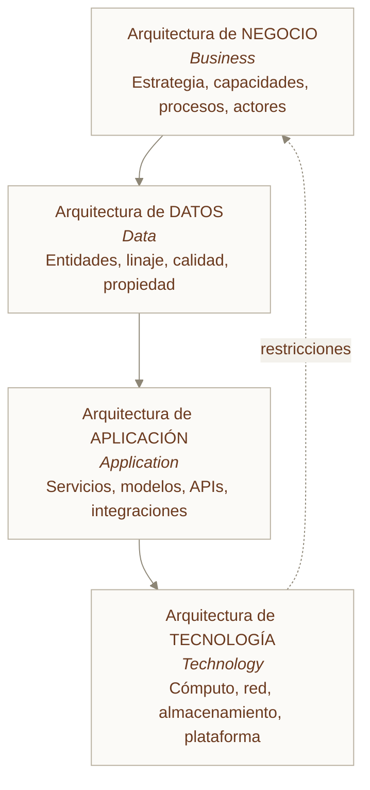
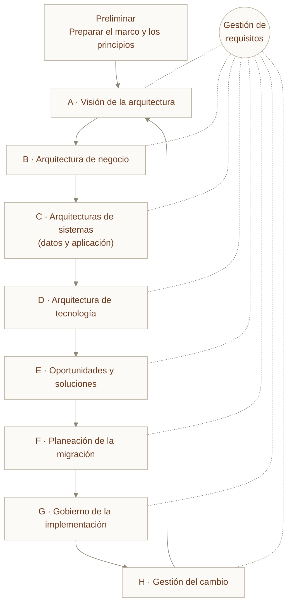
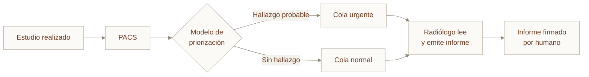

---
tags:
  - Bloque II
  - Arquitectura
  - Nuevo
---

# Módulo 03 · Arquitectura empresarial con TOGAF para IA

<div class="modulo-meta" markdown>
<span>:material-clock-outline: 3 horas</span>
<span>:material-stairs: Nivel intermedio</span>
<span>:material-link-variant: Requiere módulo 02</span>
<span>:material-star-outline: Capítulo nuevo</span>
</div>

La mayoría de las iniciativas de IA no fracasan por el modelo. Fracasan porque nadie definió qué capacidad de negocio iban a habilitar, de quién eran los datos que necesitaban, quién autorizaba su paso a producción y qué pasaba cuando el modelo se equivocaba.

Eso no es un problema de ciencia de datos. Es un problema de **arquitectura empresarial**, y existe un marco maduro para tratarlo: TOGAF.

---

## 1. Qué es TOGAF y por qué importa en IA

**TOGAF** (The Open Group Architecture Framework) es el marco de arquitectura empresarial más adoptado del mundo. Lo mantiene The Open Group y va por su 10.ª edición.

No es una tecnología ni un producto. Es un **método para diseñar, planear, implementar y gobernar la arquitectura de una organización**, de modo que la tecnología esté alineada con los objetivos de negocio y no al revés.

### El problema que resuelve en un proyecto de IA

| Síntoma habitual | Causa arquitectónica |
| --- | --- |
| "Tenemos 14 pilotos de IA y ninguno en producción" | No existe una arquitectura destino; cada piloto inventa la suya |
| "El modelo funciona pero legal no lo deja salir" | La arquitectura de gobierno no se diseñó, se improvisó al final |
| "Cada equipo construyó su propio pipeline de datos" | No hay arquitectura de datos común ni propietarios definidos |
| "Nadie sabe cuánto nos cuesta realmente la IA" | Falta el vínculo entre capacidad de negocio y consumo de tecnología |
| "El modelo se degradó y nos enteramos por un cliente" | No se definieron requisitos no funcionales ni responsables de operación |

TOGAF no escribe código ni entrena modelos. Lo que hace es **obligar a responder estas preguntas antes de que sean caras**.

---

## 2. Las cuatro arquitecturas (las "cuatro B")

TOGAF descompone la arquitectura empresarial en cuatro dominios. En inglés se conocen como BDAT.



### Cómo se traducen a un proyecto de IA

=== "Negocio"

    **Pregunta central:** ¿qué capacidad de negocio habilita este modelo?

    Nunca "queremos usar IA". Siempre una capacidad concreta y medible.

    | Elemento | Ejemplo en un caso de detección de fraude |
    | --- | --- |
    | Capacidad | Detectar transacciones fraudulentas en tiempo real |
    | Motor de negocio | Reducir pérdidas por fraude un 30 % en 12 meses |
    | Actores | Analista de riesgo, cliente, operador de soporte |
    | Proceso afectado | Autorización de transacción (de 3 pasos pasa a 4) |
    | Decisión automatizada | Bloquear, marcar para revisión o permitir |
    | Umbral de escalamiento | Todo bloqueo debe poder ser revisado por un humano en menos de 2 minutos |

=== "Datos"

    **Pregunta central:** ¿qué datos necesita, de quién son y en qué estado llegan?

    | Elemento | Contenido |
    | --- | --- |
    | Entidades | Transacción, cliente, dispositivo, comercio |
    | Propietario del dato | El área que responde por su exactitud, no la que lo almacena |
    | Linaje | De qué sistema origen viene y qué transformaciones sufre |
    | Calidad requerida | Completitud mínima, latencia máxima aceptable |
    | Clasificación | Público, interno, confidencial, datos personales |
    | Retención | Cuánto se conserva y con qué base legal |
    | Conjunto de entrenamiento | Qué subconjunto, con qué periodo, con qué sesgo conocido |

    !!! warning "El error más común"
        Tratar el conjunto de entrenamiento como un artefacto técnico y no como un activo de arquitectura de datos. Si no tiene propietario, linaje ni política de retención, tendrás un problema de auditoría, no de precisión.

=== "Aplicación"

    **Pregunta central:** ¿qué componentes hay y cómo se hablan?

    | Componente | Responsabilidad |
    | --- | --- |
    | Servicio de ingestión | Recibir eventos de transacción |
    | Servicio de características (*feature store*) | Calcular y servir características consistentes en entrenamiento e inferencia |
    | Servicio de inferencia | Exponer el modelo por API con latencia acotada |
    | Servicio de decisión | Aplicar reglas de negocio sobre la salida del modelo |
    | Registro de modelos | Versionar, aprobar y promover modelos |
    | Servicio de monitoreo | Detectar deriva y degradación |
    | Interfaz de revisión humana | Permitir la supervisión exigida por negocio |

=== "Tecnología"

    **Pregunta central:** ¿sobre qué corre todo esto?

    Aquí aterrizan las decisiones de los módulos [01](01-fundamentos-nube.md), [02](02-modelos-servicio.md), [08](08-docker.md) y [09](09-kubernetes.md): modelo de despliegue, modelo de servicio, contenedores, orquestación, tipo de acelerador, red, almacenamiento.

    | Requisito no funcional | Decisión tecnológica derivada |
    | --- | --- |
    | Latencia de inferencia < 100 ms p99 | Contenedor persistente con GPU, no serverless |
    | Residencia de datos nacional | Región específica; descarta ciertos servicios gestionados |
    | Disponibilidad 99.95 % | Múltiples zonas de disponibilidad |
    | Auditabilidad completa | Registro inmutable de cada inferencia |
    | Pico estacional 8× | Autoescalado horizontal con límites de costo |

---

## 3. El ADM: el ciclo de desarrollo de la arquitectura

El **ADM** (Architecture Development Method) es el corazón de TOGAF: un ciclo iterativo de nueve fases.



La **gestión de requisitos** está en el centro porque no es una fase: alimenta y recibe información de todas.

### Las nueve fases aplicadas a una iniciativa de IA

| Fase | Qué produce | Aplicada a IA |
| --- | --- | --- |
| **Preliminar** | Principios de arquitectura, marco de gobierno | Definir los principios de IA de la organización: explicabilidad exigida, supervisión humana, uso de datos personales |
| **A · Visión** | Documento de visión, alcance, interesados | "Detección de fraude en tiempo real"; identificar a riesgo, legal, operaciones, TI |
| **B · Negocio** | Modelo de capacidades, procesos objetivo | Mapa de capacidades antes y después; qué decisiones se automatizan |
| **C · Sistemas** | Arquitectura de datos y de aplicación | Modelo de datos, linaje, componentes de ML, contratos de API |
| **D · Tecnología** | Arquitectura de plataforma | Nube, contenedores, aceleradores, red, almacenamiento |
| **E · Oportunidades** | Paquetes de trabajo, arquitecturas de transición | Descomponer en entregas: primero reglas, luego modelo, luego tiempo real |
| **F · Migración** | Plan de implementación y hoja de ruta | Secuencia, dependencias, presupuesto, criterios de paso de fase |
| **G · Gobierno** | Contratos de arquitectura, cumplimiento | Revisión de cumplimiento antes de cada despliegue a producción |
| **H · Cambio** | Gestión de cambios de arquitectura | Qué dispara un nuevo ciclo: deriva del modelo, nueva regulación, cambio de proveedor |

!!! tip "El ADM es iterativo, no una cascada"
    El error más frecuente al adoptar TOGAF es recorrer las nueve fases una vez, en orden, durante ocho meses, y entregar un documento que nadie lee.

    En proyectos de IA funciona mejor **iterar el ciclo con alcance reducido**: una vuelta completa de cuatro semanas sobre una sola capacidad, entregando arquitecturas de transición ejecutables. TOGAF 10 lo reconoce explícitamente y describe cómo configurar el ADM para entornos ágiles.

---

## 4. Brecha, transición y hoja de ruta

El artefacto más útil del ADM —y el más ignorado— es el **análisis de brechas**: la diferencia entre la arquitectura de línea base (lo que tienes hoy) y la arquitectura destino (lo que necesitas).

### Matriz de brechas

| Dominio | Línea base | Destino | Brecha | Paquete de trabajo |
| --- | --- | --- | --- | --- |
| Negocio | Revisión manual de fraude, 48 h | Decisión automática < 1 s con revisión humana selectiva | Proceso y roles nuevos | PT-1 Rediseño de proceso |
| Datos | Datos en 4 silos, sin linaje | Repositorio unificado con linaje y propietarios | Integración y gobierno | PT-2 Plataforma de datos |
| Aplicación | Motor de reglas monolítico | Reglas + modelo + registro + monitoreo | 4 servicios nuevos | PT-3 Servicios de ML |
| Tecnología | VMs sin orquestación | Contenedores sobre Kubernetes con GPU | Plataforma nueva | PT-4 Plataforma de cómputo |

### Arquitecturas de transición

No se pasa de la línea base al destino en un salto. Se definen estados intermedios que sean **operables y útiles por sí mismos**:

```mermaid
%%{init:{"theme":"base","themeVariables":{"fontFamily":"Inter, sans-serif","darkMode":false,"background":"#f3f1ec","mainBkg":"#fbfaf7","primaryColor":"#fbfaf7","primaryTextColor":"#6b3a1f","primaryBorderColor":"#b9b1a1","secondaryColor":"#ead9ba","secondaryTextColor":"#6b3a1f","secondaryBorderColor":"#b9b1a1","tertiaryColor":"#c2d4cb","tertiaryTextColor":"#6b3a1f","tertiaryBorderColor":"#b9b1a1","lineColor":"#8d8676","textColor":"#6b3a1f","nodeTextColor":"#6b3a1f","nodeBorder":"#b9b1a1","labelTextColor":"#6b3a1f","titleColor":"#6b3a1f","edgeLabelBackground":"#f3f1ec","clusterBkg":"#efece4","clusterBorder":"#d8d2c6","cScale0":"#e2a98c","cScaleLabel0":"#6b3a1f","cScale1":"#bdb6e6","cScaleLabel1":"#6b3a1f","cScale2":"#e8d9b6","cScaleLabel2":"#6b3a1f","cScale3":"#b5d0c3","cScaleLabel3":"#6b3a1f","cScale4":"#e6cfc0","cScaleLabel4":"#6b3a1f","cScale5":"#cddcea","cScaleLabel5":"#6b3a1f"}}}%%
flowchart LR
    LB["Línea base<br/>Reglas manuales"] --> T1["Transición 1<br/>Reglas automatizadas<br/>+ datos unificados"]
    T1 --> T2["Transición 2<br/>Modelo en lote<br/>con revisión humana"]
    T2 --> T3["Transición 3<br/>Modelo en tiempo real<br/>con monitoreo"]
    T3 --> DST["Destino<br/>Decisión automática<br/>con reentrenamiento continuo"]
    classDef default fill:#fbfaf7,stroke:#b9b1a1,stroke-width:1px,color:#6b3a1f;
```



Cada transición entrega valor. Si el proyecto se cancela en la transición 2, la organización se queda con algo que funciona. Ese es el criterio de diseño.

---

## 5. Gobierno: quién aprueba qué

La fase G del ADM es donde TOGAF aporta más a la IA, porque define **un órgano y un contrato**.

### El Consejo de Arquitectura

| Función | Aplicada a IA |
| --- | --- |
| Aprobar la arquitectura destino | Validar que el diseño cumple los principios de IA |
| Otorgar exenciones (*dispensations*) | Permitir una desviación temporal con fecha de vencimiento |
| Revisar cumplimiento antes de producción | Puerta obligatoria: ningún modelo pasa sin revisión |
| Mantener el repositorio de arquitectura | Registro de modelos, decisiones y sus justificaciones |

### Niveles de cumplimiento de TOGAF

| Nivel | Significado |
| --- | --- |
| **Irrelevante** | La arquitectura no aplica a esta implementación |
| **Consistente** | Cumple algunas características, no contradice ninguna |
| **Conforme** | Cumple todas las características aplicables |
| **Totalmente conforme** | Cumple y además implementa todo lo especificado |
| **No conforme** | Contradice la arquitectura; requiere exención o rediseño |

!!! example "Puerta de cumplimiento para modelos"
    Una lista de verificación real que un Consejo de Arquitectura puede exigir antes de aprobar el paso a producción de un modelo:

    - [ ] La capacidad de negocio está documentada y tiene un propietario nombrado.
    - [ ] Los datos de entrenamiento tienen linaje, clasificación y base legal registrados.
    - [ ] Existe una línea base no-IA contra la cual comparar (regla simple o proceso manual).
    - [ ] Las métricas de evaluación están definidas y se miden por segmento, no solo en agregado.
    - [ ] Existe un mecanismo de reversión al estado anterior en menos de 15 minutos.
    - [ ] Está definido el umbral de deriva que dispara reentrenamiento o retirada.
    - [ ] Los casos de decisión adversa para una persona tienen ruta de revisión humana.
    - [ ] El costo de inferencia por cada mil peticiones está estimado y tiene presupuesto asignado.
    - [ ] La documentación del modelo (*model card*) está publicada en el repositorio de arquitectura.

---

## 6. Principios de arquitectura para IA

La fase Preliminar produce los principios. Un principio de TOGAF bien escrito tiene cuatro partes: **nombre, enunciado, justificación e implicaciones**. Ejemplos aplicables a IA:

!!! abstract "Principio 1 · La decisión automatizada es reversible"
    **Enunciado.** Toda decisión tomada por un modelo debe poder revertirse y explicarse.

    **Justificación.** Los modelos se degradan y se equivocan de formas que no se anticipan en el diseño. Sin reversibilidad, un error se convierte en un incidente de negocio.

    **Implicaciones.** Cada inferencia se registra con sus entradas, su versión de modelo y su salida. Se mantiene siempre disponible la vía de decisión anterior. El despliegue usa estrategias progresivas.

!!! abstract "Principio 2 · Los datos tienen propietario antes de tener modelo"
    **Enunciado.** Ningún conjunto de datos entra a un proceso de entrenamiento sin un propietario de negocio identificado.

    **Justificación.** La calidad y la legalidad del dato son responsabilidades de negocio, no de TI.

    **Implicaciones.** El catálogo de datos precede a la plataforma de ML. Los proyectos sin propietario de datos se detienen en la fase B.

!!! abstract "Principio 3 · Portabilidad en el núcleo, conveniencia en la periferia"
    **Enunciado.** Los componentes que constituyen el diferenciador del negocio se construyen sobre tecnología portable; los periféricos pueden usar servicios propietarios.

    **Justificación.** La dependencia del proveedor es aceptable donde el costo de salida es menor que el valor recibido.

    **Implicaciones.** El servicio de inferencia se empaqueta en contenedores. La autenticación o la mensajería pueden ser servicios gestionados.

!!! abstract "Principio 4 · Comparar siempre contra la alternativa simple"
    **Enunciado.** Toda propuesta de modelo de IA se evalúa contra una línea base sin IA.

    **Justificación.** Una parte importante de los problemas que se plantean como IA se resuelven con reglas, consultas SQL o un cambio de proceso, con una fracción del costo de operación.

    **Implicaciones.** La fase A incluye obligatoriamente la definición de la línea base. Si el modelo no la supera con margen, el proyecto no avanza.

---

## 7. TOGAF, ArchiMate y la documentación viva

**ArchiMate** es el lenguaje de modelado de The Open Group, complementario a TOGAF. Permite dibujar las cuatro arquitecturas con una notación común.

En la práctica, en proyectos de IA conviene un enfoque pragmático:

| Artefacto | Herramienta recomendada | Dónde vive |
| --- | --- | --- |
| Diagramas de arquitectura | Mermaid en Markdown | En el repositorio, versionado con Git |
| Catálogo de capacidades | Tabla en Markdown | En el repositorio |
| Matriz de brechas | Tabla en Markdown | En el repositorio |
| Decisiones de arquitectura | ADR (*Architecture Decision Record*) | `docs/decisiones/` en el repositorio |
| Registro de modelos | Herramienta de MLOps ([módulo 10](10-devops-mlops.md)) | Plataforma de ML |

!!! tip "El repositorio como repositorio de arquitectura"
    TOGAF habla de un "repositorio de arquitectura" como concepto abstracto. En una organización de ingeniería moderna, ese repositorio debería ser **el repositorio de código**: versionado, con historial, con revisión por pares y accesible tanto a humanos como a agentes.

    Esta idea reaparece con fuerza en el [módulo 13](13-harness-engineering.md): lo que no está en el repositorio, para un agente, no existe.

### Plantilla de ADR

```markdown
# ADR-007 · Usar contenedores persistentes para inferencia en lugar de serverless

- **Estado:** Aceptado
- **Fecha:** 2026-03-14
- **Fase ADM:** D · Arquitectura de tecnología
- **Decisores:** Consejo de Arquitectura

## Contexto
El requisito no funcional exige latencia p99 inferior a 100 ms. El modelo pesa 2.4 GB.

## Opciones consideradas
1. Funciones serverless con el modelo empaquetado.
2. Contenedores persistentes sobre Kubernetes con GPU.
3. Servicio de inferencia gestionado del proveedor.

## Decisión
Opción 2.

## Justificación
El arranque en frío de la opción 1 se midió entre 18 y 31 s, incompatible con el
requisito. La opción 3 cumple la latencia pero no la residencia de datos exigida
por el regulador en dos de las tres regiones objetivo.

## Consecuencias
- Positivas: latencia cumplida, portabilidad conservada, control del escalado.
- Negativas: costo base superior al de serverless en horas de baja demanda.
- Mitigación: autoescalado con mínimo de 2 réplicas y uso de instancias
  interrumpibles para el excedente.
```

---

## 8. Agua fría: los límites de TOGAF

!!! danger "TOGAF puede convertirse en burocracia"
    Las críticas recurrentes están bien fundadas:

    **Es pesado.** El estándar completo supera las 700 páginas. Aplicado literalmente en una organización de 40 personas, consume más esfuerzo del que ahorra.

    **Produce documentos, no sistemas.** Un ciclo ADM mal ejecutado entrega un conjunto de diagramas que quedan obsoletos el día del primer despliegue.

    **Asume estabilidad.** Fue diseñado para organizaciones con horizontes de planeación de años. Un modelo de IA puede quedar obsoleto en seis meses.

    **Es descriptivo, no prescriptivo.** TOGAF te dice qué preguntas hacer, no qué responder. Sin arquitectos con criterio, genera plantillas vacías.

### Cómo usarlo sin ahogarse

| Práctica | En lugar de |
| --- | --- |
| Ciclos ADM de 3–4 semanas por capacidad | Un ciclo anual de toda la empresa |
| Cinco principios que se aplican de verdad | Treinta principios que nadie recuerda |
| Diagramas en Markdown versionados | Herramientas de modelado que solo abre el arquitecto |
| Una puerta de cumplimiento con lista de verificación | Un comité que revisa presentaciones |
| Arquitecturas de transición entregables | Una arquitectura destino a tres años |

La medida de éxito es simple: **si la arquitectura no cambia el comportamiento de alguien la semana que viene, no estás haciendo arquitectura, estás haciendo documentación**.

---

## Caso práctico · Hospital regional que quiere IA diagnóstica

Un hospital público de tercer nivel quiere apoyar la lectura de radiografías de tórax con un modelo de visión por computadora.

### Fase A · Visión

- **Capacidad:** priorizar la lista de lectura del radiólogo, señalando estudios con hallazgos probables.
- **Lo que explícitamente NO es:** un sistema que diagnostique. Es un sistema que **ordena una cola**.
- **Interesados:** jefatura de radiología, dirección médica, área jurídica, TI, comité de ética, proveedor del PACS.
- **Métrica de negocio:** reducir el tiempo hasta la lectura de estudios críticos de 6 h a 45 min.

Ese reencuadre —de "diagnosticar" a "priorizar"— cambia todo el proyecto: reduce el riesgo regulatorio, elimina la exigencia de certificación como dispositivo médico en varios marcos, y hace el proyecto viable.

### Fase B · Negocio



El radiólogo sigue leyendo **todos** los estudios. El modelo solo altera el orden. Ninguna decisión clínica se automatiza.

### Fase C · Datos y aplicación

| Aspecto | Definición |
| --- | --- |
| Entidad principal | Estudio de imagen (DICOM) |
| Propietario del dato | Jefatura de radiología |
| Clasificación | Datos personales sensibles de salud |
| Anonimización | Obligatoria antes de cualquier uso de entrenamiento |
| Linaje | PACS → anonimizador → almacenamiento de entrenamiento |
| Retención de inferencias | 5 años, requisito del expediente clínico |
| Sesgo conocido | El conjunto proviene de un solo equipo de rayos X; se documenta como limitación |

### Fase D · Tecnología

| Requisito | Decisión |
| --- | --- |
| Los datos no pueden salir de la institución | Despliegue en servidores propios, no en nube pública |
| Inferencia en menos de 3 min por estudio | Un servidor con GPU es suficiente para el volumen |
| Disponibilidad no crítica (es una ayuda, no un bloqueo) | Sin alta disponibilidad; si falla, la cola vuelve a orden cronológico |
| Auditabilidad | Registro inmutable de cada priorización con versión del modelo |

Nótese que el requisito de residencia **eliminó la nube pública** en la fase D. Si esa conversación se hubiera tenido después de construir sobre un servicio gestionado, el proyecto se habría perdido entero.

### Fase E–F · Transiciones

1. **Transición 1:** el modelo corre en paralelo, sin alterar la cola. Se compara su priorización contra la real durante 8 semanas.
2. **Transición 2:** priorización activa solo en horario diurno, con supervisión del jefe de turno.
3. **Destino:** priorización activa permanente, con reentrenamiento semestral y revisión anual del comité de ética.

### Fase G · Gobierno

El Consejo de Arquitectura, ampliado con el comité de ética, aplica la lista de verificación de cumplimiento. El punto que más discusión generó: *"existe línea base no-IA"*. La línea base resultó ser "orden cronológico", y el modelo debía superarla en tiempo-hasta-lectura de casos críticos con significancia estadística.

---

## Laboratorio · Un ciclo ADM comprimido

**Objetivo:** recorrer las fases A–D de TOGAF sobre una iniciativa de IA real o verosímil, en 50 minutos.

**Formato:** equipos de 3–4 personas. Una hoja por fase.

**Paso 1 · Fase A (10 min).** Completa:

```markdown
Capacidad de negocio: ______
Métrica de éxito medible: ______
Interesados (mínimo 5): ______
Lo que este proyecto explícitamente NO hará: ______
Línea base sin IA contra la que se comparará: ______
```

**Paso 2 · Fase B (10 min).** Dibuja el proceso de negocio actual y el objetivo. Marca con color el punto exacto donde interviene el modelo y qué decisión toma.

**Paso 3 · Fase C (15 min).** Completa la tabla de datos:

| Entidad | Sistema origen | Propietario | Clasificación | Calidad requerida | Riesgo conocido |
| --- | --- | --- | --- | --- | --- |

Y lista los componentes de aplicación con una responsabilidad cada uno.

**Paso 4 · Fase D (10 min).** Deriva al menos cuatro decisiones tecnológicas **a partir de requisitos no funcionales**, no de preferencias:

| Requisito no funcional | Decisión tecnológica | Qué opción queda descartada |
| --- | --- | --- |

**Paso 5 · Brechas (5 min).** Una fila por dominio: línea base, destino, brecha, paquete de trabajo.

**Entregable:** las cinco hojas, más **un ADR** escrito con la plantilla de la sección 7 sobre la decisión tecnológica más discutida del equipo.

---

## Conceptos clave

- **TOGAF:** marco de arquitectura empresarial de The Open Group; método para alinear tecnología con objetivos de negocio.
- **ADM (Architecture Development Method):** ciclo iterativo de nueve fases que constituye el núcleo de TOGAF.
- **BDAT:** los cuatro dominios de arquitectura — negocio, datos, aplicación y tecnología.
- **Arquitectura de línea base:** el estado actual, documentado como es y no como debería ser.
- **Arquitectura destino:** el estado objetivo, derivado de capacidades de negocio.
- **Análisis de brechas:** diferencia entre línea base y destino, traducida a paquetes de trabajo.
- **Arquitectura de transición:** estado intermedio operable y útil por sí mismo.
- **Consejo de Arquitectura:** órgano que aprueba arquitecturas, otorga exenciones y revisa cumplimiento.
- **Exención (*dispensation*):** permiso temporal y con fecha de vencimiento para desviarse de la arquitectura.
- **ADR (Architecture Decision Record):** registro breve y versionado de una decisión, sus alternativas y sus consecuencias.
- **ArchiMate:** lenguaje de modelado complementario a TOGAF.

---

## Puntos clave

- Los proyectos de IA fracasan más por falta de arquitectura que por falta de precisión del modelo.
- TOGAF no dice qué construir; obliga a responder quién lo necesita, con qué datos, quién lo aprueba y qué pasa cuando falla.
- Los cuatro dominios se recorren en orden: negocio → datos → aplicación → tecnología. Empezar por la tecnología es el error clásico.
- La fase D debe **derivar** de requisitos no funcionales. Un requisito de residencia de datos puede eliminar la nube pública entera; conviene descubrirlo antes de construir.
- Las arquitecturas de transición deben entregar valor por sí solas. Si el proyecto se cancela a mitad, algo útil debe quedar.
- Los principios de arquitectura solo sirven si son pocos, están escritos con implicaciones concretas y alguien los hace cumplir.
- Toda iniciativa de IA debe compararse contra una línea base sin IA. Una parte considerable no la supera.
- TOGAF aplicado literalmente es burocracia. Aplicado en ciclos cortos sobre una capacidad a la vez, es la diferencia entre catorce pilotos y un sistema en producción.

---

## Ejercicios

1. **Reencuadra un proyecto.** Toma una iniciativa de IA que conozcas y descríbela como una **capacidad de negocio** en una frase, sin mencionar ninguna tecnología. Si no puedes, el proyecto probablemente no tiene caso de negocio definido.

2. **Matriz de propiedad del dato.** Para tu organización, lista cinco conjuntos de datos que un proyecto de IA usaría y nombra al propietario de negocio de cada uno. ¿Cuántos tienen uno identificable?

3. **Deriva tecnológica.** Escribe tres requisitos no funcionales de un sistema que conozcas y deriva, para cada uno, una decisión tecnológica y una opción que queda descartada.

4. **Escribe un ADR.** Documenta con la plantilla una decisión técnica que hayas tomado recientemente. Incluye las opciones que descartaste y por qué. Compáralo con cómo la recordabas.

5. **Diseña la puerta de cumplimiento.** Adapta la lista de verificación de la sección 5 a tu organización: quita lo que no aplique, añade lo que tu regulador exija. Quédate en un máximo de diez puntos.

6. **El argumento contrario.** Defiende en medio folio que tu organización **no** debería adoptar TOGAF. ¿Cuál es el tamaño mínimo a partir del cual compensa?

---

## Lectura adicional

- [The Open Group · TOGAF Standard](https://www.opengroup.org/togaf) — portal oficial del estándar, 10.ª edición.
- [The Open Group · TOGAF Library](https://publications.opengroup.org/togaf-library) — guías de la serie TOGAF, incluida la configuración para entornos ágiles.
- [ArchiMate 3.2 Specification](https://pubs.opengroup.org/architecture/archimate32-doc/) — el lenguaje de modelado complementario.
- [Architecture Decision Records](https://adr.github.io/) — el formato ligero para registrar decisiones en el repositorio.
- [NIST AI Risk Management Framework](https://www.nist.gov/itl/ai-risk-management-framework) — marco complementario, centrado en riesgo de IA, que encaja bien en las fases A y G.
- [Módulo 04 · Arquitecturas cloud, seguridad y gobernanza](04-arquitectura-seguridad.md) — la fase D en detalle.
- [Módulo 10 · DevOps, GitOps, MLOps y AIOps](10-devops-mlops.md) — cómo se operacionaliza la fase G.
