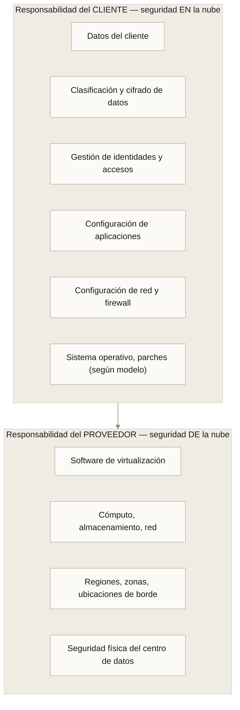
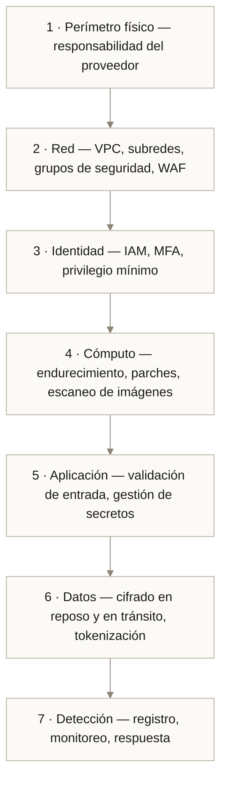
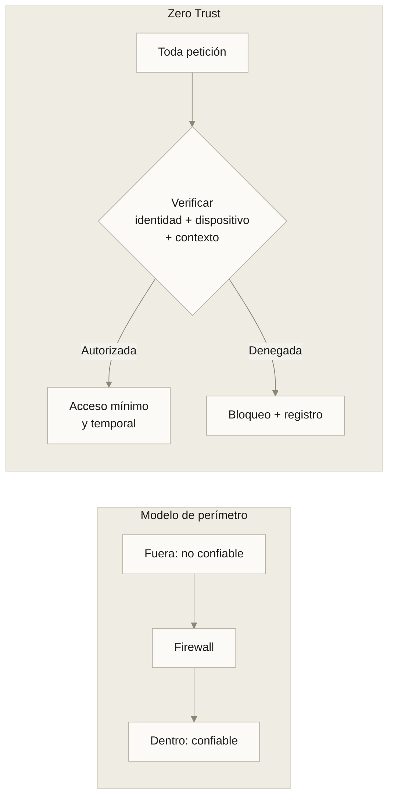
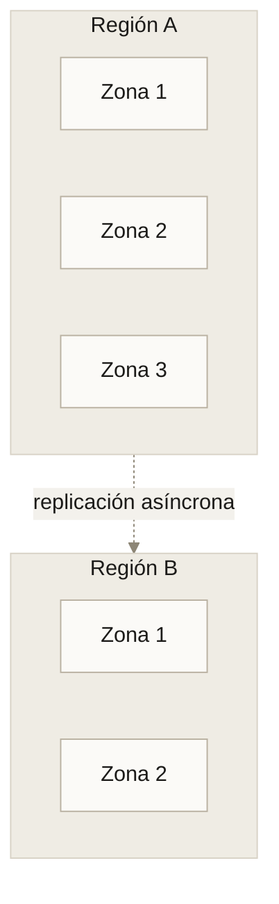
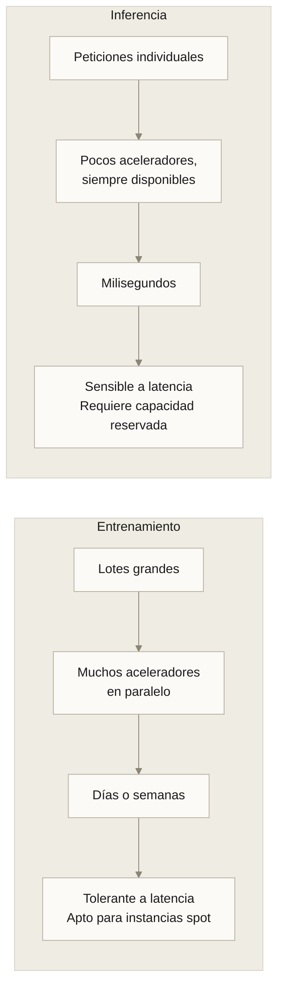
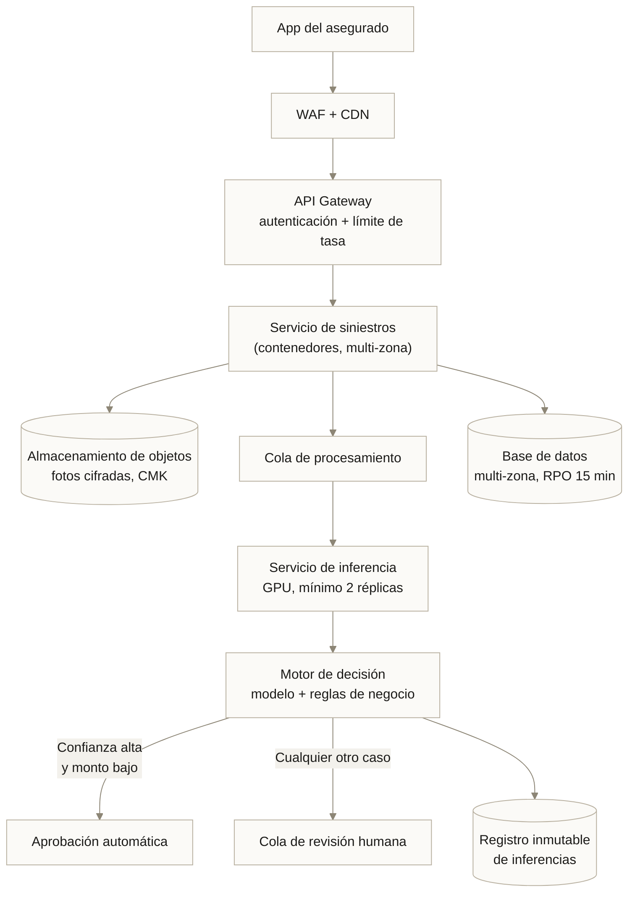

---
tags:
  - Bloque II
  - Arquitectura
  - Seguridad
---

# Módulo 04 · Arquitecturas cloud, seguridad y gobernanza

<div class="modulo-meta" markdown>
<span>:material-clock-outline: 3 horas</span>
<span>:material-stairs: Nivel intermedio</span>
<span>:material-link-variant: Requiere módulos 02 y 03</span>
</div>

En 2019 una institución financiera expuso los datos de más de cien millones de personas. La nube no fue vulnerada: un firewall de aplicación mal configurado por el cliente permitió leer el almacenamiento de objetos. El proveedor cumplió su parte del contrato. El cliente no cumplió la suya.

Ese es el tema de este módulo: **dónde termina la responsabilidad del proveedor y empieza la tuya**, y qué patrones de arquitectura hacen que ese límite sea defendible.

---

## 1. El modelo de responsabilidad compartida



### El límite se mueve con el modelo de servicio

| Responsabilidad | IaaS | PaaS | SaaS |
| --- | :---: | :---: | :---: |
| Clasificación de datos | Cliente | Cliente | Cliente |
| Identidad y accesos | Cliente | Cliente | Compartida |
| Configuración de la aplicación | Cliente | Cliente | Cliente |
| Controles de red | Cliente | Compartida | Proveedor |
| Sistema operativo | Cliente | Proveedor | Proveedor |
| Infraestructura física | Proveedor | Proveedor | Proveedor |

!!! warning "Las tres responsabilidades que nunca delegas"
    Sin importar el modelo de servicio, estas siempre son tuyas:

    1. **Tus datos.** Qué guardas, cómo lo clasificas, cuánto lo retienes.
    2. **Quién accede.** Identidades, permisos, rotación de credenciales.
    3. **Cómo configuras.** La inmensa mayoría de las brechas en nube son errores de configuración del cliente, no vulnerabilidades del proveedor.

---

## 2. Patrones de arquitectura en la nube

### Los patrones fundamentales

=== "N capas"

    ```mermaid
    %%{init:{"theme":"base","themeVariables":{"fontFamily":"Inter, sans-serif","darkMode":false,"background":"#f3f1ec","mainBkg":"#fbfaf7","primaryColor":"#fbfaf7","primaryTextColor":"#1c1b19","primaryBorderColor":"#b9b1a1","secondaryColor":"#ead9ba","secondaryTextColor":"#1c1b19","secondaryBorderColor":"#b9b1a1","tertiaryColor":"#c2d4cb","tertiaryTextColor":"#1c1b19","tertiaryBorderColor":"#b9b1a1","lineColor":"#8d8676","textColor":"#1c1b19","nodeTextColor":"#1c1b19","nodeBorder":"#b9b1a1","labelTextColor":"#1c1b19","titleColor":"#1c1b19","edgeLabelBackground":"#f3f1ec","clusterBkg":"#efece4","clusterBorder":"#d8d2c6","cScale0":"#e2a98c","cScaleLabel0":"#1c1b19","cScale1":"#bdb6e6","cScaleLabel1":"#1c1b19","cScale2":"#e8d9b6","cScaleLabel2":"#1c1b19","cScale3":"#b5d0c3","cScaleLabel3":"#1c1b19","cScale4":"#e6cfc0","cScaleLabel4":"#1c1b19","cScale5":"#cddcea","cScaleLabel5":"#1c1b19"}}}%%
    flowchart LR
        U["Usuario"] --> LB["Balanceador"]
        LB --> W1["Web 1"] & W2["Web 2"]
        W1 & W2 --> AP["Capa de aplicación"]
        AP --> DB[("Base de datos<br/>primaria")]
        DB -.replicación.-> DBR[("Réplica")]
        classDef default fill:#fbfaf7,stroke:#b9b1a1,stroke-width:1px,color:#1c1b19;
    ```

    **Cuándo:** aplicaciones tradicionales, migraciones lift-and-shift.
    **Fortaleza:** simple de entender y operar.
    **Límite:** la capa de datos suele ser el cuello de botella.

=== "Microservicios"

    ```mermaid
    %%{init:{"theme":"base","themeVariables":{"fontFamily":"Inter, sans-serif","darkMode":false,"background":"#f3f1ec","mainBkg":"#fbfaf7","primaryColor":"#fbfaf7","primaryTextColor":"#1c1b19","primaryBorderColor":"#b9b1a1","secondaryColor":"#ead9ba","secondaryTextColor":"#1c1b19","secondaryBorderColor":"#b9b1a1","tertiaryColor":"#c2d4cb","tertiaryTextColor":"#1c1b19","tertiaryBorderColor":"#b9b1a1","lineColor":"#8d8676","textColor":"#1c1b19","nodeTextColor":"#1c1b19","nodeBorder":"#b9b1a1","labelTextColor":"#1c1b19","titleColor":"#1c1b19","edgeLabelBackground":"#f3f1ec","clusterBkg":"#efece4","clusterBorder":"#d8d2c6","cScale0":"#e2a98c","cScaleLabel0":"#1c1b19","cScale1":"#bdb6e6","cScaleLabel1":"#1c1b19","cScale2":"#e8d9b6","cScaleLabel2":"#1c1b19","cScale3":"#b5d0c3","cScaleLabel3":"#1c1b19","cScale4":"#e6cfc0","cScaleLabel4":"#1c1b19","cScale5":"#cddcea","cScaleLabel5":"#1c1b19"}}}%%
    flowchart TB
        GW["API Gateway"] --> S1["Servicio<br/>usuarios"] & S2["Servicio<br/>catálogo"] & S3["Servicio<br/>pedidos"]
        S1 --> D1[("BD usuarios")]
        S2 --> D2[("BD catálogo")]
        S3 --> D3[("BD pedidos")]
        S3 -.evento.-> Q["Cola"]
        Q -.-> S4["Servicio<br/>notificaciones"]
        classDef default fill:#fbfaf7,stroke:#b9b1a1,stroke-width:1px,color:#1c1b19;
    ```

    **Cuándo:** equipos múltiples, dominios con ritmos de cambio distintos.
    **Fortaleza:** despliegue y escalado independientes.
    **Límite:** complejidad operativa. Un microservicio por cada dos desarrolladores es una mala relación.

=== "Orientado a eventos"

    ```mermaid
    %%{init:{"theme":"base","themeVariables":{"fontFamily":"Inter, sans-serif","darkMode":false,"background":"#f3f1ec","mainBkg":"#fbfaf7","primaryColor":"#fbfaf7","primaryTextColor":"#1c1b19","primaryBorderColor":"#b9b1a1","secondaryColor":"#ead9ba","secondaryTextColor":"#1c1b19","secondaryBorderColor":"#b9b1a1","tertiaryColor":"#c2d4cb","tertiaryTextColor":"#1c1b19","tertiaryBorderColor":"#b9b1a1","lineColor":"#8d8676","textColor":"#1c1b19","nodeTextColor":"#1c1b19","nodeBorder":"#b9b1a1","labelTextColor":"#1c1b19","titleColor":"#1c1b19","edgeLabelBackground":"#f3f1ec","clusterBkg":"#efece4","clusterBorder":"#d8d2c6","cScale0":"#e2a98c","cScaleLabel0":"#1c1b19","cScale1":"#bdb6e6","cScaleLabel1":"#1c1b19","cScale2":"#e8d9b6","cScaleLabel2":"#1c1b19","cScale3":"#b5d0c3","cScaleLabel3":"#1c1b19","cScale4":"#e6cfc0","cScaleLabel4":"#1c1b19","cScale5":"#cddcea","cScaleLabel5":"#1c1b19"}}}%%
    flowchart LR
        P1["Productor"] --> B(("Bus de<br/>eventos"))
        P2["Productor"] --> B
        B --> C1["Consumidor<br/>analítica"]
        B --> C2["Consumidor<br/>inferencia"]
        B --> C3["Consumidor<br/>auditoría"]
        classDef default fill:#fbfaf7,stroke:#b9b1a1,stroke-width:1px,color:#1c1b19;
    ```

    **Cuándo:** desacoplamiento temporal, múltiples consumidores del mismo hecho.
    **Fortaleza:** añadir un consumidor no toca al productor.
    **Límite:** depurar un flujo asíncrono es considerablemente más difícil.

=== "Serverless"

    ```mermaid
    %%{init:{"theme":"base","themeVariables":{"fontFamily":"Inter, sans-serif","darkMode":false,"background":"#f3f1ec","mainBkg":"#fbfaf7","primaryColor":"#fbfaf7","primaryTextColor":"#1c1b19","primaryBorderColor":"#b9b1a1","secondaryColor":"#ead9ba","secondaryTextColor":"#1c1b19","secondaryBorderColor":"#b9b1a1","tertiaryColor":"#c2d4cb","tertiaryTextColor":"#1c1b19","tertiaryBorderColor":"#b9b1a1","lineColor":"#8d8676","textColor":"#1c1b19","nodeTextColor":"#1c1b19","nodeBorder":"#b9b1a1","labelTextColor":"#1c1b19","titleColor":"#1c1b19","edgeLabelBackground":"#f3f1ec","clusterBkg":"#efece4","clusterBorder":"#d8d2c6","cScale0":"#e2a98c","cScaleLabel0":"#1c1b19","cScale1":"#bdb6e6","cScaleLabel1":"#1c1b19","cScale2":"#e8d9b6","cScaleLabel2":"#1c1b19","cScale3":"#b5d0c3","cScaleLabel3":"#1c1b19","cScale4":"#e6cfc0","cScaleLabel4":"#1c1b19","cScale5":"#cddcea","cScaleLabel5":"#1c1b19"}}}%%
    flowchart LR
        API["API Gateway"] --> F1["Función"]
        S3["Almacenamiento<br/>de objetos"] -.evento.-> F2["Función"]
        F1 & F2 --> DB[("Base de datos<br/>sin servidor")]
        classDef default fill:#fbfaf7,stroke:#b9b1a1,stroke-width:1px,color:#1c1b19;
    ```

    **Cuándo:** cargas esporádicas, glue code, procesamiento por eventos.
    **Fortaleza:** cero administración, escala a cero.
    **Límite:** arranque en frío y dependencia alta del proveedor.

### Patrones de resiliencia

| Patrón | Qué resuelve | Cómo funciona |
| --- | --- | --- |
| **Reintento con retroceso exponencial** | Fallos transitorios | Reintenta con esperas crecientes y aleatorizadas |
| **Cortacircuitos (*circuit breaker*)** | Fallo en cascada | Tras N fallos, deja de llamar al servicio caído y devuelve error rápido |
| **Mamparo (*bulkhead*)** | Agotamiento de recursos | Aísla grupos de conexiones para que un servicio lento no consuma todo el pool |
| **Limitación de tasa (*throttling*)** | Sobrecarga | Rechaza o encola peticiones por encima de un umbral |
| **Degradación elegante** | Dependencia caída | Devuelve un resultado reducido en lugar de un error |
| **Idempotencia** | Reintentos duplicados | La misma operación repetida produce el mismo resultado |

!!! tip "Degradación elegante aplicada a IA"
    Si el servicio de inferencia no responde en 200 ms, devuelve el resultado del **modelo de línea base** —una regla simple, un valor por defecto o el resultado en caché— en lugar de un error. Los usuarios toleran una recomendación mediocre; no toleran una pantalla en blanco.

---

## 3. Seguridad en la nube

### Defensa en profundidad

Ningún control es suficiente por sí solo. La seguridad se construye en capas, de modo que la falla de una no comprometa el sistema.



### Cifrado: los tres estados del dato

| Estado | Mecanismo | Consideración |
| --- | --- | --- |
| **En reposo** | Cifrado de disco y de objetos, gestión de claves | Casi siempre activado por defecto; lo importante es quién controla la clave |
| **En tránsito** | TLS 1.3, mTLS entre servicios | Incluye el tráfico interno, no solo el que sale a internet |
| **En uso** | Enclaves seguros, cómputo confidencial | Tecnología emergente; relevante para inferencia sobre datos sensibles |

**Quién controla la clave** es la pregunta que separa el cumplimiento real del teatro de cumplimiento:

- **Clave gestionada por el proveedor:** simple, suficiente para la mayoría.
- **Clave gestionada por el cliente (CMK):** el cliente controla rotación y revocación. Revocar la clave inutiliza los datos.
- **Clave propia (BYOK / HYOK):** la clave nunca entra al proveedor. Máximo control, máxima complejidad operativa.

---

## 4. Zero Trust

El modelo tradicional de seguridad era un castillo: muro exterior fuerte, interior confiado. Ese modelo falla cuando el perímetro deja de existir —trabajo remoto, SaaS, microservicios, nube.

**Zero Trust** parte de un principio: *nunca confíes, siempre verifica*.

### Los tres principios

| Principio | Qué implica en la práctica |
| --- | --- |
| **Verificar explícitamente** | Autenticar y autorizar **cada** petición con toda la señal disponible: identidad, dispositivo, ubicación, comportamiento |
| **Usar acceso de privilegio mínimo** | Permisos justo-a-tiempo y justo-lo-suficiente; acceso temporal en lugar de permanente |
| **Asumir la brecha** | Diseñar como si el atacante ya estuviera dentro: segmentar, cifrar todo, registrar todo |

### Del perímetro a la identidad



!!! example "Zero Trust aplicado a un servicio de inferencia"
    - El servicio de inferencia **no** acepta tráfico de la VPC entera; solo de la identidad de servicio del API Gateway.
    - La comunicación usa mTLS: ambos extremos presentan certificado.
    - El servicio tiene permiso de lectura sobre el bucket de modelos y **ningún** permiso de escritura.
    - Las credenciales son tokens de corta vida emitidos por el proveedor de identidad, no claves estáticas.
    - Cada inferencia queda registrada con la identidad que la solicitó.

---

## 5. Identidad y gestión de accesos (IAM)

IAM es el sistema nervioso de la seguridad en la nube. Casi todo incidente relevante tiene un componente de IAM mal configurado.

### Conceptos

| Concepto | Definición |
| --- | --- |
| **Identidad (*principal*)** | Quién hace la petición: usuario, grupo, rol, servicio |
| **Autenticación** | Probar que eres quien dices ser |
| **Autorización** | Determinar qué puedes hacer |
| **Política** | Documento que concede o deniega permisos sobre recursos |
| **Rol** | Conjunto de permisos que una identidad puede asumir temporalmente |
| **Identidad de carga de trabajo** | Identidad asignada a un servicio, no a una persona |
| **Federación** | Confiar en un proveedor de identidad externo |

### Las siete prácticas que evitan la mayoría de los incidentes

1. **Elimina las credenciales estáticas de larga vida.** Usa roles e identidades de carga de trabajo. Una clave de acceso filtrada en un repositorio público se explota en minutos.
2. **MFA obligatorio** para toda identidad humana, sin excepciones para "la cuenta de emergencia".
3. **Privilegio mínimo por defecto.** Empieza denegando todo; concede lo necesario y documenta por qué.
4. **Separación de entornos.** Cuentas o suscripciones distintas para desarrollo, pruebas y producción. No políticas distintas: **cuentas distintas**.
5. **Acceso justo-a-tiempo.** Elevación temporal con aprobación y vencimiento automático en lugar de permisos permanentes de administrador.
6. **Revisión periódica de accesos.** Los permisos se acumulan; nadie los quita al cambiar de puesto.
7. **Registro de toda acción de IAM** y alerta sobre cambios de política.

!!! danger "El antipatrón más caro"
    Conceder `*:*` ("todas las acciones sobre todos los recursos") "temporalmente, para que funcione, ya lo ajustamos después". Ese después no llega nunca, y ese permiso es el que aparece en el informe forense.

---

## 6. Alta disponibilidad y recuperación ante desastres

### Los dos números que definen todo

| Métrica | Significado | Pregunta que responde |
| --- | --- | --- |
| **RTO** (Recovery Time Objective) | Tiempo máximo aceptable de interrupción | ¿Cuánto puede estar caído? |
| **RPO** (Recovery Point Objective) | Pérdida máxima aceptable de datos | ¿Cuántos datos puedo perder? |

Ambos se definen en negocio, no en TI. Un RPO de cero es técnicamente posible y económicamente brutal.

### Estrategias de recuperación

| Estrategia | RTO | RPO | Costo relativo |
| --- | --- | --- | --- |
| **Respaldo y restauración** | Horas a días | Horas | Bajo |
| **Luz piloto** (núcleo mínimo encendido) | Decenas de minutos | Minutos | Medio-bajo |
| **Espera templada** (*warm standby*, capacidad reducida activa) | Minutos | Segundos | Medio-alto |
| **Multi-sitio activo-activo** | Casi cero | Casi cero | Alto |

### Zonas y regiones



- **Múltiples zonas** protegen contra fallo de un centro de datos: incendio, corte eléctrico, inundación. Latencia entre zonas: 1–2 ms. **Debería ser el estándar para cualquier producción.**
- **Múltiples regiones** protegen contra desastre regional o fallo de servicio del proveedor. Latencia: decenas o cientos de ms. Costo y complejidad significativamente mayores.

!!! warning "Un respaldo que no se ha restaurado no es un respaldo"
    Es una hipótesis. La prueba de restauración debe ser periódica, documentada y cronometrada. El momento de descubrir que el respaldo estaba corrupto no es durante el incidente.

---

## 7. Las 6 R de la migración

Cuando hay que mover una aplicación existente a la nube, hay seis caminos:

| Estrategia | Qué se hace | Esfuerzo | Cuándo |
| --- | --- | --- | --- |
| **Rehospedar** (*rehost*) | Mover tal cual a máquinas virtuales | Bajo | Presión de tiempo, salida de centro de datos |
| **Replataformar** (*replatform*) | Mover con ajustes menores (base de datos gestionada) | Medio-bajo | Ganancia rápida sin reescribir |
| **Recomprar** (*repurchase*) | Sustituir por un SaaS | Bajo técnico, alto organizativo | La aplicación no es diferenciadora |
| **Refactorizar** (*refactor*) | Rediseñar para la nube | Alto | La aplicación es núcleo del negocio y limita |
| **Retirar** (*retire*) | Apagar lo que ya no se usa | Mínimo | Entre 10 % y 20 % del inventario típico |
| **Retener** (*retain*) | Dejarlo donde está, por ahora | Ninguno | Restricción regulatoria o amortización pendiente |

!!! tip "Empieza por retirar"
    El primer inventario de cualquier migración revela sistemas que nadie usa. Apagarlos es la migración más barata que existe y reduce el alcance del proyecto real.

---

## 8. Gobernanza y cumplimiento

### Barreras de protección (*guardrails*)

La gobernanza efectiva no es un documento: es un control automático.

| Tipo | Cómo actúa | Ejemplo |
| --- | --- | --- |
| **Preventivo** | Impide la acción | Política que bloquea crear recursos fuera de las regiones autorizadas |
| **Detectivo** | Detecta la desviación | Regla que alerta si aparece un bucket público |
| **Correctivo** | Remedia automáticamente | Función que revierte un grupo de seguridad abierto a internet |

### Políticas como código

```yaml
# Ejemplo conceptual de política preventiva
politica: solo-regiones-autorizadas
efecto: denegar
accion: "*"
condicion:
  region_no_en:
    - "region-nacional-1"
    - "region-nacional-2"
excepciones:
  - servicios_globales: [identidad, facturacion, cdn]
```

Las políticas en archivos versionados tienen tres ventajas sobre las políticas en documentos: se revisan como código, se prueban antes de aplicar, y su historial explica por qué existen.

### Normativas frecuentes en la región

| Norma | Ámbito | Implicación de arquitectura |
| --- | --- | --- |
| **GDPR** (UE) | Datos personales de residentes europeos | Base legal del tratamiento, derecho de supresión, transferencias internacionales |
| **LFPDPPP** (México) | Datos personales | Aviso de privacidad, consentimiento, medidas de seguridad |
| **Ley 1581** (Colombia) | Protección de datos | Registro de bases de datos, autorización del titular |
| **LGPD** (Brasil) | Datos personales | Similar a GDPR, encargado de tratamiento designado |
| **PCI-DSS** | Datos de tarjetas de pago | Segmentación de red, cifrado, auditoría |
| **ISO/IEC 27001** | Gestión de seguridad de la información | Sistema de gestión certificable |
| **ISO/IEC 42001** | Gestión de sistemas de IA | Norma específica para gobierno de IA |

!!! note "ISO/IEC 42001 y el NIST AI RMF"
    Dos marcos recientes tratan específicamente el gobierno de sistemas de IA. Encajan de forma natural en las fases A y G del ADM que vimos en el [módulo 03](03-togaf-ia.md): definen qué riesgos identificar, qué documentar y qué revisar antes de cada despliegue.

---

## 9. Infraestructura para IA moderna

### Qué cambia cuando la carga es IA

| Dimensión | Aplicación tradicional | Carga de IA |
| --- | --- | --- |
| Recurso crítico | CPU y memoria | Acelerador (GPU/TPU) y ancho de banda de memoria |
| Perfil de cómputo | Continuo y moderado | Ráfagas intensas (entrenamiento) o latencia estricta (inferencia) |
| Datos | Transaccionales, GB | Conjuntos masivos, TB a PB |
| Red | Norte-sur (usuario ↔ servidor) | Este-oeste intensa entre nodos de entrenamiento |
| Almacenamiento | Bloque y relacional | Objetos, sistemas de archivos paralelos, formatos columnares |
| Escalado | Horizontal por réplicas | Horizontal por réplicas (inferencia) y por paralelismo (entrenamiento) |
| Costo dominante | Cómputo continuo | Aceleradores y transferencia de datos |

### Entrenamiento frente a inferencia



Esta distinción tiene consecuencias económicas directas: el entrenamiento se beneficia enormemente de instancias interrumpibles con puntos de control; la inferencia, no.

### Infraestructura para LLMs y sistemas agénticos

| Componente | Función | Consideración de infraestructura |
| --- | --- | --- |
| **Servicio de inferencia** | Generar respuestas | Memoria de acelerador suficiente para los pesos; lotes dinámicos para throughput |
| **Caché de contexto (KV cache)** | Evitar recalcular tokens previos | Consume memoria proporcional a la longitud del contexto |
| **Base de datos vectorial** | Búsqueda semántica para RAG | Índices en memoria; latencia de consulta < 50 ms |
| **Pasarela de modelos** | Enrutar, limitar, medir | Punto único para cuotas, costos y auditoría |
| **Almacén de trazas** | Registrar cada llamada | Indispensable para depurar sistemas agénticos |
| **Entorno de ejecución de herramientas** | Ejecutar acciones del agente | Aislamiento obligatorio: contenedor efímero, permisos mínimos |

!!! danger "Agua fría: el mayor riesgo de seguridad en sistemas agénticos"
    Un agente que puede ejecutar herramientas es, funcionalmente, **un usuario con permisos**. Si el agente procesa contenido no confiable —una página web, un correo, un documento subido— ese contenido puede contener instrucciones dirigidas al modelo. Es la **inyección de prompt**, y no se resuelve con mejores prompts.

    Se resuelve con arquitectura, y es exactamente el mismo principio de Zero Trust de la sección 4:

    - El agente corre en un entorno aislado y efímero.
    - Sus credenciales son de privilegio mínimo y corta vida.
    - Las acciones irreversibles requieren confirmación humana.
    - Todo lo que el agente hace queda registrado.
    - El contenido externo se trata como entrada no confiable, nunca como instrucción.

    Este tema se desarrolla en el [módulo 13](13-harness-engineering.md).

---

## Caso práctico · Aseguradora que despliega un modelo de siniestros

Una aseguradora quiere automatizar la evaluación inicial de siniestros de auto a partir de fotografías.

### Requisitos que dirigen la arquitectura

| Requisito | Origen | Consecuencia |
| --- | --- | --- |
| Datos personales no salen del país | Regulación | Región nacional obligatoria; descarta dos proveedores sin presencia local |
| Disponibilidad 99.9 % en horario hábil | Negocio | Multi-zona; no requiere multi-región |
| Toda decisión adversa debe ser revisable | Regulación y ética | Registro inmutable + interfaz de revisión humana |
| Pico de 12× tras eventos climáticos | Operación | Autoescalado con límite de gasto |
| RTO 4 h, RPO 15 min | Negocio | Estrategia de luz piloto en segunda zona |

### Arquitectura resultante



### Controles de seguridad aplicados

| Capa | Control |
| --- | --- |
| Red | Servicio de inferencia sin acceso a internet; solo por punto de enlace privado |
| Identidad | Identidad de carga de trabajo por servicio; sin claves estáticas |
| Datos | Cifrado con clave gestionada por el cliente; fotos con retención de 24 meses |
| Aplicación | Validación estricta de formato de imagen; límite de tamaño; escaneo antimalware |
| Detección | Alerta ante cambio de política IAM, ante bucket público y ante deriva del modelo |
| Gobierno | Política preventiva que bloquea despliegues fuera de la región nacional |

### La decisión que más discusión generó

El umbral de aprobación automática. La propuesta inicial era aprobar automáticamente cuando la confianza del modelo superara 0.9. El Consejo de Arquitectura lo rechazó con dos argumentos:

1. La confianza del modelo **no es una probabilidad calibrada** salvo que se calibre explícitamente.
2. El costo de un falso positivo (aprobar un siniestro fraudulento) y el de un falso negativo (rechazar uno legítimo) son asimétricos y tienen dueños distintos.

La versión aprobada combina **confianza calibrada + monto del siniestro + historial del asegurado**, y solo automatiza el cuadrante de riesgo bajo en las tres dimensiones. El modelo pasó de decidir el 70 % de los casos a decidir el 31 %, y el proyecto fue aprobado.

---

## Laboratorio · Revisión de arquitectura y amenazas

**Objetivo:** auditar una arquitectura contra los controles vistos en el módulo.

**Paso 1 — Dibuja.** Toma la arquitectura del caso anterior (o una propia) y redibújala marcando **los límites de confianza**: dónde cruza el dato de una zona de confianza a otra.

**Paso 2 — Modela amenazas con STRIDE.** Para cada límite de confianza, responde:

| Amenaza | Pregunta | ¿Aplica? | Control |
| --- | --- | --- | --- |
| **S**poofing (suplantación) | ¿Alguien puede hacerse pasar por otro? | | |
| **T**ampering (manipulación) | ¿Se pueden alterar los datos en tránsito o reposo? | | |
| **R**epudiation (repudio) | ¿Puede alguien negar una acción que realizó? | | |
| **I**nformation disclosure (divulgación) | ¿Se puede leer lo que no se debe? | | |
| **D**enial of service (denegación) | ¿Se puede tumbar el servicio? | | |
| **E**levation of privilege (elevación) | ¿Se pueden obtener permisos mayores? | | |

**Paso 3 — Evalúa disponibilidad.** Calcula la disponibilidad compuesta de la ruta crítica. Identifica el punto único de fallo. ¿Cuánto costaría eliminarlo?

**Paso 4 — Define RTO y RPO.** Para cada almacén de datos de la arquitectura, define RTO y RPO **desde el punto de vista del negocio** y elige la estrategia de recuperación correspondiente.

**Paso 5 — Escribe tres barreras de protección.** Una preventiva, una detectiva y una correctiva, expresadas como política.

**Entregable:** el diagrama con límites de confianza, la tabla STRIDE completa, el cálculo de disponibilidad y las tres políticas.

---

## Conceptos clave

- **Responsabilidad compartida:** el proveedor asegura la nube; el cliente asegura lo que pone en ella. El límite se mueve según el modelo de servicio.
- **Defensa en profundidad:** controles en capas, de modo que la falla de uno no comprometa el sistema.
- **Zero Trust:** verificar explícitamente, privilegio mínimo, asumir la brecha.
- **IAM:** gestión de identidades y accesos; origen de la mayoría de los incidentes relevantes.
- **Identidad de carga de trabajo:** identidad asignada a un servicio, que sustituye a las credenciales estáticas.
- **RTO / RPO:** tiempo máximo de interrupción y pérdida máxima de datos aceptables; se definen en negocio.
- **Zona de disponibilidad:** centro de datos independiente dentro de una región; la unidad básica de alta disponibilidad.
- **Cortacircuitos:** patrón que deja de llamar a un servicio caído para evitar el fallo en cascada.
- **Degradación elegante:** devolver un resultado reducido en lugar de un error cuando falla una dependencia.
- **Las 6 R:** rehospedar, replataformar, recomprar, refactorizar, retirar, retener.
- **Barrera de protección (*guardrail*):** control automático preventivo, detectivo o correctivo.
- **Inyección de prompt:** ataque en el que contenido no confiable procesado por un modelo actúa como instrucción.

---

## Puntos clave

- La mayoría de las brechas en nube son errores de configuración del cliente, no fallos del proveedor. El modelo de responsabilidad compartida no es un tecnicismo contractual.
- Tres cosas nunca se delegan: tus datos, quién accede y cómo configuras.
- Zero Trust no es un producto que se compra; es un principio que se aplica petición por petición.
- Las credenciales estáticas de larga vida son el mayor riesgo evitable. Identidades de carga de trabajo y tokens efímeros.
- Multi-zona debería ser el estándar de producción; multi-región es una decisión de negocio con costo real.
- Un respaldo sin prueba de restauración es una hipótesis, no un respaldo.
- La gobernanza que funciona es automática. Un documento de políticas sin control técnico es documentación.
- Las cargas de IA cambian el perfil de infraestructura: acelerador, red este-oeste y transferencia de datos pasan a dominar el costo.
- Entrenamiento e inferencia tienen economías opuestas: uno tolera interrupción, el otro exige capacidad reservada.
- Un agente con herramientas es un usuario con permisos. Se asegura con arquitectura, no con prompts.

---

## Ejercicios

1. **Traza el límite.** Para tres servicios que uses, dibuja exactamente dónde termina la responsabilidad del proveedor. Identifica un control que creías del proveedor y en realidad es tuyo.

2. **Caza credenciales.** Revisa un repositorio al que tengas acceso buscando credenciales, claves o cadenas de conexión en el historial. Usa una herramienta de escaneo de secretos. Documenta lo que encuentres (sin publicarlo).

3. **Cadena de disponibilidad con patrones.** Toma la arquitectura del ejercicio 2 del [módulo 01](01-fundamentos-nube.md) y añade patrones de resiliencia. Recalcula la disponibilidad efectiva.

4. **Prueba de restauración.** Elige un respaldo real. Restáuralo en un entorno aislado y cronometra. Compara con el RTO comprometido.

5. **Clasifica una migración.** Toma cinco sistemas de tu organización y asigna a cada uno una de las 6 R, con justificación de una línea.

6. **Diseña el aislamiento de un agente.** Especifica el entorno de ejecución de un agente de IA con acceso a herramientas: qué permisos tiene, qué no puede hacer nunca, qué requiere confirmación humana y qué se registra.

---

## Lectura adicional

- [AWS Shared Responsibility Model](https://aws.amazon.com/compliance/shared-responsibility-model/) — la formulación original del modelo.
- [NIST SP 800-207 · Zero Trust Architecture](https://csrc.nist.gov/publications/detail/sp/800-207/final) — la especificación de referencia de Zero Trust.
- [OWASP Top 10](https://owasp.org/www-project-top-ten/) — las diez categorías de riesgo de aplicaciones web.
- [OWASP Top 10 for LLM Applications](https://owasp.org/www-project-top-10-for-large-language-model-applications/) — la versión específica para aplicaciones con modelos de lenguaje, incluida la inyección de prompt.
- [ISO/IEC 42001 · Sistemas de gestión de IA](https://www.iso.org/standard/81230.html) — la norma certificable para gobierno de IA.
- [NIST AI Risk Management Framework](https://www.nist.gov/itl/ai-risk-management-framework) — marco de gestión de riesgo de IA.
- [Módulo 09 · Kubernetes](09-kubernetes.md) — cómo se implementan muchos de estos controles en la práctica.
- [Módulo 13 · Ingeniería de Harness](13-harness-engineering.md) — el aislamiento y la verificación aplicados a agentes.
