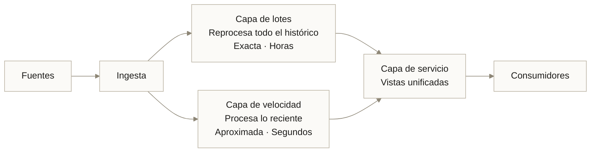
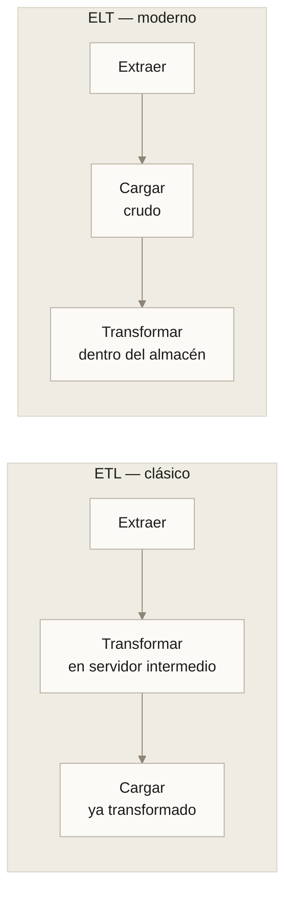
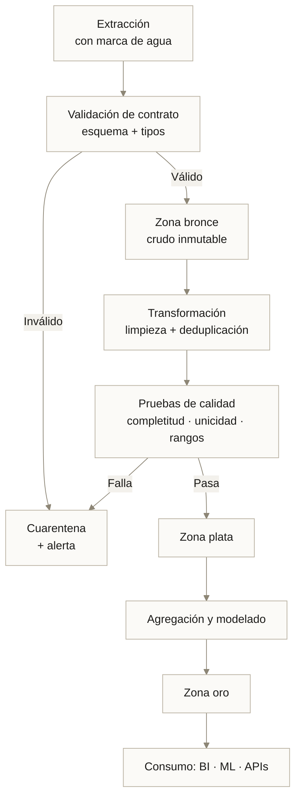
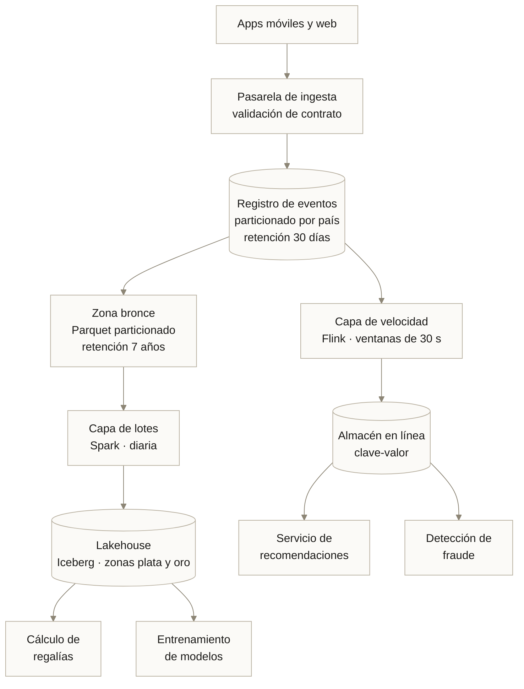

---
tags:
  - Bloque III
  - Datos
---

# Módulo 05 · Big Data: almacenamiento y procesamiento

<div class="modulo-meta" markdown>
<span>:material-clock-outline: 3 horas</span>
<span>:material-stairs: Nivel intermedio</span>
<span>:material-link-variant: Requiere módulo 04</span>
</div>

Un modelo de IA es, en el mejor de los casos, un destilado de sus datos. Si los datos llegan tarde, incompletos, duplicados o sin linaje, ninguna arquitectura de red neuronal lo compensa.

Este módulo trata de la infraestructura que hace que el dato llegue: dónde se guarda, cómo se procesa y quién responde por su calidad.

---

## 1. Qué hace "grande" a un dato

Big Data no se define por el tamaño absoluto. Se define por el punto en el que **las herramientas convencionales dejan de funcionar**: cuando una base de datos relacional en un solo servidor ya no puede ingerir, almacenar o consultar los datos en un tiempo razonable.

### Las 5 V

| V | Definición | Pregunta de diseño | Consecuencia en infraestructura |
| --- | --- | --- | --- |
| **Volumen** | Cantidad de datos | ¿Cuántos TB al mes? | Almacenamiento distribuido, particionado |
| **Velocidad** | Ritmo de llegada y de procesamiento | ¿Lotes diarios o eventos por segundo? | Batch contra streaming |
| **Variedad** | Diversidad de formatos | ¿Tablas, JSON, imágenes, audio, logs? | Esquema al leer contra esquema al escribir |
| **Veracidad** | Confiabilidad y calidad | ¿Qué porcentaje llega incompleto o erróneo? | Validación, cuarentena, reglas de calidad |
| **Valor** | Utilidad extraíble | ¿Qué decisión cambia con este dato? | Priorización; si no cambia ninguna, no lo guardes |

!!! tip "La V que más se ignora"
    **Valor.** Es habitual encontrar organizaciones almacenando años de datos que nadie ha consultado jamás, pagando por ello cada mes. Antes de diseñar la ingesta, la pregunta es qué decisión concreta cambiará con ese dato. Si no hay respuesta, hay un costo sin contrapartida.

### De dónde vienen los datos masivos

| Fuente | Características | Reto principal |
| --- | --- | --- |
| Transaccional (ERP, CRM, punto de venta) | Estructurado, alto valor, volumen moderado | Integración y consistencia |
| Registros de sistemas (*logs*) | Semiestructurado, volumen enorme | Retención y costo |
| Sensores e IoT | Series temporales, alta frecuencia | Volumen y conectividad ([módulo 06](06-edge-iot.md)) |
| Clickstream y telemetría de producto | Eventos, volumen alto | Sesionización y privacidad |
| Redes sociales y web | No estructurado, ruidoso | Calidad y derechos de uso |
| Multimedia (imagen, audio, video) | No estructurado, muy pesado | Almacenamiento y etiquetado |
| Datos abiertos y de terceros | Variable | Licencias y actualización |

---

## 2. Arquitecturas de procesamiento

### Lambda

Dos rutas paralelas: una de lotes, exacta pero lenta; otra de flujo, rápida pero aproximada. Una capa de servicio las unifica.



**Ventaja:** tolerante a errores. Si la lógica de streaming falla, el lote corrige.

**Costo:** **dos implementaciones de la misma lógica de negocio**, en dos tecnologías distintas, que hay que mantener sincronizadas. Es el problema conocido del código duplicado, multiplicado por la complejidad distribuida.

### Kappa

Una sola ruta: todo es un flujo. El reprocesamiento se hace releyendo el registro de eventos desde el principio.

```mermaid
%%{init:{"theme":"base","themeVariables":{"fontFamily":"Inter, sans-serif","darkMode":false,"background":"#f3f1ec","mainBkg":"#fbfaf7","primaryColor":"#fbfaf7","primaryTextColor":"#1c1b19","primaryBorderColor":"#b9b1a1","secondaryColor":"#ead9ba","secondaryTextColor":"#1c1b19","secondaryBorderColor":"#b9b1a1","tertiaryColor":"#c2d4cb","tertiaryTextColor":"#1c1b19","tertiaryBorderColor":"#b9b1a1","lineColor":"#8d8676","textColor":"#1c1b19","nodeTextColor":"#1c1b19","nodeBorder":"#b9b1a1","labelTextColor":"#1c1b19","titleColor":"#1c1b19","edgeLabelBackground":"#f3f1ec","clusterBkg":"#efece4","clusterBorder":"#d8d2c6","cScale0":"#e2a98c","cScaleLabel0":"#1c1b19","cScale1":"#bdb6e6","cScaleLabel1":"#1c1b19","cScale2":"#e8d9b6","cScaleLabel2":"#1c1b19","cScale3":"#b5d0c3","cScaleLabel3":"#1c1b19","cScale4":"#e6cfc0","cScaleLabel4":"#1c1b19","cScale5":"#cddcea","cScaleLabel5":"#1c1b19"}}}%%
flowchart LR
    F["Fuentes"] --> LOG[("Registro de eventos<br/>inmutable y reproducible")]
    LOG --> STREAM["Motor de streaming<br/>única implementación"]
    STREAM --> SERVE["Vistas materializadas"]
    SERVE --> C["Consumidores"]
    LOG -.reproceso desde el inicio.-> STREAM
```



**Ventaja:** una sola base de código, un solo modelo mental.

**Requisito:** el registro de eventos debe conservar el histórico completo y ser reproducible. Si no puedes releer desde el origen del tiempo, Kappa no funciona.

### Cuál elegir

| Situación | Arquitectura |
| --- | --- |
| Ya tienes un almacén de datos por lotes que funciona y solo necesitas añadir tiempo real | Lambda |
| Empiezas de cero y la mayoría de los casos de uso son de eventos | Kappa |
| Los cálculos históricos son muy distintos de los de tiempo real | Lambda |
| El equipo es pequeño y no puede mantener dos rutas | Kappa |

!!! note "El medallón: la organización que domina hoy"
    Independientemente de Lambda o Kappa, la organización interna más extendida es la **arquitectura de medallón**, en tres zonas:

    | Zona | Contenido | Calidad |
    | --- | --- | --- |
    | **Bronce** | Datos crudos tal como llegaron, sin transformar | Ninguna garantía; es el registro de lo que ocurrió |
    | **Plata** | Limpios, deduplicados, tipados, conformados | Validados y con esquema |
    | **Oro** | Agregados y modelados para consumo | Listos para análisis y para ML |

    La regla de oro: **bronce es inmutable**. Si te equivocas en plata u oro, puedes recalcular. Si pierdes bronce, no hay vuelta atrás.

---

## 3. Almacenamiento: Lake, Warehouse y Lakehouse

| Dimensión | Data Lake | Data Warehouse | Lakehouse |
| --- | --- | --- | --- |
| Tipo de dato | Cualquiera | Estructurado | Cualquiera |
| Esquema | Al leer (*schema-on-read*) | Al escribir (*schema-on-write*) | Al leer, con esquema aplicado |
| Costo por TB | Bajo | Alto | Bajo |
| Rendimiento analítico | Variable | Alto | Alto |
| Transacciones ACID | No (formato nativo) | Sí | Sí (con formatos de tabla abiertos) |
| Usuario típico | Científico de datos, ingeniero | Analista de negocio | Ambos |
| Riesgo | Convertirse en pantano de datos | Rigidez y costo | Complejidad del formato |

### El pantano de datos

Un Data Lake sin catálogo, sin propietarios y sin política de calidad se convierte en un **data swamp**: un repositorio enorme donde nadie sabe qué hay, de dónde vino ni si es confiable. Es el fracaso más común de los proyectos de datos.

Lo que evita que un lago se convierta en pantano no es tecnología: es **catálogo, linaje y propiedad** —exactamente lo que la fase C de TOGAF exige ([módulo 03](03-togaf-ia.md)).

### Formatos de tabla abiertos

El Lakehouse es posible gracias a formatos que añaden transacciones sobre almacenamiento de objetos:

| Formato | Origen | Aporta |
| --- | --- | --- |
| **Apache Iceberg** | Netflix | Transacciones, evolución de esquema, viaje en el tiempo, particionado oculto |
| **Delta Lake** | Databricks | Transacciones ACID, historial de versiones, `MERGE` |
| **Apache Hudi** | Uber | Actualizaciones incrementales eficientes, *upserts* |

Todos resuelven el mismo problema: dar garantías de base de datos sobre archivos en almacenamiento de objetos barato.

!!! tip "Viaje en el tiempo y reproducibilidad de modelos"
    El *time travel* de estos formatos permite consultar el estado exacto de una tabla en una fecha pasada. Para ML esto es decisivo: puedes **reproducir el conjunto de entrenamiento exacto** con el que se entrenó un modelo hace ocho meses, requisito habitual de auditoría.

### Formatos de archivo

| Formato | Orientación | Uso |
| --- | --- | --- |
| CSV | Fila, texto | Intercambio; ineficiente, sin tipos |
| JSON / JSONL | Fila, texto | Eventos, APIs; flexible y verboso |
| **Parquet** | Columna, binario | Analítica; compresión alta, lectura selectiva de columnas |
| **ORC** | Columna, binario | Analítica en ecosistema Hadoop |
| **Avro** | Fila, binario | Streaming; buena evolución de esquema |

**Regla práctica:** eventos en Avro o JSON al entrar; Parquet para todo lo que se vaya a analizar. La diferencia de costo de consulta entre CSV y Parquet en una tabla grande es de un orden de magnitud.

---

## 4. Frameworks de procesamiento

| Framework | Modelo | Cuándo usarlo |
| --- | --- | --- |
| **Apache Spark** | Lotes y micro-lotes, en memoria | El caballo de batalla para procesamiento distribuido a gran escala |
| **Apache Flink** | Streaming nativo, por evento | Cuando la latencia real por evento importa |
| **Apache Beam** | Abstracción unificada | Cuando quieres una API sobre múltiples motores |
| **dbt** | Transformación en SQL sobre el almacén | Modelado analítico con pruebas y documentación |
| **DuckDB** | Analítica en un solo nodo | Hasta cientos de GB; sorprendentemente lejos |
| **Polars / pandas** | En memoria, un nodo | Exploración y conjuntos que caben en RAM |

!!! danger "Agua fría: casi nadie necesita Spark"
    Una máquina moderna con 128 GB de RAM y DuckDB procesa cientos de gigabytes de Parquet en segundos. Spark aporta valor real a partir de varios terabytes o cuando el procesamiento debe distribuirse por otras razones.

    Montar un clúster de Spark para 20 GB de datos es un caso frecuente de complejidad autoinfligida: se paga el costo operativo de un sistema distribuido sin recibir su beneficio.

    **Prueba antes de distribuir.** Mide cuánto tarda tu carga en un solo nodo bien dimensionado.

---

## 5. Canalizaciones de datos: ETL y ELT



| Criterio | ETL | ELT |
| --- | --- | --- |
| Dónde se transforma | Servidor intermedio | En el motor analítico |
| Dato crudo conservado | No siempre | Sí, siempre |
| Reprocesar con nueva lógica | Requiere volver a extraer | Se recalcula desde el crudo |
| Costo de cómputo | Servidor dedicado | Se paga en el almacén |
| Cuándo | Origen frágil, transformaciones pesadas previas a la carga | Almacenes escalables modernos |

**ELT ganó** por una razón concreta: conservar el dato crudo permite corregir errores de lógica sin volver a molestar al sistema origen, que muchas veces es un sistema de producción que no tolera consultas pesadas.

### Anatomía de una canalización robusta



Cinco propiedades que separan una canalización profesional de un script:

1. **Idempotencia.** Ejecutarla dos veces produce el mismo resultado. Sin esto, cualquier reintento corrompe datos.
2. **Incrementalidad.** Procesa solo lo nuevo, mediante marcas de agua o captura de cambios.
3. **Observabilidad.** Registra filas leídas, escritas, rechazadas y duración. Sin métricas no hay diagnóstico.
4. **Pruebas de calidad como código.** Las reglas de calidad viven en el repositorio y fallan la ejecución cuando no se cumplen.
5. **Linaje.** Se sabe de qué origen viene cada columna y qué la transformó.

---

## 6. Bases de datos NoSQL

| Tipo | Modelo | Fortaleza | Ejemplos | Caso típico |
| --- | --- | --- | --- | --- |
| **Clave-valor** | Mapa simple | Latencia mínima | Redis, DynamoDB | Caché, sesiones, feature store en línea |
| **Documental** | JSON anidado | Esquema flexible | MongoDB, Firestore | Catálogos, perfiles |
| **Columnar ancha** | Filas con columnas dinámicas | Escritura masiva | Cassandra, HBase | Series temporales, telemetría |
| **Grafo** | Nodos y aristas | Consultas de relaciones | Neo4j, Neptune | Fraude, recomendación, redes |
| **Series temporales** | Optimizada para tiempo | Compresión e intervalos | InfluxDB, TimescaleDB | IoT, métricas |
| **Vectorial** | Vectores densos | Búsqueda por similitud | pgvector, Qdrant, Milvus | RAG, búsqueda semántica |

### El teorema CAP en una frase útil

Ante una **partición de red** (P), un sistema distribuido debe elegir entre **consistencia** (C) y **disponibilidad** (A). No puede garantizar ambas.

La formulación moderna más útil es **PACELC**: ante partición (P), eliges entre A y C; **else** (E), en operación normal, eliges entre **latencia** (L) y **consistencia** (C). Ese segundo intercambio es el que enfrentas todos los días.

!!! note "Bases de datos vectoriales y RAG"
    En arquitecturas de generación aumentada por recuperación, la base vectorial almacena *embeddings* de los documentos y responde "dame los k fragmentos más parecidos a esta consulta".

    Decisiones de infraestructura relevantes:

    - **Índice:** HNSW da baja latencia con más memoria; IVF usa menos memoria con más latencia.
    - **Dimensionalidad:** más dimensiones, más memoria y más latencia. 768 o 1024 suele ser suficiente.
    - **¿Base dedicada o extensión?** Para menos de algunos millones de vectores, `pgvector` sobre PostgreSQL evita operar un sistema más.
    - **Actualización:** reindexar cuando cambia el modelo de embeddings. Mezclar embeddings de dos modelos distintos produce resultados silenciosamente erróneos.

---

## 7. Procesamiento en streaming

### Conceptos que definen la corrección

| Concepto | Definición | Por qué importa |
| --- | --- | --- |
| **Tiempo de evento** | Cuándo ocurrió realmente | Es el tiempo correcto para agregar |
| **Tiempo de procesamiento** | Cuándo lo recibió el sistema | Fácil de usar, produce resultados erróneos |
| **Marca de agua (*watermark*)** | Estimación de hasta qué punto del tiempo de evento hemos visto todo | Permite cerrar ventanas sin esperar indefinidamente |
| **Datos tardíos** | Eventos que llegan después de su marca de agua | Necesitan política explícita: descartar, reprocesar o corregir |
| **Ventana** | Agrupación temporal de eventos | Fija, deslizante o de sesión |

### Garantías de entrega

| Garantía | Significado | Costo |
| --- | --- | --- |
| **Como máximo una vez** | Puede perder mensajes | Mínimo |
| **Al menos una vez** | No pierde, puede duplicar | Medio; exige consumidores idempotentes |
| **Exactamente una vez** | Ni pierde ni duplica | Alto; requiere transacciones de extremo a extremo |

!!! warning "'Exactamente una vez' casi nunca es de extremo a extremo"
    Muchos sistemas anuncian entrega exactamente-una-vez *dentro de su frontera*. En cuanto el dato sale hacia un sistema externo que no participa en la transacción, la garantía se rompe.

    La solución práctica casi siempre es la misma: **al menos una vez + consumidores idempotentes**. Es más simple, más barato y más robusto que perseguir la garantía perfecta.

---

## 8. Gobierno y calidad del dato

### Las seis dimensiones de calidad

| Dimensión | Pregunta | Ejemplo de prueba |
| --- | --- | --- |
| **Completitud** | ¿Faltan valores? | `campo_obligatorio IS NOT NULL` en > 99 % |
| **Unicidad** | ¿Hay duplicados? | `COUNT(DISTINCT id) = COUNT(*)` |
| **Validez** | ¿Respeta el formato? | Correo con formato válido, moneda en catálogo |
| **Exactitud** | ¿Refleja la realidad? | Contraste contra una fuente de referencia |
| **Consistencia** | ¿Concuerda entre sistemas? | El total de ventas cuadra con contabilidad |
| **Oportunidad** | ¿Llega a tiempo? | Retraso p95 menor que el SLA acordado |

### Contratos de datos

Un **contrato de datos** es un acuerdo explícito y versionado entre quien produce y quien consume: esquema, semántica, frecuencia, garantías de calidad y política de cambios incompatibles.

```yaml
# contrato: eventos_transaccion v2
esquema:
  transaccion_id: {tipo: string, obligatorio: true, unico: true}
  monto: {tipo: decimal, obligatorio: true, min: 0}
  moneda: {tipo: string, obligatorio: true, valores: [MXN, USD, COP, BRL]}
  ocurrido_en: {tipo: timestamp, obligatorio: true, zona: UTC}
  cliente_id: {tipo: string, obligatorio: true, clasificacion: personal}
garantias:
  frescura_maxima: 5m
  completitud_minima: 0.999
  duplicados_maximos: 0.0001
propietario: equipo-pagos
politica_cambios:
  compatibles: aviso con 2 semanas
  incompatibles: nueva version, convivencia 90 dias
```

Sin contrato, el productor cambia un campo el martes y el modelo de ML se degrada silenciosamente el miércoles. Con contrato, el cambio incompatible falla en la canalización antes de llegar a producción.

!!! tip "Calidad del dato y deriva del modelo"
    Muchas "degradaciones del modelo" que se diagnostican como deriva conceptual son en realidad **cambios de esquema o de calidad en el origen**. Antes de reentrenar, verifica el contrato. Es más barato y suele ser la causa. Este diagnóstico se desarrolla en el [módulo 10](10-devops-mlops.md).

---

## Caso práctico · MúsicaFlow, plataforma de streaming regional

12 millones de usuarios en cinco países. Necesita: recomendaciones personalizadas, pago de regalías exacto y detección de reproducción fraudulenta.

### Las 5 V del caso

| V | Situación |
| --- | --- |
| Volumen | 1 800 millones de eventos de reproducción al mes (~4 TB comprimidos) |
| Velocidad | Picos de 90 000 eventos/segundo en el horario nocturno |
| Variedad | Eventos JSON, metadatos de catálogo, audio, interacciones de UI |
| Veracidad | Entre 2 % y 4 % de eventos duplicados por reintentos de la app móvil |
| Valor | Tres consumidores muy distintos con requisitos opuestos |

### El conflicto de requisitos

| Consumidor | Latencia necesaria | Exactitud necesaria |
| --- | --- | --- |
| Recomendaciones | Segundos | Aproximada es aceptable |
| Regalías | Mensual | **Exacta, auditable** |
| Antifraude | Minutos | Alta, con capacidad de revisión |

Ese conflicto es precisamente el que Lambda resuelve, y por eso MúsicaFlow la eligió pese a su costo de mantenimiento.

### Arquitectura



### Decisiones y sus razones

| Decisión | Razón |
| --- | --- |
| Bronce inmutable con 7 años de retención | Las regalías son auditables por las disqueras; debe poder recalcularse cualquier mes |
| Deduplicación en plata, no en bronce | Bronce registra lo que ocurrió, incluidos los duplicados; la lógica de deduplicación puede cambiar |
| Particionado por país y fecha | Las consultas de regalías son siempre por país y periodo |
| Iceberg como formato de tabla | Viaje en el tiempo para reproducir conjuntos de entrenamiento y auditorías |
| Almacén en línea separado para características | La inferencia necesita latencia de milisegundos; el lakehouse no la da |
| Al menos una vez + idempotencia | Perseguir exactamente-una-vez habría añadido complejidad sin resolver el duplicado de origen |

### El problema que casi hunde el proyecto

Los eventos de la app móvil llegaban con el **tiempo de procesamiento** del servidor, no con el tiempo de evento del dispositivo. En zonas con mala conectividad, una reproducción de las 23:50 llegaba a las 02:00 del día siguiente y se contabilizaba en el mes equivocado.

**Solución:** el cliente envía el tiempo de evento local y el desfase de reloj; el servidor lo corrige y lo valida contra una marca de agua de 48 horas. Los eventos más tardíos se procesan en un ciclo de corrección mensual documentado.

**Lección:** el tiempo de evento es un problema de diseño de contrato, no de infraestructura. Descubrirlo tras seis meses en producción cuesta un reproceso de todo el histórico.

---

## Laboratorio · Canalización de medallón con validación

**Objetivo:** construir una canalización pequeña pero completa, con zonas, contrato y pruebas de calidad.

**Requisitos:** Python 3.11+, `duckdb`, `pandas`, `pyarrow`.

**Paso 1 — Genera datos crudos sucios.**

```python
# generar.py
import random, json, datetime as dt

monedas = ["MXN", "USD", "COP", "BRL", "XXX"]  # XXX es inválido a propósito
filas = []
for i in range(50_000):
    fila = {
        "transaccion_id": f"T{i:07d}",
        "monto": round(random.uniform(-50, 5000), 2),   # negativos inválidos
        "moneda": random.choice(monedas),
        "ocurrido_en": (dt.datetime.utcnow() - dt.timedelta(
            seconds=random.randint(0, 864_000))).isoformat(),
        "cliente_id": f"C{random.randint(1, 8000):05d}",
    }
    filas.append(fila)
    if random.random() < 0.03:      # 3 % de duplicados
        filas.append(dict(fila))

with open("bronce.jsonl", "w") as f:
    for fila in filas:
        f.write(json.dumps(fila) + "\n")
print(f"{len(filas)} filas escritas")
```

**Paso 2 — Zona bronce: carga sin transformar.**

```python
import duckdb
con = duckdb.connect("lakehouse.db")
con.execute("""
    CREATE OR REPLACE TABLE bronce AS
    SELECT * FROM read_json_auto('bronce.jsonl')
""")
```

**Paso 3 — Valida el contrato y separa la cuarentena.**

```python
con.execute("""
    CREATE OR REPLACE TABLE cuarentena AS
    SELECT *, CASE
        WHEN monto <= 0 THEN 'monto_invalido'
        WHEN moneda NOT IN ('MXN','USD','COP','BRL') THEN 'moneda_invalida'
        WHEN transaccion_id IS NULL THEN 'id_faltante'
    END AS motivo
    FROM bronce
    WHERE monto <= 0
       OR moneda NOT IN ('MXN','USD','COP','BRL')
       OR transaccion_id IS NULL
""")
```

**Paso 4 — Zona plata: limpia y deduplica.**

```python
con.execute("""
    CREATE OR REPLACE TABLE plata AS
    SELECT DISTINCT ON (transaccion_id)
        transaccion_id,
        CAST(monto AS DECIMAL(12,2))      AS monto,
        moneda,
        CAST(ocurrido_en AS TIMESTAMP)    AS ocurrido_en,
        cliente_id
    FROM bronce
    WHERE monto > 0
      AND moneda IN ('MXN','USD','COP','BRL')
    ORDER BY transaccion_id
""")
```

**Paso 5 — Pruebas de calidad que fallan la ejecución.**

```python
pruebas = {
    "unicidad": "SELECT COUNT(*) - COUNT(DISTINCT transaccion_id) FROM plata",
    "sin_nulos": "SELECT COUNT(*) FROM plata WHERE cliente_id IS NULL",
    "montos_positivos": "SELECT COUNT(*) FROM plata WHERE monto <= 0",
}
for nombre, sql in pruebas.items():
    valor = con.execute(sql).fetchone()[0]
    assert valor == 0, f"FALLA calidad '{nombre}': {valor} filas"
    print(f"OK  {nombre}")
```

**Paso 6 — Zona oro: agregados de negocio.**

```python
con.execute("""
    CREATE OR REPLACE TABLE oro_diario AS
    SELECT
        DATE_TRUNC('day', ocurrido_en) AS dia,
        moneda,
        COUNT(*)                        AS transacciones,
        SUM(monto)                      AS monto_total,
        COUNT(DISTINCT cliente_id)      AS clientes_unicos
    FROM plata
    GROUP BY 1, 2
    ORDER BY 1, 2
""")
con.execute("COPY oro_diario TO 'oro_diario.parquet' (FORMAT PARQUET)")
```

**Paso 7 — Mide.** Reporta: filas en bronce, filas en cuarentena por motivo, filas en plata, tasa de deduplicación, tamaño en disco de JSONL frente a Parquet.

**Paso 8 — Idempotencia.** Ejecuta todo dos veces. ¿El resultado es idéntico? Si no, corrígelo.

**Entregable:** el script completo, la tabla de métricas y un contrato de datos en YAML para la tabla `plata`.

---

## Conceptos clave

- **Las 5 V:** volumen, velocidad, variedad, veracidad y valor.
- **Arquitectura Lambda:** rutas de lotes y de velocidad en paralelo, unificadas en una capa de servicio.
- **Arquitectura Kappa:** una sola ruta de streaming, con reprocesamiento por relectura del registro de eventos.
- **Arquitectura de medallón:** organización en zonas bronce (crudo inmutable), plata (limpio) y oro (modelado).
- **Data Lake / Warehouse / Lakehouse:** almacenamiento flexible y barato / analítico y estructurado / la combinación mediante formatos de tabla abiertos.
- **Pantano de datos:** lago sin catálogo, linaje ni propietarios; el fracaso más común en proyectos de datos.
- **Esquema al leer / al escribir:** validar al consumir frente a validar al almacenar.
- **ETL / ELT:** transformar antes de cargar frente a cargar crudo y transformar dentro del almacén.
- **Idempotencia:** ejecutar una operación varias veces produce el mismo resultado.
- **Marca de agua:** estimación del avance del tiempo de evento que permite cerrar ventanas.
- **Contrato de datos:** acuerdo versionado entre productor y consumidor sobre esquema, calidad y cambios.
- **CAP / PACELC:** intercambios entre consistencia, disponibilidad y latencia en sistemas distribuidos.

---

## Puntos clave

- Big Data no es un tamaño: es el punto donde las herramientas convencionales dejan de servir. Mide antes de distribuir.
- La V más ignorada es Valor. Almacenar datos que no cambian ninguna decisión es un costo recurrente sin contrapartida.
- Bronce inmutable es la decisión de diseño más rentable: permite corregir cualquier error posterior sin volver al origen.
- Lambda cuesta dos implementaciones de la misma lógica. Kappa cuesta un registro de eventos reproducible. Elige el costo que tu equipo pueda pagar.
- Parquet frente a CSV es una diferencia de un orden de magnitud en costo de consulta.
- ELT ganó porque conservar el dato crudo permite corregir la lógica sin molestar al sistema origen.
- "Al menos una vez + consumidores idempotentes" es casi siempre mejor ingeniería que perseguir "exactamente una vez".
- El tiempo de evento y el tiempo de procesamiento no son lo mismo, y confundirlos corrompe agregados de forma silenciosa.
- Sin contratos de datos, un cambio en el origen degrada un modelo sin que nadie se entere hasta que un cliente reclama.
- Lo que convierte un lago en pantano no es la tecnología: es la falta de catálogo, linaje y propiedad.

---

## Ejercicios

1. **Aplica las 5 V.** Toma una fuente de datos de tu organización y descríbela con las cinco. Sé específico en Valor: ¿qué decisión concreta cambia?

2. **Elige arquitectura.** Para tres casos de uso reales, decide Lambda o Kappa y justifica en tres líneas. ¿Alguno no necesita streaming en absoluto?

3. **Mide el costo del formato.** Toma un CSV de al menos 500 MB, conviértelo a Parquet y compara: tamaño en disco, tiempo de una consulta con filtro, tiempo de una agregación.

4. **Escribe un contrato.** Redacta el contrato de datos de una tabla que consumas hoy. Llévalo a quien la produce. La conversación suele revelar supuestos que nadie había hecho explícitos.

5. **Audita idempotencia.** Toma un proceso de datos existente y ejecútalo dos veces sobre el mismo periodo. ¿Duplica? Si sí, diseña la corrección.

6. **Prueba el límite del nodo único.** Carga el mayor conjunto que tengas en DuckDB en una sola máquina y mide. ¿A partir de qué tamaño realmente necesitarías distribuir?

---

## Lectura adicional

- [Designing Data-Intensive Applications · Martin Kleppmann](https://dataintensive.net/) — la referencia sobre sistemas de datos distribuidos.
- [The Log: What every software engineer should know · Jay Kreps](https://engineering.linkedin.com/distributed-systems/log-what-every-software-engineer-should-know-about-real-time-datas-unifying) — el artículo que fundamenta la arquitectura Kappa.
- [Apache Iceberg · Documentación](https://iceberg.apache.org/) — formato de tabla abierto con viaje en el tiempo.
- [Streaming 101 y 102 · Tyler Akidau](https://www.oreilly.com/radar/the-world-beyond-batch-streaming-101/) — la explicación definitiva de tiempo de evento y marcas de agua.
- [dbt · Data contracts](https://docs.getdbt.com/docs/collaborate/govern/model-contracts) — implementación práctica de contratos de datos.
- [Módulo 06 · Edge, Fog e IoT](06-edge-iot.md) — de dónde vienen muchos de estos datos.
- [Módulo 10 · MLOps](10-devops-mlops.md) — cómo se versionan datos y modelos juntos.
