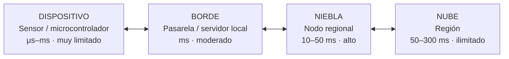
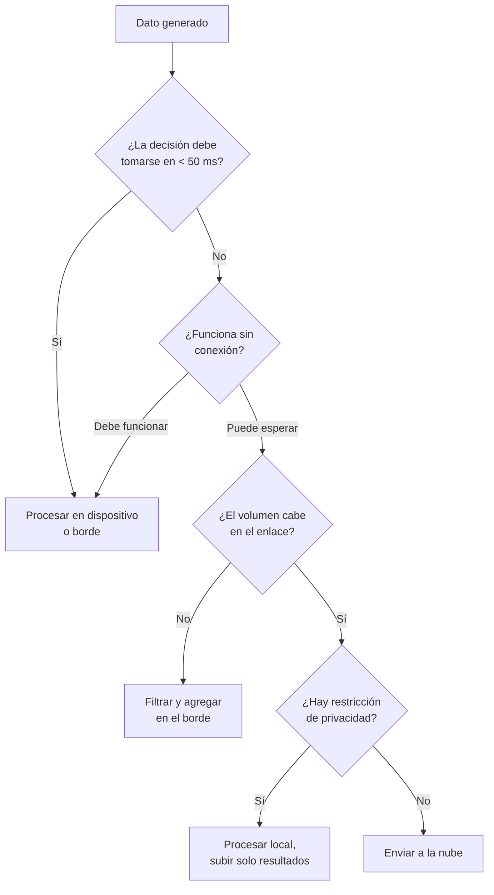
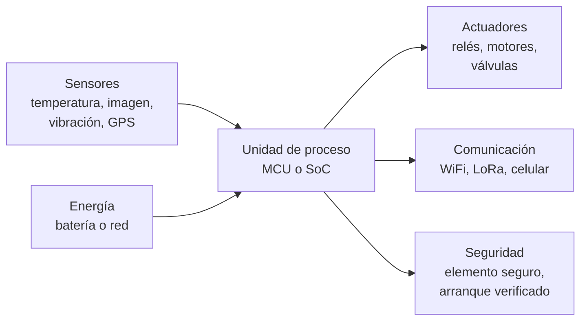
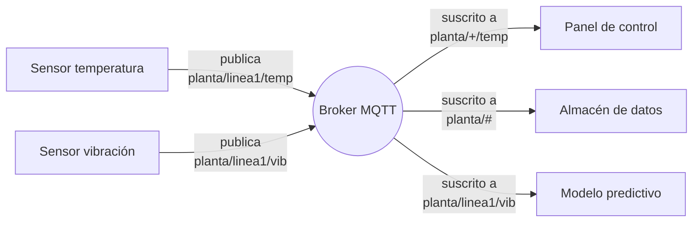
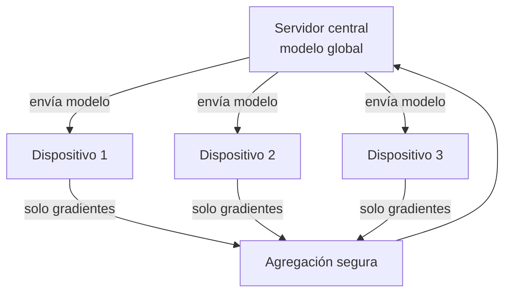

---
tags:
  - Bloque III
  - Datos
  - Edge
---

# Módulo 06 · Edge Computing, Fog e IoT

<div class="modulo-meta" markdown>
<span>:material-clock-outline: 3 horas</span>
<span>:material-stairs: Nivel intermedio</span>
<span>:material-link-variant: Requiere módulo 05</span>
</div>

Un vehículo autónomo genera del orden de un terabyte de datos por hora. Enviarlo todo a la nube para decidir si frena es imposible por tres razones simultáneas: no hay ancho de banda suficiente, la latencia de ida y vuelta es mayor que el tiempo disponible para frenar, y si se cae la conexión el vehículo se queda sin cerebro.

La respuesta a ese problema es mover el cómputo hacia donde nacen los datos. Eso es **edge computing**.

---

## 1. Por qué procesar en el borde

### Las cuatro razones

| Razón | Explicación | Ejemplo donde es decisiva |
| --- | --- | --- |
| **Latencia** | La velocidad de la luz impone un mínimo físico | Frenado automático, cirugía asistida, control industrial |
| **Ancho de banda** | Transmitir todo es caro o imposible | Cámaras 4K en 200 tiendas; video continuo en zona rural |
| **Autonomía** | Debe funcionar sin conexión | Maquinaria agrícola, minería subterránea, buques |
| **Privacidad y soberanía** | El dato no debe salir del sitio | Video de pacientes, datos biométricos, secreto industrial |

### La aritmética de la latencia

| Trayecto | Latencia típica de ida y vuelta |
| --- | --- |
| Dentro del dispositivo | < 1 ms |
| Dispositivo ↔ pasarela local | 1–5 ms |
| Dispositivo ↔ nodo de borde regional | 5–20 ms |
| Dispositivo ↔ región de nube cercana | 20–60 ms |
| Dispositivo ↔ región de nube en otro continente | 150–300 ms |

Un vehículo a 100 km/h recorre **2.8 metros** en 100 ms. Si el ciclo percepción-decisión-actuación depende de una ida y vuelta a un centro de datos a 150 ms, el vehículo ya avanzó cuatro metros antes de empezar a frenar.

!!! warning "La latencia no se optimiza, se respeta"
    A diferencia del ancho de banda —que se puede comprar— la latencia tiene un piso físico impuesto por la distancia y la velocidad de la luz en fibra (unos 200 000 km/s). Ninguna mejora de software lo cambia. Si tu requisito de latencia es menor que el tiempo de ida y vuelta, el cómputo **tiene** que estar cerca.

---

## 2. El continuo: dispositivo, borde, niebla y nube



| Capa | Dónde está | Cómputo | Qué hace |
| --- | --- | --- | --- |
| **Dispositivo** | En el objeto | Microcontrolador, pocos KB–MB | Lectura, filtrado básico, TinyML |
| **Borde (edge)** | En la instalación | Pasarela, mini-PC, a veces con GPU | Inferencia, agregación, control local, almacenamiento temporal |
| **Niebla (fog)** | Entre borde y nube | Nodo regional, micro-centro de datos | Coordinación de múltiples sitios, analítica intermedia |
| **Nube** | Región del proveedor | Prácticamente ilimitado | Entrenamiento, histórico, analítica global, orquestación |

### Borde contra niebla

La distinción genera confusión porque los términos se usan como sinónimos en marketing. La diferencia útil:

- **Edge** es cómputo **en el punto de generación o muy cerca**: la cámara, la pasarela de la planta, el servidor de la tienda.
- **Fog** es una **capa de coordinación** entre muchos bordes y la nube: agrega lo de 40 tiendas, decide qué sube y aplica políticas regionales.

En despliegues pequeños, la capa de niebla no existe y no hace falta inventarla.

### El patrón de decisión



!!! tip "La regla del 1 %"
    En despliegues maduros de visión en el borde, típicamente **menos del 1 % de los datos generados llega a la nube**: solo los eventos detectados, los recortes de imagen relevantes y las métricas agregadas. El 99 % se procesa y se descarta localmente.

    Diseñar para ese ratio desde el principio es lo que hace el proyecto económicamente viable.

---

## 3. Internet de las Cosas

IoT es la red de objetos físicos con sensores, software y conectividad que recopilan e intercambian datos.

### Anatomía de un dispositivo IoT



### Las cuatro restricciones que lo condicionan todo

1. **Energía.** Un sensor a batería que debe durar cinco años no puede transmitir continuamente. La radio consume mucho más que el procesador.
2. **Cómputo.** Un microcontrolador típico tiene entre 64 KB y 512 KB de RAM. Un modelo de visión convencional no entra.
3. **Conectividad.** Intermitente, de bajo ancho de banda y frecuentemente con costo por megabyte.
4. **Ciclo de vida.** Un dispositivo industrial se instala para diez o quince años. El firmware debe poder actualizarse en remoto y con seguridad durante todo ese tiempo.

---

## 4. Protocolos de comunicación

### Protocolos de aplicación

| Protocolo | Modelo | Sobrecarga | Cuándo |
| --- | --- | --- | --- |
| **MQTT** | Publicación/suscripción | Muy baja (2 bytes mínimo) | El estándar de facto en IoT |
| **CoAP** | Petición/respuesta sobre UDP | Muy baja | Dispositivos muy restringidos |
| **AMQP** | Colas con garantías | Media | Cuando se requiere entrega confiable y enrutamiento |
| **HTTP/REST** | Petición/respuesta | Alta | Dispositivos con recursos suficientes, integración simple |
| **gRPC** | RPC sobre HTTP/2 | Media | Comunicación entre nodos de borde |
| **OPC UA** | Industrial | Media-alta | Automatización industrial, interoperabilidad de máquinas |

### MQTT en detalle



| Concepto | Función |
| --- | --- |
| **Tema (*topic*)** | Jerarquía de enrutamiento: `planta/linea1/temp` |
| **Comodines** | `+` un nivel, `#` todos los niveles restantes |
| **QoS 0** | Como máximo una vez; sin confirmación |
| **QoS 1** | Al menos una vez; puede duplicar |
| **QoS 2** | Exactamente una vez; cuatro mensajes de protocolo |
| **Mensaje retenido** | El broker guarda el último valor y lo entrega a nuevos suscriptores |
| **Testamento (*last will*)** | Mensaje que el broker publica si el dispositivo se desconecta abruptamente |

!!! tip "El testamento es la mejor función infravalorada de MQTT"
    Permite detectar dispositivos caídos sin implementar un sistema de latidos. El dispositivo declara al conectarse: *"si desaparezco sin avisar, publica `offline` en este tema"*. El broker lo hace automáticamente.

### Protocolos de red

| Tecnología | Alcance | Ancho de banda | Consumo | Uso típico |
| --- | --- | --- | --- | --- |
| **Bluetooth LE** | 10–100 m | Bajo | Muy bajo | Vestibles, balizas |
| **Zigbee / Thread** | 10–100 m en malla | Bajo | Muy bajo | Domótica, edificios |
| **WiFi** | 30–100 m | Alto | Alto | Cuando hay red y energía |
| **LoRaWAN** | 2–15 km | Muy bajo (≈ 50 kbps) | Muy bajo | Agricultura, medición remota |
| **NB-IoT / LTE-M** | Cobertura celular | Bajo-medio | Bajo | Activos móviles, medidores |
| **5G** | Cobertura celular | Muy alto | Medio-alto | Video, control industrial |
| **Ethernet** | Cableado | Muy alto | N/A | Industria, instalaciones fijas |

---

## 5. 5G y el borde

5G no es solo "internet móvil más rápido". Para el borde, lo relevante son tres capacidades:

| Capacidad | Qué aporta | Caso de uso |
| --- | --- | --- |
| **eMBB** (banda ancha mejorada) | Hasta varios Gbps | Video de alta resolución desde el campo |
| **URLLC** (baja latencia ultrafiable) | Latencia de 1–10 ms con alta fiabilidad | Control industrial, robótica, vehículos |
| **mMTC** (comunicación masiva de máquinas) | Hasta un millón de dispositivos por km² | Ciudades y agricultura instrumentadas |

Dos conceptos adicionales importan en arquitectura:

- **Segmentación de red (*network slicing*):** crear redes lógicas aisladas con garantías propias sobre la misma infraestructura física. Una fábrica puede tener un segmento con latencia garantizada para su línea de producción.
- **MEC (*Multi-access Edge Computing*):** cómputo ubicado en la propia infraestructura del operador, a uno o dos saltos del dispositivo. Reduce la latencia sin instalar hardware en el sitio del cliente.

---

## 6. Seguridad en IoT y borde

Los dispositivos en el borde tienen un modelo de amenaza distinto al de un servidor en un centro de datos: **son físicamente accesibles**.

### Superficie de ataque

| Vector | Riesgo | Mitigación |
| --- | --- | --- |
| Acceso físico | Extracción de firmware y de claves | Elemento seguro, cifrado de almacenamiento, detección de manipulación |
| Credenciales por defecto | Toma de control masiva | Credencial única por dispositivo, aprovisionamiento seguro |
| Firmware sin firmar | Ejecución de código arbitrario | Arranque verificado, actualizaciones firmadas |
| Comunicación sin cifrar | Interceptación y suplantación | TLS obligatorio, certificados por dispositivo |
| Falta de actualizaciones | Vulnerabilidades permanentes | Actualización remota (OTA) con reversión |
| Movimiento lateral | Un dispositivo comprometido alcanza la red corporativa | Segmentación de red, VLAN dedicada |

!!! danger "Mirai y la lección que no se aprendió"
    En 2016, la botnet Mirai comprometió cientos de miles de cámaras y grabadores de video buscando **credenciales por defecto** en una lista de 60 combinaciones usuario/contraseña. Con ellos ejecutó uno de los mayores ataques de denegación de servicio registrados.

    No explotó ninguna vulnerabilidad sofisticada. Probó `admin/admin`.

    Casi una década después, siguen fabricándose dispositivos con credenciales por defecto compartidas entre todas las unidades.

### Identidad por dispositivo

El patrón correcto es el mismo Zero Trust del [módulo 04](04-arquitectura-seguridad.md), aplicado al hardware:

1. Cada dispositivo tiene una **identidad criptográfica única**, provisionada en fábrica en un elemento seguro.
2. La clave privada **nunca sale** del elemento seguro.
3. La autenticación es mutua: el dispositivo verifica al servidor y el servidor al dispositivo.
4. Los permisos son mínimos: un sensor de temperatura publica en un tema y no puede suscribirse a nada.
5. Un dispositivo comprometido se revoca **individualmente**, sin afectar a la flota.

---

## 7. Edge AI y TinyML

### Por qué ejecutar modelos en el borde

| Beneficio | Concreción |
| --- | --- |
| Latencia | Inferencia en milisegundos sin depender de la red |
| Privacidad | La imagen nunca sale del dispositivo; solo el resultado |
| Costo | Se elimina el tráfico continuo y el cómputo en nube |
| Autonomía | Funciona con la conexión caída |
| Energía | Transmitir consume más que inferir localmente |

### Técnicas de compresión de modelos

| Técnica | Qué hace | Reducción típica | Costo en exactitud |
| --- | --- | --- | --- |
| **Cuantización** | Pasa de punto flotante de 32 bits a enteros de 8 bits (o menos) | 4× en tamaño, 2–4× en velocidad | 0–2 % |
| **Poda (*pruning*)** | Elimina pesos o canales poco relevantes | 2–10× | 1–5 % |
| **Destilación** | Entrena un modelo pequeño para imitar a uno grande | 5–50× | 2–8 % |
| **Búsqueda de arquitectura** | Diseña la red para el hardware objetivo | Variable | Puede mejorar |
| **Fusión de operadores** | Combina capas en una sola operación | Sin cambio de tamaño, 1.5–3× en velocidad | Ninguno |

!!! tip "Empieza siempre por la cuantización"
    Cuantizar a enteros de 8 bits es la técnica con mejor relación beneficio/esfuerzo: la mayoría de los marcos la aplican con unas pocas líneas, reduce el modelo a la cuarta parte y en modelos de visión bien entrenados la pérdida de exactitud suele ser inferior al 1 %.

    Si además el acelerador del dispositivo tiene unidades de enteros dedicadas, la ganancia de velocidad es mayor que la teórica.

### TinyML

TinyML es machine learning en microcontroladores: dispositivos con kilobytes de memoria y consumo de miliwatts.

| Aspecto | Valor típico |
| --- | --- |
| Memoria RAM disponible | 64–512 KB |
| Memoria de programa | 256 KB – 2 MB |
| Tamaño del modelo | 20–200 KB |
| Consumo | 1–50 mW |
| Autonomía con batería de botón | Meses a años |

**Casos reales:** detección de palabra clave ("Hey…"), reconocimiento de gestos, detección de anomalías por vibración en motores, conteo de personas, detección de plagas por sonido.

### Hardware de inferencia en el borde

| Categoría | Ejemplos | Rendimiento orientativo | Consumo |
| --- | --- | --- | --- |
| Microcontrolador | ESP32, Cortex-M | Cientos de kOPS | mW |
| Acelerador USB / M.2 | Unidades TPU de borde | 2–4 TOPS | 2–4 W |
| SoC con NPU | Jetson Orin Nano, RK3588 | 20–100 TOPS | 7–25 W |
| Servidor de borde con GPU | GPU de perfil bajo | Cientos de TOPS | 70–300 W |

### Aprendizaje federado

Entrenar sin centralizar los datos:



Los datos nunca salen del dispositivo; solo viajan actualizaciones del modelo. Es la técnica que permite entrenar sobre datos sensibles distribuidos —teclados, dispositivos médicos, imágenes clínicas de múltiples hospitales— cumpliendo restricciones de privacidad.

**Sus límites, que conviene conocer:** requiere muchos participantes para converger bien, es sensible a la heterogeneidad de los datos entre dispositivos, y los gradientes por sí solos pueden filtrar información, por lo que suele combinarse con privacidad diferencial.

---

## Casos prácticos

!!! example "Caso 1 · Fábrica inteligente en Querétaro"
    **Problema.** Una planta automotriz pierde entre 40 000 y 60 000 USD por cada hora de paro no planeado. Las fallas de motores y rodamientos no se anticipan.

    **Solución.** 340 sensores de vibración y temperatura en 85 máquinas críticas.

    | Capa | Implementación |
    | --- | --- |
    | Dispositivo | Acelerómetro con MCU; FFT y extracción de características en el propio sensor |
    | Borde | Servidor industrial en planta con modelo de detección de anomalías; decisión en < 100 ms |
    | Niebla | Nodo regional que coordina tres plantas y compara patrones entre ellas |
    | Nube | Entrenamiento del modelo, histórico completo, panel corporativo |

    **Reparto del dato:** el sensor genera 3 200 muestras/segundo. Solo se transmiten 12 características por minuto, más la forma de onda completa cuando se detecta una anomalía. **Reducción del tráfico: 99.97 %.**

    **Resultado.** Paros no planeados reducidos 62 % en el primer año. El retorno se alcanzó en siete meses.

    **Lo que casi falla.** La red OT (tecnología operativa) de la planta estaba completamente separada de la IT por política de seguridad, y con razón. La solución fue un diodo de datos unidireccional: la información sale de OT hacia IT, nunca al revés. Ninguna orden puede llegar desde la red corporativa a una máquina.

!!! example "Caso 2 · Agricultura de precisión en Sinaloa"
    **Problema.** 1 800 hectáreas de hortalizas. El riego es uniforme, el consumo de agua excesivo y la detección de plagas tardía.

    **Restricción dominante.** No hay cobertura celular en la mayor parte del predio y la energía eléctrica solo llega a las casetas de bombeo.

    **Solución.**

    | Elemento | Decisión |
    | --- | --- |
    | Sensores de humedad y conductividad | Alimentados con panel solar pequeño, transmisión LoRaWAN |
    | Frecuencia de transmisión | Cada 30 minutos; 12 bytes por mensaje |
    | Pasarela | Tres pasarelas LoRaWAN en torres, con enlace celular |
    | Cámaras para detección de plagas | Modelo cuantizado en dispositivo con acelerador; solo sube la imagen cuando detecta |
    | Nube | Entrenamiento, histórico, recomendación de riego por sector |

    **Por qué LoRaWAN y no celular:** el presupuesto de datos por dispositivo con celular habría sido de unos 9 USD/mes × 420 sensores = 3 780 USD/mes. Con LoRaWAN, el costo de transmisión es cero tras la inversión en las tres pasarelas.

    **Resultado.** 31 % menos consumo de agua. Detección de plaga 9 días antes en promedio, lo que redujo el uso de plaguicida un 44 %.

    **Lo que se subestimó.** El mantenimiento físico. Roedores dañaron cableado, el polvo cubrió paneles solares y dos pasarelas fueron alcanzadas por rayos. **El costo operativo de un despliegue de borde es predominantemente físico, no digital**, y casi nunca aparece en el presupuesto inicial.

---

## Laboratorio · Del sensor al borde con MQTT y un modelo cuantizado

**Objetivo:** construir una cadena completa de borde: simulación de sensores, broker MQTT, procesamiento local con umbral y decisión sobre qué subir.

**Requisitos:** Docker, Python 3.11+, `paho-mqtt`.

**Paso 1 — Levanta un broker MQTT.**

```bash
docker run -d --name mosquitto -p 1883:1883 \
  -v "$PWD/mosquitto.conf:/mosquitto/config/mosquitto.conf" \
  eclipse-mosquitto:2
```

```conf
# mosquitto.conf
listener 1883
allow_anonymous true
```

!!! warning "`allow_anonymous true` es solo para el laboratorio"
    En cualquier despliegue real: autenticación por certificado de dispositivo, TLS obligatorio y listas de control de acceso por tema.

**Paso 2 — Simula sensores con testamento.**

```python
# sensor.py
import json, random, time, sys
import paho.mqtt.client as mqtt

sensor_id = sys.argv[1] if len(sys.argv) > 1 else "s01"
tema = f"planta/linea1/{sensor_id}"

cli = mqtt.Client(client_id=sensor_id)
cli.will_set(f"{tema}/estado", "offline", retain=True)
cli.connect("localhost", 1883)
cli.publish(f"{tema}/estado", "online", retain=True)

base = 60.0
while True:
    # 4 % de probabilidad de anomalía
    valor = base + random.gauss(0, 1.5)
    if random.random() < 0.04:
        valor += random.uniform(15, 30)
    cli.publish(tema, json.dumps({
        "sensor": sensor_id,
        "vibracion": round(valor, 2),
        "ts": time.time(),
    }))
    time.sleep(0.2)
```

**Paso 3 — Procesa en el borde y decide qué sube.**

```python
# borde.py
import json, statistics, time
from collections import defaultdict, deque
import paho.mqtt.client as mqtt

VENTANA = 50
UMBRAL_SIGMA = 3.0

historial = defaultdict(lambda: deque(maxlen=VENTANA))
contadores = defaultdict(lambda: {"recibidos": 0, "subidos": 0})

def on_message(cli, userdata, msg):
    if msg.topic.endswith("/estado"):
        print(f"[estado] {msg.topic} -> {msg.payload.decode()}")
        return

    d = json.loads(msg.payload)
    sid, v = d["sensor"], d["vibracion"]
    h = historial[sid]
    contadores[sid]["recibidos"] += 1

    if len(h) >= 20:
        mu, sigma = statistics.mean(h), statistics.pstdev(h) or 1e-6
        z = abs(v - mu) / sigma
        if z > UMBRAL_SIGMA:
            contadores[sid]["subidos"] += 1
            cli.publish("nube/anomalias", json.dumps({
                "sensor": sid, "valor": v, "z": round(z, 2), "ts": d["ts"],
            }))
            print(f"[ANOMALÍA] {sid}  v={v:.2f}  z={z:.2f}")
    h.append(v)

cli = mqtt.Client(client_id="borde")
cli.on_message = on_message
cli.connect("localhost", 1883)
cli.subscribe("planta/#")

inicio = time.time()
try:
    cli.loop_forever()
except KeyboardInterrupt:
    total_r = sum(c["recibidos"] for c in contadores.values())
    total_s = sum(c["subidos"] for c in contadores.values())
    print(f"\nRecibidos: {total_r}  ·  Subidos: {total_s}  "
          f"·  Reducción: {100*(1-total_s/max(total_r,1)):.2f}%")
```

**Paso 4 — Ejecuta.** Lanza el nodo de borde y tres sensores en terminales distintas. Déjalo correr dos minutos y detén el borde con `Ctrl+C`.

**Paso 5 — Mide el ahorro.** Anota la reducción de tráfico. Calcula: si cada mensaje pesa 90 bytes y hay 340 sensores a 5 mensajes/segundo, ¿cuántos GB al mes se ahorran?

**Paso 6 — Añade la capa de resiliencia.** Modifica `borde.py` para que, si no puede publicar en `nube/anomalias`, almacene las anomalías en un archivo local y las reenvíe al recuperar conexión. Esta capacidad de almacenar-y-reenviar es obligatoria en cualquier despliegue real.

**Paso 7 — Prueba el testamento.** Mata un sensor con `Ctrl+C` y observa el mensaje `offline` publicado por el broker.

**Entregable:** el código modificado con almacenar-y-reenviar, las métricas de reducción de tráfico y el cálculo de ahorro mensual.

---

## Conceptos clave

- **Edge computing:** procesamiento en el punto de generación de los datos o muy cerca de él.
- **Fog computing:** capa intermedia de coordinación entre muchos nodos de borde y la nube.
- **IoT:** red de objetos físicos con sensores, cómputo y conectividad.
- **MQTT:** protocolo de publicación/suscripción ligero, estándar de facto en IoT.
- **Testamento (*last will*):** mensaje que el broker publica cuando un dispositivo se desconecta abruptamente.
- **LoRaWAN:** red de área amplia de bajo consumo y bajo ancho de banda, para alcances de kilómetros.
- **Segmentación de red (*slicing*):** redes lógicas aisladas con garantías propias sobre infraestructura 5G compartida.
- **MEC:** cómputo alojado en la infraestructura del operador móvil.
- **Cuantización:** reducir la precisión numérica de los pesos para acelerar y aligerar un modelo.
- **Destilación:** entrenar un modelo pequeño para reproducir el comportamiento de uno grande.
- **TinyML:** machine learning en microcontroladores con kilobytes de memoria.
- **Aprendizaje federado:** entrenamiento distribuido en el que los datos nunca abandonan el dispositivo.
- **Almacenar-y-reenviar:** persistir localmente lo que no se puede transmitir y enviarlo al recuperar conexión.

---

## Puntos clave

- La latencia tiene un piso físico. Si el requisito es menor que el tiempo de ida y vuelta, el cómputo debe estar cerca; no hay optimización de software que lo resuelva.
- El borde no sustituye a la nube: se reparten el trabajo. El borde decide en tiempo real, la nube entrena y conserva el histórico.
- En despliegues maduros, menos del 1 % de los datos generados llega a la nube. Diseñar para ese ratio es lo que hace viable el proyecto.
- MQTT domina IoT por su bajísima sobrecarga; su testamento resuelve la detección de caídas sin código adicional.
- La elección de red la dicta la restricción dominante: alcance, energía o ancho de banda. LoRaWAN y celular resuelven problemas distintos.
- Los dispositivos en el borde son físicamente accesibles: el modelo de amenaza incluye la extracción de claves del hardware.
- Credenciales por defecto compartidas siguen siendo la causa de los mayores incidentes de IoT, casi una década después de Mirai.
- La cuantización a 8 bits es la optimización con mejor relación beneficio/esfuerzo: 4× menos tamaño con pérdida habitualmente inferior al 1 %.
- El aprendizaje federado permite entrenar sin centralizar datos, pero exige muchos participantes y no elimina por sí solo el riesgo de filtración.
- El costo operativo de un despliegue de borde es sobre todo físico: polvo, roedores, rayos, acceso al sitio. Casi nunca está en el presupuesto inicial.

---

## Ejercicios

1. **Clasifica por capa.** Toma cinco funciones de un sistema que conozcas y asigna cada una a dispositivo, borde, niebla o nube. Justifica con la restricción dominante.

2. **Presupuesto de latencia.** Elige un caso de uso con requisito de tiempo real. Desglosa el presupuesto: sensor, transmisión, inferencia, decisión, actuación. ¿Cuál domina?

3. **Compara redes.** Para un despliegue de 500 sensores en 2 000 hectáreas, compara costo total a tres años entre celular NB-IoT y LoRaWAN, incluyendo hardware, pasarelas y datos.

4. **Cuantiza un modelo.** Toma un modelo de clasificación de imágenes preentrenado, cuantízalo a 8 bits y mide: tamaño en disco, latencia de inferencia y exactitud antes y después.

5. **Modela la amenaza física.** Para un dispositivo instalado en vía pública, enumera cinco ataques que requieran acceso físico y la mitigación de cada uno.

6. **Diseña el reparto.** Para una red de 50 cámaras de 4K, calcula el ancho de banda de subir todo el video contra subir solo eventos detectados. ¿Cuál es el ahorro mensual?

---

## Lectura adicional

- [NIST SP 500-325 · Fog Computing Conceptual Model](https://www.nist.gov/publications/fog-computing-conceptual-model) — la definición formal de la capa de niebla.
- [MQTT 5.0 · Especificación OASIS](https://docs.oasis-open.org/mqtt/mqtt/v5.0/mqtt-v5.0.html) — el protocolo completo, incluida la semántica del testamento.
- [LoRa Alliance · LoRaWAN](https://lora-alliance.org/) — especificaciones y guías de despliegue.
- [TinyML Foundation](https://www.tinyml.org/) — comunidad y recursos de ML en microcontroladores.
- [OWASP IoT Top 10](https://owasp.org/www-project-internet-of-things/) — los diez riesgos principales en dispositivos conectados.
- [Google · Federated Learning](https://federated.withgoogle.com/) — explicación visual del aprendizaje federado.
- [Módulo 11 · Visión por computadora](11-vision-fundamentos.md) — los modelos que se ejecutan en estos dispositivos.
