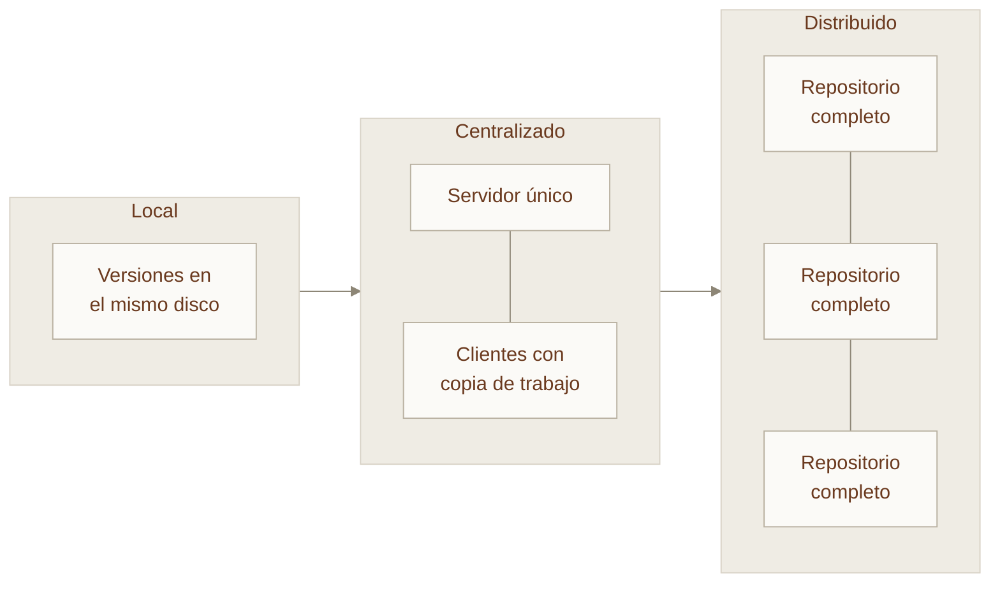
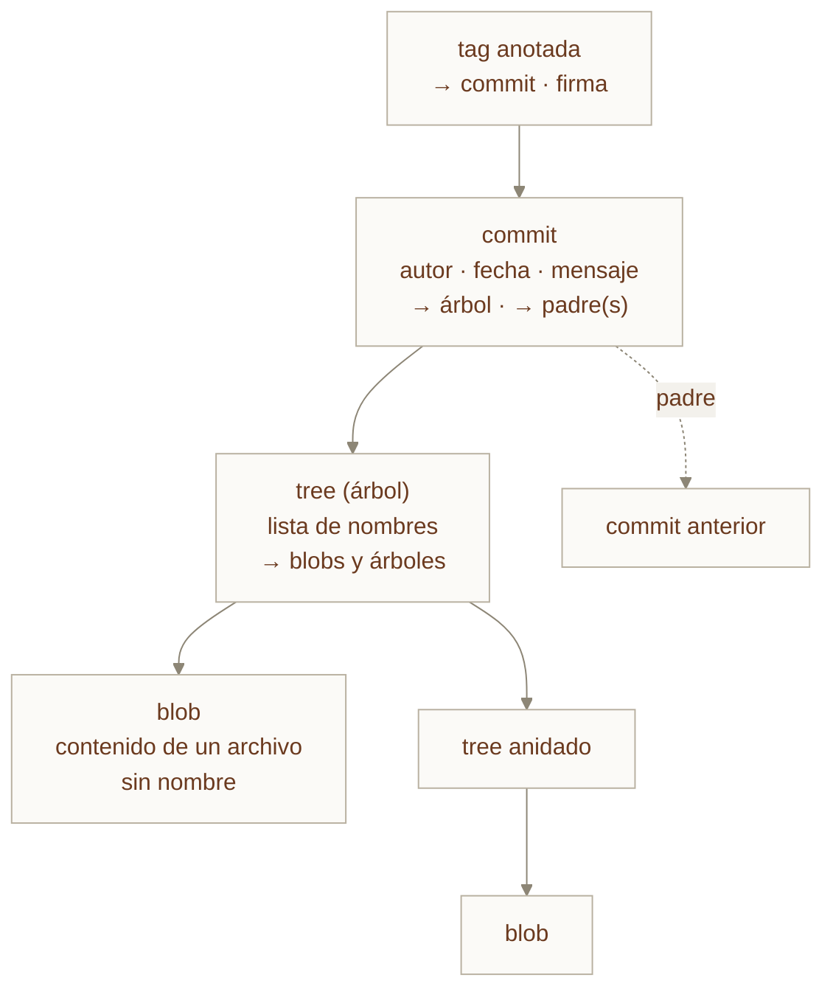
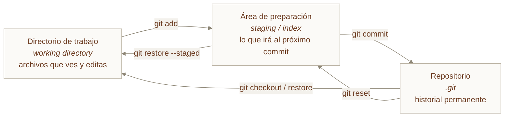

---
tags:
  - Bloque IV
  - Plataforma
  - Git
---

# Módulo 07 · Fundamentos de Git y control de versiones

<div class="modulo-meta" markdown>
<span>:material-clock-outline: 3 horas</span>
<span>:material-stairs: Nivel introductorio a intermedio</span>
<span>:material-link-variant: Requiere módulo 02</span>
<span>:material-star-outline: Capítulo ampliado</span>
</div>

Casi todo el mundo ha vivido la carpeta con `informe_final.docx`, `informe_final_v2.docx`, `informe_final_DEFINITIVO.docx` y `informe_final_DEFINITIVO_bueno.docx`. Es un sistema de control de versiones. Es solo que es un sistema pésimo: no dice quién cambió qué, no permite trabajar en paralelo sin pisarse y no se puede volver atrás con precisión.

Git resuelve ese problema, y lo resuelve tan bien que se ha convertido en la infraestructura sobre la que descansa prácticamente todo el desarrollo de software moderno —y, cada vez más, la operación de infraestructura, el gobierno de datos y la colaboración con agentes de IA.

---

## 1. Qué es el control de versiones

Un sistema de control de versiones registra los cambios sobre un conjunto de archivos a lo largo del tiempo, de forma que sea posible recuperar versiones específicas, entender la evolución y colaborar sin sobrescribir el trabajo ajeno.

### Las tres generaciones



| Generación | Ejemplos | Limitación que resolvió la siguiente |
| --- | --- | --- |
| Local | RCS, SCCS | No permite colaboración |
| Centralizado | CVS, Subversion, Perforce | Un solo punto de fallo; requiere conexión para casi todo |
| Distribuido | Git, Mercurial | — |

### Centralizado contra distribuido

| Aspecto | Centralizado | Distribuido |
| --- | --- | --- |
| Historial completo | Solo en el servidor | En cada clon |
| Trabajo sin conexión | Muy limitado | Completo salvo sincronización |
| Crear una rama | Operación del servidor, costosa | Local e instantánea |
| Punto único de fallo | Sí | No |
| Respaldo | Responsabilidad del servidor | Cada clon es un respaldo |
| Curva de aprendizaje | Menor | Mayor |

La consecuencia más profunda de ser distribuido no es técnica sino cultural: **crear una rama deja de ser un evento y se convierte en un hábito**. Todo el flujo de trabajo moderno —ramas por funcionalidad, pull requests, revisión por pares— es posible porque ramificar en Git es prácticamente gratis.

---

## 2. Historia

Git nació en 2005 de un conflicto. El kernel de Linux usaba BitKeeper, una herramienta propietaria cedida gratuitamente a la comunidad. Cuando esa cesión terminó, Linus Torvalds necesitaba un reemplazo y ninguno de los existentes cumplía sus requisitos.

Los escribió explícitamente:

1. **Rapidez.** Las operaciones habituales deben ser instantáneas.
2. **Diseño simple.** El modelo de datos interno debe ser comprensible.
3. **Soporte fuerte para desarrollo no lineal.** Miles de ramas en paralelo.
4. **Completamente distribuido.**
5. **Capaz de manejar proyectos enormes** con eficiencia.
6. **Integridad verificable.** Cualquier corrupción debe ser detectable.

Escribió la primera versión funcional en **diez días**. El kernel de Linux se migró a Git el 16 de junio de 2005.

!!! note "El requisito 6 explica el diseño"
    La integridad verificable es la razón de que todo en Git se identifique por el hash criptográfico de su contenido. No es una decisión estética: es lo que permite detectar cualquier alteración, accidental o maliciosa, en cualquier punto del historial.

---

## 3. El modelo de datos: qué es Git por dentro

Casi todas las confusiones con Git desaparecen al entender su modelo de datos. **Git no almacena diferencias. Almacena instantáneas completas.**

### Los cuatro objetos



| Objeto | Qué contiene | Qué NO contiene |
| --- | --- | --- |
| **blob** | El contenido exacto de un archivo | Su nombre, su ruta, sus permisos |
| **tree** | Nombres, permisos y referencias a blobs y a otros trees | El contenido en sí |
| **commit** | Referencia a un tree raíz, a los commits padre, autor, fecha y mensaje | Diferencias respecto al anterior |
| **tag anotada** | Referencia a un commit, mensaje y opcionalmente firma | — |

Cada objeto se identifica por el **hash SHA de su contenido**. Dos archivos idénticos en cualquier parte del historial son **el mismo blob**, almacenado una sola vez.

### Por qué esto importa en la práctica

| Consecuencia | Explicación |
| --- | --- |
| Los commits son inmutables | Cambiar cualquier cosa produce un hash distinto, es decir, otro commit |
| Reescribir la historia crea objetos nuevos | `rebase` y `amend` no modifican: sustituyen |
| Las ramas son baratas | Una rama es un archivo de 41 bytes con un hash |
| La integridad es verificable | Alterar un commit antiguo cambiaría todos los hashes posteriores |
| `git gc` comprime | El almacenamiento por deltas ocurre al empaquetar, no en el modelo lógico |

!!! tip "Una rama es un puntero, nada más"
    `main` no es una copia del proyecto ni un directorio. Es un archivo que contiene el hash de un commit. Crear una rama es escribir 41 bytes. Cambiar de rama es actualizar ese puntero y ajustar el directorio de trabajo.

    Entendido esto, operaciones como `reset`, `rebase` y `cherry-pick` dejan de ser magia.

### Referencias

| Referencia | Qué es |
| --- | --- |
| `HEAD` | Puntero a la rama actual (o directamente a un commit en estado *detached*) |
| `refs/heads/main` | La rama local `main` |
| `refs/remotes/origin/main` | La última posición conocida de `main` en el remoto |
| `refs/tags/v1.2.0` | Una etiqueta |

---

## 4. Las tres áreas



El área de preparación es la parte que más confunde a quien viene de otros sistemas, y también la más útil: permite **componer un commit deliberadamente** en lugar de subir todo lo que cambiaste.

```bash
git add -p archivo.py   # elegir fragmento por fragmento qué preparar
```

Esto permite separar un arreglo de un error de una refactorización que hiciste de paso, aunque estén en el mismo archivo. Un historial legible se construye así.

### Los cuatro estados de un archivo

| Estado | Significado | Cómo avanzar |
| --- | --- | --- |
| **No rastreado** | Git no lo conoce | `git add` |
| **Modificado** | Cambió desde el último commit | `git add` |
| **Preparado** | Está en el índice | `git commit` |
| **Confirmado** | Está en el historial | — |

---

## 5. Comandos esenciales

### Configuración inicial

```bash
git config --global user.name "Nombre Apellido"
git config --global user.email "correo@ejemplo.com"
git config --global init.defaultBranch main
git config --global pull.rebase true        # evita commits de merge en cada pull
git config --global core.editor "code --wait"

# Firma de commits (recomendado)
git config --global commit.gpgsign true
```

### Flujo básico

```bash
git init                      # crear repositorio
git clone <url>               # clonar uno existente
git status                    # estado actual — el comando más usado
git add <archivo>             # preparar cambios
git add -p                    # preparar por fragmentos
git commit -m "mensaje"       # confirmar
git log --oneline --graph --all --decorate   # ver el historial como grafo
git diff                      # cambios no preparados
git diff --staged             # cambios preparados
```

### Deshacer, según qué quieras deshacer

| Situación | Comando | Reescribe historia |
| --- | --- | --- |
| Descartar cambios en el directorio de trabajo | `git restore <archivo>` | No |
| Quitar del área de preparación | `git restore --staged <archivo>` | No |
| Corregir el último commit (aún no publicado) | `git commit --amend` | Sí |
| Deshacer un commit publicado | `git revert <hash>` | No — crea un commit inverso |
| Mover la rama atrás conservando cambios | `git reset --soft <hash>` | Sí |
| Mover la rama atrás descartando todo | `git reset --hard <hash>` | Sí |
| Recuperar algo que creías perdido | `git reflog` | — |

!!! danger "`git reset --hard` y `push --force` son las dos operaciones destructivas"
    `reset --hard` descarta cambios no confirmados de forma irrecuperable.

    `push --force` sobre una rama compartida sobrescribe el trabajo de otros. Usa siempre `--force-with-lease`, que se niega a sobrescribir si alguien publicó algo que tú no has visto.

!!! tip "`git reflog` es la red de seguridad"
    Registra todos los movimientos de `HEAD` durante 90 días por defecto, incluidos los commits que quedaron sin rama tras un `reset`. Si crees que perdiste trabajo confirmado, casi siempre está ahí.

    ```bash
    git reflog
    git checkout -b rescate <hash-encontrado>
    ```

---

## 6. Ramas y fusiones

```bash
git branch                          # listar
git switch -c funcionalidad/login   # crear y cambiar
git switch main                     # cambiar
git branch -d funcionalidad/login   # borrar (solo si ya está fusionada)
```

### Tres formas de integrar

=== "Fusión rápida (*fast-forward*)"

    Si la rama destino no avanzó, Git solo mueve el puntero.

    ```mermaid
    %%{init:{"theme":"base","themeVariables":{"fontFamily":"Inter, sans-serif","darkMode":false,"background":"#f3f1ec","mainBkg":"#fbfaf7","primaryColor":"#fbfaf7","primaryTextColor":"#6b3a1f","primaryBorderColor":"#b9b1a1","secondaryColor":"#ead9ba","secondaryTextColor":"#6b3a1f","secondaryBorderColor":"#b9b1a1","tertiaryColor":"#c2d4cb","tertiaryTextColor":"#6b3a1f","tertiaryBorderColor":"#b9b1a1","lineColor":"#8d8676","textColor":"#6b3a1f","nodeTextColor":"#6b3a1f","nodeBorder":"#b9b1a1","labelTextColor":"#6b3a1f","titleColor":"#6b3a1f","edgeLabelBackground":"#f3f1ec","clusterBkg":"#efece4","clusterBorder":"#d8d2c6","cScale0":"#e2a98c","cScaleLabel0":"#6b3a1f","cScale1":"#bdb6e6","cScaleLabel1":"#6b3a1f","cScale2":"#e8d9b6","cScaleLabel2":"#6b3a1f","cScale3":"#b5d0c3","cScaleLabel3":"#6b3a1f","cScale4":"#e6cfc0","cScaleLabel4":"#6b3a1f","cScale5":"#cddcea","cScaleLabel5":"#6b3a1f"}}}%%
    gitGraph
        commit id: "A"
        commit id: "B"
        branch funcionalidad
        commit id: "C"
        commit id: "D"
        checkout main
        merge funcionalidad
    ```

    Historial lineal, sin commit de fusión.

=== "Fusión con commit (*merge commit*)"

    Si ambas ramas avanzaron, Git crea un commit con dos padres.

    ```mermaid
    %%{init:{"theme":"base","themeVariables":{"fontFamily":"Inter, sans-serif","darkMode":false,"background":"#f3f1ec","mainBkg":"#fbfaf7","primaryColor":"#fbfaf7","primaryTextColor":"#6b3a1f","primaryBorderColor":"#b9b1a1","secondaryColor":"#ead9ba","secondaryTextColor":"#6b3a1f","secondaryBorderColor":"#b9b1a1","tertiaryColor":"#c2d4cb","tertiaryTextColor":"#6b3a1f","tertiaryBorderColor":"#b9b1a1","lineColor":"#8d8676","textColor":"#6b3a1f","nodeTextColor":"#6b3a1f","nodeBorder":"#b9b1a1","labelTextColor":"#6b3a1f","titleColor":"#6b3a1f","edgeLabelBackground":"#f3f1ec","clusterBkg":"#efece4","clusterBorder":"#d8d2c6","cScale0":"#e2a98c","cScaleLabel0":"#6b3a1f","cScale1":"#bdb6e6","cScaleLabel1":"#6b3a1f","cScale2":"#e8d9b6","cScaleLabel2":"#6b3a1f","cScale3":"#b5d0c3","cScaleLabel3":"#6b3a1f","cScale4":"#e6cfc0","cScaleLabel4":"#6b3a1f","cScale5":"#cddcea","cScaleLabel5":"#6b3a1f"}}}%%
    gitGraph
        commit id: "A"
        branch funcionalidad
        commit id: "C"
        commit id: "D"
        checkout main
        commit id: "B"
        merge funcionalidad id: "M"
    ```

    Conserva el contexto real de la colaboración.

=== "Rebase"

    Reaplica los commits de la rama sobre la punta de la otra, creando commits **nuevos**.

    ```bash
    git switch funcionalidad
    git rebase main
    ```

    Historial lineal y limpio, a costa de reescribir hashes.

### La regla de oro del rebase

!!! warning "No hagas rebase de historia que ya compartiste"
    Si otra persona basó su trabajo en los commits que reescribes, su repositorio y el tuyo divergen y la reconciliación es dolorosa.

    Regla operativa simple: **rebase en tu rama local antes de publicarla; merge para integrar ramas publicadas.**

### Resolución de conflictos

Un conflicto ocurre cuando dos ramas modifican las mismas líneas.

```text
<<<<<<< HEAD
    tasa = 0.16
=======
    tasa = 0.19
>>>>>>> funcionalidad/impuestos
```

```bash
# 1. Ver qué está en conflicto
git status

# 2. Editar el archivo y dejar el contenido correcto,
#    eliminando los marcadores

# 3. Marcar como resuelto
git add archivo.py

# 4. Continuar
git merge --continue      # o git rebase --continue
```

Herramientas que ayudan:

```bash
git mergetool                    # abre la herramienta configurada
git checkout --ours archivo      # quedarse con la versión de la rama actual
git checkout --theirs archivo    # quedarse con la de la rama entrante
git merge --abort                # cancelar y volver al estado previo
```

!!! tip "Activa `rerere`"
    ```bash
    git config --global rerere.enabled true
    ```
    *Reuse recorded resolution*: Git memoriza cómo resolviste un conflicto y lo reaplica automáticamente si vuelve a aparecer. Es particularmente útil en rebases largos y en ramas de larga vida.

---

## 7. Trabajo con repositorios remotos

```bash
git remote -v                        # listar remotos
git remote add origin <url>          # añadir
git fetch origin                     # traer sin integrar
git pull                             # fetch + merge (o rebase, según config)
git push -u origin mi-rama           # publicar y establecer seguimiento
git push --force-with-lease          # forzar de forma segura
```

### `fetch` contra `pull`

`fetch` **nunca** modifica tu trabajo: solo actualiza las referencias remotas. `pull` es `fetch` seguido de integración.

Un hábito que evita sorpresas:

```bash
git fetch origin
git log --oneline HEAD..origin/main   # ver qué llegó antes de integrarlo
git rebase origin/main
```

### Worktrees: varias ramas a la vez

```bash
git worktree add ../proyecto-hotfix hotfix/error-critico
git worktree list
git worktree remove ../proyecto-hotfix
```

Crea un segundo directorio de trabajo con otra rama, compartiendo el mismo repositorio. Evita el `stash` constante al alternar tareas.

!!! note "Worktrees y agentes de IA"
    Los worktrees se han vuelto una pieza de infraestructura relevante para ejecutar varios agentes de codificación en paralelo: cada agente trabaja en un directorio aislado y físicamente no puede pisar el trabajo de otro. Este patrón reaparece en el [módulo 14](14-graph-engineering.md).

---

## 8. Flujos de trabajo

| Flujo | Ramas | Complejidad | Cuándo |
| --- | --- | --- | --- |
| **GitHub Flow** | `main` + ramas de funcionalidad | Baja | Despliegue continuo, equipos pequeños |
| **GitLab Flow** | `main` + ramas de entorno | Media | Cuando hay entornos de staging y producción |
| **Git Flow** | `main`, `develop`, `feature`, `release`, `hotfix` | Alta | Versiones numeradas, software distribuible |
| **Trunk-Based** | `main` + ramas de horas | Baja | Equipos maduros con CI sólida y *feature flags* |

=== "GitHub Flow"

    ```mermaid
    %%{init:{"theme":"base","themeVariables":{"fontFamily":"Inter, sans-serif","darkMode":false,"background":"#f3f1ec","mainBkg":"#fbfaf7","primaryColor":"#fbfaf7","primaryTextColor":"#6b3a1f","primaryBorderColor":"#b9b1a1","secondaryColor":"#ead9ba","secondaryTextColor":"#6b3a1f","secondaryBorderColor":"#b9b1a1","tertiaryColor":"#c2d4cb","tertiaryTextColor":"#6b3a1f","tertiaryBorderColor":"#b9b1a1","lineColor":"#8d8676","textColor":"#6b3a1f","nodeTextColor":"#6b3a1f","nodeBorder":"#b9b1a1","labelTextColor":"#6b3a1f","titleColor":"#6b3a1f","edgeLabelBackground":"#f3f1ec","clusterBkg":"#efece4","clusterBorder":"#d8d2c6","cScale0":"#e2a98c","cScaleLabel0":"#6b3a1f","cScale1":"#bdb6e6","cScaleLabel1":"#6b3a1f","cScale2":"#e8d9b6","cScaleLabel2":"#6b3a1f","cScale3":"#b5d0c3","cScaleLabel3":"#6b3a1f","cScale4":"#e6cfc0","cScaleLabel4":"#6b3a1f","cScale5":"#cddcea","cScaleLabel5":"#6b3a1f"}}}%%
    gitGraph
        commit id: "inicio"
        branch feat/pagos
        commit id: "F1"
        commit id: "F2"
        checkout main
        merge feat/pagos tag: "PR + CI"
        branch fix/sesion
        commit id: "X1"
        checkout main
        merge fix/sesion tag: "PR + CI"
    ```

    `main` siempre desplegable. Toda rama nace de `main` y vuelve por pull request con CI en verde.

=== "Git Flow"

    ```mermaid
    %%{init:{"theme":"base","themeVariables":{"fontFamily":"Inter, sans-serif","darkMode":false,"background":"#f3f1ec","mainBkg":"#fbfaf7","primaryColor":"#fbfaf7","primaryTextColor":"#6b3a1f","primaryBorderColor":"#b9b1a1","secondaryColor":"#ead9ba","secondaryTextColor":"#6b3a1f","secondaryBorderColor":"#b9b1a1","tertiaryColor":"#c2d4cb","tertiaryTextColor":"#6b3a1f","tertiaryBorderColor":"#b9b1a1","lineColor":"#8d8676","textColor":"#6b3a1f","nodeTextColor":"#6b3a1f","nodeBorder":"#b9b1a1","labelTextColor":"#6b3a1f","titleColor":"#6b3a1f","edgeLabelBackground":"#f3f1ec","clusterBkg":"#efece4","clusterBorder":"#d8d2c6","cScale0":"#e2a98c","cScaleLabel0":"#6b3a1f","cScale1":"#bdb6e6","cScaleLabel1":"#6b3a1f","cScale2":"#e8d9b6","cScaleLabel2":"#6b3a1f","cScale3":"#b5d0c3","cScaleLabel3":"#6b3a1f","cScale4":"#e6cfc0","cScaleLabel4":"#6b3a1f","cScale5":"#cddcea","cScaleLabel5":"#6b3a1f"}}}%%
    gitGraph
        commit id: "v1.0" tag: "v1.0"
        branch develop
        commit id: "D1"
        branch feature/reporte
        commit id: "F1"
        checkout develop
        merge feature/reporte
        branch release/1.1
        commit id: "RC"
        checkout main
        merge release/1.1 tag: "v1.1"
        checkout develop
        merge release/1.1
    ```

    Más ceremonia, justificada cuando existen versiones que el cliente instala y hay que mantener varias en paralelo.

!!! danger "Agua fría: Git Flow suele ser demasiado"
    Git Flow se diseñó en 2010 para software con versiones numeradas y ciclos de lanzamiento largos. Aplicado a un servicio web que se despliega diez veces al día, añade ramas que no aportan nada y ralentiza la integración.

    Su propio autor publicó años después una nota recomendando no usarlo para desarrollo web continuo. **Elige el flujo por tu cadencia de despliegue, no por costumbre.**

### Buenas prácticas de commits

**Commits atómicos.** Un commit, un cambio lógico. Si el mensaje necesita la palabra "y", probablemente son dos commits.

**Mensajes convencionales:**

```text
<tipo>(<alcance>): <descripción breve en imperativo>

<cuerpo opcional: por qué, no qué>

<pie opcional: referencias, cambios incompatibles>
```

| Tipo | Uso |
| --- | --- |
| `feat` | Nueva funcionalidad |
| `fix` | Corrección de error |
| `docs` | Documentación |
| `refactor` | Cambio interno sin alterar comportamiento |
| `test` | Pruebas |
| `chore` | Mantenimiento, dependencias |
| `perf` | Mejora de rendimiento |

```text
fix(inferencia): evitar recarga del modelo en cada petición

El modelo se cargaba dentro del manejador, añadiendo 2.4 s de latencia
por petición. Se mueve a la inicialización del proceso.

Refs: #412
```

El mensaje explica **por qué**. El diff ya explica qué.

---

## 9. Git más allá del código

### GitOps

El estado deseado de la infraestructura vive en un repositorio Git. Un operador compara continuamente ese estado con el real y reconcilia. Se desarrolla en el [módulo 10](10-devops-mlops.md).

### Versionado de datos y modelos

Git está optimizado para archivos de texto pequeños. Un modelo de 4 GB o un conjunto de datos de 200 GB no van en Git.

| Herramienta | Enfoque |
| --- | --- |
| **Git LFS** | Sustituye archivos grandes por punteros; el binario vive en un almacén aparte |
| **DVC** | Versiona datos y modelos con metadatos en Git y contenido en almacenamiento de objetos |
| **LakeFS** | Versionado con semántica de Git sobre un data lake completo |
| **Registro de modelos** | Versiona modelos con su linaje, métricas y estado de aprobación |

```bash
# DVC: el patrón básico
dvc add datos/entrenamiento.parquet   # crea datos/entrenamiento.parquet.dvc
git add datos/entrenamiento.parquet.dvc .gitignore
git commit -m "chore(datos): versionar conjunto de entrenamiento v3"
dvc push                               # sube el contenido al almacén remoto
```

El archivo `.dvc` en Git contiene el hash del contenido. Git versiona **la referencia**; DVC gestiona **el contenido**.

### El repositorio como fuente de verdad

Una idea que atraviesa la ingeniería moderna: lo que no está en el repositorio, no existe.

- Una decisión acordada en una reunión y no escrita, se pierde.
- Una configuración aplicada a mano en un servidor, se olvida.
- Un contexto que vive en la cabeza de una persona, se va con esa persona.

Esta idea se vuelve literal cuando trabajas con agentes de IA: **un agente solo puede ver lo que está en el repositorio**. Es el fundamento del [módulo 13](13-harness-engineering.md).

---

## 10. Buenas prácticas y seguridad

### `.gitignore` bien configurado

```gitignore
# Entornos y dependencias
.venv/
node_modules/
__pycache__/

# Secretos — nunca en el repositorio
.env
*.pem
*.key
credenciales*.json

# Artefactos grandes
*.ckpt
*.pth
*.onnx
data/raw/

# Sistema operativo y editores
.DS_Store
.idea/
```

### Secretos: prevención y remediación

!!! danger "Un secreto en el historial está comprometido"
    Borrarlo en un commit posterior **no basta**: sigue en el historial y en cualquier clon. La única respuesta correcta es:

    1. **Rotar la credencial inmediatamente.** Antes de limpiar nada.
    2. Limpiar el historial con `git filter-repo` o BFG.
    3. Forzar la actualización de todos los clones.
    4. Instalar un gancho de pre-commit que escanee secretos para que no vuelva a ocurrir.

```bash
# Escaneo antes de confirmar
pip install detect-secrets
detect-secrets scan > .secrets.baseline

# Gancho de pre-commit
pip install pre-commit && pre-commit install
```

### Firma de commits

```bash
git config --global gpg.format ssh
git config --global user.signingkey ~/.ssh/id_ed25519.pub
git config --global commit.gpgsign true
```

Un commit firmado prueba quién lo creó. Sin firma, el campo de autor es texto libre: cualquiera puede escribir el nombre de otra persona.

### Protección de ramas

En la plataforma de alojamiento, la rama principal debería exigir:

- [ ] Pull request obligatorio; sin push directo.
- [ ] Al menos una aprobación de revisión.
- [ ] Verificaciones de CI en verde.
- [ ] Rama actualizada respecto a `main` antes de fusionar.
- [ ] Commits firmados.
- [ ] Prohibido el push forzado.
- [ ] Prohibido borrar la rama.

---

## Caso práctico · Un equipo de ML adopta Git en serio

Un equipo de cuatro personas entrena modelos de clasificación de documentos. Situación inicial:

- Los notebooks viven en carpetas compartidas con nombres como `modelo_v4_bueno.ipynb`.
- Nadie sabe con qué datos se entrenó el modelo que está en producción.
- El script de preprocesamiento tiene tres versiones distintas en tres laptops.
- Un modelo se degradó y no se pudo reproducir el entrenamiento anterior para comparar.

### Qué implementaron

| Problema | Solución | Resultado |
| --- | --- | --- |
| Notebooks sin versionar | Repositorio con `jupytext` para versionar notebooks como `.py` | Diffs legibles y revisables |
| Datos sin versionar | DVC apuntando a almacenamiento de objetos | Cada commit identifica el conjunto exacto |
| Código duplicado | Módulo compartido instalable en el repositorio | Una sola implementación |
| Modelos sin trazabilidad | Registro de modelos con el hash del commit como metadato | De un modelo en producción se llega a su código y sus datos |
| Sin revisión | Pull request obligatorio con CI que ejecuta pruebas y entrena con una muestra | Los errores se detectan antes del merge |
| Experimentos sin registro | Rama por experimento + métricas en el commit | Historial comparable |

### El flujo resultante

```mermaid
%%{init:{"theme":"base","themeVariables":{"fontFamily":"Inter, sans-serif","darkMode":false,"background":"#f3f1ec","mainBkg":"#fbfaf7","primaryColor":"#fbfaf7","primaryTextColor":"#6b3a1f","primaryBorderColor":"#b9b1a1","secondaryColor":"#ead9ba","secondaryTextColor":"#6b3a1f","secondaryBorderColor":"#b9b1a1","tertiaryColor":"#c2d4cb","tertiaryTextColor":"#6b3a1f","tertiaryBorderColor":"#b9b1a1","lineColor":"#8d8676","textColor":"#6b3a1f","nodeTextColor":"#6b3a1f","nodeBorder":"#b9b1a1","labelTextColor":"#6b3a1f","titleColor":"#6b3a1f","edgeLabelBackground":"#f3f1ec","clusterBkg":"#efece4","clusterBorder":"#d8d2c6","cScale0":"#e2a98c","cScaleLabel0":"#6b3a1f","cScale1":"#bdb6e6","cScaleLabel1":"#6b3a1f","cScale2":"#e8d9b6","cScaleLabel2":"#6b3a1f","cScale3":"#b5d0c3","cScaleLabel3":"#6b3a1f","cScale4":"#e6cfc0","cScaleLabel4":"#6b3a1f","cScale5":"#cddcea","cScaleLabel5":"#6b3a1f"}}}%%
flowchart LR
    A["Rama exp/nueva-arquitectura"] --> B["Cambios en código<br/>y parámetros"]
    B --> C["dvc repro<br/>reproduce el pipeline"]
    C --> D["Métricas comparadas<br/>contra main"]
    D -->|Mejora| E["Pull request<br/>con métricas en la descripción"]
    D -->|No mejora| F["Se registra el resultado<br/>y se cierra la rama"]
    E --> G["Revisión + CI"]
    G --> H["Merge a main"]
    H --> I["Registro de modelo<br/>con hash del commit"]
    classDef default fill:#fbfaf7,stroke:#b9b1a1,stroke-width:1px,color:#6b3a1f;
```



**Lo más valioso que ganaron:** el punto F. Registrar los experimentos que **no** funcionaron evitó que alguien repitiera el mismo intento fallido cuatro meses después. El historial de Git se convirtió en el registro de investigación del equipo.

---

## Laboratorio · Flujo completo con conflicto y rescate

**Objetivo:** ejercitar el ciclo real, incluyendo el conflicto y la recuperación de trabajo perdido.

**Paso 1 — Inicializa.**

```bash
mkdir lab-git && cd lab-git
git init
git config user.name "Tu Nombre"
git config user.email "tu@correo.com"

cat > modelo.py <<'EOF'
UMBRAL = 0.5

def predecir(puntuacion):
    return "positivo" if puntuacion > UMBRAL else "negativo"
EOF

git add modelo.py
git commit -m "feat(modelo): clasificador binario con umbral fijo"
```

**Paso 2 — Dos ramas que tocarán la misma línea.**

```bash
git switch -c exp/umbral-alto
sed -i '' 's/UMBRAL = 0.5/UMBRAL = 0.75/' modelo.py 2>/dev/null || \
  sed -i 's/UMBRAL = 0.5/UMBRAL = 0.75/' modelo.py
git commit -am "feat(modelo): subir umbral a 0.75 para reducir falsos positivos"

git switch main
git switch -c exp/umbral-calibrado
cat > modelo.py <<'EOF'
UMBRAL_POR_CLASE = {"urgente": 0.35, "normal": 0.60}

def predecir(puntuacion, clase="normal"):
    umbral = UMBRAL_POR_CLASE[clase]
    return "positivo" if puntuacion > umbral else "negativo"
EOF
git commit -am "feat(modelo): umbral diferenciado por clase de documento"
```

**Paso 3 — Fusiona y resuelve el conflicto.**

```bash
git switch main
git merge exp/umbral-alto          # fusión rápida
git merge exp/umbral-calibrado     # conflicto
git status
# Edita modelo.py y deja la versión correcta
git add modelo.py
git commit -m "merge: integrar umbral calibrado por clase"
```

**Paso 4 — Provoca la pérdida y recupérala.**

```bash
git log --oneline
git reset --hard HEAD~2     # "perdiste" dos commits
git log --oneline           # ya no están

git reflog                  # sí están
git reset --hard <hash-del-merge>
git log --oneline           # recuperados
```

**Paso 5 — Compara merge y rebase.**

```bash
git switch -c exp/rebase main~2
echo "# nota de experimento" >> modelo.py
git commit -am "docs(modelo): anotar experimento"
git rebase main
git log --oneline --graph --all
```

Observa que el hash del commit cambió tras el rebase. Ese es el punto central: rebase **no mueve** commits, los **recrea**.

**Paso 6 — Prepara por fragmentos.**

```bash
cat >> modelo.py <<'EOF'

def normalizar(x):
    return max(0.0, min(1.0, x))

# TODO: revisar este umbral con el equipo
EOF

git add -p modelo.py    # prepara solo la función, deja el TODO fuera
git commit -m "feat(modelo): añadir normalización de puntuación"
git status              # el TODO sigue sin confirmar
```

**Entregable:** la salida de `git log --oneline --graph --all`, la de `git reflog`, y una explicación en tres líneas de por qué el hash cambió al hacer rebase.

---

## Conceptos clave

- **Control de versiones distribuido:** cada clon contiene el historial completo y es un respaldo funcional.
- **Objetos de Git:** blob (contenido), tree (estructura), commit (instantánea con metadatos), tag anotada.
- **Direccionamiento por contenido:** cada objeto se identifica por el hash de su contenido; la integridad es verificable.
- **Las tres áreas:** directorio de trabajo, área de preparación (índice) y repositorio.
- **Rama:** puntero móvil a un commit. Crearla es una operación de 41 bytes.
- **`HEAD`:** puntero a la rama o commit actual.
- **Merge:** integra creando un commit con varios padres; conserva el contexto real.
- **Rebase:** reaplica commits creando otros nuevos; produce historial lineal y reescribe hashes.
- **`reflog`:** registro de los movimientos de `HEAD`; la red de seguridad para recuperar trabajo.
- **`--force-with-lease`:** push forzado que se niega a sobrescribir trabajo ajeno no visto.
- **Commit atómico:** un commit, un cambio lógico.
- **Worktree:** directorio de trabajo adicional sobre el mismo repositorio.
- **Git LFS / DVC:** versionado de archivos grandes mediante punteros en Git y contenido fuera.
- **GitOps:** el repositorio como declaración del estado deseado de la infraestructura.

---

## Puntos clave

- Git almacena instantáneas completas, no diferencias. Casi toda la confusión desaparece al interiorizar esto.
- Una rama es un puntero. Crear ramas es gratis, y todo el flujo moderno depende de ese hecho.
- El área de preparación permite componer commits deliberadamente; `git add -p` es lo que hace posible un historial legible.
- `git reflog` recupera casi cualquier cosa confirmada que creas perdida. Antes de entrar en pánico, míralo.
- Rebase en local antes de publicar; merge para integrar lo ya publicado. Esa sola regla evita la mayoría de los desastres.
- `push --force` sobre ramas compartidas destruye trabajo ajeno. Usa siempre `--force-with-lease`.
- El mensaje de commit explica el **porqué**; el diff ya explica el qué.
- Git Flow es demasiado para despliegue continuo. Elige el flujo por tu cadencia, no por costumbre.
- Un secreto que entró al historial está comprometido: rota primero, limpia después.
- Git no versiona bien archivos grandes. Datos y modelos requieren DVC, LFS o un registro de modelos.
- El repositorio como fuente de verdad deja de ser una metáfora cuando colaboras con agentes: lo que no está ahí, no existe para ellos.

---

## Ejercicios

1. **Explora el modelo de datos.** En un repositorio real, ejecuta `git cat-file -p HEAD`, luego el árbol que referencia, y luego un blob. Dibuja el grafo de objetos de un solo commit.

2. **Reconstruye un historial.** Toma cinco cambios que hayas hecho de golpe y conviértelos en cinco commits atómicos usando `git add -p`. Compara la legibilidad del resultado.

3. **Rescate deliberado.** Crea un repositorio de prueba, haz tres commits, ejecuta `git reset --hard HEAD~3` y recupera todo usando solo `reflog`. Documenta los comandos.

4. **Audita tu flujo.** Describe el flujo de trabajo actual de tu equipo. ¿Cuál de los cuatro flujos se parece más? ¿Qué parte sobra?

5. **Busca secretos.** Ejecuta un escáner de secretos sobre el historial completo de un repositorio al que tengas acceso. Si encuentras algo, escribe el plan de remediación en el orden correcto.

6. **Versiona un modelo.** Toma un modelo entrenado y un conjunto de datos. Configúralos con DVC de modo que desde un commit puedas reproducir exactamente ese entrenamiento.

7. **Escribe tres mensajes.** Toma tres commits recientes tuyos y reescribe sus mensajes según la convención, explicando el porqué. ¿Cuántos podías justificar realmente?

---

## Lectura adicional

- [Pro Git · Scott Chacon y Ben Straub](https://git-scm.com/book/es/v2) — el libro de referencia, gratuito y en español. El capítulo 10 ("Los entresijos internos de Git") es el más valioso.
- [Git from the Bottom Up · John Wiegley](https://jwiegley.github.io/git-from-the-bottom-up/) — el modelo de datos explicado desde los objetos hacia arriba.
- [Conventional Commits](https://www.conventionalcommits.org/es/) — la convención de mensajes.
- [Learn Git Branching](https://learngitbranching.js.org/?locale=es_ES) — visualizador interactivo de ramas, merge y rebase.
- [DVC · Documentación](https://dvc.org/doc) — versionado de datos y modelos.
- [git-filter-repo](https://github.com/newren/git-filter-repo) — la herramienta recomendada para reescribir historial.
- [Módulo 08 · Docker](08-docker.md) — lo que se versiona acaba construyéndose como imagen.
- [Módulo 10 · DevOps y MLOps](10-devops-mlops.md) — GitOps y el repositorio como fuente de verdad operativa.
