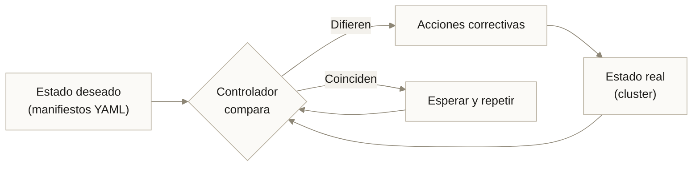
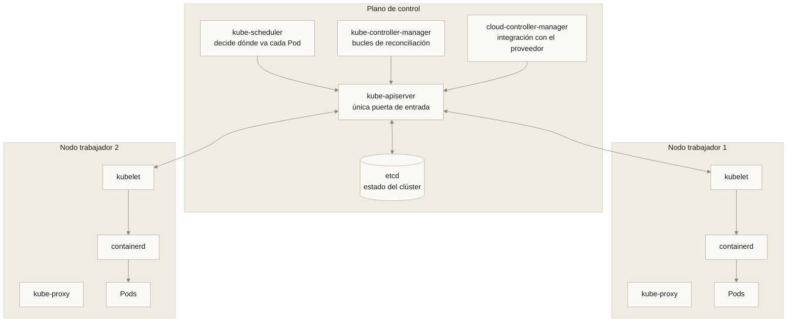
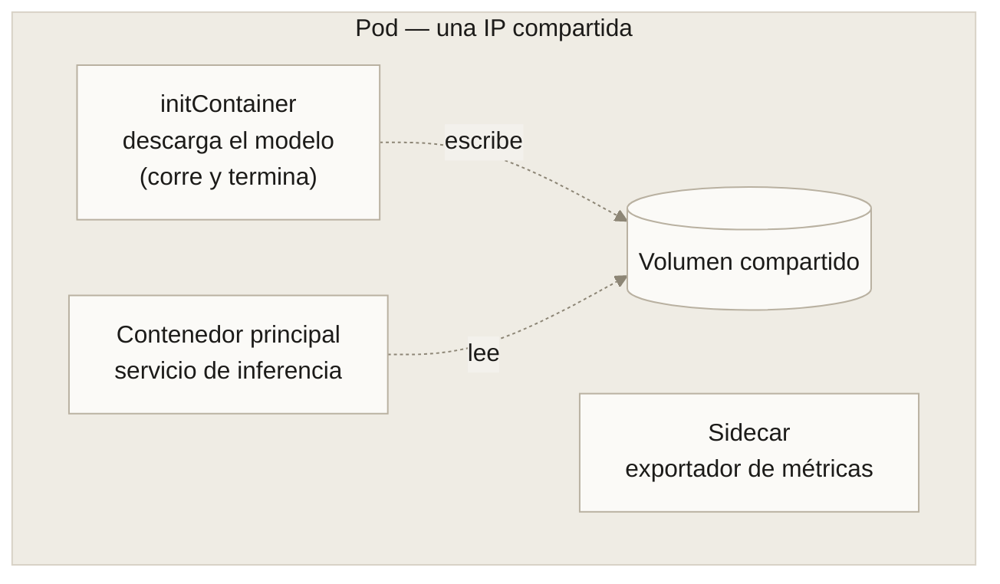
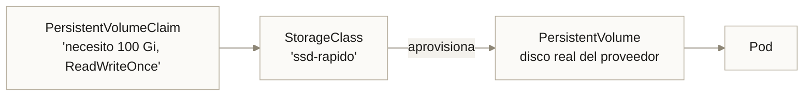
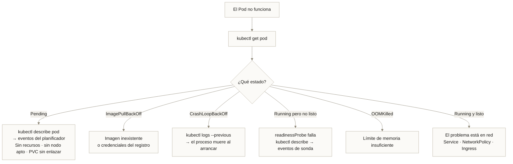

---
tags:
  - Bloque IV
  - Plataforma
  - Kubernetes
---

# Módulo 09 · Kubernetes y orquestación

<div class="modulo-meta" markdown>
<span>:material-clock-outline: 3 horas</span>
<span>:material-stairs: Nivel intermedio-avanzado</span>
<span>:material-link-variant: Requiere módulo 08</span>
</div>

Con tres contenedores, Docker Compose basta. Con trescientos repartidos en veinte servidores, donde algunos se caen cada hora, el tráfico varía diez veces al día y hay que desplegar sin cortar el servicio, hace falta otra cosa.

Kubernetes es esa otra cosa: un sistema que **mantiene continuamente el estado real igual al estado que declaraste**.

---

## 1. La idea central: reconciliación declarativa

La diferencia con todo lo anterior no es técnica, es de modelo mental.

| Enfoque | Cómo se expresa | Quién corrige la desviación |
| --- | --- | --- |
| **Imperativo** | "Arranca tres contenedores" | Tú, cuando te enteras |
| **Declarativo** | "Quiero tres réplicas corriendo" | El sistema, continuamente |



Este bucle de reconciliación corre indefinidamente. Si matas un Pod, aparece otro. Si un nodo se apaga, sus cargas se reprograman en otro. No porque alguien lo ordene: porque el estado real dejó de coincidir con el deseado.

!!! tip "Todo en Kubernetes es un bucle de reconciliación"
    Deployments, Services, autoescaladores, operadores: todos siguen el mismo patrón —observar, comparar, actuar. Entendido el patrón, cada objeto nuevo es una variación conocida.

    Este mismo patrón reaparece en GitOps ([módulo 10](10-devops-mlops.md)) y en los loops de agentes ([módulo 13](13-harness-engineering.md)).

---

## 2. Historia y contexto

| Año | Hito |
| --- | --- |
| 2003–2013 | Google opera Borg internamente: orquestación a escala de miles de máquinas |
| 2014 | Google libera Kubernetes, inspirado en las lecciones de Borg |
| 2015 | Versión 1.0; se dona a la Cloud Native Computing Foundation |
| 2016–2018 | Los tres grandes proveedores lanzan servicios gestionados (EKS, AKS, GKE) |
| 2017 | Docker Swarm y Mesos pierden la competencia de facto |
| 2019+ | Operadores, service mesh, GitOps, cargas de IA con GPU |

El nombre viene del griego κυβερνήτης, *timonel*. "K8s" es la abreviatura: K, ocho letras, s.

!!! danger "Agua fría: Kubernetes no es para todos"
    Kubernetes resuelve problemas de escala. Si no tienes esos problemas, añade complejidad sin contrapartida.

    **Probablemente NO lo necesitas si:** tienes menos de cinco servicios, un solo equipo, tráfico predecible, y nadie dedicado a plataforma.

    **Probablemente SÍ lo necesitas si:** múltiples equipos desplegando de forma independiente, necesitas autoescalado real, gestionas GPU compartidas entre cargas, o requieres despliegues progresivos con reversión automática.

    Alternativas legítimas: un PaaS gestionado, Docker Compose en un servidor robusto, ECS, Cloud Run, Nomad. Elegir Kubernetes "porque es lo que se usa" es la causa más común de plataformas sobredimensionadas.

---

## 3. Arquitectura



### Plano de control

| Componente | Responsabilidad |
| --- | --- |
| **kube-apiserver** | Expone la API REST; **todo** pasa por aquí; valida, autentica y autoriza |
| **etcd** | Almacén clave-valor consistente con el estado completo del clúster |
| **kube-scheduler** | Elige el nodo para cada Pod nuevo según recursos, afinidades y restricciones |
| **kube-controller-manager** | Ejecuta los bucles de reconciliación de los objetos integrados |
| **cloud-controller-manager** | Traduce objetos a recursos del proveedor: balanceadores, discos, rutas |

!!! warning "etcd es el activo crítico"
    Todo el estado vive en etcd. Su respaldo es el respaldo del clúster, y su pérdida es la pérdida del clúster. En clústeres gestionados esto lo opera el proveedor; en clústeres propios, es responsabilidad tuya y hay que probar la restauración.

### Nodo trabajador

| Componente | Responsabilidad |
| --- | --- |
| **kubelet** | Agente que recibe especificaciones de Pod y garantiza que sus contenedores corran |
| **kube-proxy** | Programa las reglas de red para que los Services funcionen |
| **Runtime de contenedores** | containerd o CRI-O; ejecuta los contenedores |

---

## 4. Pods

El **Pod** es la unidad mínima desplegable. Contiene uno o más contenedores que comparten red (misma IP y puertos), almacenamiento y ciclo de vida.



### Patrones de varios contenedores

| Patrón | Función | Ejemplo |
| --- | --- | --- |
| **initContainer** | Se ejecuta y termina antes que los principales | Descargar el modelo, migrar la base de datos |
| **Sidecar** | Acompaña al principal durante toda su vida | Recolector de registros, proxy de malla, exportador de métricas |
| **Ambassador** | Intermedia la conexión saliente | Proxy hacia una base de datos |
| **Adapter** | Normaliza la salida | Traduce métricas a un formato estándar |

!!! tip "initContainer es la solución al problema del modelo pesado"
    El `initContainer` descarga el modelo de almacenamiento de objetos a un volumen compartido. El contenedor principal arranca solo cuando el init terminó con éxito. La imagen se mantiene pequeña y el modelo se puede cambiar sin reconstruirla.

### Un Pod casi nunca se crea a mano

Los Pods son efímeros y no se recrean solos. Se gestionan mediante controladores.

---

## 5. Objetos de carga de trabajo

| Objeto | Qué garantiza | Uso |
| --- | --- | --- |
| **Deployment** | N réplicas idénticas e intercambiables, con actualizaciones progresivas | Servicios sin estado: APIs, inferencia |
| **StatefulSet** | Identidad estable, almacenamiento propio por réplica, orden de arranque | Bases de datos, colas, sistemas con consenso |
| **DaemonSet** | Una réplica en cada nodo | Agentes de registro, monitoreo, drivers |
| **Job** | Ejecuta hasta completar con éxito | Entrenamiento por lotes, migraciones |
| **CronJob** | Job según calendario | Reentrenamiento nocturno, informes |

### Deployment

```yaml
apiVersion: apps/v1
kind: Deployment
metadata:
  name: inferencia
  labels: {app: inferencia}
spec:
  replicas: 3
  revisionHistoryLimit: 5
  strategy:
    type: RollingUpdate
    rollingUpdate:
      maxSurge: 1          # cuántos Pods extra puede crear durante la actualización
      maxUnavailable: 0    # cero indisponibles: despliegue sin cortes
  selector:
    matchLabels: {app: inferencia}
  template:
    metadata:
      labels: {app: inferencia}
    spec:
      securityContext:
        runAsNonRoot: true
        runAsUser: 10001
        fsGroup: 10001
      initContainers:
        - name: descargar-modelo
          image: registro.ejemplo.com/utilidades:1.2
          command: ["sh", "-c", "descargar-modelo --version $(MODELO_VERSION) --destino /modelos"]
          env:
            - name: MODELO_VERSION
              value: "2026-03-11"
          volumeMounts:
            - {name: modelos, mountPath: /modelos}
      containers:
        - name: api
          image: registro.ejemplo.com/inferencia:1.4.2
          imagePullPolicy: IfNotPresent
          ports:
            - {containerPort: 8000, name: http}
          env:
            - name: MODELO_RUTA
              value: /modelos/clasificador.onnx
            - name: DB_PASSWORD
              valueFrom:
                secretKeyRef: {name: credenciales-db, key: password}
          envFrom:
            - configMapRef: {name: config-inferencia}
          resources:
            requests: {cpu: "500m", memory: "1Gi"}
            limits:   {cpu: "2",    memory: "3Gi"}
          startupProbe:                      # da tiempo a cargar el modelo
            httpGet: {path: /listo, port: http}
            periodSeconds: 5
            failureThreshold: 30             # hasta 150 s de margen
          livenessProbe:
            httpGet: {path: /salud, port: http}
            periodSeconds: 15
            failureThreshold: 3
          readinessProbe:
            httpGet: {path: /listo, port: http}
            periodSeconds: 5
            failureThreshold: 2
          securityContext:
            allowPrivilegeEscalation: false
            readOnlyRootFilesystem: true
            capabilities: {drop: ["ALL"]}
          volumeMounts:
            - {name: modelos, mountPath: /modelos, readOnly: true}
            - {name: temporal, mountPath: /tmp}
      volumes:
        - {name: modelos, emptyDir: {sizeLimit: 8Gi}}
        - {name: temporal, emptyDir: {}}
```

### Requests y limits: la configuración que más se equivoca

| Campo | Significado | Efecto |
| --- | --- | --- |
| `requests` | Lo que el Pod **necesita garantizado** | El planificador reserva esta cantidad; determina en qué nodo cabe |
| `limits` | El máximo que puede consumir | CPU: se estrangula. **Memoria: el contenedor muere con OOMKilled** |

!!! warning "Los tres errores clásicos"
    **1. No declarar requests.** El planificador asume cero, sobrecarga el nodo y todo se degrada a la vez.

    **2. Límite de memoria demasiado justo.** El contenedor muere con OOMKilled sin aviso ni registro útil. En cargas de inferencia, el pico de memoria al procesar un lote grande puede duplicar el estado en reposo.

    **3. Límite de CPU demasiado bajo en cargas de latencia.** El estrangulamiento de CPU no mata el proceso, pero dispara la latencia p99 de forma difícil de diagnosticar. En servicios sensibles a latencia, muchos equipos declaran `requests` de CPU y **omiten** el `limit`.

### Sondas: las tres y para qué sirve cada una

| Sonda | Pregunta | Si falla |
| --- | --- | --- |
| **startupProbe** | ¿Terminó de arrancar? | Reinicia, pero desactiva las otras dos mientras tanto |
| **livenessProbe** | ¿Sigue vivo? | Reinicia el contenedor |
| **readinessProbe** | ¿Puede atender? | Lo saca del Service, **sin** reiniciar |

La `startupProbe` es la que resuelve el problema de los modelos de carga lenta: mientras no pase, las otras dos no se evalúan.

---

## 6. Servicios y redes

### El problema

Los Pods tienen IP, pero son efímeros: al reiniciarse, cambia. Nada puede depender de la IP de un Pod.

### Service

```yaml
apiVersion: v1
kind: Service
metadata:
  name: inferencia
spec:
  type: ClusterIP
  selector: {app: inferencia}     # selecciona Pods por etiqueta, no por IP
  ports:
    - {port: 80, targetPort: 8000, name: http}
```

| Tipo | Alcance | Uso |
| --- | --- | --- |
| **ClusterIP** | Solo dentro del clúster | Comunicación entre servicios (por defecto) |
| **NodePort** | Un puerto en cada nodo | Desarrollo, casos específicos |
| **LoadBalancer** | Balanceador del proveedor | Exponer un servicio a internet |
| **ExternalName** | Alias DNS a un host externo | Integrar servicios fuera del clúster |
| **Headless** (`clusterIP: None`) | DNS que devuelve las IPs de los Pods | StatefulSets, descubrimiento directo |

Dentro del clúster, el nombre `inferencia.produccion.svc.cluster.local` —o simplemente `inferencia` en el mismo namespace— resuelve al Service. **Nunca se usan IPs.**

### Ingress

Un Service de tipo LoadBalancer por cada API significa un balanceador (y su factura) por cada una. **Ingress** es un único punto de entrada HTTP que enruta por host y ruta.

```yaml
apiVersion: networking.k8s.io/v1
kind: Ingress
metadata:
  name: publico
  annotations:
    cert-manager.io/cluster-issuer: letsencrypt
spec:
  ingressClassName: nginx
  tls:
    - hosts: [api.ejemplo.com]
      secretName: tls-api
  rules:
    - host: api.ejemplo.com
      http:
        paths:
          - path: /inferencia
            pathType: Prefix
            backend:
              service: {name: inferencia, port: {number: 80}}
          - path: /catalogo
            pathType: Prefix
            backend:
              service: {name: catalogo, port: {number: 80}}
```

### NetworkPolicy

Por defecto, **todos los Pods pueden hablar con todos**. Esto viola el principio de privilegio mínimo del [módulo 04](04-arquitectura-seguridad.md).

```yaml
apiVersion: networking.k8s.io/v1
kind: NetworkPolicy
metadata:
  name: inferencia-solo-desde-api
spec:
  podSelector:
    matchLabels: {app: inferencia}
  policyTypes: [Ingress, Egress]
  ingress:
    - from:
        - podSelector: {matchLabels: {app: pasarela}}
      ports:
        - {protocol: TCP, port: 8000}
  egress:
    - to:
        - namespaceSelector: {matchLabels: {kubernetes.io/metadata.name: kube-system}}
      ports:
        - {protocol: UDP, port: 53}   # solo DNS: sin salida a internet
```

!!! tip "Empieza por denegar todo"
    En cada namespace de producción, aplica primero una política que deniegue todo el tráfico y después abre únicamente lo necesario. Es más trabajo inicial y muchísimo menos incidente después.

---

## 7. Configuración y almacenamiento

### ConfigMap y Secret

```yaml
apiVersion: v1
kind: ConfigMap
metadata: {name: config-inferencia}
data:
  LOTE_MAXIMO: "32"
  TIEMPO_ESPERA_MS: "500"
  NIVEL_LOG: "info"
---
apiVersion: v1
kind: Secret
metadata: {name: credenciales-db}
type: Opaque
stringData:
  password: "cambiar-esto"
```

!!! danger "Un Secret de Kubernetes está codificado en base64, no cifrado"
    Cualquiera con permiso de lectura sobre Secrets en ese namespace lo ve en claro. Y **base64 no es cifrado**: es codificación.

    Lo mínimo aceptable en producción:

    - Cifrado de etcd en reposo activado.
    - RBAC estricto sobre el recurso `secrets`.
    - Secretos gestionados por un sistema externo (gestor de secretos del proveedor, Vault) e inyectados mediante un operador.
    - **Nunca** secretos en texto plano en el repositorio de manifiestos. Si se versionan, usa cifrado tipo SOPS o Sealed Secrets.

### Almacenamiento persistente



| Modo de acceso | Significado |
| --- | --- |
| `ReadWriteOnce` | Escritura desde un solo nodo |
| `ReadOnlyMany` | Lectura desde muchos nodos |
| `ReadWriteMany` | Escritura desde muchos nodos (requiere sistema de archivos compartido) |

Para modelos compartidos entre muchas réplicas, `ReadOnlyMany` sobre un sistema de archivos de red es el patrón habitual: una sola copia del modelo, montada por todas las réplicas.

---

## 8. Escalado

### Escalado horizontal de Pods (HPA)

```yaml
apiVersion: autoscaling/v2
kind: HorizontalPodAutoscaler
metadata: {name: inferencia}
spec:
  scaleTargetRef:
    apiVersion: apps/v1
    kind: Deployment
    name: inferencia
  minReplicas: 2
  maxReplicas: 40
  metrics:
    - type: Resource
      resource:
        name: cpu
        target: {type: Utilization, averageUtilization: 70}
    - type: Pods
      pods:
        metric: {name: peticiones_en_cola}
        target: {type: AverageValue, averageValue: "8"}
  behavior:
    scaleUp:
      stabilizationWindowSeconds: 30
      policies:
        - {type: Percent, value: 100, periodSeconds: 30}
    scaleDown:
      stabilizationWindowSeconds: 300   # baja despacio para evitar oscilación
      policies:
        - {type: Percent, value: 20, periodSeconds: 60}
```

!!! tip "Para inferencia, la CPU es una mala métrica de escalado"
    Un servicio de inferencia con GPU puede tener la CPU al 15 % mientras la GPU está saturada y la cola de peticiones crece.

    Escala por **métricas propias del servicio**: profundidad de la cola, latencia p95 o utilización de GPU. Requiere un adaptador de métricas personalizadas, y merece la pena.

### Otros escaladores

| Escalador | Qué ajusta |
| --- | --- |
| **HPA** | Número de réplicas |
| **VPA** | Requests y limits de cada Pod, basándose en consumo observado |
| **Cluster Autoscaler** | Número de nodos del clúster |
| **KEDA** | Réplicas basándose en eventos externos: longitud de cola, mensajes pendientes |

### Presupuesto de interrupción

```yaml
apiVersion: policy/v1
kind: PodDisruptionBudget
metadata: {name: inferencia}
spec:
  minAvailable: 2
  selector:
    matchLabels: {app: inferencia}
```

Impide que una operación voluntaria —drenar un nodo para mantenimiento, actualizar el clúster— deje el servicio por debajo del mínimo.

---

## 9. Kubernetes para cargas de IA

### GPU

```yaml
spec:
  containers:
    - name: entrenamiento
      image: registro.ejemplo.com/entrenamiento:2.1
      resources:
        limits:
          nvidia.com/gpu: 2      # las GPU solo se declaran como limit
  nodeSelector:
    accelerator: nvidia-a100
  tolerations:
    - key: nvidia.com/gpu
      operator: Exists
      effect: NoSchedule
```

| Aspecto | Consideración |
| --- | --- |
| Las GPU no son divisibles por defecto | Un Pod toma la GPU entera; se comparte con MIG o time-slicing |
| Se requiere el device plugin de NVIDIA | Instalado normalmente como DaemonSet |
| `taints` en nodos con GPU | Evitan que cargas sin GPU ocupen nodos caros |
| Nodos con GPU en grupo separado | Permite escalar a cero cuando no hay entrenamientos |

### Entrenamiento con Job

```yaml
apiVersion: batch/v1
kind: Job
metadata: {name: entrenar-clasificador-v7}
spec:
  backoffLimit: 2
  ttlSecondsAfterFinished: 86400
  template:
    spec:
      restartPolicy: OnFailure
      containers:
        - name: entrenar
          image: registro.ejemplo.com/entrenamiento:2.1
          args: ["--config", "/config/exp7.yaml", "--checkpoint-dir", "/ckpt"]
          resources:
            limits: {nvidia.com/gpu: 4, memory: "120Gi"}
          volumeMounts:
            - {name: checkpoints, mountPath: /ckpt}
            - {name: config, mountPath: /config}
      volumes:
        - {name: checkpoints, persistentVolumeClaim: {claimName: ckpt-exp7}}
        - {name: config, configMap: {name: config-exp7}}
```

!!! tip "Puntos de control e instancias interrumpibles"
    Si el entrenamiento guarda puntos de control cada N pasos en un volumen persistente, puede correr en nodos con instancias interrumpibles y reanudar tras una interrupción.

    El ahorro es sustancial: 70–90 % del costo de cómputo de entrenamiento. Es probablemente la optimización de costos con mayor impacto en cargas de IA.

### Estrategias de despliegue de modelos

| Estrategia | Cómo funciona | Cuándo |
| --- | --- | --- |
| **Rolling update** | Sustituye réplicas progresivamente | Por defecto; cambios de bajo riesgo |
| **Blue/Green** | Dos entornos completos; se conmuta el tráfico | Reversión instantánea necesaria |
| **Canary** | Un porcentaje pequeño del tráfico al modelo nuevo | Validar con tráfico real antes de comprometerse |
| **Shadow** | El modelo nuevo recibe copia del tráfico pero su salida se descarta | Comparar sin ningún riesgo para el usuario |
| **A/B** | Segmentos de usuarios distintos a modelos distintos | Medir impacto en métricas de negocio |

**Shadow** merece especial atención en ML: permite medir latencia, consumo y concordancia de predicciones del modelo nuevo contra el actual, con tráfico de producción real y cero riesgo. Es el paso previo natural a un canary.

---

## 10. Comandos esenciales

```bash
# Contexto y exploración
kubectl config get-contexts
kubectl config use-context mi-cluster
kubectl get nodes -o wide
kubectl get all -n produccion

# Trabajar con objetos
kubectl apply -f manifiestos/
kubectl get deploy,pod,svc -n produccion
kubectl describe pod inferencia-7d9f-x2k -n produccion   # el comando de diagnóstico
kubectl logs -f deploy/inferencia -n produccion
kubectl logs pod-x --previous                            # registros del contenedor anterior
kubectl exec -it pod-x -n produccion -- /bin/sh

# Despliegues
kubectl rollout status deploy/inferencia -n produccion
kubectl rollout history deploy/inferencia -n produccion
kubectl rollout undo deploy/inferencia -n produccion      # revertir
kubectl scale deploy/inferencia --replicas=8 -n produccion

# Diagnóstico
kubectl get events -n produccion --sort-by=.lastTimestamp
kubectl top nodes
kubectl top pods -n produccion
kubectl port-forward svc/inferencia 8080:80 -n produccion
kubectl auth can-i create deployments -n produccion

# Validación antes de aplicar
kubectl apply -f manifiestos/ --dry-run=server
kubectl diff -f manifiestos/
```

### El procedimiento de diagnóstico



---

## Caso práctico · Plataforma de inferencia multi-equipo

Una empresa de servicios financieros tiene cuatro equipos de ML desplegando modelos. Antes: cada equipo con sus propias máquinas virtuales, GPU infrautilizadas y despliegues manuales.

### Diseño

| Decisión | Razón |
| --- | --- |
| Namespace por equipo con `ResourceQuota` | Aísla y limita el consumo de cada equipo |
| Grupo de nodos con GPU y `taint` dedicado | Las cargas sin GPU no ocupan nodos caros |
| Grupo de nodos interrumpibles para entrenamiento | 76 % de ahorro en cómputo de entrenamiento |
| Cluster Autoscaler con escalado a cero en GPU | Fuera de horario, el grupo de GPU baja a cero nodos |
| `NetworkPolicy` de denegación por defecto | Un modelo comprometido no alcanza a otros equipos |
| Ingress único con autenticación centralizada | Un solo punto de control de acceso y de medición |
| HPA por profundidad de cola | La CPU no reflejaba la carga real de inferencia |
| `PodDisruptionBudget` en todos los servicios | Las actualizaciones del clúster no cortan servicio |

### Resultados a los ocho meses

| Métrica | Antes | Después |
| --- | --- | --- |
| Utilización media de GPU | 19 % | 68 % |
| Tiempo de un despliegue nuevo | 3–5 días | 25 minutos |
| Costo mensual de cómputo | Línea base | −41 % |
| Incidentes por despliegue | 1 de cada 4 | 1 de cada 30 |

### Los tres problemas que aparecieron

**1. Modelos que tardaban 90 segundos en cargar entraban en bucle de reinicio.** La `livenessProbe` los mataba antes de terminar. Solución: `startupProbe` con `failureThreshold` generoso.

**2. Un equipo consumió toda la cuota del clúster con un Job mal configurado.** Solución: `ResourceQuota` y `LimitRange` por namespace, más `priorityClass` para que la inferencia en producción desaloje al entrenamiento si hace falta.

**3. El escalado oscilaba.** El HPA subía y bajaba réplicas cada minuto, y cada arranque costaba 90 s de carga de modelo. Solución: ventana de estabilización de 300 s para el escalado hacia abajo.

---

## Laboratorio · Desplegar un servicio de inferencia con autoescalado

**Requisitos:** Docker y `kind` (o Minikube), más `kubectl`.

**Paso 1 — Clúster local.**

```bash
cat > kind.yaml <<'EOF'
kind: Cluster
apiVersion: kind.x-k8s.io/v1alpha4
nodes:
  - role: control-plane
    kubeadmConfigPatches:
      - |
        kind: InitConfiguration
        nodeRegistration:
          kubeletExtraArgs:
            node-labels: "ingress-ready=true"
    extraPortMappings:
      - {containerPort: 80, hostPort: 80, protocol: TCP}
  - role: worker
  - role: worker
EOF

kind create cluster --name lab --config kind.yaml
kubectl get nodes
```

**Paso 2 — Namespace con cuota.**

```yaml
# 00-namespace.yaml
apiVersion: v1
kind: Namespace
metadata: {name: ml}
---
apiVersion: v1
kind: ResourceQuota
metadata: {name: cuota, namespace: ml}
spec:
  hard:
    requests.cpu: "4"
    requests.memory: 8Gi
    limits.cpu: "8"
    limits.memory: 16Gi
    pods: "20"
```

**Paso 3 — Carga la imagen del módulo 08.**

```bash
kind load docker-image app:bueno --name lab
```

**Paso 4 — Deployment, Service y HPA.** Adapta los manifiestos de las secciones 5, 6 y 8. Usa `imagePullPolicy: Never` para la imagen local.

**Paso 5 — Aplica y verifica.**

```bash
kubectl apply -f 00-namespace.yaml -f 10-deployment.yaml -f 20-service.yaml
kubectl -n ml rollout status deploy/inferencia
kubectl -n ml get pods -w
```

**Paso 6 — Provoca fallos deliberadamente.**

```bash
# a) Mata un Pod: observa cómo aparece otro
kubectl -n ml delete pod -l app=inferencia --field-selector status.phase=Running | head -1

# b) Baja el límite de memoria a 64Mi, aplica y observa OOMKilled
kubectl -n ml describe pod <nombre> | grep -A5 "Last State"

# c) Rompe la readinessProbe: cambia la ruta a /noexiste
#    El Pod queda Running pero 0/1 READY y sale del Service
kubectl -n ml get endpoints inferencia
```

**Paso 7 — Despliegue y reversión.**

```bash
kubectl -n ml set image deploy/inferencia api=app:roto
kubectl -n ml rollout status deploy/inferencia    # se queda atascado
kubectl -n ml rollout undo deploy/inferencia
kubectl -n ml rollout history deploy/inferencia
```

Observa que con `maxUnavailable: 0` **el servicio nunca quedó sin réplicas sanas**, incluso con una imagen rota.

**Paso 8 — Política de red.** Aplica una `NetworkPolicy` de denegación total en el namespace, comprueba que el servicio deja de responder, y ábrelo solo desde el Pod que debe llamarlo.

**Entregable:** los manifiestos, la salida de `kubectl get events` durante el despliegue fallido, y una explicación de qué hizo Kubernetes en cada uno de los tres fallos del paso 6.

---

## Conceptos clave

- **Reconciliación declarativa:** el sistema compara continuamente el estado real con el deseado y corrige la diferencia.
- **Pod:** unidad mínima desplegable; uno o más contenedores que comparten red, almacenamiento y ciclo de vida.
- **initContainer:** contenedor que se ejecuta y termina antes que los principales.
- **Sidecar:** contenedor auxiliar que acompaña al principal durante toda su vida.
- **Deployment / StatefulSet / DaemonSet / Job / CronJob:** los cinco controladores de carga de trabajo.
- **Service:** abstracción estable de red sobre un conjunto cambiante de Pods.
- **Ingress:** punto único de entrada HTTP con enrutamiento por host y ruta.
- **NetworkPolicy:** cortafuegos a nivel de Pod; sin ella, todo se comunica con todo.
- **requests / limits:** recursos garantizados frente a máximo permitido.
- **OOMKilled:** terminación por superar el límite de memoria.
- **startup / liveness / readiness probe:** ¿arrancó? ¿sigue vivo? ¿puede atender?
- **HPA / VPA / Cluster Autoscaler / KEDA:** escaladores de réplicas, de recursos, de nodos y por eventos.
- **PodDisruptionBudget:** mínimo de réplicas que debe sobrevivir a una interrupción voluntaria.
- **Despliegue canary / shadow:** enviar una fracción del tráfico frente a enviar una copia cuya salida se descarta.

---

## Puntos clave

- Kubernetes no ejecuta contenedores: mantiene el estado deseado. Todo lo demás se deriva de ese bucle.
- Si no tienes problemas de escala, Kubernetes añade complejidad sin contrapartida. Elegirlo por costumbre es la causa más común de plataformas sobredimensionadas.
- El Pod es la unidad, no el contenedor. Los patrones init y sidecar resuelven problemas reales de ML.
- `requests` y `limits` mal configurados son la causa de la mayoría de los incidentes: OOMKilled por memoria justa, latencia disparada por estrangulamiento de CPU.
- `startupProbe` existe precisamente para modelos de carga lenta. Sin ella, la sonda de salud produce bucles de reinicio.
- Nunca se usan IPs: se usan nombres de Service. Es lo que permite que los Pods sean desechables.
- Por defecto todos los Pods se comunican entre sí. Denegar por defecto y abrir lo necesario es trabajo inicial que evita incidentes.
- Un Secret de Kubernetes es base64, no cifrado. Requiere RBAC estricto, cifrado de etcd y preferentemente un gestor externo.
- Para inferencia, la CPU es mala métrica de escalado. Usa profundidad de cola, latencia o utilización de GPU.
- Puntos de control + instancias interrumpibles es la optimización de costo más rentable en entrenamiento: 70–90 % de ahorro.
- El despliegue shadow permite validar un modelo nuevo con tráfico real y riesgo cero.

---

## Ejercicios

1. **Justifica o descarta.** Para tu organización, argumenta en media página si Kubernetes está justificado. Si no lo está, propón la alternativa concreta.

2. **Dimensiona correctamente.** Toma un servicio real, mide su consumo de CPU y memoria durante una semana y propón `requests` y `limits` con justificación de los percentiles elegidos.

3. **Diagnostica los cinco estados.** Provoca deliberadamente `Pending`, `ImagePullBackOff`, `CrashLoopBackOff`, `OOMKilled` y `Running pero no listo`. Documenta cómo distinguirlos y qué comando lo revela.

4. **Diseña el escalado de inferencia.** Define la métrica de escalado, los límites mínimo y máximo, y las ventanas de estabilización para un servicio con carga de modelo de 60 s.

5. **Política de red.** Escribe las políticas de un namespace con tres servicios donde solo el frontal recibe tráfico externo y solo el servicio de datos accede a la base.

6. **Plan de despliegue de modelo.** Describe el paso de un modelo v1 a v2 usando shadow, luego canary al 5 %, con criterios numéricos de promoción y de reversión automática.

---

## Lectura adicional

- [Kubernetes · Documentación oficial](https://kubernetes.io/es/docs/home/) — disponible en español.
- [Kubernetes Patterns · Bilgin Ibryam y Roland Huß](https://k8spatterns.io/) — los patrones de diseño del ecosistema.
- [Large-scale cluster management at Google with Borg](https://research.google/pubs/pub43438/) — el sistema del que Kubernetes es heredero.
- [Kubernetes Failure Stories](https://k8s.af/) — colección de postmortems reales; la mejor forma de aprender los modos de fallo.
- [Kubeflow](https://www.kubeflow.org/) — plataforma de ML sobre Kubernetes.
- [KEDA](https://keda.sh/) — autoescalado basado en eventos.
- [Módulo 10 · DevOps, GitOps y MLOps](10-devops-mlops.md) — cómo se automatiza todo lo anterior.
