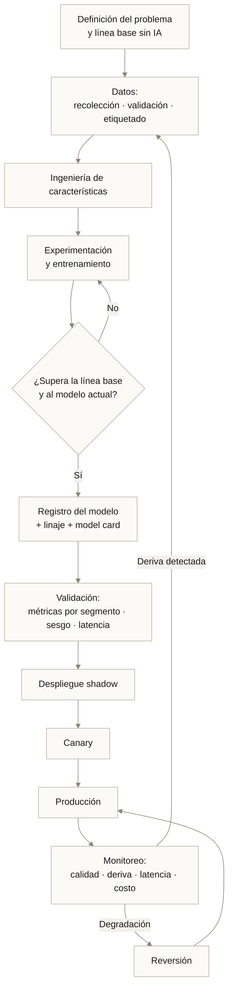
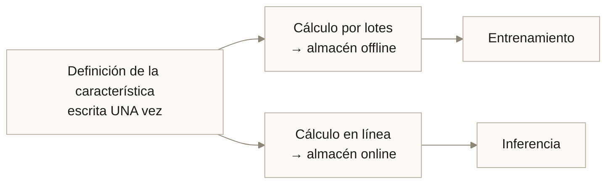
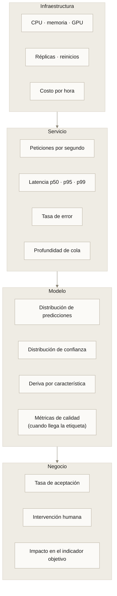

---
tags:
  - Bloque IV
  - Plataforma
  - MLOps
---

# Módulo 10 · DevOps, GitOps, MLOps y AIOps

<div class="modulo-meta" markdown>
<span>:material-clock-outline: 3 horas</span>
<span>:material-stairs: Nivel intermedio-avanzado</span>
<span>:material-link-variant: Requiere módulos 07 y 09</span>
</div>

Un modelo con 99 % de exactitud lleva ocho meses en producción sin reentrenarse. ¿Sigue teniendo 99 %?

Casi seguro que no, y lo preocupante es que probablemente nadie lo sabe. El modelo no falla ruidosamente: sigue devolviendo predicciones con la misma confianza aparente. Solo que el mundo cambió y el modelo no.

Este módulo trata del ciclo de vida completo: cómo se construye, se despliega, se vigila y se renueva el software —y el software que aprende.

---

## 1. DevOps: qué resuelve realmente

Antes de DevOps, el desarrollo y la operación eran dos organizaciones con incentivos opuestos:

| Área | Incentivo | Consecuencia |
| --- | --- | --- |
| Desarrollo | Entregar cambios rápido | Presiona por desplegar |
| Operación | Mantener el sistema estable | Resiste los cambios |

El resultado era el "muro de confusión": desarrollo lanzaba código por encima del muro y operación se las arreglaba. Cuando algo fallaba, cada lado culpaba al otro.

**DevOps no es un puesto ni un conjunto de herramientas.** Es la eliminación de ese muro mediante responsabilidad compartida sobre el resultado.

### CALMS

| Letra | Principio | Qué significa en la práctica |
| --- | --- | --- |
| **C**ulture | Cultura | Responsabilidad compartida; postmortems sin culpables |
| **A**utomation | Automatización | Si se hace dos veces, se automatiza |
| **L**ean | Eficiencia | Lotes pequeños, flujo continuo, eliminar esperas |
| **M**easurement | Medición | Decidir con datos, no con opiniones |
| **S**haring | Compartir | El conocimiento no se acumula en personas |

### Las métricas DORA

Cuatro métricas que, según la investigación de DevOps Research and Assessment, predicen el rendimiento de una organización de ingeniería:

| Métrica | Qué mide | Élite | Bajo |
| --- | --- | --- | --- |
| **Frecuencia de despliegue** | Cada cuánto llega código a producción | Bajo demanda, varias veces al día | Menos de una vez al mes |
| **Tiempo de entrega** | De commit a producción | Menos de 1 hora | Más de 1 mes |
| **Tasa de fallo de cambios** | Porcentaje de despliegues que causan incidente | 0–15 % | 46–60 % |
| **Tiempo de restauración** | De incidente a servicio restablecido | Menos de 1 hora | Más de 1 semana |

!!! tip "El hallazgo contraintuitivo de DORA"
    Velocidad y estabilidad **no** están en conflicto. Las organizaciones élite despliegan más a menudo **y** fallan menos.

    La razón: lotes pequeños. Un despliegue de tres líneas es fácil de revisar, fácil de diagnosticar y fácil de revertir. Un despliegue trimestral con 400 cambios es imposible de diagnosticar cuando falla.

---

## 2. El ciclo de vida y CI/CD

```mermaid
%%{init:{"theme":"base","themeVariables":{"fontFamily":"Inter, sans-serif","darkMode":false,"background":"#f3f1ec","mainBkg":"#fbfaf7","primaryColor":"#fbfaf7","primaryTextColor":"#1c1b19","primaryBorderColor":"#b9b1a1","secondaryColor":"#ead9ba","secondaryTextColor":"#1c1b19","secondaryBorderColor":"#b9b1a1","tertiaryColor":"#c2d4cb","tertiaryTextColor":"#1c1b19","tertiaryBorderColor":"#b9b1a1","lineColor":"#8d8676","textColor":"#1c1b19","nodeTextColor":"#1c1b19","nodeBorder":"#b9b1a1","labelTextColor":"#1c1b19","titleColor":"#1c1b19","edgeLabelBackground":"#f3f1ec","clusterBkg":"#efece4","clusterBorder":"#d8d2c6","cScale0":"#e2a98c","cScaleLabel0":"#1c1b19","cScale1":"#bdb6e6","cScaleLabel1":"#1c1b19","cScale2":"#e8d9b6","cScaleLabel2":"#1c1b19","cScale3":"#b5d0c3","cScaleLabel3":"#1c1b19","cScale4":"#e6cfc0","cScaleLabel4":"#1c1b19","cScale5":"#cddcea","cScaleLabel5":"#1c1b19"}}}%%
flowchart LR
    P["Planear"] --> C["Codificar"] --> B["Construir"] --> T["Probar"]
    T --> R["Publicar"] --> D["Desplegar"] --> O["Operar"] --> M["Monitorear"]
    M --> P
    classDef default fill:#fbfaf7,stroke:#b9b1a1,stroke-width:1px,color:#1c1b19;
```



### Integración continua

Integrar los cambios de todos en la rama principal **con frecuencia** —idealmente varias veces al día— con verificación automática en cada integración.

```yaml
# .github/workflows/ci.yml
name: CI
on:
  pull_request:
  push:
    branches: [main]

jobs:
  verificar:
    runs-on: ubuntu-latest
    steps:
      - uses: actions/checkout@v4
      - uses: actions/setup-python@v5
        with: {python-version: "3.12", cache: pip}

      - run: pip install -r requirements-dev.txt

      - name: Formato y estilo
        run: ruff check . && ruff format --check .

      - name: Tipos
        run: mypy src/

      - name: Pruebas unitarias
        run: pytest tests/unit --cov=src --cov-fail-under=80

      - name: Escaneo de secretos
        run: detect-secrets-hook --baseline .secrets.baseline

      - name: Vulnerabilidades en dependencias
        run: pip-audit

  construir:
    needs: verificar
    runs-on: ubuntu-latest
    permissions: {contents: read, packages: write, id-token: write}
    steps:
      - uses: actions/checkout@v4
      - uses: docker/setup-buildx-action@v3
      - uses: docker/build-push-action@v6
        with:
          push: ${{ github.ref == 'refs/heads/main' }}
          tags: ghcr.io/${{ github.repository }}:${{ github.sha }}
          cache-from: type=gha
          cache-to: type=gha,mode=max

      - name: Escanear la imagen
        uses: aquasecurity/trivy-action@master
        with:
          image-ref: ghcr.io/${{ github.repository }}:${{ github.sha }}
          severity: CRITICAL,HIGH
          exit-code: "1"
```

!!! warning "Etiqueta con el hash del commit, no con `latest`"
    `latest` es mutable: no se puede saber qué contiene ni reproducir un despliegue pasado. Etiquetar con el SHA del commit hace que **cada imagen sea rastreable hasta su código exacto**. Es el eslabón que conecta el repositorio con lo que corre en producción.

### Entrega continua frente a despliegue continuo

| Concepto | Significado |
| --- | --- |
| **Entrega continua** | Todo cambio que pasa CI **puede** desplegarse; el botón lo aprieta un humano |
| **Despliegue continuo** | Todo cambio que pasa CI **se despliega** automáticamente |

La diferencia no es técnica sino de confianza en la suite de pruebas. Casi ninguna organización debería empezar por despliegue continuo.

---

## 3. GitOps

GitOps aplica a la infraestructura el modelo de reconciliación del [módulo 09](09-kubernetes.md), con Git como fuente de verdad.

### Los cuatro principios

1. **Declarativo.** El sistema completo se describe de forma declarativa.
2. **Versionado e inmutable.** La declaración vive en Git; Git es la fuente de verdad.
3. **Aplicado automáticamente.** Los cambios aprobados se aplican solos.
4. **Reconciliado continuamente.** Un agente corrige cualquier desviación del estado declarado.

```mermaid
%%{init:{"theme":"base","themeVariables":{"fontFamily":"Inter, sans-serif","darkMode":false,"background":"#f3f1ec","mainBkg":"#fbfaf7","primaryColor":"#fbfaf7","primaryTextColor":"#1c1b19","primaryBorderColor":"#b9b1a1","secondaryColor":"#ead9ba","secondaryTextColor":"#1c1b19","secondaryBorderColor":"#b9b1a1","tertiaryColor":"#c2d4cb","tertiaryTextColor":"#1c1b19","tertiaryBorderColor":"#b9b1a1","lineColor":"#8d8676","textColor":"#1c1b19","nodeTextColor":"#1c1b19","nodeBorder":"#b9b1a1","labelTextColor":"#1c1b19","titleColor":"#1c1b19","edgeLabelBackground":"#f3f1ec","clusterBkg":"#efece4","clusterBorder":"#d8d2c6","cScale0":"#e2a98c","cScaleLabel0":"#1c1b19","cScale1":"#bdb6e6","cScaleLabel1":"#1c1b19","cScale2":"#e8d9b6","cScaleLabel2":"#1c1b19","cScale3":"#b5d0c3","cScaleLabel3":"#1c1b19","cScale4":"#e6cfc0","cScaleLabel4":"#1c1b19","cScale5":"#cddcea","cScaleLabel5":"#1c1b19"}}}%%
flowchart LR
    DEV["Desarrollador"] -->|pull request| GIT[("Repositorio<br/>de manifiestos")]
    GIT -->|revisión + CI| MERGE["Merge a main"]
    MERGE --> AGENT["Agente GitOps<br/>Argo CD · Flux"]
    AGENT -->|compara| CLUSTER["Clúster"]
    CLUSTER -->|estado real| AGENT
    AGENT -->|aplica diferencias| CLUSTER
    classDef default fill:#fbfaf7,stroke:#b9b1a1,stroke-width:1px,color:#1c1b19;
```



### Por qué es mejor que un pipeline que ejecuta `kubectl apply`

| Aspecto | CI que despliega (*push*) | GitOps (*pull*) |
| --- | --- | --- |
| Credenciales del clúster | En el sistema de CI | Solo dentro del clúster |
| Desviación manual | No se detecta | Se detecta y se corrige |
| Reversión | Ejecutar el pipeline anterior | `git revert` |
| Auditoría | Registros del CI | El historial de Git |
| Estado real conocido | Solo el último despliegue | Continuamente verificado |

!!! tip "La propiedad más valiosa: la corrección de desviaciones"
    Si alguien hace `kubectl edit` en producción a las 3 de la mañana para apagar un incendio, GitOps lo revierte automáticamente —o lo marca como desviación y alerta.

    Eso convierte una práctica habitual y peligrosa (cambios manuales que nadie documenta) en algo visible e imposible de olvidar.

### Repositorio de aplicación y repositorio de manifiestos

La estructura habitual separa ambos:

```text
repo-aplicacion/            repo-manifiestos/
├── src/                    ├── base/
├── tests/                  │   ├── deployment.yaml
├── Dockerfile              │   └── service.yaml
└── .github/workflows/      └── overlays/
    └── ci.yml                  ├── desarrollo/
                                ├── staging/
                                └── produccion/
                                    └── kustomization.yaml
```

La CI del repositorio de aplicación construye la imagen y abre un pull request en el de manifiestos actualizando la etiqueta. **La promoción entre entornos es un merge**, revisable y reversible.

---

## 4. MLOps

MLOps es DevOps aplicado a sistemas de machine learning. Comparte los principios, pero enfrenta problemas que el software tradicional no tiene.

### Los cinco retos propios de ML

| Reto | Por qué no existe en software tradicional |
| --- | --- |
| **El código no basta** | El comportamiento depende de código **y** datos **y** hiperparámetros |
| **Las pruebas son estadísticas** | No hay "correcto" binario, hay métricas con intervalos de confianza |
| **Degradación silenciosa** | El modelo sigue respondiendo mientras su calidad cae |
| **Sesgo entrenamiento-servicio** | Las características se calculan distinto en entrenamiento y en inferencia |
| **Reproducibilidad** | Reproducir un entrenamiento exige fijar datos, semillas, versiones y hardware |

### El ciclo de vida



### Los tres artefactos que hay que versionar juntos

| Artefacto | Herramienta | Qué identifica |
| --- | --- | --- |
| **Código** | Git | Hash del commit |
| **Datos** | DVC, LakeFS, formato de tabla con viaje en el tiempo | Hash del conjunto o versión de la tabla |
| **Modelo** | Registro de modelos | Versión, métricas, estado de aprobación |

Un modelo en producción debe poder responder, a partir de su versión: qué commit lo produjo, con qué datos exactos, con qué hiperparámetros y qué métricas obtuvo.

### Feature store

El **sesgo entrenamiento-servicio** ocurre cuando una característica se calcula de una forma en el entrenamiento y de otra en la inferencia. Es una de las causas más comunes —y más difíciles de diagnosticar— de que un modelo excelente en validación rinda mal en producción.



La propiedad esencial: **la lógica se escribe una sola vez** y se materializa en ambos almacenes. El almacén offline sirve conjuntos históricos correctos en el tiempo; el online sirve valores actuales con latencia de milisegundos.

### Tipos de deriva

| Tipo | Qué cambió | Cómo se detecta |
| --- | --- | --- |
| **Deriva de datos** | La distribución de las entradas | Tests estadísticos por característica (KS, PSI) |
| **Deriva conceptual** | La relación entre entrada y salida | Caída de métricas cuando llega la etiqueta real |
| **Deriva de predicción** | La distribución de las salidas | Comparar distribución de predicciones contra la de referencia |
| **Deriva de esquema** | Tipos, campos o dominios del origen | Validación del contrato de datos ([módulo 05](05-big-data.md)) |

!!! warning "Antes de diagnosticar deriva, revisa el contrato de datos"
    Una proporción notable de "deriva de modelo" es en realidad un cambio en el sistema origen: un campo que pasó a enviarse en otra unidad, un valor nulo que antes no existía, una categoría nueva sin codificación.

    Es más barato de verificar y más fácil de arreglar. Compruébalo primero.

### Niveles de madurez

| Nivel | Descripción | Señal reconocible |
| --- | --- | --- |
| **0 · Manual** | Notebooks; despliegue artesanal | "¿Quién tiene la última versión del notebook?" |
| **1 · Pipeline automatizado** | El entrenamiento es un pipeline reproducible | `dvc repro` o equivalente ejecuta todo |
| **2 · CI/CD de ML** | Pruebas, registro y despliegue automáticos | Un merge produce un modelo candidato validado |
| **3 · Reentrenamiento continuo** | El monitoreo dispara reentrenamiento y promoción | El sistema se renueva sin intervención |

La mayoría de las organizaciones están entre 0 y 1. **Pasar de 0 a 1 es donde está el mayor retorno**; los niveles superiores tienen rendimientos decrecientes salvo a gran escala.

---

## 5. Herramientas del ecosistema

| Categoría | Opciones |
| --- | --- |
| Control de versiones | Git, GitHub, GitLab |
| CI/CD | GitHub Actions, GitLab CI, Jenkins, Tekton |
| GitOps | Argo CD, Flux |
| Infraestructura como código | Terraform, OpenTofu, Pulumi, Crossplane |
| Contenedores y orquestación | Docker, Kubernetes, Helm, Kustomize |
| Versionado de datos | DVC, LakeFS, Delta Lake, Iceberg |
| Seguimiento de experimentos | MLflow, Weights & Biases, Neptune |
| Orquestación de pipelines | Airflow, Dagster, Prefect, Kubeflow Pipelines |
| Feature store | Feast, Tecton |
| Servicio de modelos | KServe, BentoML, Triton, vLLM |
| Monitoreo de modelos | Evidently, WhyLabs, Arize |
| Observabilidad | Prometheus, Grafana, OpenTelemetry, Loki, Tempo |

!!! danger "Agua fría: la mayoría de los equipos tiene demasiadas herramientas"
    Cada herramienta de esta tabla tiene curva de aprendizaje, mantenimiento, actualizaciones y modos de fallo propios. Un equipo de cinco personas con doce herramientas dedica más tiempo a la plataforma que al problema.

    **Empieza con cuatro:** Git, un CI, un registro de experimentos y un registro de modelos. Añade la quinta cuando el dolor de no tenerla sea concreto y medible.

---

## 6. Observabilidad

### Los tres pilares, y el cuarto

| Pilar | Responde | Herramienta típica |
| --- | --- | --- |
| **Métricas** | ¿Qué está pasando? | Prometheus |
| **Registros** | ¿Qué pasó exactamente? | Loki, Elasticsearch |
| **Trazas** | ¿Dónde se fue el tiempo? | Tempo, Jaeger |
| **Perfiles** | ¿Qué consume los recursos? | Pyroscope |

### Qué monitorear en un servicio de inferencia



!!! tip "La capa que casi nadie instrumenta es la de negocio"
    Un panel con latencia y uso de GPU en verde mientras la tasa de conversión cae es un panel que miente por omisión.

    Conecta al menos una métrica de negocio a cada modelo en producción. Es la única forma de detectar que el modelo optimiza un número que se separó de lo que le importa al negocio —el fenómeno que el [módulo 14](14-graph-engineering.md) llama ley de Goodhart.

### SLI, SLO y presupuesto de error

| Concepto | Definición | Ejemplo |
| --- | --- | --- |
| **SLI** | Indicador medido | Porcentaje de peticiones con latencia < 200 ms |
| **SLO** | Objetivo sobre el SLI | 99.5 % en 30 días |
| **Presupuesto de error** | 100 % − SLO | 0.5 % = 3.6 horas al mes |

El presupuesto de error convierte la fiabilidad en una decisión de negocio: mientras quede presupuesto, se puede desplegar rápido. Cuando se agota, se congelan las funcionalidades nuevas y se trabaja en estabilidad.

Es la herramienta que resuelve, con un número, la tensión histórica entre desarrollo y operación.

---

## 7. AIOps

AIOps es el uso de IA para operar sistemas: detección de anomalías, correlación de alertas, análisis de causa raíz y remediación automática.

| Caso de uso | Qué aporta |
| --- | --- |
| **Detección de anomalías** | Detecta desviaciones sin umbrales fijos que hay que mantener |
| **Correlación de alertas** | Agrupa 400 alertas de un mismo incidente en uno solo |
| **Análisis de causa raíz** | Correlaciona el inicio del incidente con el despliegue que lo causó |
| **Predicción de capacidad** | Anticipa saturación antes de que ocurra |
| **Remediación automática** | Ejecuta acciones correctivas conocidas |

!!! warning "La fatiga de alertas es el problema que AIOps debe resolver primero"
    Un equipo que recibe 200 alertas diarias deja de leerlas. En ese estado, la alerta que sí importaba se pierde entre el ruido.

    Antes de añadir IA a la operación, reduce el ruido: elimina alertas sin acción asociada, agrupa las correlacionadas y alerta sobre síntomas que el usuario percibe, no sobre causas internas.

### AIOps con agentes

La evolución reciente son agentes que diagnostican y proponen correcciones: leen registros, consultan métricas, correlacionan con despliegues recientes y abren un pull request con el arreglo.

Aquí aplica íntegro el principio del [módulo 04](04-arquitectura-seguridad.md): **un agente con acceso a producción es un operador con permisos**. Debe tener permisos mínimos, acciones irreversibles bajo confirmación humana y todo registrado. El diseño de ese entorno es el [módulo 13](13-harness-engineering.md).

---

## 8. Comparación de las cuatro disciplinas

| Dimensión | DevOps | GitOps | MLOps | AIOps |
| --- | --- | --- | --- | --- |
| Qué gestiona | Ciclo de vida del software | Estado de la infraestructura | Ciclo de vida de modelos | Operación de sistemas |
| Artefacto central | Código y binarios | Manifiestos declarativos | Código + datos + modelo | Telemetría |
| Fuente de verdad | Repositorio | Repositorio | Repositorio + registro de modelos | Métricas y registros |
| Se dispara por | Commit | Merge | Commit o deriva detectada | Anomalía |
| Métrica clave | DORA | Tiempo de reconciliación, desviaciones | Calidad del modelo, deriva | Tiempo de detección y de resolución |
| Relación | Base de todo | DevOps aplicado a infraestructura | DevOps aplicado a ML | IA aplicada a la operación |

No compiten: se apilan. GitOps y MLOps son especializaciones de DevOps; AIOps es una capacidad que se añade a la operación.

---

## Caso práctico · De notebooks a nivel 2 en seis meses

Un equipo de seis personas mantiene tres modelos de predicción de demanda para una cadena de retail.

### Situación inicial (nivel 0)

- Los modelos se entrenan ejecutando notebooks a mano cada dos meses.
- El despliegue consiste en copiar un archivo `.pkl` a un servidor.
- Nadie sabe con qué datos se entrenó el modelo en producción.
- La degradación se detectó porque el área de compras notó que los pedidos no cuadraban, dos meses tarde.

### Plan por etapas

=== "Mes 1–2 · Reproducibilidad"

    | Acción | Resultado |
    | --- | --- |
    | Notebooks convertidos a módulos y versionados | Diffs revisables |
    | DVC sobre los conjuntos de entrenamiento | Cada commit identifica sus datos |
    | Semillas fijadas y versiones bloqueadas | Dos ejecuciones dan el mismo resultado |
    | MLflow para registrar experimentos | Historial comparable de intentos |

    **Criterio de éxito:** dos personas distintas reproducen el mismo modelo con el mismo commit.

=== "Mes 3–4 · Automatización"

    | Acción | Resultado |
    | --- | --- |
    | Pipeline de entrenamiento como DAG | `dvc repro` ejecuta todo de extremo a extremo |
    | CI que entrena con una muestra en cada PR | Errores detectados antes del merge |
    | Imagen de inferencia construida en CI | Despliegue reproducible |
    | Registro de modelos con estados | Ningún modelo llega a producción sin aprobación |

    **Criterio de éxito:** un merge produce un modelo candidato registrado y validado, sin intervención.

=== "Mes 5–6 · Monitoreo y despliegue seguro"

    | Acción | Resultado |
    | --- | --- |
    | Despliegue shadow del candidato | Se compara con el actual usando tráfico real |
    | Canary al 10 % con promoción automática | Riesgo acotado |
    | Monitoreo de deriva por característica | Alerta antes de que el negocio lo note |
    | Métrica de negocio conectada | Se detecta si el modelo se separa del objetivo |

    **Criterio de éxito:** una degradación se detecta en menos de 48 horas, no en dos meses.

### Resultados

| Métrica | Antes | Después |
| --- | --- | --- |
| Tiempo de un modelo nuevo a producción | 5–7 semanas | 3 días |
| Reproducibilidad de un entrenamiento | No verificable | 100 % |
| Detección de degradación | 8 semanas | 36 horas |
| Reversión de un modelo malo | No existía | 4 minutos |
| Experimentos registrados | Ninguno | 340 en seis meses |

### La lección más valiosa

El equipo intentó saltar directamente al reentrenamiento automático (nivel 3) en el mes 2 y falló. Sin reproducibilidad ni monitoreo, el reentrenamiento automático solo producía **modelos malos más rápido**.

**El orden importa:** reproducir → automatizar → medir → automatizar la decisión. Saltarse un escalón no acelera; retrasa.

---

## Laboratorio · Pipeline de ML de extremo a extremo

**Objetivo:** construir un flujo que, desde un commit, entrene, valide, registre y despliegue un modelo, con puertas de calidad reales.

**Paso 1 — Estructura del repositorio.**

```text
proyecto-ml/
├── src/
│   ├── datos.py           # carga y validación
│   ├── caracteristicas.py # transformaciones — UNA definición
│   ├── entrenar.py
│   └── servir.py
├── tests/
│   ├── test_caracteristicas.py
│   └── test_modelo.py     # pruebas de comportamiento
├── dvc.yaml               # el pipeline
├── params.yaml            # hiperparámetros versionados
├── Dockerfile
└── .github/workflows/ml.yml
```

**Paso 2 — Pipeline reproducible.**

```yaml
# dvc.yaml
stages:
  preparar:
    cmd: python -m src.datos --entrada data/raw --salida data/procesado
    deps: [src/datos.py, data/raw]
    outs: [data/procesado]

  caracteristicas:
    cmd: python -m src.caracteristicas --entrada data/procesado --salida data/features
    deps: [src/caracteristicas.py, data/procesado]
    outs: [data/features]

  entrenar:
    cmd: python -m src.entrenar --features data/features --salida modelos/
    deps: [src/entrenar.py, data/features]
    params: [entrenamiento.tasa_aprendizaje, entrenamiento.profundidad, entrenamiento.semilla]
    outs: [modelos/modelo.pkl]
    metrics: [metricas/entrenamiento.json]

  evaluar:
    cmd: python -m src.evaluar --modelo modelos/modelo.pkl --salida metricas/
    deps: [src/evaluar.py, modelos/modelo.pkl]
    metrics: [metricas/evaluacion.json]
    plots: [metricas/curva_roc.json]
```

```bash
dvc repro                        # ejecuta solo lo que cambió
dvc metrics diff                 # compara métricas con el commit anterior
dvc plots diff                   # compara curvas
```

**Paso 3 — Pruebas de comportamiento, no solo de exactitud.**

```python
# tests/test_modelo.py
import pytest

UMBRAL_EXACTITUD = 0.82

def test_supera_linea_base(modelo, datos_prueba):
    """El modelo debe superar la regla simple, no solo tener buen número."""
    exactitud_modelo = evaluar(modelo, datos_prueba)
    exactitud_base = evaluar(regla_simple, datos_prueba)
    assert exactitud_modelo > exactitud_base + 0.05, \
        "El modelo no aporta sobre la línea base"

def test_exactitud_por_segmento(modelo, datos_prueba):
    """Un buen promedio puede esconder un segmento muy mal atendido."""
    for segmento in ["norte", "centro", "sur"]:
        subset = datos_prueba[datos_prueba.region == segmento]
        acc = evaluar(modelo, subset)
        assert acc > UMBRAL_EXACTITUD - 0.08, \
            f"Segmento '{segmento}' por debajo del umbral: {acc:.3f}"

def test_invariancia(modelo):
    """Cambiar un campo irrelevante no debe cambiar la predicción."""
    base = ejemplo_valido()
    variante = {**base, "id_cliente": "OTRO-ID"}
    assert modelo.predict(base) == modelo.predict(variante)

def test_latencia(modelo, benchmark):
    resultado = benchmark(modelo.predict, ejemplo_valido())
    assert benchmark.stats["mean"] < 0.05, "Latencia media superior a 50 ms"
```

**Paso 4 — CI con puertas.**

```yaml
# .github/workflows/ml.yml (fragmento)
      - name: Reproducir pipeline
        run: dvc repro

      - name: Puertas de calidad
        run: pytest tests/ -v

      - name: Comparar contra main
        run: |
          dvc metrics diff main --show-md >> $GITHUB_STEP_SUMMARY
          python scripts/verificar_no_regresion.py --minimo-f1 0.82

      - name: Registrar modelo candidato
        if: github.ref == 'refs/heads/main'
        run: python scripts/registrar.py --commit ${{ github.sha }} --estado candidato
```

**Paso 5 — Despliegue progresivo.** Define en manifiestos un despliegue shadow del candidato durante 24 h, con promoción a canary si:

- La concordancia con el modelo actual supera el 92 %.
- La latencia p95 no empeora más de un 10 %.
- No hay errores no controlados.

**Paso 6 — Monitoreo.** Instrumenta y expón como métricas: distribución de predicciones, distribución de confianza, PSI por característica frente a la referencia, latencia por percentil y una métrica de negocio.

**Paso 7 — Provoca deriva.** Modifica artificialmente la distribución de una característica en los datos de entrada y verifica que tu detector lo señala.

**Entregable:** el repositorio completo funcionando, la salida de `dvc metrics diff`, las pruebas en verde y una captura del panel mostrando la deriva detectada.

---

## Conceptos clave

- **DevOps:** eliminación del muro entre desarrollo y operación mediante responsabilidad compartida.
- **CALMS:** cultura, automatización, eficiencia, medición y compartir.
- **Métricas DORA:** frecuencia de despliegue, tiempo de entrega, tasa de fallo de cambios y tiempo de restauración.
- **CI / CD:** integración continua; entrega continua (puede desplegarse) frente a despliegue continuo (se despliega).
- **GitOps:** infraestructura declarada en Git y reconciliada continuamente por un agente dentro del clúster.
- **Corrección de desviaciones (*drift correction*):** revertir automáticamente cambios manuales no declarados.
- **MLOps:** DevOps para sistemas que aprenden; versiona código, datos y modelo juntos.
- **Sesgo entrenamiento-servicio:** discrepancia entre cómo se calcula una característica al entrenar y al inferir.
- **Feature store:** definición única de características materializada en un almacén offline y otro online.
- **Deriva de datos / conceptual / de predicción / de esquema:** los cuatro tipos de degradación de un modelo.
- **Registro de modelos:** catálogo versionado de modelos con linaje, métricas y estado de aprobación.
- **Despliegue shadow / canary:** copia del tráfico con salida descartada frente a fracción real del tráfico.
- **SLI / SLO / presupuesto de error:** indicador, objetivo y margen de fallo permitido.
- **AIOps:** uso de IA para detectar, correlacionar, diagnosticar y remediar en la operación.

---

## Puntos clave

- Velocidad y estabilidad no se oponen: las organizaciones élite despliegan más a menudo y fallan menos. La causa es el tamaño del lote.
- Etiquetar imágenes con el hash del commit es lo que conecta el repositorio con lo que corre en producción. `latest` rompe esa cadena.
- GitOps mueve las credenciales del clúster fuera del CI y hace visible cualquier cambio manual. La reversión pasa a ser `git revert`.
- En ML hay que versionar tres cosas juntas: código, datos y modelo. Versionar solo el código no permite reproducir nada.
- El sesgo entrenamiento-servicio es una de las causas más frecuentes de que un modelo bueno en validación rinda mal en producción.
- Antes de diagnosticar deriva conceptual, verifica el contrato de datos. Muchas veces es un cambio de esquema en el origen.
- Pasar del nivel 0 al 1 de madurez es donde está el mayor retorno. El reentrenamiento automático sin reproducibilidad solo produce modelos malos más rápido.
- Un panel sin métricas de negocio miente por omisión: el modelo puede estar optimizando un número que se separó del objetivo real.
- El presupuesto de error convierte la fiabilidad en una decisión de negocio con un número, y resuelve la tensión entre velocidad y estabilidad.
- Antes de añadir IA a la operación, elimina el ruido de alertas. AIOps sobre 200 alertas diarias sin acción asociada no ayuda.
- Menos herramientas y mejor entendidas superan a un catálogo completo mal mantenido.

---

## Ejercicios

1. **Mide tus DORA.** Calcula las cuatro métricas para un proyecto real de los últimos tres meses. Clasifícalo según la tabla. ¿Cuál es el cuello de botella?

2. **Diseña la puerta de calidad.** Define los criterios exactos —con números— que un modelo debe cumplir para pasar de candidato a producción en tu contexto.

3. **Reproduce un entrenamiento.** Toma un modelo existente e intenta reproducir su entrenamiento exactamente. Documenta qué te faltó: ¿datos? ¿semilla? ¿versiones? ¿hardware?

4. **Busca el sesgo entrenamiento-servicio.** Compara cómo se calcula una característica en el código de entrenamiento y en el de inferencia. ¿Son la misma implementación o dos?

5. **Define SLO y presupuesto de error.** Para un servicio real, define un SLI, un SLO justificado desde el negocio y calcula el presupuesto mensual. ¿Cuánto llevas gastado este mes?

6. **Audita tus alertas.** Lista las alertas activas de un sistema. Para cada una: ¿hay una acción concreta asociada? Elimina las que no la tengan y cuenta la reducción.

7. **Plan de madurez.** Sitúa a tu equipo en un nivel de madurez de MLOps y escribe el plan concreto para subir un escalón en tres meses.

---

## Lectura adicional

- [Accelerate · Forsgren, Humble y Kim](https://itrevolution.com/product/accelerate/) — la investigación detrás de las métricas DORA.
- [DORA · State of DevOps Report](https://dora.dev/) — el informe anual con los datos actualizados.
- [Google · MLOps: Continuous delivery and automation pipelines in ML](https://cloud.google.com/architecture/mlops-continuous-delivery-and-automation-pipelines-in-machine-learning) — el documento que define los niveles de madurez.
- [Hidden Technical Debt in Machine Learning Systems · Sculley et al.](https://papers.nips.cc/paper/2015/hash/86df7dcfd896fcaf2674f757a2463eba-Abstract.html) — el artículo fundacional sobre la deuda técnica específica de ML.
- [OpenGitOps · Principios](https://opengitops.dev/) — la definición neutral de GitOps.
- [Google SRE Book](https://sre.google/books/) — SLO, presupuestos de error y gestión de incidentes.
- [Evidently AI · Guía de monitoreo de ML](https://www.evidentlyai.com/ml-in-production) — detección de deriva en la práctica.
- [Módulo 13 · Ingeniería de Harness](13-harness-engineering.md) — cuando el que opera el pipeline es un agente.
