---
tags:
  - Bloque V
  - Visión
---

# Módulo 11 · Visión por computadora: fundamentos

<div class="modulo-meta" markdown>
<span>:material-clock-outline: 3 horas</span>
<span>:material-stairs: Nivel intermedio</span>
<span>:material-link-variant: Requiere módulo 05</span>
</div>

Para una computadora no existen los gatos, las radiografías ni las señales de tránsito. Existe una matriz de números entre 0 y 255.

Toda la visión por computadora consiste en construir funciones que transformen esa matriz en algo con significado. Este módulo trata de cómo funcionan esas funciones.

---

## 1. Cómo "ve" una computadora

### La imagen como tensor

Una imagen en color de 224 × 224 píxeles es un tensor de forma $(224, 224, 3)$: alto, ancho y tres canales de color.

$$
I \in \mathbb{Z}^{H \times W \times C}, \quad I_{h,w,c} \in [0, 255]
$$

Eso son **150 528 números**. Cada uno es la intensidad de un canal en un punto.

| Concepto | Definición |
| --- | --- |
| **Píxel** | Unidad mínima; en RGB, una terna de valores |
| **Resolución** | Número de píxeles: $H \times W$ |
| **Profundidad de bits** | Valores posibles por canal; 8 bits = 256 niveles |
| **Canales** | 1 (escala de grises), 3 (RGB), 4 (RGBA), $N$ (multiespectral) |

### Espacios de color

| Espacio | Componentes | Cuándo usarlo |
| --- | --- | --- |
| **RGB** | Rojo, verde, azul | Por defecto; cómo se capturan y muestran las imágenes |
| **HSV** | Tono, saturación, valor | Segmentar por color con robustez ante cambios de iluminación |
| **Escala de grises** | Intensidad | Cuando el color no aporta; reduce el cómputo a un tercio |
| **YCbCr** | Luminancia y crominancia | Compresión (JPEG, video) |
| **LAB** | Luminancia y dos ejes de color | Distancias de color perceptualmente uniformes |

!!! tip "HSV para umbralizar color"
    Segmentar "lo rojo" en RGB es sorprendentemente difícil: un objeto rojo en sombra y en pleno sol tiene valores RGB muy distintos. En HSV, el tono (H) se mantiene aproximadamente constante y basta con acotar un rango.

!!! warning "El orden de canales de OpenCV es BGR"
    OpenCV lee las imágenes en **BGR**, no RGB. Si entrenas con imágenes cargadas por OpenCV y sirves con imágenes cargadas por PIL —o al revés— el modelo recibe los canales invertidos y la exactitud cae sin que nada parezca roto.

    Es un caso de sesgo entrenamiento-servicio ([módulo 10](10-devops-mlops.md)) específico de visión, y uno de los errores más frecuentes en despliegue.

---

## 2. Procesamiento digital de imágenes

### Operaciones puntuales

Transforman cada píxel independientemente: $I'(x,y) = f(I(x,y))$.

| Operación | Efecto |
| --- | --- |
| Brillo | $I' = I + b$ |
| Contraste | $I' = \alpha \cdot I$ |
| Corrección gamma | $I' = 255 \cdot (I/255)^{\gamma}$ |
| Umbralización | $I' = 255$ si $I > T$, si no $0$ |
| Ecualización de histograma | Redistribuye intensidades para usar todo el rango |
| Normalización | $I' = (I - \mu) / \sigma$ — indispensable antes de una red |

### Filtros espaciales (convoluciones)

Un filtro combina cada píxel con sus vecinos mediante un núcleo (*kernel*).

| Núcleo | Efecto | Ejemplo |
| --- | --- | --- |
| Promedio | Suaviza, reduce ruido | $\frac{1}{9}\begin{bmatrix}1&1&1\\1&1&1\\1&1&1\end{bmatrix}$ |
| Gaussiano | Suaviza preservando mejor la estructura | Pesos según campana de Gauss |
| Sobel horizontal | Detecta bordes verticales | $\begin{bmatrix}-1&0&1\\-2&0&2\\-1&0&1\end{bmatrix}$ |
| Laplaciano | Detecta bordes en toda dirección | $\begin{bmatrix}0&1&0\\1&-4&1\\0&1&0\end{bmatrix}$ |
| Realce | Aumenta nitidez | $\begin{bmatrix}0&-1&0\\-1&5&-1\\0&-1&0\end{bmatrix}$ |
| Mediana | Elimina ruido sal y pimienta | No lineal: toma la mediana de la vecindad |

### Operaciones morfológicas

Sobre imágenes binarias, modifican la forma de las regiones:

| Operación | Efecto |
| --- | --- |
| **Erosión** | Reduce las regiones claras; elimina ruido pequeño |
| **Dilatación** | Expande las regiones claras; cierra huecos |
| **Apertura** | Erosión + dilatación; elimina objetos pequeños |
| **Cierre** | Dilatación + erosión; rellena huecos internos |

---

## 3. La convolución paso a paso

La convolución es la operación central de la visión moderna. Conviene entenderla numéricamente.

### El cálculo

Dado un fragmento de imagen y un núcleo de $3\times3$:

$$
\text{Entrada} = \begin{bmatrix} 10 & 20 & 30 \\ 40 & 50 & 60 \\ 70 & 80 & 90 \end{bmatrix}
\quad
K_{\text{Sobel-x}} = \begin{bmatrix} -1 & 0 & 1 \\ -2 & 0 & 2 \\ -1 & 0 & 1 \end{bmatrix}
$$

$$
\begin{aligned}
S &= (10)(-1) + (20)(0) + (30)(1) \\
  &+ (40)(-2) + (50)(0) + (60)(2) \\
  &+ (70)(-1) + (80)(0) + (90)(1) \\
  &= (-10 + 30) + (-80 + 120) + (-70 + 90) = 80
\end{aligned}
$$

El valor 80 indica un gradiente horizontal fuerte: hay un borde vertical.

### Los hiperparámetros

| Parámetro | Efecto |
| --- | --- |
| **Tamaño del núcleo** ($k$) | Área de vecindad considerada; 3×3 es el estándar |
| **Paso** (*stride*, $s$) | Cuánto se desplaza; $s=2$ reduce la dimensión a la mitad |
| **Relleno** (*padding*, $p$) | Añade borde para conservar dimensiones |
| **Dilatación** | Espacia el núcleo para ampliar el campo receptivo sin más parámetros |

Dimensión de salida:

$$
O = \left\lfloor \frac{I - k + 2p}{s} \right\rfloor + 1
$$

### Parámetros de una capa convolucional

Para una capa con $C_{in}$ canales de entrada, $C_{out}$ filtros y núcleo $k \times k$:

$$
\text{parámetros} = (k \times k \times C_{in} + 1) \times C_{out}
$$

**El dato que explica por qué funcionan las CNN:** una capa densa que conectara una imagen de 224×224×3 con 1 000 neuronas tendría más de 150 millones de parámetros. Una capa convolucional con 64 filtros de 3×3 tiene **1 792**.

La razón es el **compartir pesos**: el mismo filtro detector de bordes se aplica en toda la imagen. Un borde es un borde esté donde esté.

---

## 4. Detección de características clásica

Antes del aprendizaje profundo, las características se diseñaban a mano.

| Método | Qué detecta | Propiedad |
| --- | --- | --- |
| **Canny** | Bordes | Supresión no máxima e histéresis |
| **Harris** | Esquinas | Invariante a rotación |
| **SIFT** | Puntos clave con descriptor | Invariante a escala y rotación |
| **ORB** | Puntos clave rápidos | Libre de patentes, eficiente |
| **HOG** | Histogramas de gradientes | Base de los detectores de peatones clásicos |

!!! note "Los métodos clásicos siguen siendo útiles"
    No todo requiere una red neuronal. Para tareas geométricas bien definidas —alinear dos imágenes, detectar un código, medir una pieza con iluminación controlada— los métodos clásicos son más rápidos, deterministas, explicables y no requieren datos de entrenamiento.

    La pregunta correcta no es "¿qué red uso?" sino "¿necesito una red?".

---

## 5. Redes neuronales convolucionales

### Por qué funcionan

Tres propiedades:

1. **Conectividad local.** Cada neurona mira una vecindad pequeña. Los píxeles cercanos están correlacionados; los lejanos, mucho menos.
2. **Pesos compartidos.** El mismo filtro recorre toda la imagen: menos parámetros y equivarianza a la traslación.
3. **Jerarquía de representaciones.** Las capas iniciales detectan bordes; las medias, texturas y partes; las profundas, objetos completos.

```mermaid
%%{init:{"theme":"base","themeVariables":{"fontFamily":"Inter, sans-serif","darkMode":false,"background":"#f3f1ec","mainBkg":"#fbfaf7","primaryColor":"#fbfaf7","primaryTextColor":"#1c1b19","primaryBorderColor":"#b9b1a1","secondaryColor":"#ead9ba","secondaryTextColor":"#1c1b19","secondaryBorderColor":"#b9b1a1","tertiaryColor":"#c2d4cb","tertiaryTextColor":"#1c1b19","tertiaryBorderColor":"#b9b1a1","lineColor":"#8d8676","textColor":"#1c1b19","nodeTextColor":"#1c1b19","nodeBorder":"#b9b1a1","labelTextColor":"#1c1b19","titleColor":"#1c1b19","edgeLabelBackground":"#f3f1ec","clusterBkg":"#efece4","clusterBorder":"#d8d2c6","cScale0":"#e2a98c","cScaleLabel0":"#1c1b19","cScale1":"#bdb6e6","cScaleLabel1":"#1c1b19","cScale2":"#e8d9b6","cScaleLabel2":"#1c1b19","cScale3":"#b5d0c3","cScaleLabel3":"#1c1b19","cScale4":"#e6cfc0","cScaleLabel4":"#1c1b19","cScale5":"#cddcea","cScaleLabel5":"#1c1b19"}}}%%
flowchart LR
    I["Imagen<br/>224×224×3"] --> C1["Conv + ReLU<br/>bordes"]
    C1 --> P1["Pooling<br/>112×112"]
    P1 --> C2["Conv + ReLU<br/>texturas"]
    C2 --> P2["Pooling<br/>56×56"]
    P2 --> C3["Conv + ReLU<br/>partes"]
    C3 --> P3["Pooling<br/>28×28"]
    P3 --> F["Aplanado /<br/>pooling global"]
    F --> D["Densa + ReLU"]
    D --> O["Softmax<br/>clases"]
    classDef default fill:#fbfaf7,stroke:#b9b1a1,stroke-width:1px,color:#1c1b19;
```



### Las capas

| Capa | Función | Parámetros entrenables |
| --- | --- | --- |
| **Convolucional** | Extrae características locales | Sí |
| **Activación (ReLU)** | Introduce no linealidad | No |
| **Pooling** | Reduce dimensión, aporta invariancia | No |
| **Normalización por lotes** | Estabiliza y acelera el entrenamiento | Sí (escala y sesgo) |
| **Dropout** | Regulariza desactivando neuronas al azar | No |
| **Densa** | Combina características para la decisión | Sí |
| **Softmax** | Convierte puntuaciones en probabilidades | No |

### Funciones de activación

| Función | Fórmula | Nota |
| --- | --- | --- |
| ReLU | $\max(0, x)$ | Estándar; rápida, puede "morir" |
| Leaky ReLU | $\max(0.01x, x)$ | Evita neuronas muertas |
| GELU | $x \cdot \Phi(x)$ | Habitual en transformers |
| Sigmoide | $1/(1+e^{-x})$ | Solo en salida binaria |
| Softmax | $e^{z_i}/\sum_j e^{z_j}$ | Salida multiclase |

### Arquitecturas históricas

| Arquitectura | Año | Aportación | Parámetros |
| --- | --- | --- | --- |
| **LeNet-5** | 1998 | Primera CNN práctica (dígitos postales) | 60 K |
| **AlexNet** | 2012 | ReLU, dropout, GPU; ganó ImageNet por 10 puntos | 60 M |
| **VGG-16** | 2014 | Profundidad con núcleos 3×3 uniformes | 138 M |
| **GoogLeNet** | 2014 | Módulos Inception; multi-escala | 6.8 M |
| **ResNet** | 2015 | Conexiones residuales; permitió 152 capas | 25 M (R50) |
| **MobileNet** | 2017 | Convoluciones separables; diseñada para móvil | 4.2 M |
| **EfficientNet** | 2019 | Escalado compuesto de ancho, profundidad y resolución | 5.3 M (B0) |
| **Vision Transformer** | 2020 | Atención sobre parches, sin convoluciones | 86 M (Base) |
| **ConvNeXt** | 2022 | CNN modernizada que iguala a los ViT | 28 M (Tiny) |

!!! tip "La conexión residual, en una línea"
    ResNet resolvió el problema de que redes más profundas rendían **peor** que redes menos profundas. La solución: $y = F(x) + x$.

    Si la capa no aporta nada, la red puede aprender $F(x) \approx 0$ y dejar pasar la entrada. Eso permite entrenar cientos de capas sin degradación. Es una de las ideas más influyentes del aprendizaje profundo y cabe en una fórmula.

---

## 6. Entrenamiento

### El bucle

```mermaid
%%{init:{"theme":"base","themeVariables":{"fontFamily":"Inter, sans-serif","darkMode":false,"background":"#f3f1ec","mainBkg":"#fbfaf7","primaryColor":"#fbfaf7","primaryTextColor":"#1c1b19","primaryBorderColor":"#b9b1a1","secondaryColor":"#ead9ba","secondaryTextColor":"#1c1b19","secondaryBorderColor":"#b9b1a1","tertiaryColor":"#c2d4cb","tertiaryTextColor":"#1c1b19","tertiaryBorderColor":"#b9b1a1","lineColor":"#8d8676","textColor":"#1c1b19","nodeTextColor":"#1c1b19","nodeBorder":"#b9b1a1","labelTextColor":"#1c1b19","titleColor":"#1c1b19","edgeLabelBackground":"#f3f1ec","clusterBkg":"#efece4","clusterBorder":"#d8d2c6","cScale0":"#e2a98c","cScaleLabel0":"#1c1b19","cScale1":"#bdb6e6","cScaleLabel1":"#1c1b19","cScale2":"#e8d9b6","cScaleLabel2":"#1c1b19","cScale3":"#b5d0c3","cScaleLabel3":"#1c1b19","cScale4":"#e6cfc0","cScaleLabel4":"#1c1b19","cScale5":"#cddcea","cScaleLabel5":"#1c1b19"}}}%%
flowchart LR
    A["Lote de imágenes"] --> B["Paso hacia adelante"]
    B --> C["Predicción"]
    C --> D["Función de pérdida<br/>comparar con etiqueta"]
    D --> E["Retropropagación<br/>calcular gradientes"]
    E --> F["Optimizador<br/>actualizar pesos"]
    F --> A
    classDef default fill:#fbfaf7,stroke:#b9b1a1,stroke-width:1px,color:#1c1b19;
```



### Componentes

| Componente | Opciones | Nota |
| --- | --- | --- |
| **Pérdida** | Entropía cruzada (clasificación), Focal (clases desbalanceadas), IoU (detección) | Debe reflejar el costo real del error |
| **Optimizador** | SGD con momento, Adam, AdamW | AdamW es el punto de partida razonable |
| **Tasa de aprendizaje** | El hiperparámetro más importante | Usa un programa: calentamiento + decaimiento coseno |
| **Tamaño de lote** | Limitado por la memoria del acelerador | Lotes mayores requieren tasas mayores |
| **Épocas** | Pasadas completas por el conjunto | Con parada temprana según validación |

### Sobreajuste y regularización

```mermaid
%%{init:{"theme":"base","themeVariables":{"fontFamily":"Inter, sans-serif","darkMode":false,"background":"#f3f1ec","mainBkg":"#fbfaf7","primaryColor":"#fbfaf7","primaryTextColor":"#1c1b19","primaryBorderColor":"#b9b1a1","secondaryColor":"#ead9ba","secondaryTextColor":"#1c1b19","secondaryBorderColor":"#b9b1a1","tertiaryColor":"#c2d4cb","tertiaryTextColor":"#1c1b19","tertiaryBorderColor":"#b9b1a1","lineColor":"#8d8676","textColor":"#1c1b19","nodeTextColor":"#1c1b19","nodeBorder":"#b9b1a1","labelTextColor":"#1c1b19","titleColor":"#1c1b19","edgeLabelBackground":"#f3f1ec","clusterBkg":"#efece4","clusterBorder":"#d8d2c6","cScale0":"#e2a98c","cScaleLabel0":"#1c1b19","cScale1":"#bdb6e6","cScaleLabel1":"#1c1b19","cScale2":"#e8d9b6","cScaleLabel2":"#1c1b19","cScale3":"#b5d0c3","cScaleLabel3":"#1c1b19","cScale4":"#e6cfc0","cScaleLabel4":"#1c1b19","cScale5":"#cddcea","cScaleLabel5":"#1c1b19"}}}%%
flowchart LR
    subgraph S["Síntomas"]
        S1["Pérdida de entrenamiento baja"]
        S2["Pérdida de validación sube"]
    end
    subgraph R["Remedios"]
        R1["Más datos"]
        R2["Aumento de datos"]
        R3["Dropout"]
        R4["Decaimiento de pesos"]
        R5["Parada temprana"]
        R6["Modelo más pequeño"]
    end
    S --> R
    classDef default fill:#fbfaf7,stroke:#b9b1a1,stroke-width:1px,color:#1c1b19;
```



### División de los datos

| Conjunto | Uso | Proporción típica |
| --- | --- | --- |
| Entrenamiento | Ajustar pesos | 70–80 % |
| Validación | Elegir hiperparámetros y parar | 10–15 % |
| Prueba | Estimar el rendimiento final, **una sola vez** | 10–15 % |

!!! danger "Fuga de datos: el error que invalida el experimento"
    Tres formas frecuentes:

    **1. Aumento antes de dividir.** Una imagen aumentada en entrenamiento y su original en prueba: el modelo ya la vio.

    **2. División aleatoria con datos correlacionados.** Varias fotos del mismo paciente, de la misma parcela o del mismo lote repartidas entre entrenamiento y prueba. Hay que dividir **por grupo**, no por imagen.

    **3. Normalización con estadísticas del conjunto completo.** La media y desviación deben calcularse **solo** sobre entrenamiento.

    Síntoma característico: exactitud excelente en prueba y desastrosa en producción.

### Aumento de datos

| Transformación | Cuándo usarla | Cuándo NO |
| --- | --- | --- |
| Volteo horizontal | Casi siempre en objetos naturales | Texto, señales con direccionalidad, radiografías lateralizadas |
| Rotación | Objetos sin orientación canónica | Dígitos (6 y 9), texto |
| Recorte aleatorio | Casi siempre | Cuando el borde contiene información crítica |
| Cambios de color y brillo | Robustez a iluminación | Cuando el color es la señal (madurez de fruta, diagnóstico) |
| Ruido gaussiano | Robustez a sensores | — |
| Mixup / CutMix | Regularización fuerte | Cuando las etiquetas deben ser exactas |

!!! warning "El aumento debe respetar la semántica del dominio"
    Voltear horizontalmente una radiografía de tórax crea una imagen con el corazón del lado derecho: una condición médica real y rara (*situs inversus*). El modelo aprende que es normal y comete errores graves.

    Consulta el aumento con quien conoce el dominio. Esta es una decisión de negocio disfrazada de parámetro técnico.

---

## 7. Transfer learning

Entrenar desde cero requiere millones de imágenes y mucho cómputo. **Transfer learning** parte de un modelo ya entrenado en un conjunto grande y lo adapta.

### Por qué funciona

Las capas iniciales aprenden características universales —bordes, texturas, patrones— que sirven para casi cualquier dominio visual. Solo las últimas capas son específicas de la tarea original.

### Estrategias

| Estrategia | Qué se entrena | Cuándo |
| --- | --- | --- |
| **Extracción de características** | Solo la cabeza nueva | Pocos datos (< 1 000), dominio similar |
| **Ajuste fino parcial** | Cabeza + últimas capas | Datos moderados (1 000–10 000) |
| **Ajuste fino completo** | Toda la red, con tasa baja | Muchos datos o dominio muy distinto |
| **Entrenamiento desde cero** | Todo, inicializado al azar | Muchísimos datos y dominio radicalmente distinto |

```python
import torch, torch.nn as nn
from torchvision import models

modelo = models.resnet50(weights=models.ResNet50_Weights.IMAGENET1K_V2)

# 1. Congelar todo
for p in modelo.parameters():
    p.requires_grad = False

# 2. Sustituir la cabeza por una del número de clases propio
modelo.fc = nn.Linear(modelo.fc.in_features, NUM_CLASES)

# 3. Entrenar solo la cabeza unas épocas
optimizador = torch.optim.AdamW(modelo.fc.parameters(), lr=1e-3)

# 4. Después, descongelar las últimas capas con tasa MUY baja
for p in modelo.layer4.parameters():
    p.requires_grad = True
optimizador = torch.optim.AdamW([
    {"params": modelo.layer4.parameters(), "lr": 1e-5},
    {"params": modelo.fc.parameters(),     "lr": 1e-4},
])
```

!!! tip "El orden importa"
    Descongelar toda la red desde el principio con una tasa alta destruye las características preentrenadas antes de que la cabeza aleatoria aprenda nada útil.

    Secuencia correcta: **congelar → entrenar la cabeza → descongelar gradualmente con tasa mucho menor**.

---

## 8. Tareas de la visión por computadora

| Tarea | Entrada → Salida | Ejemplo |
| --- | --- | --- |
| **Clasificación** | Imagen → una etiqueta | ¿Hay un tumor? |
| **Clasificación multietiqueta** | Imagen → varias etiquetas | ¿Qué hallazgos hay? |
| **Localización** | Imagen → una caja | ¿Dónde está el objeto? |
| **Detección de objetos** | Imagen → N cajas con clase | ¿Cuántos vehículos y dónde? |
| **Segmentación semántica** | Imagen → clase por píxel | ¿Qué píxeles son carretera? |
| **Segmentación de instancias** | Imagen → máscara por objeto | ¿Cuáles píxeles son *este* coche? |
| **Segmentación panóptica** | Combina ambas | Escena completa etiquetada |
| **Estimación de pose** | Imagen → puntos clave | ¿Cómo está posicionado el cuerpo? |
| **Seguimiento** | Video → trayectorias | ¿A dónde va cada persona? |
| **Estimación de profundidad** | Imagen → distancia por píxel | ¿Qué tan lejos está cada cosa? |
| **Reidentificación** | Dos imágenes → ¿la misma entidad? | Reconocimiento facial |
| **Generación** | Texto o ruido → imagen | Síntesis de datos |

### Detección de objetos

| Familia | Ejemplos | Característica |
| --- | --- | --- |
| **Dos etapas** | R-CNN, Fast R-CNN, Faster R-CNN | Propone regiones y luego clasifica; más preciso, más lento |
| **Una etapa** | YOLO, SSD, RetinaNet | Predice cajas y clases de una vez; más rápido |
| **Sin anclas** | CenterNet, FCOS | Elimina las cajas ancla predefinidas |
| **Basados en transformer** | DETR, DINO | Predicción de conjunto, sin supresión no máxima |

**Supresión no máxima (NMS):** los detectores producen muchas cajas solapadas para el mismo objeto. NMS conserva la de mayor confianza y elimina las que se solapan por encima de un umbral de IoU.

$$
\text{IoU} = \frac{|A \cap B|}{|A \cup B|}
$$

### Segmentación

| Arquitectura | Idea | Uso |
| --- | --- | --- |
| **FCN** | Red totalmente convolucional | La primera propuesta end-to-end |
| **U-Net** | Codificador-decodificador con conexiones de salto | Imagen médica; funciona con pocos datos |
| **DeepLab** | Convoluciones dilatadas, multi-escala | Escenas complejas |
| **Mask R-CNN** | Faster R-CNN + rama de máscara | Segmentación de instancias |
| **SAM** | Modelo fundacional segmentable por indicación | Segmentar sin entrenar |

---

## Laboratorio · Clasificador con transfer learning, bien hecho

**Objetivo:** entrenar un clasificador evitando los errores que invalidan resultados.

**Requisitos:** Python 3.11+, PyTorch, torchvision.

**Paso 1 — Divide por grupo, no por imagen.**

```python
from sklearn.model_selection import GroupShuffleSplit

# 'grupos' identifica paciente, parcela, lote... lo que correlaciona imágenes
gss = GroupShuffleSplit(n_splits=1, test_size=0.2, random_state=42)
idx_tr, idx_tmp = next(gss.split(X, y, groups=grupos))

gss2 = GroupShuffleSplit(n_splits=1, test_size=0.5, random_state=42)
idx_val, idx_test = next(gss2.split(X[idx_tmp], y[idx_tmp], groups=grupos[idx_tmp]))
```

Verifica explícitamente que ningún grupo aparece en dos conjuntos:

```python
assert not (set(grupos[idx_tr]) & set(grupos[idx_test])), "¡Fuga de datos!"
```

**Paso 2 — Aumento solo en entrenamiento.**

```python
from torchvision import transforms as T

# Estadísticas de ImageNet; si tu dominio es muy distinto, calcúlalas
# SOLO sobre el conjunto de entrenamiento
NORM = T.Normalize([0.485, 0.456, 0.406], [0.229, 0.224, 0.225])

tr_entrenamiento = T.Compose([
    T.RandomResizedCrop(224, scale=(0.7, 1.0)),
    T.RandomHorizontalFlip(),              # ¿tiene sentido en TU dominio?
    T.ColorJitter(0.2, 0.2, 0.2),
    T.ToTensor(), NORM,
])

tr_evaluacion = T.Compose([               # sin aleatoriedad
    T.Resize(256), T.CenterCrop(224),
    T.ToTensor(), NORM,
])
```

**Paso 3 — Línea base obligatoria.** Antes de entrenar la red, mide:

```python
from collections import Counter
clase_mayoritaria = Counter(y_train).most_common(1)[0][0]
base = (y_test == clase_mayoritaria).mean()
print(f"Línea base (clase mayoritaria): {base:.3f}")
```

Si tu red no supera esto con margen claro, no aporta nada.

**Paso 4 — Entrena en dos fases.** Implementa la secuencia de la sección 7: congelar, entrenar cabeza, descongelar `layer4` con tasa menor.

**Paso 5 — Evalúa por segmento, no solo en agregado.**

```python
import pandas as pd
from sklearn.metrics import classification_report, confusion_matrix

print(classification_report(y_test, y_pred, target_names=CLASES, digits=3))
print(confusion_matrix(y_test, y_pred))

# Desglose por el atributo que importe en tu dominio
for seg in df_test.segmento.unique():
    m = df_test.segmento == seg
    print(f"{seg:>12}: exactitud={(y_pred[m]==y_test[m]).mean():.3f}  n={m.sum()}")
```

**Paso 6 — Interpreta con Grad-CAM.** Genera mapas de activación para al menos cinco aciertos y cinco errores. La pregunta clave: **¿el modelo mira lo que debería mirar?**

Un caso célebre: un clasificador de neumonía que alcanzaba excelente exactitud y en realidad estaba leyendo el **identificador del hospital impreso en la esquina de la radiografía**, porque un hospital tenía más casos positivos.

**Paso 7 — Prueba de robustez.** Evalúa el modelo con las imágenes de prueba degradadas: ruido, desenfoque, cambio de brillo, compresión JPEG agresiva. Una caída brusca indica que el modelo depende de artefactos y no de la señal.

**Paso 8 — Exporta y cuantiza.**

```python
torch.onnx.export(modelo, ejemplo, "modelo.onnx",
                  input_names=["entrada"], output_names=["salida"],
                  dynamic_axes={"entrada": {0: "lote"}}, opset_version=17)
```

Compara tamaño, latencia y exactitud del modelo original frente al cuantizado a 8 bits ([módulo 06](06-edge-iot.md)).

**Entregable:** el informe de clasificación por segmento, los mapas de Grad-CAM comentados, la tabla de robustez y la comparación de cuantización.

---

## Conceptos clave

- **Tensor de imagen:** representación numérica $(H, W, C)$ de una imagen.
- **Espacio de color:** RGB, HSV, escala de grises, LAB; cada uno útil para tareas distintas.
- **Convolución:** producto de un núcleo por una vecindad de píxeles, desplazado por toda la imagen.
- **Campo receptivo:** región de la entrada que influye en una activación dada.
- **Pesos compartidos:** el mismo filtro se aplica en toda la imagen; origen de la eficiencia de las CNN.
- **Pooling:** reducción de dimensión que aporta invariancia a pequeñas traslaciones.
- **Conexión residual:** $y = F(x) + x$; permite entrenar redes muy profundas.
- **Transfer learning:** reutilizar un modelo preentrenado adaptando sus últimas capas.
- **Ajuste fino:** reentrenar parcial o totalmente un modelo preentrenado con tasa reducida.
- **Aumento de datos:** transformaciones que amplían artificialmente el conjunto de entrenamiento.
- **Fuga de datos:** información del conjunto de prueba que influyó en el entrenamiento.
- **IoU:** intersección sobre unión; métrica de solapamiento entre cajas o máscaras.
- **NMS:** supresión no máxima; elimina detecciones duplicadas del mismo objeto.
- **Grad-CAM:** mapa de calor que indica qué regiones influyeron en la predicción.

---

## Puntos clave

- Una imagen es una matriz de números. Toda la visión consiste en funciones que extraen significado de esa matriz.
- Las CNN funcionan por tres razones: conectividad local, pesos compartidos y jerarquía de representaciones.
- Compartir pesos reduce los parámetros en cuatro o cinco órdenes de magnitud respecto a una capa densa equivalente.
- La conexión residual es una idea de una línea que hizo posible entrenar redes de cientos de capas.
- No todo necesita una red neuronal. Para tareas geométricas con iluminación controlada, los métodos clásicos son mejores en todos los ejes.
- Transfer learning es el punto de partida por defecto. Entrenar desde cero solo se justifica con enormes cantidades de datos.
- El orden del ajuste fino importa: congelar, entrenar cabeza, descongelar con tasa mucho menor.
- La fuga de datos por división aleatoria de imágenes correlacionadas es el error más común y el más difícil de detectar: produce resultados excelentes que no se reproducen en producción.
- El aumento de datos debe respetar la semántica del dominio. Es una decisión que requiere a un experto del dominio, no solo al ingeniero.
- Evaluar solo en agregado esconde segmentos mal atendidos. Desglosa siempre.
- Grad-CAM responde la pregunta que la exactitud no responde: ¿está mirando lo correcto?
- El orden de canales BGR/RGB es una fuente clásica de sesgo entrenamiento-servicio en visión.

---

## Ejercicios

1. **Convolución a mano.** Aplica un núcleo Sobel vertical a una matriz 5×5 que definas. Calcula la salida completa con paso 1 y relleno 0. Verifica la dimensión con la fórmula.

2. **Cuenta parámetros.** Para una CNN de tres bloques convolucionales con 32, 64 y 128 filtros de 3×3 más una capa densa de 256, calcula los parámetros totales. Compáralo con una red densa equivalente.

3. **Diseña el aumento.** Para tres dominios —radiografías, fotos de productos en anaquel, imágenes satelitales de cultivos— decide qué transformaciones aplicar y cuáles prohibir, justificando cada una.

4. **Caza la fuga.** Toma un conjunto de datos con imágenes correlacionadas. Entrena con división aleatoria y con división por grupo. Compara la exactitud. La diferencia es la magnitud de la fuga.

5. **Compara estrategias.** Con el mismo conjunto, entrena con extracción de características, ajuste fino parcial y ajuste fino completo. Compara exactitud, tiempo y señales de sobreajuste.

6. **Interpreta errores.** Genera Grad-CAM para los diez errores más confiados del modelo. ¿Hay un patrón? ¿Es un problema de datos o de arquitectura?

7. **Clásico contra profundo.** Elige una tarea geométrica sencilla y resuélvela con métodos clásicos de OpenCV. Compara contra una CNN en exactitud, latencia y datos necesarios.

---

## Lectura adicional

- [CS231n · Convolutional Neural Networks for Visual Recognition (Stanford)](https://cs231n.github.io/) — el curso de referencia; las notas son excelentes.
- [Deep Learning · Goodfellow, Bengio y Courville](https://www.deeplearningbook.org/) — el libro de referencia teórica, gratuito en línea.
- [Deep Residual Learning for Image Recognition · He et al.](https://arxiv.org/abs/1512.03385) — el artículo de ResNet.
- [An Image is Worth 16x16 Words · Dosovitskiy et al.](https://arxiv.org/abs/2010.11929) — Vision Transformer.
- [Dive into Deep Learning](https://d2l.ai/) — libro interactivo con código ejecutable.
- [OpenCV · Tutoriales](https://docs.opencv.org/4.x/d9/df8/tutorial_root.html) — procesamiento clásico de imágenes.
- [Módulo 12 · Visión: aplicaciones](12-vision-aplicaciones.md) — llevar esto a producción.
