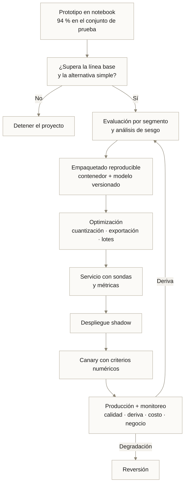

---
tags:
  - Bloque V
  - Visión
---

# Módulo 12 · Visión por computadora: aplicaciones y convergencia

<div class="modulo-meta" markdown>
<span>:material-clock-outline: 3 horas</span>
<span>:material-stairs: Nivel intermedio-avanzado</span>
<span>:material-link-variant: Requiere módulos 10 y 11</span>
</div>

Un modelo con 94 % de exactitud en el conjunto de prueba es un resultado de laboratorio. Lo que decide si sirve es otra cosa: qué pasa con el 6 % restante, a quién perjudica, cuánto cuesta cada inferencia, qué ocurre cuando cambia la iluminación de la planta y quién responde cuando se equivoca.

Este módulo trata del camino entre ese 94 % y un sistema que funciona.

---

## 1. Aplicaciones por sector

### Salud

| Aplicación | Estado de madurez | Consideración crítica |
| --- | --- | --- |
| Detección en radiografía e imagen médica | Producción con supervisión | Casi siempre asistencia, no diagnóstico autónomo |
| Análisis de patología digital | Producción creciente | Imágenes gigapíxel; requiere procesamiento por mosaicos |
| Detección de retinopatía diabética | Aprobada en varios países | Uno de los primeros casos con aprobación regulatoria |
| Guía quirúrgica en tiempo real | Emergente | Latencia y fiabilidad extremas |
| Seguimiento de lesiones cutáneas | Producción en apps | Sesgo documentado por tono de piel |

!!! warning "El sesgo por tono de piel en dermatología"
    Los conjuntos de datos públicos de lesiones cutáneas están dominados por piel clara. Los modelos entrenados con ellos rinden significativamente peor en pieles oscuras, y ese error se concentra precisamente donde el diagnóstico tardío es más grave.

    No es un problema de arquitectura. Es un problema de composición del conjunto de datos, y solo se detecta **midiendo por segmento**.

### Transporte y movilidad

| Aplicación | Madurez |
| --- | --- |
| Asistencia a la conducción (frenado, carril) | Producción masiva |
| Conducción autónoma supervisada | Despliegue geográficamente limitado |
| Lectura automática de placas | Producción madura |
| Inspección de infraestructura por dron | Producción creciente |
| Monitoreo de fatiga del conductor | Producción en flotas |

### Retail y manufactura

| Aplicación | Retorno típico |
| --- | --- |
| Inspección de calidad visual | Alto; medible directamente en tasa de defectos |
| Conteo y disponibilidad en anaquel | Medio-alto |
| Tiendas sin caja | Alto pero con inversión muy elevada |
| Analítica de tráfico de tienda | Medio |
| Seguridad y detección de EPP | Alto en industria de riesgo |

### Agricultura y ambiente

| Aplicación | Nota |
| --- | --- |
| Detección de plagas y enfermedades | Frecuentemente en el borde ([módulo 06](06-edge-iot.md)) |
| Estimación de rendimiento | Combina imagen satelital y de dron |
| Deshierbe selectivo | Reduce herbicida entre 60 % y 90 % |
| Monitoreo de deforestación | Imagen satelital multiespectral |
| Conteo y clasificación de ganado | Reduce trabajo manual intensivo |

---

## 2. Métricas: elegir la correcta cambia el proyecto

### Clasificación

$$
\text{Precisión} = \frac{VP}{VP + FP} \qquad
\text{Exhaustividad} = \frac{VP}{VP + FN} \qquad
F_1 = 2 \cdot \frac{P \cdot R}{P + R}
$$

| Métrica | Responde | Úsala cuando |
| --- | --- | --- |
| **Exactitud** | ¿Qué proporción acerté? | Las clases están balanceadas |
| **Precisión** | De lo que marqué, ¿cuánto era correcto? | Un falso positivo es caro |
| **Exhaustividad (*recall*)** | De lo que existía, ¿cuánto encontré? | Un falso negativo es caro |
| **F1** | Media armónica de ambas | Se necesita un solo número balanceado |
| **AUC-ROC** | Capacidad de separar clases | Comparar modelos sin fijar umbral |
| **AUC-PR** | Idem con clases muy desbalanceadas | Prevalencia baja (< 5 %) |

!!! danger "La paradoja de la exactitud"
    Un detector de una enfermedad con prevalencia del 1 % que responde "sano" siempre tiene **99 % de exactitud** y es completamente inútil.

    Con clases desbalanceadas, la exactitud no informa. Usa AUC-PR, F1 por clase o, mejor, una métrica que refleje el costo real de cada tipo de error.

### La pregunta que debe hacerse antes de elegir métrica

**¿Cuánto cuesta cada tipo de error, y a quién?**

| Contexto | Falso positivo | Falso negativo | Métrica prioritaria |
| --- | --- | --- | --- |
| Detección de cáncer | Estudio adicional, ansiedad | Diagnóstico tardío, posible muerte | Exhaustividad alta |
| Filtro de spam | Correo importante perdido | Spam en la bandeja | Precisión alta |
| Control de calidad industrial | Pieza buena descartada | Pieza defectuosa al cliente | Depende del costo unitario |
| Detección de fraude | Cliente legítimo bloqueado | Pérdida económica | Balance según montos |

Esta conversación pertenece a la fase A del ADM ([módulo 03](03-togaf-ia.md)), no al final del proyecto.

### Detección y segmentación

| Métrica | Definición |
| --- | --- |
| **IoU** | Intersección sobre unión entre predicción y verdad |
| **mAP@0.5** | Precisión media promediada, con IoU ≥ 0.5 como acierto |
| **mAP@[.5:.95]** | Promediada sobre umbrales de 0.5 a 0.95; el estándar de COCO |
| **Dice / F1 de máscara** | $2|A\cap B| / (|A|+|B|)$; habitual en imagen médica |

### Métricas de operación

Un modelo en producción necesita además:

| Métrica | Por qué |
| --- | --- |
| Latencia p50, p95, p99 | El promedio esconde la cola que sufren los usuarios |
| Rendimiento (imágenes/segundo) | Determina cuántas réplicas hacen falta |
| Costo por mil inferencias | La métrica que decide la viabilidad económica |
| Tasa de abstención | Proporción de casos escalados a humano |
| Calibración | ¿Una confianza de 0.8 acierta el 80 % de las veces? |

!!! tip "La calibración importa más de lo que parece"
    Las redes neuronales modernas tienden a estar **sobreconfiadas**: dicen 0.97 cuando la frecuencia real de acierto es 0.83.

    Si tu sistema automatiza decisiones por encima de un umbral de confianza, una confianza no calibrada hace que ese umbral no signifique lo que crees. Calibra con *temperature scaling* o regresión isotónica sobre el conjunto de validación, y verifica con un diagrama de fiabilidad.

---

## 3. Modelos fundacionales y multimodales

### El cambio de paradigma

| Antes | Ahora |
| --- | --- |
| Un modelo por tarea | Un modelo base adaptable a muchas tareas |
| Miles de imágenes etiquetadas por tarea | Pocos ejemplos o ninguno |
| Entrenar desde preentrenamiento en ImageNet | Partir de un modelo entrenado en escala web |
| Clases fijas definidas al entrenar | Vocabulario abierto definido por texto |

### Modelos relevantes

| Modelo | Capacidad |
| --- | --- |
| **CLIP** | Alinea imagen y texto en un espacio común; clasificación sin entrenamiento previo |
| **SAM** | Segmenta cualquier objeto a partir de una indicación (punto, caja, texto) |
| **DINOv2** | Características visuales autosupervisadas de propósito general |
| **Grounding DINO** | Detección con vocabulario abierto descrito en lenguaje natural |
| **VLM multimodales** | Responden preguntas sobre imágenes en lenguaje natural |

### Clasificación sin entrenamiento con CLIP

```python
import torch, clip
from PIL import Image

modelo, preprocesar = clip.load("ViT-B/32")

imagen = preprocesar(Image.open("pieza.jpg")).unsqueeze(0)
etiquetas = [
    "una pieza metálica sin defectos",
    "una pieza metálica con una grieta",
    "una pieza metálica con corrosión",
]
texto = clip.tokenize(etiquetas)

with torch.no_grad():
    logits, _ = modelo(imagen, texto)
    probabilidades = logits.softmax(dim=-1)
```

Sin una sola imagen de entrenamiento. La exactitud será inferior a la de un modelo especializado, pero como **línea base construida en veinte minutos** es extraordinariamente útil: te dice si el problema es fácil o difícil antes de invertir en etiquetado.

!!! tip "Usa modelos fundacionales para etiquetar, no solo para inferir"
    Un patrón muy rentable: usar un modelo fundacional para preetiquetar el conjunto y que las personas solo **corrijan**. Reduce el costo de etiquetado entre 60 % y 80 %.

    El modelo final sigue siendo uno pequeño y especializado —más rápido y más barato de servir—, pero entrenado en una fracción del tiempo.

### Agua fría sobre los modelos fundacionales

!!! danger "No son gratis ni son siempre mejores"
    **Costo de inferencia.** Un modelo fundacional multimodal puede costar dos o tres órdenes de magnitud más por inferencia que una CNN pequeña especializada. A un millón de imágenes al día, la diferencia decide el proyecto.

    **Latencia.** Cientos de milisegundos frente a unidades de milisegundos.

    **Control.** No puedes auditar exactamente qué aprendió ni garantizar su comportamiento en casos límite de tu dominio.

    **Dependencia.** Si es una API, tu producto depende de su disponibilidad, su precio y su política de versiones.

    **Regla práctica:** modelo fundacional para prototipar, validar y etiquetar; modelo especializado y destilado para producción a volumen.

---

## 4. Visión generativa

| Familia | Idea | Uso principal |
| --- | --- | --- |
| **GAN** | Generador y discriminador en competencia | Superresolución, traducción de estilo |
| **VAE** | Codificación a un espacio latente probabilístico | Detección de anomalías, compresión |
| **Difusión** | Eliminar ruido iterativamente desde ruido puro | Generación de alta calidad, edición |
| **Flow matching** | Trayectorias continuas entre distribuciones | Generación más rápida |

### Usos legítimos en infraestructura de IA

| Uso | Valor |
| --- | --- |
| **Datos sintéticos** | Generar casos raros que no existen en el conjunto real |
| **Aumento avanzado** | Variaciones realistas más allá de rotar y recortar |
| **Detección de anomalías** | Entrenar solo con normal; lo que no reconstruye bien es anómalo |
| **Superresolución** | Mejorar imágenes de cámaras de baja calidad |
| **Anonimización** | Sustituir rostros reales por sintéticos conservando la escena |

!!! warning "Datos sintéticos: la brecha entre síntesis y realidad"
    Entrenar solo con datos sintéticos casi siempre produce modelos que fallan en el mundo real: la distribución sintética tiene artefactos sutiles que el modelo aprende como señal.

    El patrón que funciona es **mezclar**: datos reales como base, sintéticos para reforzar clases raras. Y evaluar **siempre** en un conjunto de prueba exclusivamente real.

### Deepfakes y detección

La misma tecnología que anonimiza permite falsificar. La detección de contenido generado es un problema abierto y adversarial: cada mejora del detector se incorpora al generador.

Las respuestas más prometedoras no son de detección sino de **procedencia**: firmar criptográficamente el contenido en el momento de captura (estándar C2PA). Es un problema de infraestructura de confianza, no de clasificación de imágenes.

---

## 5. De notebook a producto



### Optimización de la inferencia

| Técnica | Ganancia típica |
| --- | --- |
| **Exportar a ONNX o TensorRT** | 2–5× en latencia |
| **Cuantización a 8 bits** | 2–4× en velocidad, 4× menos tamaño |
| **Lotes dinámicos** | 3–10× en rendimiento con latencia algo mayor |
| **Fusión de operadores** | 1.5–3× |
| **Destilación** | 5–50× menos cómputo, con pérdida de exactitud |
| **Caché de resultados** | Hasta eliminar la inferencia en contenido repetido |

### El cálculo que decide la viabilidad

```text
Volumen:               2 000 000 imágenes/día
Latencia por imagen:   45 ms en GPU
Rendimiento por réplica: 22 img/s  →  1.9 M imágenes/día
Réplicas necesarias:   2 (más 1 de holgura) = 3
Costo GPU:             ~1.2 USD/hora × 24 h × 30 d × 3 = 2 592 USD/mes
Costo por mil imágenes: 0.043 USD
```

Si el valor de negocio por cada mil imágenes procesadas es inferior a 0.043 USD, **el proyecto no es viable a ese volumen** por mucho que el modelo sea excelente. Ese cálculo pertenece a la fase D del ADM, antes de construir.

---

## 6. Análisis de video y seguimiento

El video añade la dimensión temporal, y con ella problemas nuevos.

| Tarea | Descripción |
| --- | --- |
| **Seguimiento multiobjeto** | Mantener identidad de cada objeto entre cuadros |
| **Reidentificación** | Reconocer al mismo objeto tras perderlo de vista |
| **Reconocimiento de acciones** | Clasificar qué ocurre en una secuencia |
| **Detección de eventos** | Identificar el instante en que algo sucede |
| **Conteo por línea** | Contar cruces direccionales |

### Paradigmas de seguimiento

| Paradigma | Ejemplos | Característica |
| --- | --- | --- |
| **Detección y asociación** | SORT, DeepSORT, ByteTrack | Detecta en cada cuadro y asocia con el anterior |
| **Seguimiento conjunto** | FairMOT, CenterTrack | Detecta y sigue en una sola pasada |
| **Basado en transformer** | TrackFormer, MOTR | Predicción de conjunto a lo largo del tiempo |

### Optimizaciones prácticas

!!! tip "No proceses todos los cuadros"
    A 30 fps, la mayoría de las aplicaciones no necesita inferencia en cada cuadro:

    - **Muestreo temporal:** detectar cada N cuadros y seguir con un rastreador ligero en los intermedios. Reduce el cómputo entre 5 y 10 veces.
    - **Detección de movimiento previa:** si nada se mueve, no ejecutes el detector. En cámaras de seguridad nocturnas, el ahorro es enorme.
    - **Regiones de interés:** procesa solo la zona relevante del cuadro.
    - **Resolución adaptativa:** baja resolución para detectar presencia, alta solo para clasificar.

---

## 7. Ética y despliegue responsable

### Los problemas documentados

| Problema | Manifestación |
| --- | --- |
| **Sesgo demográfico** | Tasas de error muy superiores en grupos subrepresentados |
| **Vigilancia masiva** | Reconocimiento facial sin consentimiento ni marco legal |
| **Falsa autoridad** | Una salida numérica se percibe como objetiva aunque no lo sea |
| **Uso fuera de contexto** | Un modelo entrenado para una población aplicado a otra |
| **Falta de recurso** | La persona afectada no puede apelar una decisión automática |
| **Opacidad** | Ni quien opera el sistema puede explicar una decisión concreta |

!!! danger "El caso Gender Shades"
    El estudio de Buolamwini y Gebru (2018) midió sistemas comerciales de clasificación de género facial por tono de piel y género:

    | Grupo | Tasa de error |
    | --- | --- |
    | Hombres de piel clara | 0.8 % |
    | Mujeres de piel oscura | 34.7 % |

    Una diferencia de más de **40 veces**. Ninguno de los proveedores lo había reportado, porque todos evaluaban en agregado, donde el promedio se veía excelente.

    La lección operativa es concreta: **evaluar solo en agregado es una decisión que oculta daño**. Desglosar por segmento debe ser obligatorio, no una buena práctica opcional.

### Lista de verificación de despliegue responsable

- [ ] Las métricas están desglosadas por los segmentos demográficos y operativos relevantes.
- [ ] El conjunto de entrenamiento tiene documentada su composición y sus sesgos conocidos.
- [ ] Existe una *model card* publicada: uso previsto, limitaciones, métricas por segmento.
- [ ] Está definido el uso previsto **y los usos explícitamente fuera de alcance**.
- [ ] Las decisiones adversas para una persona tienen vía de revisión humana.
- [ ] Hay un mecanismo para que una persona afectada apele.
- [ ] El umbral de confianza está calibrado y su elección está justificada por el costo de cada error.
- [ ] Existe un plan de retirada si el sistema causa daño.
- [ ] La base legal del tratamiento de imágenes está establecida.
- [ ] Se registra cada decisión con su versión de modelo, de forma auditable.

---

## Casos prácticos

!!! example "Caso 1 · Seguridad urbana en Bogotá"
    **Propuesta inicial.** Reconocimiento facial en 200 cámaras de espacio público para identificar personas con orden de captura.

    **Lo que ocurrió en la revisión de arquitectura.** El comité rechazó la propuesta por tres razones:

    1. Sin marco legal específico para el tratamiento biométrico en espacio público.
    2. Sin datos de rendimiento por segmento demográfico de la población local.
    3. Sin mecanismo de apelación para un falso positivo.

    **Reencuadre aprobado.** En lugar de identificar personas, el sistema detecta **eventos**: aglomeraciones anómalas, objetos abandonados, personas caídas, movimiento en zonas restringidas fuera de horario. No identifica a nadie.

    | Dimensión | Propuesta original | Versión aprobada |
    | --- | --- | --- |
    | Dato procesado | Rostro identificable | Silueta y movimiento |
    | Salida | Identidad de una persona | Tipo de evento y ubicación |
    | Retención | Base biométrica permanente | 72 horas, solo eventos |
    | Riesgo legal | Alto | Bajo |
    | Valor operativo | Alto pero no desplegable | Medio-alto y desplegable |

    **Resultado.** Tiempo de respuesta a incidentes reducido 28 %. Cero controversias legales. El sistema lleva tres años operando.

    **Lección.** Reencuadrar la tarea —de identificar a detectar— hizo el proyecto viable sin renunciar a la mayor parte del valor. Es el mismo movimiento del caso del hospital en el [módulo 03](03-togaf-ia.md).

!!! example "Caso 2 · Control de calidad en Monterrey"
    **Problema.** Inspección visual de piezas metálicas. Dos inspectores por turno, tres turnos. Tasa de escape de defectos: 3.2 %. Costo de un defecto que llega al cliente: 1 800 USD.

    **Fase 1 · Datos.** 14 000 imágenes capturadas en cuatro semanas, etiquetadas por los propios inspectores. Problema inmediato: solo el 1.8 % de las piezas tenía defecto. Clases extremadamente desbalanceadas.

    **Decisiones que definieron el resultado:**

    | Decisión | Razón |
    | --- | --- |
    | Métrica objetivo: exhaustividad con precisión ≥ 60 % | Un defecto escapado cuesta 1 800 USD; una revisión extra cuesta 4 USD |
    | Iluminación controlada y fija | Eliminó la mayor fuente de variabilidad; mejoró más que cualquier cambio de modelo |
    | División por lote de producción, no por imagen | Evitó fuga: piezas del mismo lote comparten condiciones |
    | Datos sintéticos para defectos raros | Solo había 12 ejemplos de un tipo de grieta |
    | Umbral que abstiene en la zona dudosa | El sistema escala el 8 % de los casos al inspector |

    **Fase 2 · Despliegue.**

    | Etapa | Duración | Qué se midió |
    | --- | --- | --- |
    | Shadow | 6 semanas | Concordancia con los inspectores: 91.4 % |
    | Revisión de discrepancias | 2 semanas | En el 63 % de los desacuerdos, **el modelo tenía razón** |
    | Canary en un turno | 4 semanas | Sin escapes atribuibles al sistema |
    | Producción con abstención | — | Los inspectores revisan el 8 % dudoso más un 5 % aleatorio de auditoría |

    **Resultados.**

    | Métrica | Antes | Después |
    | --- | --- | --- |
    | Tasa de escape | 3.2 % | 0.7 % |
    | Piezas inspeccionadas/hora | 180 | 620 |
    | Inspectores por turno | 2 | 1 (reasignado a análisis de causa) |
    | Ahorro anual estimado | — | ~410 000 USD |

    **Lo que más aportó, y no fue el modelo.** Controlar la iluminación. Antes de tocar la arquitectura, fijar la luz subió la exhaustividad de 0.71 a 0.86. **En visión industrial, la ingeniería de la captura suele rendir más que la ingeniería del modelo.**

    **Lo que falló a los cinco meses.** Cambió el proveedor de la materia prima; el acabado superficial era ligeramente distinto y la tasa de falsos positivos se triplicó. El monitoreo de deriva lo detectó en 30 horas. Se reentrenó con 800 imágenes nuevas en tres días.

    Sin monitoreo de deriva, lo habrían descubierto por la queja de producción, semanas después.

---

## Laboratorio · Del modelo al servicio evaluado

**Objetivo:** tomar el clasificador del [módulo 11](11-vision-fundamentos.md) y llevarlo a un servicio con evaluación completa, optimización y monitoreo.

**Paso 1 — Línea base con modelo fundacional.** Antes de nada, mide qué logra CLIP sin entrenamiento en tu tarea. Anótalo: es tu referencia de "cuánto aporta realmente entrenar".

**Paso 2 — Evaluación honesta.** Produce una tabla con:

| Segmento | n | Precisión | Exhaustividad | F1 | AUC-PR |
| --- | --- | --- | --- | --- | --- |

Incluye al menos tres segmentos relevantes de tu dominio. Marca en rojo cualquiera que esté más de 8 puntos por debajo del promedio.

**Paso 3 — Calibra.** Genera un diagrama de fiabilidad. Si el modelo está sobreconfiado, aplica *temperature scaling* sobre validación y regenera el diagrama.

```python
import torch, torch.nn as nn

class EscaladoTemperatura(nn.Module):
    def __init__(self, modelo):
        super().__init__()
        self.modelo = modelo
        self.temperatura = nn.Parameter(torch.ones(1) * 1.5)

    def forward(self, x):
        return self.modelo(x) / self.temperatura

# Ajustar SOLO la temperatura sobre el conjunto de validación
```

**Paso 4 — Elige el umbral por costo, no por F1.**

```python
import numpy as np

COSTO_FP, COSTO_FN = 4, 1800     # los costos reales de TU dominio

mejor = min(
    ((np.sum((probs > t) & (y == 0)) * COSTO_FP +
      np.sum((probs <= t) & (y == 1)) * COSTO_FN), t)
    for t in np.arange(0.05, 0.96, 0.01)
)
print(f"Umbral óptimo por costo: {mejor[1]:.2f}  ·  costo esperado: {mejor[0]}")
```

Compara este umbral con el que maximiza F1. Casi nunca coinciden, y el de costo es el correcto.

**Paso 5 — Añade abstención.** Define dos umbrales: por debajo de $t_1$ es negativo, por encima de $t_2$ es positivo, y entre ambos el sistema **se abstiene** y escala a humano. Mide qué porcentaje se abstiene y cómo mejora la precisión en lo que sí decide.

**Paso 6 — Optimiza la inferencia.** Exporta a ONNX, cuantiza y mide:

| Versión | Tamaño | Latencia p50 | Latencia p99 | Rendimiento | F1 |
| --- | --- | --- | --- | --- | --- |
| PyTorch FP32 | | | | | |
| ONNX FP32 | | | | | |
| ONNX INT8 | | | | | |

**Paso 7 — Calcula la viabilidad.** Con tu volumen esperado, calcula réplicas necesarias, costo mensual y costo por mil inferencias. Compáralo con el valor de negocio por mil inferencias. ¿Es viable?

**Paso 8 — Model card.** Escribe una ficha del modelo que incluya: uso previsto, usos fuera de alcance, composición del conjunto de entrenamiento, métricas por segmento, limitaciones conocidas, umbral y su justificación, y plan de monitoreo.

**Paso 9 — Simula deriva.** Aplica una transformación sistemática a las imágenes de prueba (cambio de tono, desenfoque leve) que imite un cambio de proveedor o de cámara. Verifica que tu detector de deriva la señala antes de que la exactitud se desplome.

**Entregable:** la tabla de evaluación por segmento, el diagrama de fiabilidad antes y después de calibrar, la tabla de optimización, el cálculo de viabilidad económica y la model card completa.

---

## Conceptos clave

- **Precisión / exhaustividad:** de lo que marqué cuánto era correcto / de lo que existía cuánto encontré.
- **Paradoja de la exactitud:** con clases muy desbalanceadas, una exactitud alta puede corresponder a un modelo inútil.
- **AUC-PR:** área bajo la curva precisión-exhaustividad; la métrica adecuada con baja prevalencia.
- **mAP:** precisión media promediada, estándar en detección de objetos.
- **Calibración:** correspondencia entre la confianza declarada y la frecuencia real de acierto.
- **Abstención:** que el modelo declare "no sé" y escale a un humano en la zona dudosa.
- **Modelo fundacional:** modelo grande entrenado a escala web, adaptable a muchas tareas.
- **Clasificación sin entrenamiento (*zero-shot*):** clasificar con clases descritas en lenguaje natural.
- **Destilación:** entrenar un modelo pequeño para imitar a uno grande.
- **Lotes dinámicos:** agrupar peticiones en tiempo de ejecución para aumentar el rendimiento.
- **Brecha síntesis-realidad:** diferencia entre datos sintéticos y reales que degrada el modelo en producción.
- **Model card:** ficha documental de un modelo con uso previsto, limitaciones y métricas por segmento.
- **Procedencia de contenido (C2PA):** firma criptográfica del origen de una imagen.

---

## Puntos clave

- El 94 % del conjunto de prueba no dice nada por sí solo. Lo que decide es el 6 % restante: a quién perjudica y cuánto cuesta.
- La métrica correcta se deriva del costo de cada tipo de error, y esa conversación es de negocio, no técnica.
- Evaluar solo en agregado oculta daño. Gender Shades documentó diferencias de más de 40 veces entre segmentos que ningún proveedor había reportado.
- Las redes modernas están sobreconfiadas. Sin calibración, un umbral de confianza no significa lo que crees.
- La abstención es una función de producto, no una limitación: un sistema que sabe cuándo no sabe es más útil que uno que siempre responde.
- Los modelos fundacionales son excelentes para prototipar, validar y etiquetar; para producción a volumen, un modelo destilado y cuantizado suele ser la decisión correcta.
- Los datos sintéticos refuerzan clases raras; entrenar solo con ellos produce modelos que fallan en el mundo real. Evalúa siempre con datos reales.
- En visión industrial, controlar la captura —iluminación, ángulo, enfoque— suele rendir más que cambiar de arquitectura.
- El despliegue shadow permite descubrir que el modelo tiene razón donde discrepa del humano, sin ningún riesgo.
- El cálculo de costo por mil inferencias decide la viabilidad, y pertenece a la fase de diseño, no al final.
- No proceses todos los cuadros de un video. El muestreo temporal y la detección de movimiento previa reducen el cómputo entre 5 y 10 veces.
- Un modelo en producción sin monitoreo de deriva se degrada y lo descubres por la queja de un cliente.

---

## Ejercicios

1. **Matriz de costo.** Para un caso de uso de tu interés, construye la matriz de costo de los cuatro resultados posibles con cifras reales. Deriva de ella la métrica prioritaria.

2. **Detecta la paradoja.** Encuentra un conjunto de datos con prevalencia inferior al 5 %. Calcula la exactitud del clasificador trivial "siempre negativo" y compárala con el AUC-PR de un modelo entrenado.

3. **Calibra un modelo.** Toma un clasificador entrenado y genera su diagrama de fiabilidad. Aplica *temperature scaling* y cuantifica la mejora en el error de calibración esperado.

4. **Línea base sin entrenamiento.** Usa CLIP para resolver una tarea de clasificación de tu dominio sin entrenar nada. Compara con tu modelo entrenado en exactitud, latencia y costo.

5. **Auditoría de sesgo.** Toma un modelo existente y evalúalo desglosando por al menos tres atributos. Documenta la mayor diferencia encontrada y propón una mitigación concreta.

6. **Viabilidad económica.** Para un volumen de un millón de inferencias diarias, calcula el costo mensual de servir un modelo pequeño cuantizado frente a un modelo fundacional por API. ¿Cuál es el punto de equilibrio en volumen?

7. **Escribe una model card.** Documenta un modelo que conozcas con el formato de la sección 7. Incluye explícitamente los usos fuera de alcance.

---

## Lectura adicional

- [Gender Shades · Buolamwini y Gebru](http://gendershades.org/) — el estudio que estableció la obligación de evaluar por segmento.
- [Model Cards for Model Reporting · Mitchell et al.](https://arxiv.org/abs/1810.03993) — el formato estándar de documentación de modelos.
- [On Calibration of Modern Neural Networks · Guo et al.](https://arxiv.org/abs/1706.04599) — por qué las redes modernas están sobreconfiadas y cómo corregirlo.
- [CLIP · Learning Transferable Visual Models From Natural Language Supervision](https://arxiv.org/abs/2103.00020) — el artículo que abrió la clasificación de vocabulario abierto.
- [Segment Anything · Kirillov et al.](https://arxiv.org/abs/2304.02643) — SAM y la segmentación por indicación.
- [C2PA · Content Provenance and Authenticity](https://c2pa.org/) — el estándar de procedencia de contenido.
- [Partnership on AI · Responsible Practices](https://partnershiponai.org/) — guías de despliegue responsable.
- [Módulo 13 · Ingeniería de Harness](13-harness-engineering.md) — cuando el sistema que construyes es un agente.
