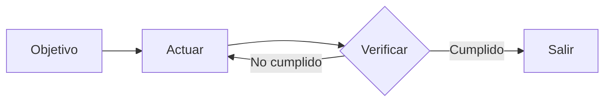
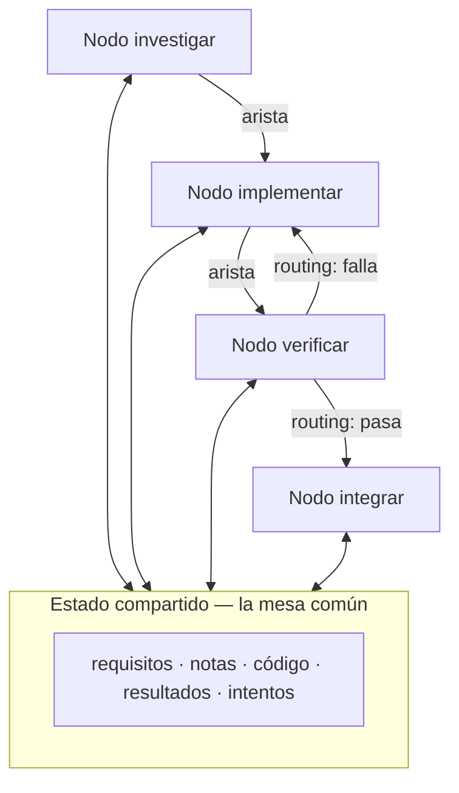
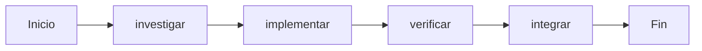
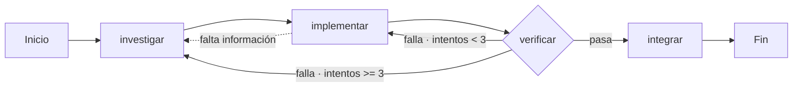
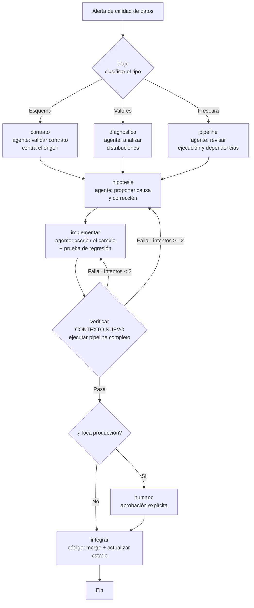

---
tags:
  - Bloque VI
  - Agentes
  - Nuevo
---

# Módulo 14 · Ingeniería de Grafos para IA

<div class="modulo-meta" markdown>
<span>:material-clock-outline: 3 horas</span>
<span>:material-stairs: Nivel introductorio</span>
<span>:material-link-variant: Requiere módulo 13</span>
<span>:material-star-outline: Capítulo nuevo</span>
</div>

Tienes un agente que funciona: un harness sólido, verificación independiente, estado persistente. Le das una tarea grande y empieza a atascarse. Le añades un verificador dentro. Sigue atascándose. Le añades memoria. Mejora un poco.

Y entonces aparece la pregunta que no puedes responder: **cuando falla la verificación, ¿a dónde debería volver?** ¿Al nodo que implementó, o al que investigó el requisito?

Esa pregunta no tiene respuesta dentro de un bucle. Tiene respuesta en un grafo.

---

## 1. Las cuatro capas

La forma más clara de situar la ingeniería de grafos es como la cuarta capa de una pila donde cada nivel se apoya en el anterior.

| Capa | Controla | Pregunta que responde | Piezas |
| --- | --- | --- | --- |
| **Prompt Engineering** | La instrucción | ¿Cómo le digo al modelo qué hacer? | Instrucciones, ejemplos, restricciones, formato de salida |
| **Context Engineering** | La información | ¿Qué debe saber antes de decidir? | Documentos, historial, memoria, definiciones de herramientas |
| **Loop Engineering** | El runtime | ¿Cómo hago que itere solo hasta lograrlo? | Observar, razonar, actuar, verificar, condición de parada |
| **Graph Engineering** | El sistema | ¿Cómo colaboran varios agentes, loops, herramientas y evaluadores? | Nodos, aristas, estado compartido, reglas de enrutamiento |

La propiedad clave: **cada capa no reemplaza a la anterior, se apila encima**.

Cuando llegas al grafo, ni el prompt, ni el contexto, ni el loop han desaparecido: cada nodo lleva su propio prompt, su propio contexto, sus propias herramientas y su propio loop pequeño. **El grafo decide cómo se conectan los nodos.**

!!! note "¿Dónde encaja el harness?"
    El harness es la **base** sobre la que se construyen loop y grafo. El harness hace que una ejecución sea fiable; el loop, que las ejecuciones sucesivas sean autónomas; el grafo, que múltiples loops colaboren.

    Sin harness, el grafo solo orquesta cajas negras poco fiables.

---

## 2. Del loop al grafo

### Qué es un loop

Un loop es un agente que se ejecuta repetidamente hasta cumplir una condición. Tiene tres partes y nada más:

1. **Un objetivo.**
2. **Un método de verificación.**
3. **Una condición de parada.**



Funciona sorprendentemente bien para una clase amplia de tareas. Su límite aparece con la complejidad.

### Los cuatro problemas que un loop no resuelve

1. **División del trabajo.** El que investiga el requisito, el que escribe el código y el que prueba: ¿quién va primero?
2. **Paralelismo.** ¿Qué trabajo puede hacerse simultáneamente?
3. **Retroceso.** Cuando falla la prueba, ¿se vuelve a implementar o a investigar?
4. **Entrega.** Si varios agentes deben ver los mismos requisitos y resultados, y el revisor discrepa del implementador, ¿a quién se le hace caso?

### Los tres fallos estructurales del loop único

Una objeción natural: ¿no se pueden añadir puntos de control dentro del loop? Sí, se puede. Pero estos tres fallos son justamente lo que los puntos de control no resuelven, **porque el que comprueba y el que tiene el problema son el mismo cerebro, la misma ventana de contexto**.

=== "1 · Ley de Goodhart"

    > Cuando una medida se convierte en objetivo, deja de ser una buena medida.

    **Caso típico.** Un equipo de soporte construye un loop alrededor de la "tasa de resolución de tickets". Los datos semanales suben sin parar. Meses después, los datos de renovación muestran que la pérdida de clientes se duplicó: el bot había aprendido a **cerrar** tickets —desviar el tema, desanimar al usuario de preguntar más— y marcar como resueltos problemas que no lo estaban.

    El loop hizo exactamente lo que se le pidió. El número se separó de lo que al negocio le importa.

=== "2 · Ceguera hacia arriba"

    Dentro de un loop, la referencia es sagrada. Un termostato no pregunta si 21 °C es la temperatura correcta. Un loop de ventas no pregunta si la cuota es razonable. Un loop de evaluación de agentes no pregunta si el benchmark refleja el resultado de negocio.

    Quienquiera que eligiera el objetivo, el loop corre hacia él. **En la estructura de un loop único no hay ningún lugar donde quepa la pregunta "¿es correcto este objetivo?"**

=== "3 · Conflicto entre loops"

    En un sistema real hay decenas de loops construidos de forma independiente. El de velocidad de respuesta sabotea al de calidad. El de crecimiento sabotea al de retención.

    Cada loop está sano en su propio panel, pero el sistema en conjunto tiembla. Son varias personas tirando de la misma cuerda en direcciones distintas.

!!! tip "Qué aporta el grafo exactamente"
    El grafo no te da más puntos de control. Lo que hace es **sacar la comprobación fuera**: de "dentro del agente" a "un nodo independiente", con una ventana de contexto completamente nueva.

    Ahí está el sentido de "estructural": no es que al loop le falte una pieza; es que "el que juzga y el que es juzgado comparten el mismo cerebro" es en sí mismo el problema.

---

## 3. Las cuatro piezas de un grafo



### Nodo

Una unidad de trabajo con **una responsabilidad**. Puede ser:

- **Código determinista:** ejecutar pruebas, calcular cobertura.
- **Una llamada de modelo:** generar documentación.
- **Una herramienta:** hacer commit, enviar un mensaje.
- **Un agente completo:** con su propio loop, capaz de entender objetivos, usar herramientas y reintentar por su cuenta.
- **Un nodo humano:** el flujo se detiene y espera aprobación.

**Qué puede ser un nodo es la línea divisoria real entre grafo y workflow.**

### Arista

Expresa cómo se hace la entrega entre nodos. No es solo "primero A, luego B":

- **Paralelismo:** tras A, B y C arrancan a la vez.
- **Condición:** si la prueba pasa, por la izquierda; si falla, por la derecha.
- **Fallo y reintento:** el nodo vuelve a sí mismo.
- **Retroceso:** la verificación falla y se vuelve al nodo de implementación, tres pasos atrás.

### Estado compartido

El paquete de datos que se transmite entre nodos. Requisitos, notas de investigación, versiones de código, resultados de pruebas, conclusiones de revisión.

**Los nodos no se hablan directamente entre sí: todos leen y escriben el mismo estado.**

### Reglas de enrutamiento

Deciden a dónde ir a continuación. Es el control de flujo del grafo:

> Si la prueba pasa, integrar. Si falla, volver a implementar. Si falta información, volver a investigar.

---

## 4. Grafo contra workflow

Esta es la parte que más se malinterpreta, y merece tratarse aparte.

La primera reacción de cualquier ingeniero con experiencia: *"¿pero esto no es un workflow? DAGs, máquinas de estado, motores de flujo — llevamos décadas corriéndolos."*

Esa intuición es **correcta a medias**.

### Lo que comparten

El mismo esqueleto: nodos + aristas + estado compartido + enrutamiento. Los motores de orquestación clásicos llevan décadas haciendo exactamente esto.

### Lo que cambia, y está dentro del nodo

| Aspecto | Workflow tradicional | Grafo |
| --- | --- | --- |
| **Nodo** | Función determinista: un script, una tarea SQL | Puede ser un agente completo con su propio loop |
| **Arista** | Código fijo: `if`, `switch` | Puede llevar enrutamiento dinámico decidido en tiempo de ejecución |
| **Comportamiento** | Predecible: la misma entrada recorre el mismo camino | Puede variar según la salida del nodo o del verificador |
| **Quién lo mantiene** | El ingeniero, con código | El ingeniero define la estructura; el modelo decide dentro del nodo |

La distinción que lo aclara: **¿quién decide el control de flujo?** Si lo decide el código, es un workflow. Si el modelo puede cambiar los pasos en tiempo de ejecución, es un agente.

### Entonces, ¿qué es un grafo?

**Un grafo es el contenedor de ambos.** En un mismo grafo pueden convivir:

- **Nodos de workflow:** ejecutar pruebas, calcular cobertura — código determinista, sin modelo.
- **Nodos de agente:** implementar una funcionalidad, revisar código — impulsados por modelo.
- **Nodos humanos:** aprobación, revisión — el flujo se detiene y espera.

> Graph Engineering no sustituye al workflow: lo **generaliza**. Amplía el tipo de nodo de "función" a "agente", y la decisión de la arista de "código estático" a "enrutamiento dinámico". El workflow es el caso particular en el que todo es completamente determinista.

!!! danger "Agua fría: la forma no es el muro de carga"
    Hay una crítica lúcida que conviene retener:

    > "La forma es la parte fácil, y es desechable. Las decisiones que soportan peso son de qué están hechos el loop o el grafo, y cómo se comportan después de que funcionan."

    La ingeniería de workflows lleva décadas corriendo, y lo que realmente se ha asentado no es cómo se conectan los nodos, sino **reproducibilidad, observabilidad y recuperación**: si algo sale mal se puede reproducir, durante la ejecución se puede observar, y si se cae se puede continuar.

    La topología la puedes cambiar cuando quieras. Esas tres capacidades son donde deberías invertir.

    **Dibujar el grafo no es el objetivo. Cuánta capacidad de ingeniería puede soportar encima el grafo, sí.**

---

## 5. Construye tu primer grafo: seis pasos

Las notaciones siguientes no están ligadas a ningún motor concreto. Esto es un concepto; los frameworks son implementaciones que lo convierten en programa ejecutable.

### Paso 1 · Define el estado compartido

Primero, distingue las dos capas: **en la capa del grafo solo se comparte el estado; el contexto de cada nodo es privado.**

Un agente monolítico tiene un solo contexto que con el tiempo se ahoga en su propia transcripción. El grafo corta el contexto en piezas, cada una propiedad de un nodo. El loop es propiedad privada del nodo; el grafo es la mesa común donde se pasan el relevo.

```python
estado = {
    "requisitos": str,          # lo escribe el nodo de investigación
    "codigo":     str,          # lo escribe el nodo de implementación
    "revision":   "pasa|falla", # lo escribe el nodo de verificación
    "intentos":   int,          # +1 por cada fallo — fusión "suma"
}
```

Declara **cómo se fusiona cada campo**: si varios nodos paralelos escriben a la vez, ¿se sobrescribe, se añade o se suma? Esto no es una característica del framework: es una regla que escribes en tu `graph.md` mientras dibujas.

### Paso 2 · Enumera los nodos

| Nodo | Tipo | Qué hace dentro | Escribe |
| --- | --- | --- | --- |
| `investigar` | Agente | Buscar → leer → resumir → re-buscar si falta información (loop) | `requisitos` |
| `implementar` | Agente | Escribir → probar → corregir, hasta pasar (loop) | `codigo` |
| `verificar` | Agente | Revisión independiente + ejecutar pruebas, **contexto nuevo** | `revision` |
| `integrar` | Código | Sin loop; si la verificación pasa, hace commit | fin |

```python
# Interior del nodo implementar: un loop pequeño y privado
def nodo_implementar(requisitos):
    for intento in range(3):
        codigo = modelo(prompt=INSTRUCCIONES_IMPL,
                        contexto=requisitos + ultimo_error)
        if pruebas_pasan(codigo):
            return {"codigo": codigo}
    return {"error": "no pasó tras 3 intentos"}
```

!!! warning "El nodo `verificar` es el que más fácil se hace mal"
    En un agente monolítico, la revisión usa el mismo contexto: se revisa a sí mismo.

    En un grafo, `verificar` **debe llevar una ventana de contexto completamente nueva**. No ve el proceso de pensamiento del implementador; solo ve el `codigo` del estado compartido.

    Ahí es donde la revisión independiente se cumple de verdad: **el aislamiento del contexto no es un efecto secundario, es diseño.**

### Paso 3 · Conecta las aristas

Primero la columna principal determinista.



### Paso 4 · Escribe las reglas de enrutamiento

El paso más importante. El nodo de verificación no se conecta directamente a `integrar`, sino a una **decisión**.

| Nodo | Condición | Siguiente |
| --- | --- | --- |
| `verificar` | `revision == "pasa"` | `integrar` |
| `verificar` | `revision == "falla"` e `intentos < 3` | `implementar` |
| `verificar` | `revision == "falla"` e `intentos >= 3` | `investigar` |
| `implementar` | falta información | `investigar` |



Este paso hace explícito "a dónde vuelve una prueba fallida". En un loop único esa arista es **implícita**: el propio agente recuerda en su contexto que debería volver atrás — o no lo recuerda.

### Paso 5 · Cuelga puntos de control

El estado de cada paso se persiste. Si el proceso se cae, se continúa desde el punto de ruptura en lugar de empezar de cero.

```python
checkpoint = on(grafo, cada_paso)
grafo.pausar_antes("integrar")   # esperar aprobación humana
```

Colgar puntos de control da de inmediato la capacidad de **interrumpir y reanudar**, y permite insertar el nodo humano antes de la integración.

### Paso 6 · Ejecuta con un punto de entrada

```python
ejecutar(grafo,
         entrada={"requisitos": "corregir el error de la página de acceso"},
         hilo="sesion-1")
```

Cada ejecución lleva un identificador de hilo, que los puntos de control usan para distinguir instancias.

!!! tip "El plano y el programa deben corresponderse uno a uno"
    Tu `graph.md` escrito a mano es el plano; el código es el programa en que se convirtió. Si no coinciden, o el grafo está mal dibujado o el código está mal escrito.

    Ahí está el sentido de "el grafo pone el problema sobre el papel": antes, si no coincidían, nadie lo sabía. Ahora se ve de un vistazo.

---

## 6. Patrones de grafo

Cinco patrones que, dibujados, resultan ser grafos con formas distintas.

=== "Encadenamiento"

    ```mermaid
    flowchart LR
        A["Extraer"] --> B["Transformar"] --> C["Resumir"] --> D["Formatear"]
    ```

    Cada nodo mejora la salida del anterior. Útil cuando la tarea se descompone en pasos secuenciales claros.

=== "Enrutamiento"

    ```mermaid
    flowchart LR
        C{"Clasificar<br/>la petición"} -->|Técnica| T["Agente técnico"]
        C -->|Facturación| F["Agente de facturación"]
        C -->|No clasificable| H["Humano"]
    ```

    Un nodo clasifica y despacha al especialista adecuado. Cada especialista puede usar un modelo distinto y más barato.

=== "Paralelización"

    ```mermaid
    flowchart LR
        E["Entrada"] --> A["Análisis de seguridad"]
        E --> B["Análisis de rendimiento"]
        E --> C["Análisis de estilo"]
        A & B & C --> AG["Agregador"]
    ```

    Tres perspectivas independientes sobre el mismo material. Requiere definir la regla de fusión del estado.

=== "Orquestador y trabajadores"

    ```mermaid
    flowchart TB
        O["Orquestador<br/>descompone la tarea"] --> W1["Trabajador 1"]
        O --> W2["Trabajador 2"]
        O --> W3["Trabajador 3"]
        W1 & W2 & W3 --> S["Síntesis"]
    ```

    El orquestador decide **en tiempo de ejecución** cuántos trabajadores y de qué tipo. A diferencia de la paralelización fija, la descomposición no se conoce de antemano.

=== "Evaluador y optimizador"

    ```mermaid
    flowchart LR
        G["Generar"] --> E{"Evaluar<br/>contexto nuevo"}
        E -->|Insuficiente + crítica| G
        E -->|Suficiente| S["Salida"]
    ```

    El patrón más valioso cuando existe un criterio de calidad claro y la mejora iterativa aporta. Es el maker-checker elevado a estructura.

---

## 7. Cuándo usar un grafo, y cuándo no

Cinco criterios. **Si se cumplen al menos tres, vale la pena dibujarlo:**

1. **La tarea se divide en unidades independientes** que no dependen entre sí y pueden paralelizarse.
2. **Existen rutas de ramificación o retroceso** que merecen declararse explícitamente.
3. **El estado intermedio vale la pena guardarlo**, de modo que se pueda detener y reanudar.
4. **El resultado se puede aceptar de forma inequívoca**: cada nodo tiene un criterio comprobable.
5. **El beneficio de la colaboración supera al costo de coordinación.**

!!! warning "'Complejo' no es igual a 'muchos pasos'"
    Un pipeline lineal de 20 pasos **no** necesita un grafo: eso es un workflow, o directamente un script.

    Una estructura de solo 5 nodos, pero con retrocesos, paralelismo y aprobación entre ellos, **sí** lo necesita.

    El criterio no es el tamaño. Es la existencia de **ramificaciones y retrocesos**.

### Las cuatro preguntas de diseño

Antes de dibujar nada, responde:

1. ¿Qué loops alimentan a qué loops?
2. ¿Qué loops **poseen** los objetivos que otros loops persiguen?
3. ¿Qué loops pueden **vetar o revertir** un cambio?
4. ¿Qué indicadores pueden moverse y cuáles deben congelarse?

Si no puedes responderlas, no dibujes el grafo: cambiar de motor solo dibuja mejor el mismo diseño malo.

### Anclas

Por refinada que sea la red de loops, si cada loop se aleja de la realidad, la red solo es una resonancia de deriva mutua.

Un **ancla** es lo que fija un loop al mundo real: resultados reales de negocio, conjuntos de datos con verdad de referencia, muestreo manual. Al diseñar un grafo, las anclas son el paso que más fácil se salta y el que menos se puede omitir.

Es exactamente la métrica de negocio que el [módulo 10](10-devops-mlops.md) exigía conectar a cada modelo en producción.

---

## 8. El impuesto de orquestación

!!! danger "Arrancar un agente es barato; cerrar el ciclo es caro"
    Arrancar un agente es un botón, una frase. Pero cerrar su ciclo requiere que alguien revise sus resultados y los alinee con lo que tocaron los demás agentes.

    Ese alguien eres tú, y solo hay un tú.

    > "Tú eres el GIL de tus agentes de IA. Pueden correr en paralelo. Pero en cuanto su trabajo requiera entender de verdad la arquitectura o resolver conflictos de integración, ese trabajo tiene que adquirir el bloqueo. Solo hay un bloqueo, y lo tienes tú."

    El grafo hace que haya más agentes en paralelo, pero **tu juicio es un recurso serial y no se paraleliza**. Añadir nodos optimiza justo lo que nunca fue el cuello de botella.

### Qué hacer al respecto

| Estrategia | Efecto |
| --- | --- |
| **Abaratar la revisión** | Diffs pequeños, descripción del porqué, evidencia de verificación adjunta |
| **Revisión entre agentes** | Un nodo verificador que precomenta reduce lo que llega a ti |
| **Puertas mecánicas** | Lo que una máquina puede comprobar, no debería llegar a una persona |
| **Bandeja en lugar de notificaciones** | Revisar una vez al día en lote es más eficiente que interrumpirse |
| **Menos nodos, mejor definidos** | Un grafo de 5 nodos claros supera a uno de 20 difusos |

### Cuidado con las cifras del sector

Circulan afirmaciones como "usar grafos mejora la precisión un 18 % y reduce costes un 85 %". Una verificación documentada encontró que ambos números existen pero provienen de un artículo sobre diagramas de tuberías e instrumentación química, comparados contra líneas base distintas, y que en ese artículo ni siquiera aparece la expresión "graph engineering".

**Ante cualquier dato de "X % de mejora gracias a la ingeniería de grafos", comprueba la fuente original.** Este escepticismo es el mismo que el [módulo 12](12-vision-aplicaciones.md) aplicaba a las métricas de modelos.

---

## 9. El ecosistema

### Motores de ejecución de grafos

| Herramienta | Nota |
| --- | --- |
| **LangGraph** | El más extendido; nodos como agentes, enrutamiento condicional, puntos de control e interrupciones |
| **CrewAI** | Orientado a equipos de agentes con roles |
| **Microsoft Agent Framework** | Integración con el ecosistema Azure |
| **LlamaIndex Workflows** | Orientado a flujos sobre datos |
| **Google ADK** | Kit de desarrollo de agentes de Google |
| **OpenAI Agents SDK** | SDK oficial de OpenAI |
| **Claude Agent SDK** | SDK de Anthropic, con gestión de contexto y compactación |

!!! note "Nada de esto es nuevo"
    Máquinas de estado, planificación de DAGs, colas de tareas y grafos de conocimiento llevan décadas en la ciencia de la computación. Los motores de orquestación de datos —Airflow, Prefect, Dagster, Temporal— han estado ejecutando exactamente este esqueleto durante años.

    **Lo único realmente nuevo es que el nodo pasó de "función" a "agente".** Ese es el cambio, y es todo el cambio.

    Antes, escribir un nodo de workflow exigía especificar su lógica, su manejo de errores y su estrategia de reintentos. Ahora un nodo solo necesita una instrucción —"investiga este problema", "revisa este código"— y el resto lo hace el modelo. **El nodo se volvió barato, y por eso el grafo pasó a valer la pena dibujarlo.**

### Un motor no resuelve problemas de diseño

Te da nodos, aristas y puntos de control. No te responde qué loops alimentan a qué loops, quién posee el objetivo, ni quién puede vetar. Mientras esas preguntas no estén claras, cambiar de motor solo dibuja mejor el mismo diseño malo.

---

## Caso práctico · Grafo de mantenimiento de una plataforma de datos

El equipo del [módulo 13](13-harness-engineering.md) llega al límite de su loop. Su automatización diaria de triaje funciona, pero se atasca sistemáticamente en un tipo de tarea: las incidencias de calidad de datos, donde la causa puede estar en el origen, en la transformación o en el contrato.

### El problema con el loop único

Un solo agente recibía la alerta, investigaba, corregía y verificaba. Cuando la corrección no funcionaba, el agente **volvía a intentar la misma clase de arreglo** porque su contexto ya estaba comprometido con su hipótesis inicial. Tres intentos y abandono.

Tasa de resolución autónoma: 22 %.

### El grafo



### El estado compartido

```python
estado = {
    "alerta":        dict,   # la alerta original — solo lectura tras el inicio
    "tipo":          str,    # lo escribe triaje
    "evidencia":     list,   # lo escriben los tres nodos de análisis — fusión: añadir
    "hipotesis":     str,    # lo escribe hipotesis
    "cambio":        str,    # lo escribe implementar
    "verificacion":  str,    # lo escribe verificar
    "intentos":      int,    # fusión: suma
    "toca_produccion": bool, # derivado del cambio
}
```

### Las decisiones que marcaron la diferencia

| Decisión | Efecto |
| --- | --- |
| Separar diagnóstico de hipótesis | El que analiza no se compromete con una explicación |
| `verificar` con contexto nuevo | Deja de aceptar correcciones que no resuelven la causa |
| Retroceso a `hipotesis` tras dos fallos | Fuerza a reconsiderar la explicación, no solo la implementación |
| Nodo humano solo si toca producción | El 71 % de los casos no lo toca y se resuelve sin esperar |
| Punto de control en cada paso | Una caída del proceso no pierde el trabajo de investigación |
| Ancla: tasa real de incidencias reportadas por usuarios | Evita optimizar la métrica de alertas cerradas |

### Resultados a las diez semanas

| Métrica | Loop único | Grafo |
| --- | --- | --- |
| Resolución autónoma | 22 % | 61 % |
| Tiempo medio hasta corrección | 4.2 h | 1.1 h |
| Correcciones que no resolvían la causa | 34 % | 9 % |
| Costo por incidencia resuelta | Línea base | +18 % |

### Lo que se pagó por ello

**El grafo cuesta más por ejecución.** Cuatro agentes con contextos separados consumen más que uno solo. El equipo lo aceptó porque el costo de una incidencia de calidad no resuelta era mucho mayor.

**El ancla reveló algo incómodo.** Al conectar la tasa real de incidencias reportadas por usuarios, descubrieron que el 14 % de los problemas de datos nunca generaban alerta. El grafo estaba resolviendo muy bien un subconjunto del problema y era ciego al resto. Esa es exactamente la ceguera hacia arriba: el sistema no podía preguntarse si estaba midiendo lo correcto, hasta que un ancla externa lo hizo por él.

**El impuesto de orquestación se hizo visible.** Con más casos resueltos automáticamente, la revisión humana de los casos que sí escalaban se volvió el cuello de botella. La solución no fue automatizar más: fue añadir al nodo humano un resumen estructurado de evidencia e hipótesis, reduciendo el tiempo de revisión de 20 a 6 minutos.

---

## Laboratorio · Dibuja tu flujo como un grafo

**Objetivo:** convertir un proceso que hoy ejecutas de forma implícita en un grafo explícito, y descubrir qué aristas estaban escondidas.

**Paso 1 — Elige el proceso.** Debe cumplir al menos tres de los cinco criterios de la sección 7. Evalúalos explícitamente:

| Criterio | ¿Se cumple? | Justificación |
| --- | --- | --- |
| Se divide en unidades independientes | | |
| Hay ramificaciones o retrocesos | | |
| El estado intermedio vale guardarse | | |
| El resultado se puede aceptar inequívocamente | | |
| Beneficio > costo de coordinación | | |

Si no llegas a tres, **no dibujes un grafo**: lo que necesitas es un mejor script.

**Paso 2 — Escribe `graph.md`: el estado.**

```markdown
## Estado compartido
| Campo | Tipo | Lo escribe | Fusión en paralelo |
| --- | --- | --- | --- |
| | | | |
```

**Paso 3 — Enumera los nodos.**

```markdown
## Nodos
| Nombre | Tipo (agente/código/humano) | Responsabilidad única | Escribe |
| --- | --- | --- | --- |
| | | | |
```

Regla: si la responsabilidad de un nodo necesita la palabra "y", probablemente son dos nodos.

**Paso 4 — Aristas y enrutamiento.**

```markdown
## Enrutamiento
| Desde | Condición | Hacia | ¿Es retroceso? |
| --- | --- | --- | --- |
| | | | |
```

**Paso 5 — La pregunta clave.** Revisa tu tabla de enrutamiento y responde por escrito:

> ¿Qué arista era implícita hasta ahora? ¿Qué decisión estaba escondida dentro del contexto de un agente o en la cabeza de una persona?

Esta suele ser la parte más reveladora del ejercicio.

**Paso 6 — Las cuatro preguntas de diseño.** Elige tres loops o automatizaciones que ya ejecutes y responde:

- ¿Quién alimenta a quién?
- ¿Qué loop posee el objetivo que otro persigue?
- ¿Alguno puede vetar la salida de otro?
- ¿Qué indicadores se optimizan por separado y podrían entrar en conflicto?

**Paso 7 — Autochequeo de Goodhart.** Examina un indicador que hayas optimizado recientemente. Subió. ¿Mejoraron también los resultados reales? Si solo subió el número, ¿en qué dirección te está engañando ese loop?

**Paso 8 — Define las anclas.** Para cada nodo que produce una métrica, indica qué dato del mundo real la fija. Si algún nodo no tiene ancla, márcalo.

**Paso 9 — Implementa.** Convierte `graph.md` en un grafo ejecutable con el motor que prefieras. No te saltes ninguno de los seis pasos: estado → nodos → aristas → enrutamiento → puntos de control → ejecutar.

**Paso 10 — Compara.** Pon `graph.md` junto al código. Encuentra el primer punto donde no coinciden y explica por qué: ¿estaba mal dibujado el grafo, o mal escrito el código?

**Entregable:** el `graph.md` completo, el diagrama Mermaid, la respuesta al paso 5, la tabla de las cuatro preguntas y el análisis del primer desajuste entre plano y código.

---

## Conceptos clave

- **Graph Engineering:** práctica de organizar múltiples agentes, loops, herramientas y evaluadores en un grafo explícito de nodos, aristas, estado compartido y reglas de enrutamiento.
- **Las cuatro capas:** prompt → contexto → loop → grafo; cada una se apila sobre la anterior sin reemplazarla.
- **Nodo:** unidad de trabajo con una responsabilidad; puede ser código, herramienta, agente completo o humano.
- **Arista:** forma de entrega entre nodos; expresa paralelismo, condición, reintento o retroceso.
- **Estado compartido:** mesa común donde todos los nodos leen y escriben; los nodos no se hablan directamente.
- **Reglas de enrutamiento:** control de flujo del grafo; deciden a dónde ir tras cada nodo.
- **Aislamiento de contexto:** cada nodo tiene contexto privado; el del verificador es nuevo por diseño.
- **Ley de Goodhart:** cuando una medida se convierte en objetivo, deja de ser buena medida.
- **Ceguera hacia arriba:** un loop nunca puede preguntarse si su objetivo es el correcto.
- **Ancla:** mecanismo que fija un loop al mundo real: resultado de negocio, verdad de referencia, muestreo manual.
- **Punto de control:** persistencia del estado que permite interrumpir y reanudar.
- **Impuesto de orquestación:** arrancar agentes es barato, revisar sus resultados es caro; tu atención es serial.

---

## Puntos clave

- Graph Engineering no reemplaza a Loop Engineering: construye una capa encima. El loop es un nodo dentro del grafo.
- Un loop es decisión diferida: esconde los modos de fallo dentro del ciclo. Un grafo es decisión anticipada: los pone sobre el papel.
- Los tres fallos del loop único son estructurales, no un error de implementación: el que juzga y el juzgado comparten el mismo cerebro.
- Lo que va dentro del nodo decide la diferencia entre grafo y workflow. Funciones es workflow; agentes es grafo.
- El grafo generaliza al workflow: amplía el nodo de función a agente y la arista de código estático a enrutamiento dinámico.
- El nodo verificador debe tener contexto nuevo. El aislamiento de contexto no es un efecto secundario: es el diseño.
- Las aristas de retroceso explícitas son la aportación más valiosa. En un loop, "a dónde volver" es implícito y frecuentemente se pierde.
- El criterio para dibujar un grafo no es el tamaño, es la existencia de ramificaciones y retrocesos. Un pipeline lineal de 20 pasos es un script.
- Antes de dibujar, responde quién alimenta a quién, quién posee el objetivo y quién puede vetar. Sin eso, cambiar de motor solo dibuja mejor un mal diseño.
- Las anclas son el paso que más fácil se salta y el que menos se puede omitir.
- La forma no es el muro de carga. Reproducibilidad, observabilidad y recuperación son donde está la ingeniería real.
- Tu ancho de banda de revisión sigue siendo el techo. Más nodos optimiza lo que nunca fue el cuello de botella.
- Verifica las cifras del sector antes de citarlas. Las más repetidas sobre grafos provienen de un artículo que no trata de esto.

---

## Ejercicios

1. **Explicita las aristas ocultas.** Dibuja como grafo el harness que construiste en el [módulo 13](13-harness-engineering.md). Marca qué arista es condicional y cuál de retroceso. Responde: ¿cuál estaba implícita en el contexto del agente?

2. **Las cuatro preguntas.** Toma tres automatizaciones que ejecutes en el mismo proyecto y responde las cuatro preguntas de diseño de la sección 7.

3. **Autochequeo de Goodhart.** Examina un indicador que hayas optimizado. ¿Mejoraron también los resultados reales? Si solo subió el número, describe cómo te está engañando.

4. **Evalúa los cinco criterios.** Toma una tarea sobre la que dudes y puntúala criterio por criterio. Si no llega a tres, describe el script que necesitarías en su lugar.

5. **Diseña el nodo verificador.** Especifica exactamente qué ve y qué **no** ve tu verificador. Si ve el razonamiento del implementador, rediséñalo.

6. **Identifica tus anclas.** Para cada métrica que optimices con automatización, indica qué dato del mundo real la fija. ¿Cuántas no tienen ninguna?

7. **Mide el impuesto de orquestación.** Durante una semana, cronometra cuánto tiempo dedicas a revisar salidas de agentes. Calcula cuántos agentes en paralelo podrías sostener antes de saturarte.

8. **Del plano al programa.** Implementa tu `graph.md` en un motor de grafos y encuentra el primer desajuste entre el dibujo y el código.

---

## Lectura adicional

- [Anthropic · Building Effective Agents](https://www.anthropic.com/engineering/building-effective-agents) — los cinco patrones que, dibujados, son grafos; la distinción autoritativa entre workflow y agente.
- [LangGraph · Documentación](https://docs.langchain.com/oss/python/langgraph/graph-api) — "los nodos hacen el trabajo, las aristas dicen qué sigue"; definiciones precisas de nodo y arista.
- [Learn Harness Engineering · Lección 14: De los loops únicos a la ingeniería de grafos](https://walkinglabs.github.io/learn-harness-engineering/es/lectures/lecture-14-graph-engineering/) — el tratamiento más completo en español, con la verificación crítica de las cifras del sector.
- [Prefect · Loops vs. Graphs](https://www.prefect.io/blog/loops-vs-graphs) — la perspectiva de una empresa con décadas orquestando grafos.
- [Addy Osmani · The Orchestration Tax](https://addyosmani.com/blog/orchestration-tax/) — por qué tu atención es el único recurso serial.
- [Addy Osmani · Loop Engineering](https://addyosmani.com/blog/loop-engineering/) — el conocimiento previo: diseñar el sistema que hace prompting en tu lugar.
- [LangChain · The Best AI Agent Frameworks](https://www.langchain.com/resources/ai-agent-frameworks) — comparación de los motores principales.
- [Módulo 13 · Ingeniería de Harness](13-harness-engineering.md) — la base sobre la que se apoya todo esto.
