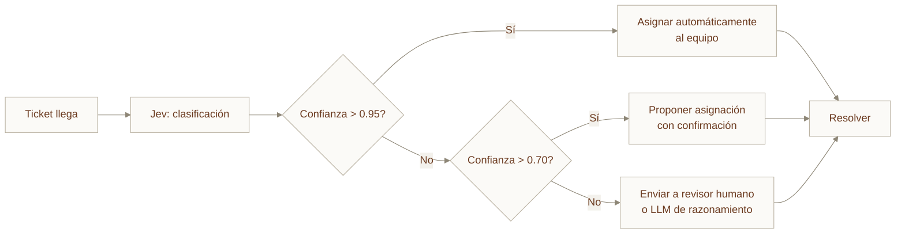

---
tags:
  - Bloque VI
  - Agentes
  - Nuevo
  - TypeSafe
---

# Módulo 16 · Introducción a Jev y los Modelos System One

<div class="modulo-meta" markdown>
<span>:material-clock-outline: 2 horas</span>
<span>:material-stairs: Nivel introductorio</span>
<span>:material-link-variant: Requiere módulo 14</span>
<span>:material-star-outline: Capítulo nuevo</span>
</div>

Durante años hemos estado usando modelos entrenados para escribir bien como **clasificadores**, **enrutadores** y **tomadores de decisiones** dentro de sistemas automatizados. Los resultados son lentos, costosos y propensos a alucinaciones.

TypeSafe AI reconoció una oportunidad: **la mayoría de las decisiones dentro del software son juicios rápidos** ("¿en qué categoría va esto?", "¿es urgente?", "¿es seguro ejecutar esto?"), no generación de texto creativo.

Jev es su respuesta: un modelo entrenado específicamente para tomar decisiones estructuradas rápidas y precisas, con confianza calibrada.

---

## 1. Qué es un modelo System One

Un modelo System One es una **nueva categoría de modelo de IA** diseñado específicamente para tomar decisiones rápidas, estructuradas y verificables que el código pueda usar directamente.

### El nombre: una metáfora de Kahneman

TypeSafe tomó prestada la distinción de Daniel Kahneman entre **Sistema 1** (pensamiento rápido, intuitivo) y **Sistema 2** (razonamiento lento, deliberado) de su libro *Pensar, rápido y despacio*.

La tesis: la mayoría de las decisiones en software son juicios del Sistema 1. Hemos estado alquilando un modelo de razonamiento completo del Sistema 2 para hacerlas.

El nombre **Jev** es un homenaje al economista William Stanley Jevons, quien observó que **a medida que el costo de una decisión baja, la demanda de decisiones explota**. Un modelo de decisión barato abre casos de uso que eran económicamente imposibles.

### Jev en una frase

**Jev es un modelo de frontera de TypeSafe AI que evalúa el estado del programa junto con un conjunto de preguntas tipadas, las responde todas en un único paso paralelo y devuelve valores estructurados con probabilidades calibradas en lugar de texto generado.**

---

## 2. Jev vs. LLM tradicional

La diferencia central está en **cómo produce respuestas** y **para qué está optimizado**.

| Aspecto | LLM Tradicional | Jev (System One) |
| --- | --- | --- |
| **Salida** | Texto generado (cadenas) | Decisiones tipadas + probabilidades |
| **Muestreo** | Secuencial, token por token | Paralelo, un único paso |
| **Latencia** | 1-10 segundos | 70–500 ms |
| **Errores de estructura** | Distinto de cero (errores de parsing) | 0% por construcción (garantizado) |
| **Confianza reportada** | A menudo sobreconfiada | Calibrada con cada respuesta |
| **Alucinaciones** | Comunes en clasificación | Imposibles en salida tipada |
| **Entrenamiento** | RLHF / RLVR (preferencia humana) | RLCD (Reinforcement Learning for Calibrated Decisions) |

### El muestreo paralelo es transformador

Cuando invocas a Jev con 10 preguntas sobre el mismo estado, todas se procesan a la vez. **Añadir una pregunta adicional apenas cambia el tiempo de respuesta.**

Con un LLM tradicional, cada pregunta requeriría una llamada separada o al menos una regeneración secuencial de tokens.

### Confianza calibrada

Jev se entrena con un método llamado **RLCD (Reinforcement Learning for Calibrated Decisions)** que optimiza sus probabilidades frente a resultados reales, no frente a preferencias humanas.

Esto significa: **una confianza más alta en la predicción de Jev correlaciona con mayor precisión real** — exactamente lo que necesitas para decidir cuándo actuar automáticamente y cuándo escalar a un humano.

---

## 3. Los tres primitivos: Choice, Score, Noul

Toda la API de Jev se compone de tres tipos de preguntas. Eso es el diseño, no una limitación.

### 1. Choice (Elección)

**Elige una opción de un conjunto** (hasta 255 opciones).

```json
{
  "type": "choice",
  "instructions": "¿A qué equipo debe dirigirse este ticket?",
  "options": [
    "Soporte técnico",
    "Facturación",
    "Ventas",
    "Otro"
  ]
}
```

**Retorna:**
- La opción seleccionada
- Una probabilidad para cada opción
- Una puntuación de confianza general

!!! tip "La opción 'other' es importante"
    Incluye siempre una opción `other` (u `ninguna de estas encaja`) para que el modelo pueda decir que no encaja en los casos conocidos.

### 2. Score (Puntuación)

**Puntúa una entrada contra niveles ordenados** que describes con palabras (2-10 niveles).

```json
{
  "type": "score",
  "instructions": "¿Qué tan frustrado está el cliente?",
  "levels": [
    "Neutro",
    "Levemente molesto",
    "Frustrado",
    "Muy frustrado",
    "Furioso"
  ]
}
```

**Retorna:**
- Una puntuación continua (puede ser `1.4`, no solo valores discretos)
- La distribución subyacente completa
- Un valor de confianza

### 3. Noul (No-Or-Yes-Unambiguously-Left)

**Una pregunta de sí/no** devuelta como una única probabilidad de 0 a 1.

```json
{
  "type": "noul",
  "instructions": "¿Pidió el cliente explícitamente un reembolso?"
}
```

**Retorna:**
- Una probabilidad de 0 a 1
- Donde 0.5 es máxima incertidumbre, 0.99 es "casi seguro sí", 0.01 es "casi seguro no"

### Ejemplo integrado

Una sola solicitud a Jev sobre un ticket de soporte podría preguntar:

```json
{
  "model": "jev-latest",
  "state": "Cliente: Llevo 3 días intentando conectar mi cuenta Stripe y sigue fallando. Estoy perdiendo ventas. Por favor ayuden YA.",
  "questions": {
    "routing": {
      "type": "choice",
      "instructions": "¿A qué equipo debe ir?",
      "options": ["Soporte técnico", "Facturación", "Ventas"]
    },
    "frustration": {
      "type": "score",
      "instructions": "Nivel de frustración del cliente",
      "levels": ["Bajo", "Medio", "Alto"]
    },
    "is_urgent": {
      "type": "noul",
      "instructions": "¿Es urgente?"
    }
  }
}
```

**Jev retorna todas las respuestas en un único paso paralelo.**

---

## 4. Dónde Jev es fuerte — y dónde no

### Casos de uso ideales para Jev

Jev está construido para **decisiones repetidas de alto volumen sobre conjuntos de respuestas conocidos**:

- **Clasificación de tickets** — categorizar por tipo, urgencia, equipo
- **Enrutamiento de intenciones** — ¿a qué agente especializado debería ir esto?
- **Moderación de contenido** — ¿es inapropiado? ¿violenta la política?
- **Extracción de entidades** — extraer campos de formularios o documentos
- **Puntuación** — calificar candidatos, leads, tareas
- **Guardrails en salida de modelos** — ¿es seguro ejecutar lo que sugirió el agente?
- **Decisiones en bucles de agentes** — ¿debería actuar automáticamente o escalar?

### Lo que Jev NO hace

Jev es la herramienta equivocada para:

- **Generación de texto** — chat, escritura, explicaciones, código
- **Razonamiento abierto** — análisis complejos que requieren pasos intermedios
- **Búsqueda de información** — Jev solo conoce el estado que le proporcionas; no puede buscar nada
- **Tareas creativas** — diseño, brainstorming, prosa

### Limitaciones importantes

1. **Sin conocimiento del mundo.** Jev solo opera sobre el estado que le inyectas. Ese paso establece el techo de cualquier flujo de trabajo construido a su alrededor.
2. **La calibración es una propiedad grupal.** TypeSafe es claro: la calibración se mantiene en agregado a través de muchas predicciones, no en cada respuesta individual. Jev puede equivocarse.

---

## 5. Jev en un bucle de agente

Jev no reemplaza tu LLM. **Es una capa de decisión dentro del bucle de agente.**

### El patrón: cascada de confianza

El patrón más efectivo es una **cascada basada en umbral de confianza**:

```
Estado del programa
        ↓
    Jev clasifica/enruta (costo bajo)
        ↓
    ¿Confianza alta? ──→ Actúa automáticamente (sin modelo)
        ↓ (no)
    ¿Confianza media? ──→ Pide confirmación humana
        ↓ (no)
    Confianza baja ──→ Escala a LLM de razonamiento completo
                     o a revisión humana
```

### Ejemplo: procesamiento de tickets



### Ventajas

- **Menos llamadas costosas a LLMs** — Jev maneja la mayoría de decisiones baratas
- **Latencia predecible** — 70–500 ms vs. segundos con un LLM
- **Límite auditable** — "la máquina decidió esto automáticamente" vs. "una persona debe revisar"
- **Costo controlable** — solo pagas input tokens; la salida es gratuita

---

## 6. Integración con harness

Jev se integra naturalmente en el harness de agentes que aprendiste en el [módulo 14](14-harness-engineering.md).

### Jev como herramienta especializada

Dentro de tu harness, Jev es una **herramienta más rápida y barata** para decisiones estructuradas:

```python
# En tu harness de agente
class JevDecisionTool:
    """Herramienta para decisiones rápidas tipadas"""
    
    def execute(self, state: str, questions: dict) -> dict:
        # Llamar a Jev
        response = jev_client.classify(state, questions)
        
        # Las respuestas tipadas fluyen directamente en el código
        if response.routing.choice == "Soporte técnico":
            return self.route_to_support(state, response)
        elif response.routing.choice == "Facturación":
            return self.route_to_billing(state, response)
```

### En capas de verificación

Jev es especialmente potente en la **capa de verificación del harness** (el módulo 14, sección sobre verificación):

```python
# Verificador independiente usando Jev
class JevVerifier:
    """Verifica salidas del agente contra rúbrica"""
    
    def verify(self, agent_output: str, rubric: dict) -> VerificationResult:
        # Jev puntúa rápidamente contra la rúbrica
        scores = jev_client.score(agent_output, rubric)
        
        if all(s.score >= rubric_threshold for s in scores):
            return VerificationResult(passed=True)
        return VerificationResult(passed=False, issues=scores)
```

---

## 7. Precios y rendimiento: lee la letra pequeña

TypeSafe hace afirmaciones atrevidas en su sitio:

- **193.6x más rápido** que LLMs en flujos de trabajo
- **444.6x más barato** que LLMs en flujos de trabajo
- **Entrada: $0.042 por millón de tokens**
- **Salida: gratuita**

### Advertencias importantes

1. **Afirmaciones del proveedor, no independientes.** Trátalas como puntos de referencia, no hechos comprobados.
2. **Los benchmarks se corrieron desde laptops en la Costa Oeste** de TypeSafe — sujeto a latencia regional.
3. **No puede probar que los precios no estén subsidiados.** Es muy pronto en el ciclo de vida del producto.
4. **El modelo de referencia "correcto" fue GPT-6 Astra y Fable 5.1**, lo que introduce sesgo hacia esos modelos.
5. **Lo único falsable: cero errores de tipo.** Por construcción, las salidas tipadas no pueden tener errores de esquema.

### El test real

La única afirmación difícil de refutar es el **0% de errores de tipo** — o falsa o es garantizada por matemática. 

Para todo lo demás: **prueba Jev en tu caso de uso estrecho y mide contra tu configuración actual.** No confíes en los números de TypeSafe; confía en tus propios números.

---

## 8. Patrones de implementación

### Patrón 1: Model Routing

Usa Jev para evaluar la complejidad de una solicitud y enrutar a modelos diferentes:

```python
# Solicitud simple → modelo rápido/barato
# Solicitud compleja → modelo potente/costoso

request_complexity = jev.score(
    state=user_request,
    levels=["Trivial", "Simple", "Complejo", "Muy complejo"]
)

if request_complexity.score <= 1.5:
    model = "fast-model"
else:
    model = "powerful-model"
```

### Patrón 2: Auto Mode con Guardrails

Usa Jev para identificar acciones potencialmente peligrosas antes de ejecutarlas:

```python
# Verificar si la acción propuesta es segura
safety_check = jev.noul(
    state=f"Tool call: {tool_name} with args: {args}",
    instructions="¿Es esta herramienta call potencialmente peligrosa?"
)

if safety_check.confidence > 0.8 and safety_check.noul > 0.7:
    # Acción potencialmente peligrosa - requerir aprobación
    return AwaitHumanApproval(action)
else:
    # Seguro - ejecutar
    return execute_tool(tool_name, args)
```

### Patrón 3: Triage de alto volumen

Procesa miles de entradas, clasificando solo lo que requiere atención humana:

```python
for incoming_item in stream:
    # Jev triage rápido - costo mínimo
    classification = jev.classify(
        state=item.content,
        questions={
            "needs_attention": {...},
            "priority": {...},
            "category": {...}
        }
    )
    
    if classification.needs_attention.confidence > threshold:
        escalate_to_human(item, classification)
    else:
        auto_handle(item, classification)
```

---

## 9. Conceptos clave

- **System One:** Modelo optimizado para decisiones rápidas, no razonamiento profundo
- **RLCD (Reinforcement Learning for Calibrated Decisions):** Método de entrenamiento que optimiza para confianza bien calibrada
- **Primitivos tipados:** Choice (elección), Score (puntuación), Noul (sí/no)
- **Muestreo paralelo:** Todas las preguntas se procesan simultáneamente, no secuencialmente
- **Cascada de confianza:** Actúa automático (alta confianza) → pide confirmación (media) → escala a LLM (baja)
- **Cero errores de tipo por construcción:** Las salidas tipadas nunca violarán el esquema definido
- **Calibración grupal:** La confianza correlaciona con precisión en agregado, no necesariamente en respuestas individuales

---

## 10. Puntos clave

- Jev es una nueva categoría de modelo, no un "LLM pequeño". Está optimizado para decisiones estructuradas, no para chat.
- Resuelve un problema real: hemos estado usando modelos generativos costosos para tomar clasificaciones simples.
- El muestreo paralelo hace que agregar preguntas sea casi gratuito — puedes "expandirte" y preguntar todo de antemano.
- Jev encaja mejor como **capa dentro de un bucle de agente**, no como reemplazo del LLM principal.
- El patrón cascada (alta confianza → automático, baja confianza → humano) es donde obtiene verdadero valor.
- Las afirmaciones de rendimiento de TypeSafe son puntos de referencia internos, no hechos independientes probados.
- La confianza calibrada es real y verificable; es lo más fiable de TypeSafe hoy en día.
- Jev no genera texto, no busca información y no razona. Es una "sentencia if inteligente".

---

## 11. Ejercicios

1. **Identifica decisiones clasificables en tu dominio.** Enumera cinco decisiones repetidas de alto volumen que tu equipo toma hoy "a mano" (mediante reglas o humanos). ¿Cuáles podrían ser Choice, Score o Noul?

2. **Diseña una cascada de confianza.** Para una de esas decisiones, define:
   - Qué umbral de confianza dispara acción automática
   - Qué umbral dispara revisión humana
   - Qué umbral escala a un LLM de razonamiento completo

3. **Compara latencia real.** Toma un flujo de trabajo existente que hoy usa un LLM para clasificación. Mide su latencia de extremo a extremo. Luego estima qué sería con Jev usando sus números publicados. ¿Cuál es el cambio real en tu caso?

4. **Construye un guardrail.** Implementa un verificador de seguridad usando Jev que evalúe si una herramienta call propuesta es potencialmente peligrosa.

5. **Calcula el ROI.** Para un proceso de alto volumen, calcula:
   - Costo actual (tiempo humano + costo de modelo si lo hay)
   - Costo con Jev + revisor humano ocasional
   - Break-even: ¿cuántos elementos necesitas procesar para que el cambio sea rentable?

---

## Lectura adicional

### Recursos principales

- [TypeSafe AI: Introducción a Modelos System One y Jev](https://typesafe.ai/blog/introducing-system-one-models-and-jev) — La fuente original. Incluye evaluaciones, demostraciones y FAQ.
- [LangChain: Construir un Harness con Jev](https://www.langchain.com/blog/building-a-harness-with-jev) — Integración práctica con LangChain y patrones de uso.
- [Eigent: ¿Qué es Jev? El Modelo System One de TypeSafe](https://www.eigent.ai/es/blog/typesafe-ai-jev-system-one-models) — Explicación completa en español latino.

### Referencias relacionadas

- [Documentación oficial de TypeSafe](https://docs.typesafe.ai/) — API, primitivos, ejemplos de código.
- [Playground de TypeSafe](https://console.typesafe.ai/) — Prueba Jev interactivamente.
- [Módulo 14 · Ingeniería de Harness](14-harness-engineering.md) — Cómo integrar Jev en tu harness.
- [Módulo 13 · Fundamentos de Arquitectura de IA](13-fundamentos-arquitectura-ia-agentes.md) — Contexto de decisiones en agentes.

