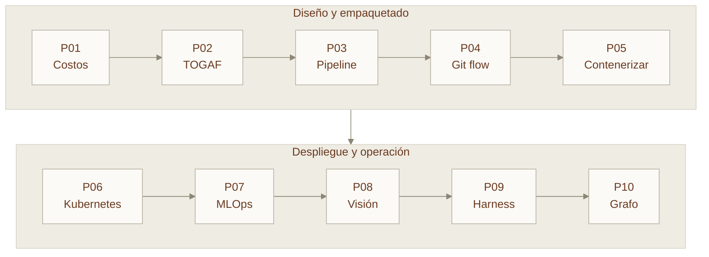

# Prácticas

Diez laboratorios encadenados. El artefacto de cada uno alimenta al siguiente, de modo que al terminar tengas un sistema completo y no diez ejercicios sueltos.

## El caso que atraviesa todas

Para dar continuidad, todas las prácticas trabajan sobre el mismo escenario. Puedes sustituirlo por uno propio siempre que mantengas las restricciones.

!!! abstract "AgroVisión"
    Una cooperativa agrícola de 2 400 hectáreas quiere detectar plagas en cultivos de hortalizas a partir de imágenes capturadas por drones y cámaras fijas.

    **Restricciones:**

    - Conectividad limitada en campo; enlace celular solo en las casetas.
    - Estacionalidad marcada: 4 meses de actividad intensa, 8 de baja.
    - El productor debe recibir la alerta en menos de 30 minutos.
    - Presupuesto de infraestructura: 2 500 USD/mes en temporada alta.
    - Los datos de parcela son información comercial sensible de cada socio.

## Las diez prácticas

| # | Práctica | Módulo | Entregable |
| --- | --- | --- | --- |
| [P01](p01-modelos-costos.md) | Comparar modelos de servicio y costos | 01–02 | Tabla comparativa y recomendación |
| [P02](p02-togaf.md) | Diseñar una arquitectura TOGAF para IA | 03–04 | Fases A–D y un ADR |
| [P03](p03-pipeline-datos.md) | Pipeline de datos Lake + ETL | 05–06 | Canalización de medallón funcionando |
| [P04](p04-git-flow.md) | Flujo Git colaborativo completo | 07 | Repositorio con historial limpio |
| [P05](p05-docker-modelo.md) | Contenerizar un modelo de IA | 08 | Imagen optimizada y medida |
| [P06](p06-kubernetes-deploy.md) | Desplegar en Kubernetes con autoescalado | 09 | Manifiestos y pruebas de fallo |
| [P07](p07-mlops.md) | CI/CD y MLOps de extremo a extremo | 10 | Pipeline con puertas de calidad |
| [P08](p08-vision.md) | Clasificador de visión con transfer learning | 11–12 | Modelo evaluado y model card |
| [P09](p09-harness.md) | Tu primer harness agéntico | 13 | Harness medido contra línea base |
| [P10](p10-grafo.md) | Dibujar tu flujo como un grafo | 14 | `graph.md` y grafo ejecutable |

## Cómo se evalúan

Cada práctica se califica con la misma rúbrica de cuatro criterios. El detalle está en [Evaluación y rúbricas](../recursos/evaluacion.md).

| Criterio | Peso |
| --- | --- |
| Funciona y es reproducible | 40 % |
| Decisiones justificadas con criterios explícitos | 30 % |
| Medición y evidencia, no afirmaciones | 20 % |
| Documentación legible por otra persona | 10 % |

!!! tip "El criterio que más cuesta"
    **Medición y evidencia.** "La imagen quedó más pequeña" no vale. "La imagen pasó de 1.24 GB a 187 MB, un 85 % menos, y el tiempo de reconstrucción tras un cambio de código bajó de 94 s a 7 s" sí vale.

    Mide antes, mide después, reporta ambos.

## Si solo puedes hacer tres

**P05**, **P06** y **P07**. Son las que convierten un modelo en un servicio desplegado, escalable y gobernado. Todo lo demás se puede aprender leyendo; eso no.
