# P02 · Diseñar una arquitectura TOGAF para IA

<div class="modulo-meta" markdown>
<span>:material-book-open-variant: Módulos 03–04</span>
<span>:material-clock-outline: 120 minutos</span>
<span>:material-tools: Markdown y Mermaid</span>
</div>

## Objetivo

Recorrer las fases A–D del ADM sobre AgroVisión y producir los artefactos que permiten decidir si el proyecto es viable **antes** de construirlo.

## Desarrollo

### Fase A · Visión de la arquitectura

```markdown
## Capacidad de negocio
(Una frase, sin mencionar ninguna tecnología)

## Métrica de éxito
(Un número con su línea base actual y su objetivo)

## Interesados
| Rol | Qué le importa | Qué puede vetar |
| --- | --- | --- |

## Alcance: lo que este sistema NO hará
(Al menos tres puntos explícitos)

## Línea base sin IA
(Cómo se resuelve hoy el problema y qué rendimiento tiene)
```

!!! tip "El reencuadre"
    Igual que en los casos del hospital y de Bogotá, pregúntate si la capacidad está bien formulada. ¿"Detectar plagas" o "priorizar qué parcelas debe visitar el técnico agrónomo"? La segunda es más modesta, mucho más viable y conserva casi todo el valor.

### Fase B · Arquitectura de negocio

Dibuja con Mermaid el proceso **actual** y el **objetivo**. Marca en color el punto exacto donde interviene el modelo y qué decisión toma.

```mermaid
%%{init:{"theme":"base","themeVariables":{"fontFamily":"Inter, sans-serif","darkMode":false,"background":"#f3f1ec","mainBkg":"#fbfaf7","primaryColor":"#fbfaf7","primaryTextColor":"#6b3a1f","primaryBorderColor":"#b9b1a1","secondaryColor":"#ead9ba","secondaryTextColor":"#6b3a1f","secondaryBorderColor":"#b9b1a1","tertiaryColor":"#c2d4cb","tertiaryTextColor":"#6b3a1f","tertiaryBorderColor":"#b9b1a1","lineColor":"#8d8676","textColor":"#6b3a1f","nodeTextColor":"#6b3a1f","nodeBorder":"#b9b1a1","labelTextColor":"#6b3a1f","titleColor":"#6b3a1f","edgeLabelBackground":"#f3f1ec","clusterBkg":"#efece4","clusterBorder":"#d8d2c6","cScale0":"#e2a98c","cScaleLabel0":"#6b3a1f","cScale1":"#bdb6e6","cScaleLabel1":"#6b3a1f","cScale2":"#e8d9b6","cScaleLabel2":"#6b3a1f","cScale3":"#b5d0c3","cScaleLabel3":"#6b3a1f","cScale4":"#e6cfc0","cScaleLabel4":"#6b3a1f","cScale5":"#cddcea","cScaleLabel5":"#6b3a1f"}}}%%
flowchart LR
    A["..."] --> B["..."]
    classDef default fill:#fbfaf7,stroke:#b9b1a1,stroke-width:1px,color:#6b3a1f;
```



Responde por escrito: ¿qué decisión se automatiza, cuál se asiste y cuál sigue siendo enteramente humana?

### Fase C · Arquitectura de datos y aplicación

**Datos:**

| Entidad | Sistema origen | Propietario de negocio | Clasificación | Calidad requerida | Retención | Sesgo conocido |
| --- | --- | --- | --- | --- | --- | --- |
| Imagen de parcela | | | | | | |
| Registro de plaga confirmada | | | | | | |
| Datos meteorológicos | | | | | | |
| Historial de tratamiento | | | | | | |

**Aplicación:** lista los componentes con **una sola responsabilidad** cada uno.

| Componente | Responsabilidad | Entrada | Salida |
| --- | --- | --- | --- |

### Fase D · Arquitectura de tecnología

La parte clave: cada decisión debe **derivar** de un requisito no funcional.

| Requisito no funcional | Origen | Decisión tecnológica | Qué queda descartado |
| --- | --- | --- | --- |
| Alerta en < 30 min | Negocio | | |
| Datos de parcela aislados por socio | Comercial | | |
| Conectividad intermitente en campo | Física | | |
| Escala a casi cero 8 meses al año | Económico | | |
| Presupuesto 2 500 USD/mes | Económico | | |

!!! warning "Si una fila no tiene nada en 'qué queda descartado', revísala"
    Un requisito que no elimina ninguna opción probablemente no es un requisito, es una preferencia.

### Análisis de brechas

| Dominio | Línea base | Destino | Brecha | Paquete de trabajo |
| --- | --- | --- | --- | --- |
| Negocio | | | | |
| Datos | | | | |
| Aplicación | | | | |
| Tecnología | | | | |

### Arquitecturas de transición

Define al menos tres estados intermedios. **Cada uno debe entregar valor por sí solo.**

```mermaid
%%{init:{"theme":"base","themeVariables":{"fontFamily":"Inter, sans-serif","darkMode":false,"background":"#f3f1ec","mainBkg":"#fbfaf7","primaryColor":"#fbfaf7","primaryTextColor":"#6b3a1f","primaryBorderColor":"#b9b1a1","secondaryColor":"#ead9ba","secondaryTextColor":"#6b3a1f","secondaryBorderColor":"#b9b1a1","tertiaryColor":"#c2d4cb","tertiaryTextColor":"#6b3a1f","tertiaryBorderColor":"#b9b1a1","lineColor":"#8d8676","textColor":"#6b3a1f","nodeTextColor":"#6b3a1f","nodeBorder":"#b9b1a1","labelTextColor":"#6b3a1f","titleColor":"#6b3a1f","edgeLabelBackground":"#f3f1ec","clusterBkg":"#efece4","clusterBorder":"#d8d2c6","cScale0":"#e2a98c","cScaleLabel0":"#6b3a1f","cScale1":"#bdb6e6","cScaleLabel1":"#6b3a1f","cScale2":"#e8d9b6","cScaleLabel2":"#6b3a1f","cScale3":"#b5d0c3","cScaleLabel3":"#6b3a1f","cScale4":"#e6cfc0","cScaleLabel4":"#6b3a1f","cScale5":"#cddcea","cScaleLabel5":"#6b3a1f"}}}%%
flowchart LR
    LB["Línea base"] --> T1["Transición 1"] --> T2["Transición 2"] --> DST["Destino"]
    classDef default fill:#fbfaf7,stroke:#b9b1a1,stroke-width:1px,color:#6b3a1f;
```



Para cada transición, responde: si el proyecto se cancelara aquí, ¿qué se queda la cooperativa?

### Fase G · Puerta de cumplimiento

Adapta la lista de verificación del módulo 03 a este caso. Máximo diez puntos. Debe incluir al menos uno sobre sesgo del conjunto de datos y uno sobre reversibilidad.

## Entregable

1. Las cuatro fases completas en un único archivo `arquitectura.md`.
2. Los dos diagramas de proceso (actual y objetivo).
3. La matriz de brechas y el diagrama de transiciones.
4. **Un ADR completo** con la plantilla del módulo 03, sobre la decisión tecnológica que más discusión generó en tu equipo. Debe incluir las opciones descartadas y por qué.
5. La puerta de cumplimiento de diez puntos.

## Criterios de evaluación

| Criterio | Qué se espera |
| --- | --- |
| Reproducible (40 %) | Las decisiones de fase D derivan de requisitos, no de preferencias |
| Justificación (30 %) | Cada requisito descarta algo; el ADR documenta alternativas reales |
| Medición (20 %) | La métrica de éxito tiene línea base numérica y objetivo numérico |
| Documentación (10 %) | Un interesado no técnico puede leer las fases A y B y entenderlas |

!!! danger "El punto que más proyectos detiene"
    La línea base sin IA. En AgroVisión, la línea base es "el técnico recorre las parcelas en un orden fijo". Si tu modelo no mejora el tiempo hasta detección frente a eso, con significancia, el proyecto no debe avanzar. Documenta explícitamente cómo lo medirás.
