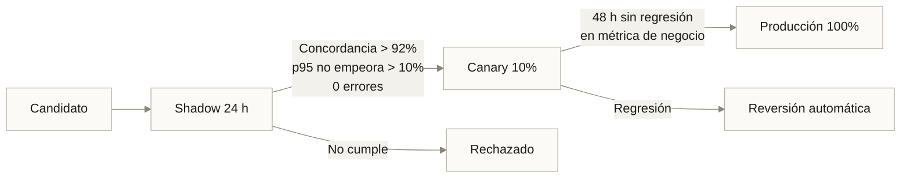

# P07 · CI/CD y MLOps de extremo a extremo

<div class="modulo-meta" markdown>
<span>:material-book-open-variant: Módulo 10</span>
<span>:material-clock-outline: 150 minutos</span>
<span>:material-tools: GitHub Actions o GitLab CI, DVC, MLflow</span>
</div>

## Objetivo

Cerrar el ciclo: que un commit produzca un modelo entrenado, validado, registrado y desplegado, con puertas de calidad que impidan que un modelo malo llegue a producción.

## Desarrollo

### 1. Pipeline de ML reproducible

Escribe `dvc.yaml` con las etapas: preparar → características → entrenar → evaluar. Cada una con dependencias, parámetros y salidas declarados.

Verificación obligatoria:

```bash
dvc repro           # ejecuta todo
dvc repro           # segunda vez: no debe ejecutar nada
```

Si la segunda ejecución vuelve a entrenar, tus dependencias están mal declaradas.

### 2. Parámetros versionados

Todos los hiperparámetros en `params.yaml`, nunca en el código. Incluye la semilla aleatoria.

Demuestra reproducibilidad: dos ejecuciones con el mismo commit y los mismos datos deben producir métricas idénticas.

### 3. Puertas de calidad

Implementa las cuatro y haz que **fallen la ejecución**, no que impriman avisos:

| Puerta | Criterio |
| --- | --- |
| Supera la línea base | El modelo mejora a la regla simple por un margen explícito |
| Sin regresión | No empeora respecto al modelo actual en producción |
| Equidad por segmento | Ningún segmento está más de 8 puntos por debajo del promedio |
| Latencia | p95 de inferencia por debajo del presupuesto |

### 4. Pruebas de comportamiento

Más allá de la exactitud, implementa al menos cuatro pruebas del tipo del módulo 10: invariancia, direccionalidad, casos límite y latencia.

### 5. CI completo

El pipeline debe, en orden:

1. Formato, estilo y tipos.
2. Pruebas unitarias con umbral de cobertura.
3. Escaneo de secretos.
4. Auditoría de dependencias.
5. `dvc repro` con datos de muestra.
6. Las cuatro puertas de calidad.
7. Comparación de métricas contra `main`, publicada en el resumen del PR.
8. Construcción y escaneo de la imagen, etiquetada con el SHA del commit.
9. Registro del modelo como candidato.

!!! warning "Etiqueta con el SHA, nunca con `latest`"
    Si no puedes trazar una imagen en producción hasta su commit exacto, no tienes reproducibilidad, tienes esperanza.

### 6. Registro de modelos con estados

Implementa la promoción por estados: `candidato` → `validado` → `sombra` → `produccion` → `retirado`.

Cada transición debe registrar: quién o qué la disparó, con qué evidencia, y en qué momento.

### 7. GitOps

Separa el repositorio de manifiestos. La CI de la aplicación debe **abrir un pull request** en el repositorio de manifiestos actualizando la etiqueta de la imagen, no aplicar directamente.

Documenta: ¿qué credenciales necesita ahora el sistema de CI? Compáralo con el enfoque de `kubectl apply` desde el pipeline.

### 8. Despliegue progresivo

Implementa la secuencia completa con criterios numéricos:



### 9. Monitoreo

Instrumenta y expón como métricas:

| Capa | Métricas |
| --- | --- |
| Infraestructura | CPU, memoria, réplicas, reinicios |
| Servicio | Peticiones/s, latencia p50/p95/p99, errores, cola |
| Modelo | Distribución de predicciones, de confianza, PSI por característica |
| Negocio | Alertas aceptadas por el técnico, plagas confirmadas |

### 10. Simula deriva y verifica la detección

Introduce un cambio sistemático en los datos de entrada que imite un cambio real (nueva cámara con distinto balance de color, cambio de variedad de cultivo). Verifica que:

- El detector de deriva lo señala.
- Lo señala **antes** de que la métrica de calidad se desplome.
- La alerta identifica **qué característica** derivó.

## Entregable

1. `dvc.yaml`, `params.yaml` y el código del pipeline.
2. El workflow de CI completo.
3. Evidencia de reproducibilidad: dos ejecuciones con métricas idénticas.
4. Captura de un PR rechazado por una puerta de calidad, con el mensaje de error.
5. El PR automático al repositorio de manifiestos.
6. Definición del despliegue progresivo con sus criterios numéricos.
7. Panel de monitoreo con las cuatro capas.
8. Evidencia de la deriva simulada y su detección, con el tiempo transcurrido.
9. **Tabla de métricas DORA** de tu propio pipeline durante la práctica.

## Criterios de evaluación

| Criterio | Qué se espera |
| --- | --- |
| Reproducible (40 %) | Un commit desencadena todo el flujo sin intervención |
| Justificación (30 %) | Los umbrales de las puertas derivan del costo de error, no son redondos |
| Medición (20 %) | La deriva se detecta y el tiempo está cronometrado |
| Documentación (10 %) | Un miembro nuevo del equipo entiende el flujo leyendo el README |

!!! tip "La prueba definitiva de esta práctica"
    Intenta desplegar deliberadamente un modelo peor. Si llega a producción, tus puertas son decorativas.

    Un sistema de MLOps se evalúa por lo que **impide**, no por lo que permite.
