# P10 · Dibujar tu flujo como un grafo

<div class="modulo-meta" markdown>
<span>:material-book-open-variant: Módulo 14</span>
<span>:material-clock-outline: 120 minutos</span>
<span>:material-tools: Markdown, Mermaid, un motor de grafos</span>
</div>

## Objetivo

Convertir un proceso que hoy ejecutas de forma implícita en un grafo explícito, descubrir las aristas escondidas, e implementarlo.

## Desarrollo

### 1. Evalúa si merece la pena

Antes de dibujar nada, puntúa los cinco criterios. **Necesitas al menos tres.**

| Criterio | ¿Se cumple? | Justificación |
| --- | --- | --- |
| Se divide en unidades independientes | | |
| Hay ramificaciones o retrocesos | | |
| El estado intermedio vale guardarse | | |
| El resultado se acepta inequívocamente | | |
| Beneficio de colaboración > costo de coordinación | | |

!!! warning "Si no llegas a tres, di que no"
    Escribe en su lugar un párrafo explicando qué script o qué workflow lineal resolvería el problema mejor. **Saber cuándo no usar un grafo es parte del entregable.**

    Un pipeline lineal de veinte pasos no es un grafo. Es un script.

### 2. `graph.md` · El estado compartido

```markdown
## Estado compartido

| Campo | Tipo | Lo escribe | Fusión si hay paralelismo |
| --- | --- | --- | --- |
| | | | |
```

Para cada campo responde: si dos nodos paralelos escriben aquí a la vez, ¿se sobrescribe, se añade o se suma?

### 3. Los nodos

```markdown
## Nodos

| Nombre | Tipo | Responsabilidad única | Lee | Escribe | ¿Contexto nuevo? |
| --- | --- | --- | --- | --- | --- |
| | | | | | |
```

Reglas:

- Si la responsabilidad necesita la palabra "y", probablemente son dos nodos.
- Debe haber al menos un nodo de código determinista.
- Debe haber al menos un nodo de verificación con **contexto nuevo**.
- Considera si necesitas un nodo humano y dónde.

### 4. Aristas y enrutamiento

```markdown
## Enrutamiento

| Desde | Condición | Hacia | ¿Es retroceso? |
| --- | --- | --- | --- |
| | | | |
```

Debe haber al menos **dos aristas de retroceso distintas**, que vuelvan a nodos diferentes. Si todos los fallos vuelven al mismo sitio, no has modelado el problema: has dibujado un loop con más cajas.

### 5. El diagrama

```mermaid
%%{init:{"theme":"base","themeVariables":{"fontFamily":"Inter, sans-serif","darkMode":false,"background":"#f3f1ec","mainBkg":"#fbfaf7","primaryColor":"#fbfaf7","primaryTextColor":"#6b3a1f","primaryBorderColor":"#b9b1a1","secondaryColor":"#ead9ba","secondaryTextColor":"#6b3a1f","secondaryBorderColor":"#b9b1a1","tertiaryColor":"#c2d4cb","tertiaryTextColor":"#6b3a1f","tertiaryBorderColor":"#b9b1a1","lineColor":"#8d8676","textColor":"#6b3a1f","nodeTextColor":"#6b3a1f","nodeBorder":"#b9b1a1","labelTextColor":"#6b3a1f","titleColor":"#6b3a1f","edgeLabelBackground":"#f3f1ec","clusterBkg":"#efece4","clusterBorder":"#d8d2c6","cScale0":"#e2a98c","cScaleLabel0":"#6b3a1f","cScale1":"#bdb6e6","cScaleLabel1":"#6b3a1f","cScale2":"#e8d9b6","cScaleLabel2":"#6b3a1f","cScale3":"#b5d0c3","cScaleLabel3":"#6b3a1f","cScale4":"#e6cfc0","cScaleLabel4":"#6b3a1f","cScale5":"#cddcea","cScaleLabel5":"#6b3a1f"}}}%%
flowchart TB
    I["Inicio"] --> A["..."]
    classDef default fill:#fbfaf7,stroke:#b9b1a1,stroke-width:1px,color:#6b3a1f;
```



### 6. La pregunta clave

Responde por escrito, con detalle:

> **¿Qué arista era implícita hasta ahora?** ¿Qué decisión estaba escondida dentro del contexto de un agente, o en la cabeza de una persona, y ahora está sobre el papel?

Esta suele ser la parte más reveladora de toda la práctica.

### 7. Las cuatro preguntas de diseño

Elige tres loops o automatizaciones que ya ejecutes en el mismo proyecto:

| Pregunta | Respuesta |
| --- | --- |
| ¿Qué loops alimentan a qué loops? | |
| ¿Qué loop posee el objetivo que otro persigue? | |
| ¿Alguno puede vetar o revertir la salida de otro? | |
| ¿Qué indicadores se optimizan por separado y podrían entrar en conflicto? | |

### 8. Autochequeo de Goodhart

Examina un indicador que hayas optimizado recientemente en este curso —tasa de detección de plagas, cobertura de pruebas, exactitud del modelo, alertas cerradas.

Subió. ¿Mejoraron también los **resultados reales**? Si solo subió el número, ¿en qué dirección te está engañando ese loop?

### 9. Anclas

Para cada nodo que produce una métrica, indica qué dato del mundo real la fija.

| Nodo | Métrica que produce | Ancla al mundo real |
| --- | --- | --- |
| | | |

**Marca explícitamente los nodos sin ancla.** Son los que pueden derivar sin que nadie se entere.

### 10. Implementa

Convierte `graph.md` en un grafo ejecutable. No te saltes ningún paso:

1. Definir estado.
2. Enumerar nodos.
3. Conectar aristas.
4. Escribir enrutamiento.
5. Colgar puntos de control.
6. Ejecutar con punto de entrada.

Verifica explícitamente que:

- El punto de control permite interrumpir y reanudar sin perder trabajo.
- El nodo verificador **no** tiene acceso al razonamiento del implementador.
- El nodo humano detiene el flujo y espera.

### 11. Plano contra programa

Pon `graph.md` junto al código. Encuentra el **primer punto donde no coinciden**.

Explica: ¿estaba mal dibujado el grafo, o mal escrito el código?

### 12. Mide el impuesto de orquestación

Ejecuta el grafo varias veces y cronometra **tu** tiempo de revisión, no el del sistema.

| Métrica | Valor |
| --- | --- |
| Tiempo de ejecución del grafo | |
| Tiempo de revisión humana por ejecución | |
| Costo por ejecución (tokens o USD) | |
| Casos resueltos sin intervención | % |
| Cuántas ejecuciones en paralelo podrías sostener | |

## Entregable

1. La evaluación de los cinco criterios, con la decisión de proceder o no.
2. `graph.md` completo: estado, nodos, aristas, enrutamiento, puntos de control.
3. El diagrama Mermaid.
4. La respuesta al paso 6 sobre la arista implícita.
5. La tabla de las cuatro preguntas de diseño.
6. El autochequeo de Goodhart.
7. La tabla de anclas, con los nodos sin ancla marcados.
8. El grafo implementado y ejecutándose.
9. El análisis del primer desajuste entre plano y código.
10. La tabla del impuesto de orquestación.

## Criterios de evaluación

| Criterio | Qué se espera |
| --- | --- |
| Reproducible (40 %) | El grafo se ejecuta, se interrumpe y se reanuda desde el punto de control |
| Justificación (30 %) | Los cinco criterios están evaluados honestamente; hay al menos dos retrocesos distintos |
| Medición (20 %) | El impuesto de orquestación está cronometrado, no estimado |
| Documentación (10 %) | `graph.md` y el código se corresponden, o el desajuste está explicado |

!!! tip "El entregable más valioso"
    No es el grafo funcionando. Es la respuesta al paso 6.

    Casi siempre existe una decisión que llevabas tomando de memoria —"si falla dos veces, mejor vuelvo a revisar el requisito"— que nunca estuvo escrita en ninguna parte. Escribirla es el momento en que el proceso deja de vivir en tu cabeza y pasa a ser algo que otra persona, u otro agente, puede ejecutar.

!!! danger "Y si decidiste no hacer un grafo"
    Esa también es una entrega válida y completa. Documenta los cinco criterios, explica cuál falla, y describe la solución más simple que sí resuelve el problema.

    Un curso que solo premia usar la herramienta produce ingenieros que la usan siempre.
