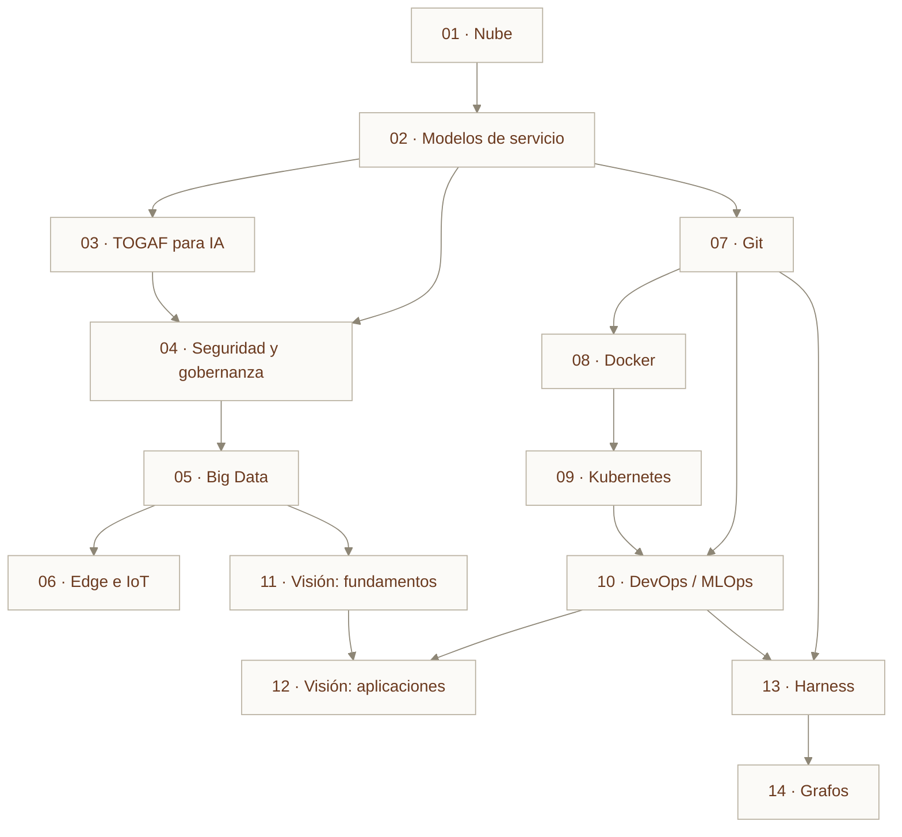
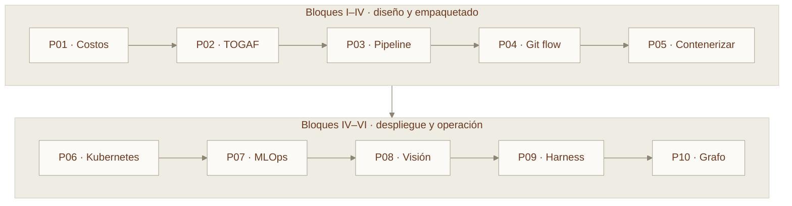

# Ruta de aprendizaje

## Dependencias entre módulos

No todos los módulos requieren los anteriores. Este grafo muestra qué necesitas realmente antes de abrir cada capítulo.

## Rutas recortadas por perfil

=== "Arquitecto de soluciones"

    Te interesa decidir, no operar.

    `01 → 02 → 03 → 04 → 05 → 06 → 10`

    Puedes leer 08 y 09 en modo panorámico (solo las secciones de arquitectura) y saltarte los laboratorios.

=== "Ingeniero de datos / ML"

    Te interesa el flujo del dato y del modelo.

    `01 → 02 → 05 → 07 → 08 → 09 → 10 → 11 → 12`

    TOGAF (03) te servirá cuando tengas que justificar la arquitectura ante dirección; déjalo para el final.

=== "Ingeniero de plataforma / DevOps"

    Te interesa que todo corra y se pueda revertir.

    `02 → 04 → 07 → 08 → 09 → 10 → 13 → 14`

=== "Desarrollador que se mueve a IA"

    Te interesa llegar a producción con un modelo propio.

    `01 → 02 → 07 → 08 → 09 → 11 → 12 → 13`

=== "Ruta completa (diplomado)"

    Las 14 sesiones en orden, una por semana.

    `01 → 02 → 03 → 04 → 05 → 06 → 07 → 08 → 09 → 10 → 11 → 12 → 13 → 14`

## Progresión de las prácticas

Las prácticas están encadenadas: el artefacto de una alimenta la siguiente.

Si solo puedes hacer tres: **P05**, **P06** y **P07**. Son las que convierten un modelo en un servicio desplegado y gobernado.

## Carga estimada

| Bloque | Sesiones | Horas de aula | Horas de trabajo autónomo |
| --- | --- | --- | --- |
| I · Fundamentos de la nube | 2 | 6 | 4 |
| II · Arquitectura y gobierno | 2 | 6 | 6 |
| III · Datos | 2 | 6 | 6 |
| IV · Ingeniería de plataforma | 4 | 12 | 14 |
| V · IA aplicada | 2 | 6 | 8 |
| VI · Sistemas agénticos | 2 | 6 | 6 |
| **Total** | **14** | **42** | **44** |
